# ACKNOWLEDGEMENTS

In the first place, I would like to thank my friends and family for supporting me during the development of this research. In particular, I would like to thank Alessandra de Oliveira for motivating me to pursue a Ph.D. degree since I was a teenager. But also for allowing me to use her computer, which was “my” first computer. I also would like to thank Bianca Cartacci, for the unconditional support in the hardest days of these last years.

> 首先，我要感谢我的朋友和家人在这项研究的过程中对我的支持。特别是，我要感谢亚历山德拉·德·奥利维拉（Alessandra de Oliveira）从我十几岁起就激励我攻读博士学位。但也感谢她允许我使用她的电脑，这是“我”的第一台电脑。我还要感谢比安卡·卡塔奇在过去几年最艰难的日子里给予的无条件支持。

I would like to thank Red Hat, Inc. for allowing me to continue my academic research in concurrency with my professional life. I would also like to thank the pro- fessionals that motivated me to remain in the academy and supported this research, including Nelson Campaner, Steven Rostedt, Juri Lelli and Arnaldo Carvalho de Mello. In special, I would like to thank Clark Williams, not only for his effort in supporting my research at Red Hat but, mainly, for his adivises and personal support.

> 我要感谢股份有限公司允许我在职业生涯的同时继续我的学术研究。我还要感谢激励我留在学院并支持这项研究的专业人士，包括纳尔逊·坎帕纳、史蒂文·罗斯泰特、尤里·莱利和阿尔纳尔多·卡瓦略·德梅洛。特别是，我要感谢克拉克·威廉姆斯，不仅感谢他为支持我在红帽大学的研究所做的努力，而且主要感谢他对我的支持和个人支持。

I would like to thank my Ph.D. colleagues from UFSC and Sant’Anna, in special Karila Palma Silva, Marco Pagani, Paolo Pazzaglia and Daniel Casini, all the members of the Retis Lab, and the administrave staff of the TeCIP institute at Sant’Anna and the PPGEAS at UFSC for the support in the cotutela agreement, in special for Enio Snoeijer.

> 我要感谢 UFSC 和圣安娜的博士同事，特别是 Karila Palma Silva、Marco Pagani、Paolo Pazzaglia 和 Daniel Casini，Retis 实验室的所有成员，以及圣安娜 TeCIP 研究所和 UFSC PPGEAS 的管理人员对 cotutela 协议的支持，特别是对 Enio Snoeijer 的支持。

Finally, and most importantly, I dedicate this work to my advisors. Thanks, Pro- fessor Tommaso Cucinotta and Professor Rômulo Silva de Oliveira for supporting me and guiding me in this journey, not only as an academic but as a human as well.

> 最后，也是最重要的一点，我将这项工作献给我的顾问。感谢 Tommaso Cucinotta 教授和 Rômulo Silva de Oliveira 教授对我的支持和指导，不仅是作为一名学者，也是作为一名人类。

# RESUMO

Sistemas de tempo real são sistemas computacionais em que o comportamento correto não depende apenas do comportamento lógico, mas também do comportamento temporal. Na teoria de sistemas de tempo real, um sistema é uma abstração, modelada usando um conjunto de variáveis que descrevem tão somente o comportamento temporal de seus componentes. O Linux é uma implementação de um sistema operacional (SO), que atualmente suporta algumas das abstrações fundamentais da teoria sistemas de tempo real. Apesar de todas as melhorias da última década, classificar o Linux como um SO de tempo real ainda é uma fonte de atrito entre as comunidades de desenvolvimento do Linux e da teoria de sistemas de tempo real. O principal motivo para este conflito está na análise empírica feitas pelos desenvolvedores do Linux, visto que na teoria, espera-se que as propriedades de um sistema derivem de uma descrição matemática de seu comportamento. Geralmente, um conjunto rigoroso de provas se faz necessário antes de obter qualquer conclusão sobre a previsibilidade do comportamento de tempo de execução de um sistema de tempo real. A diferença entre o Linux de tempo real e a teoria de tempo real nasce na complexidade do kernel do Linux. Isto se dá pelo grande esforço necessário para se entender todas as restrições impostas às tarefas de tempo real no Linux. O desafio é então descrever essas operações, usando um nível de abstração que remova a complexidade inerente ao código do kernel. Esta descrição deve utilizar-se de formato formal que facilite o entendimento da dinâmica do Linux pelos pesquisadores, sem ficar muito longe da maneira como os desenvolvedores observam e melhoram o Linux. Portanto, para melhorar a análise e verificação do Linux de tempo real, esta tese apresenta um modelo formal de sincronização de threads para o kernel PREEMPT_RT do Linux. Esse modelo é construído com base na teoria de autômatos, usando uma abordagem modular que permite a criação de um modelo baseado em um conjunto de subsistemas independentes e nas especificações que definem seu comportamento sincronizado. A tese também apresenta uma metodologia de modelagem, incluindo a estratégia de validação e ferramentas que comparam o modelo com a execução real do sistema. Esse modelo é usado como base para a criação de uma metodologia de verificação em tempo de execução para o kernel do Linux. O método de verificação em tempo de execução usa a geração automática de código do modelo para facilitar o desenvolvimento do sistema de monitoramento. Além disso, este método utiliza-se dos recursos de tracing dinâmico do Linux para permitir a verificação on-the-fly do sistema, com uma baixa sobrecarga do sistema. Por fim, a modelagem formal do comportamento do kernel é usada como uma etapa intermediária, facilitando o entendimento das regras e propriedades que regem o comportamento de temporização das tarefas do Linux. Por fim, um conjunto de especificações do modelo é utilizado como uma passo lógico na definição de um conjunto de regras e propriedades que definem o comportamento de tempo das tarefas do Linux. Essas propriedades são usadas na definição formal dos componentes e na composição da principal métrica usada pelos desenvolvedores do Linux de tempo real, a latência de escalonamento, no mesmo nível de abstração usado pelos pesquisadores de tempo real. Os valores para essas variáveis são então medidos e analisados por uma ferramenta proposta nesta tese.

> 实时系统是一种计算系统，其中正确的行为不仅取决于逻辑行为，而且还取决于时间行为。在实时系统理论中，系统是一个抽象概念，使用一组只描述其组成部分的时间行为的变量进行建模。Linux 是一个操作系统（OS）的实现，它目前支持实时系统理论的一些基本抽象。尽管在过去的十年中取得了所有的改进，将 Linux 归类为实时操作系统仍然是 Linux 和实时系统理论开发团体之间摩擦的根源。
> 这种冲突的主要原因在于 Linux 开发者所做的经验分析，因为在理论上，一个系统的属性应该是由其行为的数学描述得出的。一般来说，在对一个实时系统的运行时行为的可预测性得出任何结论之前，需要一套严格的证明。**实时 Linux 和实时理论之间的差异诞生于 Linux 内核的复杂性。**这是因为要了解 Linux 中的实时任务所受到的所有限制，需要付出巨大的努力。
> 然后的挑战是如何描述这些操作，使用一个抽象的层次来消除内核代码的固有复杂性。这种描述应该使用一种正式的格式，使研究人员容易理解 Linux 的动态，而不至于离开发者观察和改进 Linux 的方式太远。
> 因此，为了改进对实时 Linux 的分析和验证，本论文提出了一个 Linux 内核的线程同步的形式化模型 PREEMPT_RT。这个模型是在自动机理论的基础上建立的，使用了一种模块化的方法，允许在一组独立的子系统和定义其同步行为的规范的基础上创建一个模型。
> 论文还提出了一种建模方法，包括验证策略和工具，将模型与系统的实际执行进行比较。这个模型被用来作为创建 Linux 内核运行时验证方法的基础。运行时验证方法使用模型的自动代码生成来促进监测系统的开发。此外，该方法利用了 Linux 的动态跟踪功能，以较低的系统开销实现了即时的系统验证。最后，内核行为的形式化建模被用作中间步骤，促进了对管理 Linux 任务计时行为的规则和属性的理解。这些属性被用于组件的正式定义和 Linux 实时开发人员使用的主要指标--调度延迟的组成，与实时研究人员使用的抽象水平相同。然后通过本论文提出的一个工具对这些变量的数值进行测量和分析。

**Palavras-chave**: Tempo real. Kernel do Linux. Métodos formais. Automatos. Verificação.

> **关键词**：实时; Linux 内核; 形式化的方法; 自动装置; 核实。

# RESUMO EXPANDIDO

Sistemas de tempo real são sistemas de computacionais que a corretude não depende apenas do comportamento lógico, mas também do comportamento temporal. Em out- ras palavras, a resposta a uma solicitação está correta apenas se o resultado lógico estiver correto e produzido dentro de um tempo limite ou _deadline_. Caso contrário, o sistema apresentará uma falha ([BUTTAZZO](#_bookmark246), [2011](#_bookmark246)).

> 真正的速度系统和计算系统是一个正确的、依赖于时间的系统。这是一个很好的解决方案，一个解决方案，它是一个有效的解决方案。Caso contrário，o sistema apresentaráuma falha（[BUTTAZZO]（#\_bookmark246），[2011]（#\_bbookmark246））。

Na teoria de escalonamento de tempo real um sistema é uma abstração, modelada usando um conjunto de variáveis que descrevem tão somente o comportamento tem- poral de seus componentes. Por exemplo, geralmente um sistema é composto por um conjunto de _n_ tarefas _\tau_ = {*\tau*1, *\tau*2, ..., _\taun_}. Cada tarefa é definida com um conjunto de variáveis definidas pelo _modelo de tarefa_ do sistema. Por exemplo, no _modelo de tarefa esporádico_, cada tarefa _\taui_ é caracterizada por um tempo mínimo entre chegadas _Pi_ e um tempo de execução _Ci_ . Essas tarefas são escalonadas em um conjunto de _m_ processadores _\pho_ = {*\pho*1, *\pho*2, ..., _\phom_} e também podem compartilhar _q_ recursos _\sigmal_ = {*\sigmal*1, *\sigmal*2, ..., _\sigmalq_ } que requerem exclusão mútua. Nesse contexto, o principal objetivo do escalonador é atribuir, de alguma forma, o tempo dos processadores de _\pho_ e os recursos de _\sigmal_ às tarefas de _\tau_ a fim de concluir todas as ativações de todas as tarefas de _\tau_ cumprindo as restrições de tempo de cada tarefa. A demonstração de que um determinado algoritmo de escalonamento cumpre esse objetivo é feita por métodos analíticos conhecidos como _análise de escalonamento_.

> 事实上，这是一个抽象的系统，是一个复杂的模型，它是一个系统的组成部分。举例来说，系统组成的阶段与组成的阶段相结合。定义系统的定义范围。举例来说，没有任何具体的行动计划，也没有任何行动计划。这是一个很好的例子，它是一个非常好的例子。在这一背景下，主要目标是进行形式化、形式化、过程化的升级，并将其作为一种形式化的方法，将其作为当前的方法，作为未来的方法。这是一个确定升级算法的演示，该算法可以实现升级目标。

_Linux como um sistema operacional de tempo real_

> _Linux como um sistema 操作速度真实_

O Linux é uma implementação de um sistema operacional (SO) que atualmente su- porta algumas das abstrações fundamentais da teoria de escalonamento de tempo real. No Linux, do ponto de vista do escalonador, as tarefas são as _threads_. O objetivo dos escalonadores é atribuir o tempo dos processadores às _threads_ do sistema. Com o SCHED*DEADLINE ([LELLI et al.](#_bookmark294), [2016](#_bookmark294)), o Linux suporta o \_modelo de tarefa es- porádico*, permitindo a configuração do _tempo de execução_ e do _período_, equivalentes ao _Ci_ e _Pi_ , de uma determinada _thread_. Outra tecnologia importante que habilita o Linux para sistemas de tempo real é o PREEMPT*RT. Os desenvolvedores do PRE- EMPT_RT reformularam extensivamente o kernel do Linux para reduzir as seções de código que poderiam atrasar o escalonamento da \_thread* de mais alta prioridade, com o objetivo de transformar o Linux em um sistema operacional preemptivo, aproximando o comportamento Linux ao dos sistemas preemptivos teóricos. Essa característica permite o uso do Linux para uma ampla variedade de aplicações que requerem baixa latência na resposta a uma solicitação. De fato, o Linux de tempo real tem sido usado com sucesso em vários projetos acadêmicos e industriais, desde infra-estruturas dis- tribuídas e orientadas a serviços ([VARDHAN et al.](#_bookmark340), [2009](#_bookmark340)), robótica ([GUTIÉRREZ et al.](#_bookmark280), [2018](#_bookmark280)), redes de sensores ([DUBEY; KARSAI; ABDELWAHED](#_bookmark270), [2009](#_bookmark270)) e automação in- dustrial ([CUCINOTTA et al.](#_bookmark267), [2009](#_bookmark267)), até no controle de drones militares ([CONDLIFFE](#_bookmark259), [2014](#_bookmark259)) e sistemas de bolsas de valores ([CORBET, J.](#_bookmark260), [2010](#_bookmark260)).

> O Linuxéuma implementationçãO de um sistema operatacional（SO）que atualmente su-portal algumas das abstraçóes basicais da teoria de escalonato de tempo real。没有 Linux，做 ponto de vista 做 escalonador，做 tarefas são 做*threads*。目标是要升级，目标是要加快进程，目标是线程，目标是系统。Com o SCHED*DEADLINE（[LELLI 等人]（#\_bookmark294），[2016]（#\_bbookmark294）），o Linux suportal o \_modelo de tarefa es-porádico*，permit do a configuração do _tempo de execução o e do \_período_，等同于 ao _Ci_ e _Pi_，de uma determenda _thread_。在 PREEMPT*RT 中，Linux 系统的性能至关重要。o desinvolvores do PRE-EMPT_RT reformularam extensivamente to kernel do Linux para reduzir as seçães de código que poderiam atrasar o escalonato da thread*de mais alta prioridade，com o objetivo de transformar o Linux em sis tema operational prevento，approximato o comportamento Linux ao dos system as prevento ricos。在 Linux 环境下，我们需要有不同的应用程序，以满足不同的需求。事实上，在 Linux 上，真正意义上的系统是 usado com，它成功地实现了工业科学项目（projetos acadêmicos e industriais）、基础设施设计（desde infra estrutus dis-tribuídas e orientadas a serviços）（[VARDHAN 等人]（#_bookmark340）、[2009]（#\_bbookmark340））、robótica（[GUTIÉRREZ 等人]）（#\_bBookmark280）、[2018]（#\_bookmark280）））、传感器设计（[DUBEY；KARSAI；ABDELWAHED]书签 270），【2009】（#\_bookmark270））工业自动化（【CUCINOTTA 等人】（#\_bookmark267），【2009】【#\_bookmark 267）），军事无人机无人机控制（【CONDLIFE】（#\_blaookmark259），【2014】（#_ bookmark259））和从价武器系统（【CORBET，J.】（#\_tookmark260），【2010】（#\_bookmark260））。

Apesar de todas as melhorias da última década, classificar o Linux como um sistema operacional de tempo real ainda é uma fonte de conflito entre os desenvolvedores do Linux e a academia. Em resumo, existem dois pontos principais de divergência: a maneira como o Linux é analisado e as suposições usadas no desenvolvimento de novos algoritmos teóricos.

> 今天，作为一个学术界，Linux 公司和系统的分类是真正的操作系统。事实上，现有的基本原则是：一个与 Linux 系统相结合的系统，它是一个没有新算法的系统。

O uso frequente de suposições como _as tarefas são completamente independentes_ e _as operações são atômicas_ ([BRANDENBURG, B. B.; ANDERSON, J. H.](#_bookmark242), [2007](#_bookmark242); [CALAN-](#_bookmark247) [DRINO et al.](#_bookmark247), [2006](#_bookmark247)) são consideradas uma simplificação excessiva do comportamento de um sistema moderno pelos desenvolvedores do kernel do Linux ([GLEIXNER](#_bookmark279), [2010](#_bookmark279)). No Linux, as tarefas podem interferir entre si de uma maneira não negligenciável. Estas interferências causam atrasos, como por exemplo, o atraso que sofre a tarefa de mais alta prioridade em começar a sua execução. Esse atraso é conhecido como _atraso de escalonamento_ ou _latência de escalonamento_. Reduzir o atraso de escalonamento é a meta principal dos desenvolvedores do PREEMPT_RT. Os desenvolvedores do PREEMPT_RT medem este atraso usando o cyclictest. O cyclictest simula uma tarefa de mais alta prioridade e mede a diferença entre o tempo esperado para o início da sua execução e o tempo efetivo de início da execução, deste modo, medindo o atraso de escalonamento.

> 我们经常参加独立歌剧院的演出（[BRANDENBURG，B.B.；ANDERSON，J.H.]（#\_bookmark242），[2007]（#\_bbookmark242）；[CLAN-]（#\_bookmark247）[DRINO 等人]（#\_bookmark247），[2006]（#\_bbookmark247））são consideradas uma simplificação excessiva do comportamento um sistema moderno pelos desenvolvores do kernel do Linux（[GLEIXNER]（#\_blaookmark279），[2010]（#\_bBookmark279））。没有 Linux，因为 tarefas podem interferir entre si de uma maneira não ignigenciável。这是一个很好的例子。升级道路和升级道路的本质。在 PREEMPT_RT 之前，需要解决的主要问题是：。o 解溶剂进行 PREEMPT_RT 试验，以进行循环试验。一个周期性的模拟结果表明，优先事项的重要性在执行中的速度和执行中的效率之间存在差异。

Apesar de ser útil, a forma com que o cyclictest mede o atraso de escalonamento é considerada uma simplificação excessiva do problema pela academia. Para a academia, as propriedades de um sistema de tempo real devem derivar de uma descrição matemática do seu comportamento. Além do mais, um conjunto rigoroso de provas é necessário para qualquer conclusão sobre a previsibilidade do comportamento de tempo de execução de um sistema.

> Apesar de serútil，一个形式上的循环测试方法，一个学术界的问题。作为一个学术界，作为一个真正的发展衍生工具，它是一个完整的组成部分。我认为，严格的证明是必要的，这是一种可能的做法，可以作为执行制度的一部分。

A diferença entre o Linux de tempo real e a teoria de tempo real nasce na complexidade do kernel do Linux. O esforço necessário para entender todas as restrições impostas às tarefas de tempo real no Linux não é desprezível. Pode levar anos para um ini- ciante entender os aspectos internos do kernel do Linux. A complexidade é de fato uma barreira, não apenas para pesquisadores, mas também para desenvolvedores. O entendimento das primitivas de sincronização e como elas afetam o comportamento temporal das _threads_ é fundamental para a definição do Linux nos termos da teoría de sistemas de tempo real. O desafio então é descrever essas operações, usando um nível de abstração que remova a complexidade do código no kernel, sem perder em detalhes.

> 实时 Linux 和实时理论之间的差异诞生于 Linux 内核的复杂性。了解 Linux 中实时任务所受的所有限制所需的努力是不可忽视的。一个新手可能需要几年时间才能了解 Linux 内核的内部情况。复杂性的确是一个障碍，不仅对研究人员，而且对开发者也是如此。了解同步原语以及它们如何影响 _线程_ 的时间行为，是在实时系统理论方面定义 Linux 的基础。那么，挑战是如何描述这些操作，使用一个抽象的层次，消除内核中代码的复杂性，同时又不失细节。

_Métodos formais, modelos formais e runtime verification_

> _形式化方法、形式化模型和运行时验证_

Os métodos formais consistem em uma coleção de técnicas matemáticas utilizadas na especificação de um sistema. As especificações de um sistema podem ser usadas para vários propósitos. Por exemplo, para fornecer uma prova rigorosa de que o pro- grama implementado satisfaz algumas propriedades. A vantagem de usar a notação matemática é que ela remove a natureza ambígua da linguagem natural enquanto permite a verificação automática do sistema.

> 形式化方法由用于系统规范的数学技术的集合组成。一个系统的规格可用于几个目的。例如，提供一个严格的证明，证明所实施的方案满足某些属性。使用数学符号的好处是，它消除了自然语言的模糊性，同时允许对系统进行自动验证。

Apesar dos argumentos a favor do uso de métodos formais, a sua aplicação é geral- mente restrita a setores específicos. As razões mais comumente citadas para tal são a complexidade da notação matemática usada nas especificações e os requisitos de espaço em memória e tempo de processamento necessários para a verificação de um sistema usando métodos formais.

> 尽管有支持使用正式方法的论据，但其应用一般仅限于特定部门。最常引用的原因是规范中使用的数学符号的复杂性，以及使用形式化方法验证系统所需的内存空间和处理时间的要求。

Um modelo é uma _abstração_ (um conjunto de equações matemáticas) de um sistema, enquanto um sistema é _algo real_, por exemplo, um amplificador, um carro, uma fábrica, um corpo humano, etc. O processo de modelagem de um sistema envolve a definição de um conjunto de variáveis mensuráveis associadas ao sistema em questão. Fre- qüentemente, o modelo apenas aproxima o comportamento completo do sistema. A _adequação_ é um aspecto crucial durante a definição do nível de abstração usado no modelo. A _adequação_ de um modelo determina com que eficácia ele representa o comportamento subjacente do sistema ([O’REGAN 2017](#_bookmark305)). Os termos sistema e modelo podem ser usados alternadamente quando um modelo _adequado_ é encontrado.

> 模型是一个系统的 _抽象_（一组数学方程），而系统是 _真实_ 的东西，例如一个放大器、一辆汽车、一个工厂、一个人体，等等。对一个系统进行建模的过程包括定义一组与有关系统相关的可测量的变量。通常情况下，该模型只近似于系统的完整行为。在定义模型中使用的抽象水平时，_适当性_ 是一个关键的方面。一个模型的 _充分性_ 决定了它如何有效地代表系统的基本行为（[O'REGAN 2017](#_bookmark305)）。当找到一个 _适当的_ 模型时，系统和模型这两个词可以互换使用。

> [!NOTE]
> 这不就是控制系统吗?!

Portanto, representa um desafio para este trabalho definir um nível de abstração _adequado_ que, ao mesmo tempo, explique o comportamento em tempo de execução das tarefas de tempo real do Linux, evitando a conhecida limitação dos métodos formais.

> 因此，这项工作的挑战是如何定义一个适当的抽象层次，同时解释 Linux 实时任务的运行行为，同时避免形式化方法的众所周知的限制。

Entre as técnicas disponíveis para a aplicação de métodos formais, foi escolhida a técnica de _runtime verification_ (RV) devido à natureza do tempo de execução do modelo proposto. _Runtime verification_ é um método leve, porém rigoroso, que complementa as técnicas de verificação exaustivas clássicas (como _model checking_ e _theorem proving_) com uma abordagem mais prática. Ao preço de uma cobertura de execução limitada, que analisa uma única execução _trace_ de um sistema, RV pode fornecer informações precisas sobre o comportamento em tempo de execução do sistema monitorado ([FALCONE et al. 2018](#_bookmark274)).

> 在应用形式化方法的现有技术中，由于提议的模型运行时间的性质，选择了 _运行时间验证_（RV）的技术。_运行时验证_ 是一种轻量级但严格的方法，它以一种更实用的方法补充了经典的穷举验证技术（如 _模型检查_ 和 _定理证明_）。以有限的执行覆盖率为代价，分析系统的单一_轨迹执行，RV可以提供关于被监测系统运行时行为的准确信息（[FALCONE et al. 2018](#_bookmark274)）。

## Objetivo

Com o objetivo de melhorar a análise e verificação do kernel Linux de tempo real, esta tese propõe a criação de um modelo formal para as tarefa do Linux, incluindo as primitivas de sincronização que influenciam seu comportamento temporal. Este modelo deve permitir a verificação formal do comportamento _lógico_ do sistema, bem como a análise formal do seu comportamento _temporal_.

> 为了改进对实时Linux内核的分析和验证，本论文提出建立一个Linux任务的形式化模型，包括影响其时间行为的同步基元。这个模型应该允许对系统的 _逻辑_ 行为进行形式化验证，以及对其 _时间_ 行为进行形式化分析。

## Contribuições

As contribuições desta tese para o estado da arte estão divididas em três etapas, descritas a seguir.

> 正如我们所说的那样，这是一个阶段。

_Um modelo formal para as sincronização das threads do Linux de tempo real_

> _Ummodelo 正式 para as sincronização das threads do Linux de tempo real_

Esta etapa compreende o desenvolvimento de um modelo formal para as sincronização das _threads_ do Linux de tempo real, e inclui:

> 在 Linux 的实际运行过程中，将压缩到正式版本的模型中，如 sincronização das \_threads，包括：

- a definição de uma metodologia de modelagem usando a teoria dos autômatos e a abordagem modular;

> -一个模块化的模型管理定义；

- o modelo de sincronização das _threads_ para o kernel PREEMPT_RT Linux;

> -o modelo de sincronização das _threads_ para o 内核 PREEMPT_RT Linux；

- uma ferramenta de verificação de tempo de execução _offline_ que pode ser usada na validação de modelo e na verificação de tempo de execução do kernel.

> -uma ferromata de verificação de tempo de execução offline\_ que pode ser usada na validaçãa de modelo e na verificaão des tempo de Executiuço do kernel。

_Um método eficiente para a verificação formal do kernel do Linux_

> _Um método efficiente para a verificação formal do kernel do Linux_

Esta etapa compreende o aperfeiçoamento da técnica de verificação, possibilitando a verificação do comportamento lógico do sistema eficientemente em tempo de execução, e inclui:

> 在验证文件的基础上，可能会进行验证，以确保执行效率，包括：

- o desenvolvimento de uma abordagem dinâmica de verificação em tempo de exe- cução para o kernel Linux, permitindo o monitoramento do sistema em produção;

> -o desenvolvimento de uma abordagem dinâmica de verificação em tempo de exe-cução para o kernel Linux，permit do o monitoramento do sistema em produço；

- o desenvolvimento de uma ferramenta de geração automática de código do kernel a partir de um modelo de autômato;

> -o desenvolvimento de uma ferromenta de geração automática de código do kernel a partr de um modelo de autômato；

- a análise de desempenho do método, demonstrando seu baixo impacto no de- sempenho do sistema.

> -这是一个不可忽视的事实，证明了这一点。

_Análise temporal do comportamento do kernel do Linux_

> _在 Linux 上做组件做内核_

A última etapa utiliza o modelo proposto anteriormente para extrair um conjunto de regras e propriedades que definem o comportamento de temporal do atraso de escalon- amento. As principais contribuições desta etapa são:

> 一种利用模型的新方法，提出了一种新的方法，即在升级过程中，根据定义的时间成分，对外部环境进行评估。作为设计原则：

- a definição de um conjunto de regras e propriedades sobre a dinâmica básica de sincronização do kernel Linux, necessária para a definição formal do atraso de escalonamento;

> -a definição de um conjunto de regras e propriedades sobre a dinâmica básica de sincronização do kernel Linux，requiresária para a definião formal do atraso de escalonamento；

- a definição formal do conjunto de variáveis e da equação que define o atraso de escalonamento da tarefa de mais alta prioridade;

> -一个正式的定义，定义优先事项的等级；

- uma ferramenta eficiente utilizada na medição e análise do atraso de escalona- mento.

> -这是一种高效利用水资源的方法。

## Considerações finais

O desenvolvimento de um modelo abstrato usando métodos formais foi uma resposta natural para desvendar a complexidade do Linux de uma maneira determinística. A simplicidade do formato dos autômatos e a flexibilidade da abordagem modular foram a combinação perfeita para conectar essas três áreas complexas: o kernel do Linux, a teoria dos sistemas em tempo real e os métodos formais. Com relação ao compor- tamento _lógico_, o formalismo dos autômatos tornou possível a verificação com baixo _overhead_. Com relação ao comportamento _temporal_, a definição formal do conjunto de variáveis e da equação que define o atraso de escalonamento da tarefa de mais alta prioridade permitiu a análise do Linux usando um método aceito pela comunidade acadêmica, algo que era fonte de atrito por mais de uma década ([BRANDENBUG;](#_bookmark241) [ANDERSON](#_bookmark241), [2009](#_bookmark241)). É importante observar que esse problema permaneceu aberto não por causa de uma _rivalidade_, mas por causa da complexidade de traduzir o com- portamento do kernel para o formalismo de escalonamento de tempo real.

> 设计抽象的数学模型和数学模型是一个复杂的自然过程。一个简化的操作系统格式是一个灵活的操作模块，用于实现一个复杂的操作系统：一个内核操作系统，一个实时操作系统格式。Com relação ao compor-tamento _lógico，o formsmo dos autômatos tornou possível a vericação Com baixo \_overhead_。Com relação ao comportamento _temporal_，一个正式的定义，定义了 Linux 使用许可证的优先等级（[BRANDENBUG；]（#\_bookmark241）[ANDERSON]（#\_bookmark241），[2009]（#\_bbookmark241））。重要的是，观察者的问题是一个永久性的问题，这是一个复杂的传统问题，是一个真正意义上的形式主义核心问题。

# ABSTRACT

Real-time systems are computing systems where the correct behavior does not depend only on the functional behavior, but also on the timing behavior. In the real-time schedul- ing theory, a system is an abstraction, modeled using a set of variables that describe the sole timing behavior of its components. Linux is an implementation of an [operating](#_bookmark17) [system (OS)](#_bookmark17), that nowadays supports some of the fundamental abstractions from the real-time scheduling theory. Despite all improvements of the last decade, classifying Linux as a [real-time operating system (RTOS)](#_bookmark22) is still a source of conflict between real- time Linux and scheduling communities. The central reasons for this conflict lie in the empirical analysis of the timing properties of Linux made by practitioners, as it is ex- pected that the properties of a real-time system derive from a mathematical description of the behavior of the system. Generally, a rigorous set of proofs is required for any con- clusion about the predictability of the runtime behavior of a real-time system. The gap between the real-time Linux and real-time theory roots in the Linux kernel complexity. The amount of effort required to understand all the constraints imposed on real-time tasks on Linux is not negligible. The challenge is then to describe such operations, using a level of abstraction that removes the complexity due to the in-kernel code. The description must use a formal format that facilitates the understanding of Linux dynam- ics for real-time researchers, without being too far from the way developers observe and improve Linux. Hence, to improve the real-time Linux runtime analysis and verification, this thesis presents a formal thread synchronization model for the PREEMPT*RT Linux kernel. This model is built upon the automata formalism, using a modular approach that enables the creation of a model based on a set of independent sub-systems and the specifications that define their synchronized behavior. The thesis also presents a viable modeling methodology, including the validation strategy and tooling that compares the model against the real execution of the system. This model is then used as the base for the creation of a runtime verification of the method for the Linux kernel. The runtime verification method uses automatic code generation from the model to facilitate the development of the monitoring system. Moreover, it uses the dynamic tracing features of Linux to enable \_on-the-fly* verification of the system, at a low overhead. Finally, the formal modeling of the kernel behavior is used as an intermediary step, facilitating the understanding of the rules and properties that rule the timing behavior of Linux tasks. These properties are then used in the formal definition of the components and compo- sition of the main metric used by the real-time Linux developers, the scheduling latency, in the same level of abstraction used by real-time researchers. The values for these variables are then measured and analyzed by a tool proposed in this thesis.

> 实时系统是计算系统，其中正确的行为不仅取决于功能行为，还取决于定时行为。在实时调度理论中，系统是一个抽象，使用一组描述其组件唯一计时行为的变量进行建模。Linux 是[操作]（#\_bookmark17）[系统（OS）]（#\_bookmark17）的实现，它现在支持实时调度理论中的一些基本抽象。尽管在过去十年中有了所有改进，但将 Linux 分类为[实时操作系统（RTOS）]（#\_bookmark22）仍然是实时 Linux 和调度社区之间冲突的根源。这种冲突的主要原因在于从业人员对 Linux 的计时特性进行的实证分析，因为人们认为实时系统的特性源自对系统行为的数学描述。通常，对于实时系统运行时行为的可预测性的任何结论，都需要一组严格的证明。实时 Linux 和实时理论之间的差距源于 Linux 内核的复杂性。理解 Linux 上实时任务的所有限制所需的工作量是不可忽略的。然后，挑战是使用一个抽象级别来描述这样的操作，该抽象级别可以消除内核内代码带来的复杂性。描述必须使用便于实时研究人员理解 Linux 动态的正式格式，而不偏离开发人员观察和改进 Linux 的方式。因此，为了改进实时 Linux 运行时分析和验证，本文为 PREEMPT\*RTLinux 内核提供了一个正式的线程同步模型。该模型基于自动机形式，使用模块化方法，能够基于一组独立的子系统和定义其同步行为的规范创建模型。本文还提出了一种可行的建模方法，包括验证策略和工具，用于将模型与系统的实际执行进行比较。然后，该模型被用作创建 Linux 内核方法的运行时验证的基础。运行时验证方法使用来自模型的自动代码生成来促进监控系统的开发。此外，它使用 Linux 的动态跟踪功能，以较低的开销实现系统的实时验证。最后，内核行为的形式化建模被用作中间步骤，有助于理解控制 Linux 任务计时行为的规则和属性。这些属性随后被用于实时 Linux 开发人员使用的组件和主要度量（调度延迟）的正式定义，与实时研究人员使用的抽象级别相同。然后用本文提出的工具测量和分析这些变量的值。

**Keywords**: Real-time Systems. Linux kernel. Formal methods. Automata. Runtime Verification.

> **关键词**：实时系统。Linux 内核。形式化方法。自动机。运行时验证。

# LIST OF FIGURES

> [Figure 1 – Thesis approach and contributions](#_bookmark41) 27
> [Figure 2 – Response-time analysis abstractions in a timeline](#_bookmark50) 32
> [Figure 3 – ftrace output.](#_bookmark64) 40
> [Figure 4 – Trace timeflow output example](#_bookmark72) 43
> [Figure 5 – Non-maskable interruption timeline](#_bookmark74) 44
> [Figure 6 – Maskable interruption timeline](#_bookmark75) 44
> [Figure 7 – Real-time thread.](#_bookmark77) 45
> [Figure 8 – Forms of thread interference](#_bookmark78) 46
> [Figure 9 – Forms of thread blocking.](#_bookmark79) 46
> [Figure 10 – System and Model.](#_bookmark83) 49
> [Figure 11 – Example of automaton.](#_bookmark86) 53
> [Figure 12 – Example of Petri net.](#_bookmark86) 53
> [Figure 13 – Monolithic generator _G_ of the washer and dryer machine](#_bookmark93) 58
> [Figure 14 – Monolithic specification model _S_ of the washer and dryer machine](#_bookmark94) 59
> [Figure 15 – _S_/_G_ of the washer and dryer machine](#_bookmark94) 59
> [Figure 16 – Generator: _Gdoor_](#_bookmark95) 59
> [Figure 17 – Generator: _Gwash_](#_bookmark95) 59
> [Figure 18 – Generator: _Gdry_](#_bookmark95) 59
> [Figure 19 – Specification: *S*1](#_bookmark96) 60
> [Figure 20 – Specification: *S*2](#_bookmark96) 60
> [Figure 21 – Specification: *S*3](#_bookmark96) 60
> [Figure 22 – Specification: *S*4](#_bookmark96) 60
> [Figure 23 – Modular generator _G_ of the washer and dryer machine](#_bookmark97) 60
> [Figure 24 – Modular specification _S_ of the washer and dryer machine](#_bookmark98) 61
> [Figure 25 – Modular model _S_/_G_ of the washer and dryer machine](#_bookmark98) 61
> [Figure 26 – Modeling approach.](#_bookmark115) 76
> [Figure 27 – Examples of generators: _G05_ need resched (left) and _G04_ Scheduling context (right).](#_bookmark122) 80
> [Figure 28 – Examples of generators: _G01_ sleepable and runnable](#_bookmark123) 80
> [Figure 29 – Sets of sequences of event.](#_bookmark125) 81
> [Figure 30 – perf task_model report dynamic.](#_bookmark126) 82
> [Figure 31 – perf_tool definition inside the task_model structure](#_bookmark128) 83
> [Figure 32 – task*model and \_perf_tool* initialization.](#_bookmark129) 83
> [Figure 33 – perf thread_model: Events to callback mapping.](#_bookmark131) 84
> [Figure 34 – Handler for the irq_vectors:nmi_entry tracepoint](#_bookmark132) 84
> [Figure 35 – _process_event_ : trying to run the automata.](#_bookmark133) 85
> [Figure 36 – Example of the perf thread_model output: a thread activation.](#_bookmark134) 85
> [Figure 37 – Kernel trace excerpt.](#_bookmark135) 86
> [Figure 38 – _S18_ Scheduler call sufficient and necessary conditions](#_bookmark139) 87
> [Figure 39 – Missing kernel events: the output of perf thread_model.](#_bookmark142) 89
> [Figure 40 – Missing kernel events: the output of kernel tracepoints](#_bookmark143) 89
> [Figure 41 – Pseudo-code of tracing recurrence](#_bookmark144) 89
> [Figure 42 – Trace excerpt with comments of where the IRQ context is identifiedin the trace](#_bookmark145) 90
> [Figure 43 – mutex_lock not permitted with interrupts disabled.](#_bookmark146) 90
> [Figure 44 – _S12_ Events blocked in the IRQ context.](#_bookmark148) 91
> [Figure 45 – _S22_ Lock while interruptible](#_bookmark149) 91
> [Figure 46 – Trace of mutex_lock taken in the timer interrupt handler](#_bookmark150) 91
> [Figure 47 – Function stack, from the timer IRQ to the mutex_lock, used in the](#_bookmark151) [report for the Linux kernel developers](#_bookmark151) 92
> [Figure 48 – Verification approach.](#_bookmark154) 95
> [Figure 49 – Wake-up In Preemptive (_WIP_) Model.](#_bookmark155) 95
> [Figure 50 – Auto-generated code from the automaton in Figure](#_bookmark159) [49.](#_bookmark155) 96
> [Figure 51 – Helper functions to get the next state](#_bookmark160) 97
> [Figure 52 – Sleeping While in Atomic (_SWA_) model.](#_bookmark161) 98
> [Figure 53 – Example of output from the proposed verification module, as occurring when a problem is found.](#_bookmark162) 98
> [Figure 54 – Phoronix Stress-NG Benchmark Results: _as-is_ is the system without](#_bookmark163) [tracing nor verification; _SWA_ is the system while verifying _Sleeping_](#_bookmark163) [_While in Atomic_ automata in Figure](#_bookmark163) [56](#_bookmark169) [and with the code in Figure](#_bookmark163) [50;](#_bookmark159) [and the _trace_ is the system while tracing the same events usedin the _SWA_ verification.](#_bookmark163) 99
> [Figure 55 – Need re-sched forces scheduling (_NRS_ model).](#_bookmark167) 101
> [Figure 56 – Latency evaluation, using the _SWA_ model (top) and the _NRS_ model](#_bookmark169) [(bottom).](#_bookmark169) 102
> [Figure 57 – NMI generator (O1).](#_bookmark172) 105
> [Figure 58 – IRQ disabled by software (O2).](#_bookmark174) 106
> [Figure 59 – IRQs disabled by hardware (O3).](#_bookmark174) 106
> [Figure 60 – Context switch generator (04).](#_bookmark174) 106
> [Figure 61 – Context switch generator (05).](#_bookmark174) 106
> [Figure 62 – Preempt disable (06).](#_bookmark174) 106
> [Figure 63 – Scheduling context (07).](#_bookmark174) 106
> [Figure 64 – Thread runnable/sleepable (08).](#_bookmark174) 106
> [Figure 65 – Need re-schedule operation (09).](#_bookmark174) 106
> [Figure 66 – NMI blocks all other operations (R2).](#_bookmark176) 108
> [Figure 67 – Operations blocked in the IRQ context (R3).](#_bookmark176) 108
> [Figure 68 – IRQ disabled by thread or IRQs (R4).](#_bookmark177) 108
> [Figure 69 – The scheduler is called with interrupts enabled (R5).](#_bookmark178) 108
> [Figure 70 – The scheduler is called with preemption disabled to call the scheduler [(R6).](#_bookmark178) 108
> [Figure 71 – The scheduler context does not enable the preemption (R7).](#_bookmark179) 109
> [Figure 72 – The context switch occurs with interrupts and preempt disabled (R8).](#_bookmark179) 109 > [Figure 73 – The context switch occurs in the scheduling context (R9).](#_bookmark180) 109
> [Figure 74 – Wakeup and need resched requires IRQs and preemption disabled (R10 and R11).](#_bookmark180) 109
> [Figure 75 – Disabling preemption to schedule always causes a call to the scheduler (R12).](#_bookmark181) 109
> [Figure 76 – Scheduling always causes context switch (R13).](#_bookmark181) 109
> [Figure 77 – Setting need resched always causes a context switch (R14).](#_bookmark182) 111
> [Figure 78 – Reference Timeline](#_bookmark182) 111
> [Figure 79 – rt_sched_latency: tool kit components](#_bookmark205) 119
> [Figure 80 – perf rtsl output: excerpt from the textual output (time in nanosec-](#_bookmark207) [onds).](#_bookmark207) 122
> [Figure 81 – Using perf and the _latency parser_ to find the cause of a large *D*POID value](#_bookmark207) 122
> [Figure 82 – Workstation experiments: single-core system.](#_bookmark210) 124
> [Figure 83 – Workstation and Server experiments: multicore systems](#_bookmark211) 124

**LIST OF TABLES**

> **表格列表**

> [Table 1 – Mapping between mechanisms of the Linux kernel and abstractions of the response-time analysis](#_bookmark67) 41
> [Table 2 – Linux events used in the parallel with the response-time analysis](#_bookmark70) 42
> [Table 3 – Events of the washer and dryer machine](#_bookmark92) 58
> [Table 4 – Interrupt related events](#_bookmark116) 77
> [Table 5 – Scheduling related events](#_bookmark117) 77
> [Table 6 – Locking related events](#_bookmark118) 78
> [Table 7 – Automata models](#_bookmark121) 79
> [Table 8 – Events and state transitions of Figure](#_bookmark140) [37.](#_bookmark135) 88
> [Table 9 – Parameters used to bound *L*IF](#_bookmark191) 115

# LIST OF ABBREVIATIONS AND ACRONYMS

> API application programming interface
> APIC advanced programmable interrupt controller CCS calculus communicating systems
> CFS completely fair scheduler
> CI continuous integration
> CPU central processing unit
> CSP communicating sequential processes
> DES discrete event system
> EDF earliest deadline first
> GPOS general-purpose operating system
> INTs interrupts
> IRQ maskable interrupt
> IRQs maskable interrupts
> LDV Linux driver verification
> LKMM Linux kernel memory consistency model NMI nonmaskable interrupt
> OS operating system
> OSes operating systems
> PID process identification number
> RT real-time
> RTA response-time analysis
> RTOS real-time operating system
> RV runtime verification
> SAT boolean satisfiability
> SDV static driver verifier
> SLIC specification language for interface checking SMP symmetric multiprocessing
> WCET worst-case execution time

# CONTENTS

```
    1.  [INTRODUCTION](#introduction) 21
        1.  [LINUX AS A REAL-TIME OPERATING SYSTEM](#_bookmark30) 22
        2.  [FORMAL METHODS](#_bookmark31) 23
            1.  [Formal models](#formal-models) 24
            2.  [Runtime verification](#runtime-verification) 25
        3.  [GOALS OF THIS THESIS](#_bookmark35) 25
            1.  [A formal model for Linux tasks](#a-formal-model-for-linux-tasks) 25
            2.  [Runtime verification of the logical behavior of Linux](#runtime-verification-of-the-logical-behavior-of-linux) 26
            3.  [Runtime analysis of the timing behavior of Linux](#runtime-analysis-of-the-timing-behavior-of-linux) 26
        4.  [CONTRIBUTIONS OF THIS THESIS](#_bookmark39) 26
            1.  [First stage: modeling the timing behavior of tasks on real-time Linux](#first-stage-modeling-the-timing-behavior-of-tasks-on-real-time-linux) 26
            2.  [Second stage: efficient runtime verification for the Linux kernel](#second-stage-efficient-runtime-verification-for-the-linux-kernel) 27
            3.  [Third stage: formal definition of the latency components](#third-stage-formal-definition-of-the-latency-components) 28
        5.  [ORGANIZATION OF THIS THESIS](#_bookmark44) 28
    2.  [BACKGROUND](#background) 29

        1.  [REAL-TIME SYSTEMS](#_bookmark46) 29

            1.  [Real-time scheduling theory](#real-time-scheduling-theory)
                29

            2.  [Response-time analysis](#response-time-analysis) 31

        2.  [LINUX](#_bookmark51) 32

            1.  [Linux as a real-time operating
                system](#linux-as-a-real-time-operating-system) 33

            2.  [Task abstraction and context
                synchronization](#task-abstraction-and-context-synchronization)
                35

            3.  [Mutual exclusion](#mutual-exclusion) 36

                1.  [Spinlock](#_bookmark57) 36

                2.  [Read-write spinlocks](#_bookmark58) 37

                3.  [Semaphores](#_bookmark59) 38

                4.  [Read-write semaphores](#_bookmark60) 38

                5.  [Mutex](#_bookmark61) 39

                6.  [RT mutex](#_bookmark62) 39

                7.  [Spinlocks and RT mutex in the PREEMPT RT](#_bookmark63)
                    39

            4.  [Linux tracing](#linux-tracing) 40

            5.  [Characterization of real-time Linux tasks
                timeline](#characterization-of-real-time-linux-tasks-timeline)
                41

                1.  [Kernel mechanisms and the response time
                    analysis](#_bookmark69) 41

                2.  [Trace-timeflow: empircal observation of the
                    system](#_bookmark71) 42

                3.  [Characterization of interrupt handlers
                    timeline](#_bookmark73) 43

                4.  [Characterization of the threads timeline](#_bookmark76)
                    45

                5.  [Final remarks](#_bookmark80) 47

        3.  [FORMAL METHODS](#_bookmark81) 47

            1.  [Models](#models) 48

            2.  [Discrete event systems](#discrete-event-systems) 51

                1.  [Language definition](#_bookmark85) 51

                2.  [DES modeling formalism](#_bookmark87) 53

            3.  [Automata theory](#automata-theory) 54

                1.  [Operations with automata](#_bookmark90) 56

                2.  [Modeling approaches](#_bookmark91) 57

            4.  [Runtime verification](#runtime-verification-1) 61

        4.  [FINAL REMARKS](#_bookmark100) 62

    3.  [RELATED WORK](#related-work) 64

        1.  [FORMAL METHODS FOR OS KERNELS](#_bookmark102) 64

            1.  [Formal methods in the Linux kernel
                community](#formal-methods-in-the-linux-kernel-community) 67

        2.  [AUTOMATA-BASED REAL-TIME SYSTEMS ANALYSIS](#_bookmark105) 68

            1.  [Automata-based models for
                Linux](#automata-based-models-for-linux) 69

        3.  [REAL-TIME LINUX LATENCY](#_bookmark108) 71

        4.  [FINAL REMARKS](#_bookmark109) 72

    4.  [A THREAD SYNCHRONIZATION MODEL FOR THE
        PREEMPT_RT](#a-thread-synchronization-model-for-the-preempt_rt-kernel)
        [KERNEL](#a-thread-synchronization-model-for-the-preempt_rt-kernel)
        74

        1.  [MODELING APPROACH](#_bookmark113) 75

        2.  [EVENTS](#_bookmark114) 75

        3.  [MODELING](#_bookmark119) 78

            1.  [Automate or not to automate the model
                creation?](#automate-or-not-to-automate-the-model-creation)
                80

        4.  [MODEL VALIDATION](#_bookmark127) 82

        5.  [OFFLINE RUNTIME VERIFICATION](#_bookmark136) 86

            1.  [Scheduling in vain](#scheduling-in-vain) 86

            2.  [Tracing dropping events](#tracing-dropping-events) 88

            3.  [Using a real-time mutex in an interrupt
                handler](#using-a-real-time-mutex-in-an-interrupt-handler)
                90

        6.  [FINAL REMARKS](#_bookmark152) 92

    5.  [ONLINE RUNTIME VERIFICATION](#online-runtime-verification) 94

        1.  [EFFICIENT FORMAL VERIFICATION FOR THE LINUX
            KERNEL](#_bookmark156) 95

        2.  [PERFORMANCE EVALUATION](#_bookmark164) 99

            1.  [Throughput evaluation](#throughput-evaluation) 100

            2.  [Latency evaluation](#latency-evaluation) 100

        3.  [FINAL REMARKS](#_bookmark168) 101

    6.  [LATENCY ANALYSIS](#latency-analysis) 103

        1.  [SYSTEM MODEL](#_bookmark171) 104

            1.  [Basic Operations](#basic-operations) 105

            2.  [Rules](#rules) 107

        2.  [DEMYSTIFYING THE REAL-TIME LINUX SCHEDULING
            LATENCY](#_bookmark183) 112

            1.  [Problem statement](#problem-statement) 112

            2.  [Bounding *L*IF](#_bookmark190) 113

        3.  [RT_SCHED_LATENCY: EFFICIENT SCHEDULING LATENCY
            ESTI-](#_bookmark206) [MATION TOOL KIT](#_bookmark206) 119

        4.  [EXPERIMENTAL ANALYSIS](#_bookmark208) 122

        5.  [FINAL REMARKS](#_bookmark212) 125

    7.  [FINAL REMARKS](#final-remarks-2) 126

        1.  [THE FUTURE OF THE MODEL](#_bookmark215) 127

        2.  [FUTURE WORK](#_bookmark216) 128

        3.  [LIST OF PUBLICATIONS](#_bookmark218) 129

            1.  [Other publications](#other-publications) 129

        4.  [INTERACTIONS WITH THE LINUX KERNEL DEVELOPMENT
            COM-](#_bookmark220) [MUNITY](#_bookmark220) 130

        5.  [ACKNOWLEDGMENT](#_bookmark221) 131

    [REFERENCES](#_bookmark222) 132

```

# INTRODUCTION

Real-time systems are computing systems where the correct behavior does not depend only on the functional behavior, but also on the timing behavior. In other words, the response to a request is only correct if the logical result is correct and produced within a _deadline_. Otherwise, the system will be showing a defect ([BUTTAZZO](#_bookmark246), [2011](#_bookmark246)).

> 实时系统是计算系统，其中正确的行为不仅取决于功能行为，还取决于定时行为。换句话说，只有当逻辑结果正确并且在*deadline*内生成时，对请求的响应才是正确的。否则，系统将显示缺陷（[BUTTAZZO]（#\_bookmark246），[2011]（#\_bbookmark246））。

In the real-time scheduling theory, a system is an abstraction, modeled using a set of variables that describe the sole timing behavior of its components . For example, usually a system is composed by a set of _n_ tasks _\tau_ = {*\tau*1, *\tau*2, ..., _\taun_}. Each task is defined as a set of variables defined by the _task model_ of the system. For instance, in _sporadic task model_, each task _\taui_ is characterized by a minimum time between arrivals _Pi_ and an execution time _Ci_ . These tasks are scheduled on a set of _m_ processors _\pho_ = {*\pho*1, *\pho*2, ..., _\phom_} and they may share _q_ resources _\sigmal_ = {*\sigmal*1, *\sigmal*2, ..., _\sigmalq_ } which require mutual exclusion. In this context, the main goal of the scheduling is to somehow assign the time of processors from _\pho_ and resources from _\sigmal_ to tasks from _\tau_ in order to finish all jobs of all tasks from _\tau_ while meeting the timing constraints of each task. The demonstration that a given scheduling algorithm can achieve such a goal is done through analytical methods known as _schedulability analysis_.

> 在实时调度理论中，系统是一个抽象，使用一组描述其组件唯一计时行为的变量进行建模。例如，通常一个系统由一组*n*任务*\tau*={*\tau*1，*\tau*2，…，_\taun_}组成。每个任务都定义为一组由系统的任务模型定义的变量。例如，在*sporadic 任务模型中，每个任务的特征是到达之间的最小时间\_Pi*和执行时间*Ci*。这些任务是在一组*m*处理器*\pho*={*\pho*1，*\pho*2，…，_\phom_}上调度的，它们可以共享*q*资源*\sigmal*={*\sigmal*1，*\sigmal*2，..，_\sigmolq_}，这需要互斥。在这种情况下，调度的主要目标是以某种方式将处理器的时间和资源分配给任务，以完成任务的所有任务，同时满足每个任务的时间限制。通过称为“可调度性分析”的分析方法，证明了给定的调度算法可以实现这一目标。

Linux is an implementation of an [OS](#_bookmark17) that nowadays supports some of the fundamental abstractions from the real-time scheduling theory. In Linux, from the scheduling point of view, the most basic unit is the thread. It is then the goal of the schedulers to assign the time from the processors to the threads of the system. With SCHED*DEADLINE ([LELLI et al.](#_bookmark294), [2016](#_bookmark294)), Linux supports the classical \_sporadic task model*, allowing the configuration of the _runtime_ and _period_, equivalent to the _Ci_ and _Pi_ , of a given thread. Another key technology enabling Linux for real-time systems is the PREEMPT*RT. The PREEMPT_RT developers have extensively reworked the Linux kernel to reduce the code sections that could delay the scheduling of the highest- priority thread, aiming to transform Linux into a \_preemptive* operating system, trying to approximate Linux to the theoretical _preemptive_ system. This characteristic allows the usage of Linux for a wide range of workloads that require low latency in the response for a request. Indeed, real-time Linux has been successfully used throughout a number of academic and industrial projects as a fundamental building block of real-time sys- tems, from distributed and service-oriented infrastructures for multimedia ([VARDHAN](#_bookmark340) [et al.](#_bookmark340), [2009](#_bookmark340)), robotics ([GUTIÉRREZ et al.](#_bookmark280), [2018](#_bookmark280)), sensor networks ([DUBEY; KAR-](#_bookmark270) [SAI; ABDELWAHED](#_bookmark270), [2009](#_bookmark270)) and factory automation ([CUCINOTTA et al.](#_bookmark267), [2009](#_bookmark267)), to the control of military drones ([CONDLIFFE](#_bookmark259), [2014](#_bookmark259)) and distributed high-frequency trading systems ([CORBET, J.](#_bookmark260), [2010](#_bookmark260)).

> Linux 是一个[OS]（#*bookmark17）的实现，它现在支持实时调度理论中的一些基本抽象。在 Linux 中，从调度的角度来看，最基本的单元是线程。然后，调度器的目标是将处理器的时间分配给系统的线程。通过 SCHED*DEADLINE（[LELLI 等人]（#\_bookmark294），[2016]（#\_bbookmark294）），Linux 支持经典的随机任务模型*，允许配置给定线程的\_runtime*和*period*，相当于*Ci*和*Pi*。另一项支持 Linux 用于实时系统的关键技术是 PREEMPT\*RT。PREEMPT_RT 开发人员已经对 Linux 内核进行了大量修改，以减少可能会延迟最高优先级线程调度的代码段，旨在将 Linux 转变为一个可接受的操作系统，试图使 Linux 接近理论上的可接受系统。这一特性允许将 Linux 用于需要低延迟响应请求的各种工作负载。事实上，实时 Linux 已经在许多学术和工业项目中成功地用作实时系统的基本构建块，包括分布式和面向服务的多媒体基础设施（[VARDHAN]（#\_bookmark340）[等人]（#\_bookmark340），[2009]（#\_bbookmark340））、机器人（[GUTIÉRREZ 等人]（#\_bookmark280），[2018]，传感器网络（[DUBEY；KAR-]（#\_bookmark270）[SAI；ABDELWAHED]（#\_bookmark270），[2009]（#\_bbookmark270））和工厂自动化（[CUCINOTTA 等人]（#\_blaookmark267），[2009]（#\_tookmark267）），到军用无人机（[CONDLIFE]（#\_mookmark259），[2014]（#\_bBookmark259））和分布式高频交易系统（[CORBET，J.]（#/bookmark260），[2010]（#\_bokmark260））的控制。

1.  LINUX AS A REAL-TIME OPERATING SYSTEM

> 1.LINUX 作为实时操作系统

Despite all improvements of the last decade, classifying Linux as a [RTOS](#_bookmark22) is still a source of conflict between real-time Linux and scheduling communities. In summary, there are two central sources of divergence: the way that Linux is analyzed, and the assumptions used in the development of new theoretical real-time algorithms.

> 尽管在过去十年中有了所有改进，但将 Linux 分类为[RTOS]（#\_bookmark22）仍然是实时 Linux 和调度社区之间冲突的根源。总之，分歧的主要来源有两个：分析 Linux 的方式，以及开发新的理论实时算法时使用的假设。

From the real-time Linux community, the frequent use of assumptions like _tasks are completely independent_, and _operations are atomic_ ([BRANDENBURG, B. B.; AN-](#_bookmark242) [DERSON, J. H.](#_bookmark242), [2007](#_bookmark242); [CALANDRINO et al.](#_bookmark247), [2006](#_bookmark247)) are considered an oversimplification of Linux behavior by kernel developers ([GLEIXNER](#_bookmark279), [2010](#_bookmark279)).

> 在实时 Linux 社区中，像\_tasks 这样的假设的频繁使用是完全独立的，而\_operations 是原子的（[BRANDENBURG，B.B.；AN-]（#\_bookmark242）[DERSON，J.H.]（#\_bookmark242），[2007]（#\_bbookmark242）；[CCALANDRINO 等人]（#\_bookmark247），[2006]（#\_bbookmark247））被内核开发人员认为是对 Linux 行为的过度简化（[GLEIXNER]（#\_bookmark279），[2010]（#\_bBookmark279））。

On Linux, tasks can interfere with each other in a non-negligible way, both _ex- plicitly_, due to programmed interactions and synchronizations, and _implicitly_, due to in-kernel operations that may cause synchronizations among tasks that are not even directly related. Those in-kernel operations are necessary because of the non-atomic nature of a sophisticated [OS](#_bookmark17) like Linux. For example, the arrival of the highest priority thread will not atomically load its context in the processor, starting to run instantaneously. Instead, to notify the activation of a thread, the system needs to postpone the execution of the scheduler to avoid inconsistency in the data structures that define the thread and are used by the scheduling algorithms. Moreover, interrupts must be disabled to avoid race conditions with interrupt handlers. Hence, delays in scheduling and interrupt handling are created during the activation of a thread ([OLIVEIRA; OLIVEIRA](#_bookmark319), [2016](#_bookmark319)). Only after the end of the activation process of a thread is that the system will be able to call the scheduling functions, that will eventually allow the thread to start running. This delay is known as the _scheduling latency_, and it drives the development of the PREEMPT_RT. The PREEMPT_RT developers measure it by using the cyclictest tool.

> 在 Linux 上，由于编程的交互和同步，任务可能以不可忽略的方式相互干扰，这两种情况都是由于内核内的操作可能导致甚至没有直接关联的任务之间的同步。由于复杂的[OS]（#_bookmark17）（如 Linux）的非原子性质，内核中的操作是必要的。例如，最高优先级线程的到达将不会在处理器中自动加载其上下文，并立即开始运行。相反，为了通知线程的激活，系统需要推迟调度器的执行，以避免定义线程并由调度算法使用的数据结构中的不一致。此外，必须禁用中断，以避免中断处理程序的竞争条件。因此，在线程激活期间会产生调度和中断处理的延迟（[OLIVEIRA；OLIVEIRA]（#\_bookmark319），[2016]（#\_bbookmark319））。只有在线程的激活过程结束后，系统才能调用调度函数，从而最终允许线程开始运行。这个延迟被称为\_scheduling latency_，它驱动 PREEMPT_RT 的开发。PREEMPT_RT 开发人员使用 cyclectest 工具测量它。

The cyclictest tool works by creating a thread that periodically sets an external timer in the future, and suspends its execution waiting for this timer occurrence. When the timer awakens the thread, the thread computes the time difference between the expected activation time and the actual time. By creating one thread per CPU, config- ured as the highest priority, cyclictest is used in practice to measure the _scheduling latency_ of each CPU of the system. Maximum observed latency values generally range from a few microseconds on single-CPU systems to 250 us on non-uniform memory access systems, which are acceptable values for a vast range of applications with sub-millisecond timing precision requirements.

> cyclectest 工具通过创建一个线程来工作，该线程在将来定期设置外部计时器，并暂停其执行，等待计时器出现。当计时器唤醒线程时，线程计算预期激活时间与实际时间之间的时间差。通过为每个 CPU 创建一个线程（配置为最高优先级），cyclectest 在实践中用于测量系统中每个 CPU 的调度延迟。观察到的最大延迟值通常从单 CPU 系统上的几微秒到非均匀存储器访问系统上的 250 微秒不等，这对于具有亚毫秒计时精度要求的大量应用来说是可接受的值。

Despite useful, the _scheduling latency_, as measured by cyclictest, is consid- ered an oversimplification of the problem by the academy. An interesting discussion about this metric, from the real-time scheduling theory standing point, is presented in ([BRANDENBUG; ANDERSON](#_bookmark241), [2009](#_bookmark241)). In that work, the authors argue that the dual notion of correctness of real-time systems, the _logical_ and _timing_ correctness, is formally addressed in the academy. The properties of a real-time system must derive from a mathematical description of the behavior of the system, and a rigorous set of proofs are required for any conclusion about the predictability of the runtime behavior of a sys- tem. It is clear that cyclictest results do not provide such a level of certainty, justifying the argument that there are still further steps to be taken toward a better acceptance of Linux as a [RTOS](#_bookmark22).

> 尽管有用，但由 cyclectest 测量的调度延迟被学术界认为是对问题的过度简化。（[BRANDENBUG；ANDERSON]（#\_bookmark241），[2009]（#\_bbookmark241））从实时调度理论的观点出发，对该度量进行了有趣的讨论。在这项工作中，作者认为实时系统正确性的双重概念，即逻辑正确性和时间正确性，在学术界得到了正式的解决。实时系统的特性必须从系统行为的数学描述中得出，对于系统运行时行为的可预测性的任何结论，都需要一套严格的证明。很明显，循环测试的结果并不能提供这样的确定性，这证明了以下论点：要更好地接受 Linux 作为[RTOS]（#\_bookmark22），还需要采取进一步的步骤。

The gap between the real-time Linux and real-time theory roots in the Linux ker- nel complexity. The amount of effort required to understand all the constraints imposed on real-time tasks on Linux is not negligible. It might take years for a newcomer to understand the internals of the Linux kernel. The complexity is indeed a barrier, not only for researchers but for developers as well. The understanding of the synchronization primitives and how they affect the timing behavior of a thread is fundamental for the definition of Linux in terms of real-time scheduling.

> 实时 Linux 和实时理论之间的差距源于 Linux 内核的复杂性。理解 Linux 上实时任务的所有限制所需的工作量是不可忽略的。新手可能需要几年时间才能理解 Linux 内核的内部结构。复杂性确实是一个障碍，不仅对研究人员，对开发人员也是如此。了解同步原语以及它们如何影响线程的计时行为，对于实时调度方面的 Linux 的定义至关重要。

The challenge is then to describe such operations, using a level of abstraction that removes the complexity of the in-kernel code. The description must use a format that facilitates the understanding of Linux dynamics for real-time researchers, without being too far from the way developers observe and improve Linux. The usage of math- ematical notation can remove the ambiguous nature of natural language, enabling the application of a more sophisticated analysis of the runtime behavior of Linux. To improve the state-of-art, we believe that a mathematical model, based on well-defined criteria that describe, in a deterministic way, the Linux behavior is required, which leads this research to the application of another area from the computer science: formal methods.

> 然后，挑战是使用一个抽象级别来描述这样的操作，从而消除内核内代码的复杂性。描述必须使用便于实时研究人员理解 Linux 动态的格式，而不偏离开发人员观察和改进 Linux 的方式。数学符号的使用可以消除自然语言的模糊性，从而可以对 Linux 的运行时行为进行更复杂的分析。为了改进现有技术，我们认为需要一个基于明确定义的标准的数学模型，以确定性的方式描述 Linux 行为，这将这项研究引向计算机科学的另一个领域：形式方法的应用。

1.  FORMAL METHODS

> 1.正式方法

Formal methods consist of a collection of mathematical techniques to rigorously state the

> 形式化方法由一系列数学技术组成，以严格地陈述

specification of a system. The specifications of a system can then be used for multiple purposes. For example, to provide a rigorous proof that the implemented program satisfies some properties. The advantage of using mathematical notation is that it removes the ambiguous nature of natural language while enabling automatic verification of the system.

> 系统规范。系统的规格可以用于多种目的。例如，提供所实现程序满足某些属性的严格证明。使用数学符号的优点是它消除了自然语言的模糊性，同时实现了系统的自动验证。

Despite the arguments in favor of formal methods, its application is generally restricted to specific sectors. The most commonly mentioned reasons for that are the complexity of the mathematical notation used in the specifications and the limitations of computational space and processing time required for the verification of a system using formal methods. Regarding performance, a common problem faced by practitioners in the usage of formal methods is the _state explosion_ problem. As exemplified in ([CLARKE;](#_bookmark256)

> 尽管有支持正式方法的论点，但其应用通常限于特定部门。最常提到的原因是规范中使用的数学符号的复杂性，以及使用正式方法验证系统所需的计算空间和处理时间的限制。关于性能，从业者在使用正式方法时面临的一个常见问题是状态爆炸问题。如（[CLAKE；]（#\_bookmark256）中所示

[EMERSON; SIFAKIS](#_bookmark256), [2009](#_bookmark256)), the composition of a model of a system with _n_ tasks, with each task with _m_ states, will result in a model with _mn_ states. Moreover, it is also necessary to consider the level of expressiveness of the specification notation.

> [EMERSON；SIFAKIS]（#*bookmark256），[2009]（#\_bbookmark256）），一个具有\_n 个任务的系统模型的组成，每个任务具有\_m*个状态，将产生一个具有*mn*个状态的模型。此外，还需要考虑规范符号的表达水平。

Generally, a more concise notation is likely to be more efficient than feature-rich notation. Regarding the complexity, it is a challenge for this work to find a formal specification notation that, at the same time, can be easily interpreted by kernel developers, useful to demonstrate the timing behavior of tasks, and able to verify the Linux kernel behavior appropriately.

> 通常，更简洁的表示法可能比功能丰富的表示法更有效。关于复杂性，这项工作的一个挑战是找到一个正式的规范符号，同时，它可以很容易地被内核开发人员解释，有助于演示任务的计时行为，并能够适当地验证 Linux 内核行为。

## Formal models

A model is an _abstraction_ (a set of mathematical equations) of a system, whereas a system is _something real_, e.g., an amplifier, a car, a factory, a human body, and so on. The process of modeling a system involves defining a set of measurable variables associated with the given system. Often, the model only approximates the complete behavior of the system. The _adequacy_ is a crucial aspect during the definition of the level of abstraction used in the model. The _adequacy_ of a model determines how effectively it represents the underlying behavior of the system ([O’REGAN](#_bookmark305), [2017](#_bookmark305)). The terms system and model can be interchangeably used when an _adequate_ model is found.

> 模型是一个系统的抽象（一组数学方程），而系统是一个实际的东西，例如放大器、汽车、工厂、人体等等。系统建模的过程包括定义一组与给定系统相关的可测量变量。通常，模型仅近似于系统的完整行为。在定义模型中使用的抽象级别时，*等式是一个关键方面。模型的\_aequacy*决定了它如何有效地表示系统的底层行为（[O'REGAN]（#\_bookmark305），[2017]（#\_bbookmark305））。当找到\_aequate_model 时，术语系统和模型可以互换使用。

It is then a challenge for this work to define an _adequate_ level of abstraction that, at the same time, explains the runtime behavior of real-time tasks of Linux while avoiding the well-known limitation of formal methods.

> 因此，这项工作的一个挑战是定义一个抽象级别，同时解释 Linux 实时任务的运行时行为，同时避免众所周知的形式化方法的限制。

Regarding the level of abstractions, the developers of Linux observe and debug the timing properties of Linux using the tracing features present in the kernel ([ROSTEDT](#_bookmark331), [S.](#_bookmark331), [2011](#_bookmark331); [SPEAR; LEVY; DESNOYERS](#_bookmark336), [2012](#_bookmark336); [TOUPIN](#_bookmark339), [2011](#_bookmark339); [BRANDENBURG, Bjorn](#_bookmark244)

> 关于抽象级别，Linux 的开发人员使用内核中存在的跟踪特性（[ROSTEDT]（#\_bookmark331）、[S.]（#\_bookmark331）、[2011]（#\_bbookmark331））来观察和调试 Linux 的计时属性；[SSPEAR；LEVY；DESNOYERS]（#\_bookmark336），[2012]（#\_bbookmark336）；[TOUPIN]（#\_bookmark339），[2011]（#\_bbookmark339）；[比约恩·布兰登伯格]（#\_bookmark244）

[B.; ANDERSON, James H.](#_bookmark244), [2007](#_bookmark244)). They interpret a chain of events, trying to identify the states that cause large _scheduling latencies_ delays, and then try to change kernel algorithms to avoid such delays. For instance, they use ftrace ([ROSTEDT, Steven [2010](#_bookmark333)) or perf[1](#_bookmark33) to trace kernel events like interrupt handling, wakeup of a new thread, context switch, etc., while cyclictest runs.

> [B.；ANDERSON，James H.]（#\_bookmark244），[2007]（#\_bbookmark244））。他们解释一系列事件，试图确定导致大的调度延迟的状态，然后尝试更改内核算法以避免此类延迟。例如，当循环测试运行时，他们使用 ftrace（[ROSTEDT，Steven[2010]（#\_bookmark333））或 perf[1]（#\_bbookmark33）跟踪内核事件，如中断处理、新线程唤醒、上下文切换等。

The notion of _events_, _traces_ and _states_ used by developers are common to [dis-](#_bookmark8) [crete event system (DES)](#_bookmark8). The admissible sequences of events that a DES can produce or process can be formally modeled through a _language_, using the automata formal- ism. One of the key features of the automata formalism is its directed graph or state transition diagram representation. This graphical representation hides the complexity of the language and was very welcome by the Linux kernel community during discussions about the development of this thesis. Moreover, the automata are amenable to compo- sition operations, allowing a modular development of the model. The modular approach allows the model development based on a set of subsystems and the specifications that synchronizes these subsystems. Moreover, it enables a set of analyses as well, considering the finite-state case, including [runtime verification (RV)](#_bookmark23).

> 开发人员使用的*events*、*traces*和*states*的概念对于[dis-]（#\_bookmark8）[crete event system（DES）]（#\_bookmark8。DES 可以产生或处理的可接受事件序列可以使用自动机形式主义通过语言形式化建模。自动机形式的一个关键特征是它的有向图或状态转换图表示。这种图形表示隐藏了语言的复杂性，在讨论本论文的发展过程中，Linux 内核社区非常欢迎这种表示。此外，自动机可以进行组合操作，从而实现模型的模块化开发。模块化方法允许基于一组子系统和同步这些子系统的规范进行模型开发。此外，考虑到有限状态情况，它还支持一组分析，包括[运行时验证（RV）]（#\_bookmark23）。

## Runtime verification

Among the techniques available to the application of formal methods, [RV](#_bookmark23) was chosen because of the runtime nature of the proposed model. [RV](#_bookmark23) presents a lightweight, yet rigorous, method that complements classical exhaustive verification techniques (such as model checking and theorem proving) with a more practical approach. At the price of a limited execution coverage, that analyses a single execution _trace_ of a system, [RV](#_bookmark23) can give precise information on the runtime behavior of the monitored system ([FALCONE et al.](#_bookmark274), [2018](#_bookmark274)).

> 在可用于形式化方法应用的技术中，选择[RV]（#\_bookmark23）是因为所提出模型的运行时性质。[RV]（#\_bookmark23）提出了一种轻量级但严谨的方法，它以更实用的方法补充了经典的穷举验证技术（如模型检查和定理证明）。以分析系统的单个执行跟踪的有限执行覆盖率为代价，[RV]（#\_bookmark23）可以提供有关受监控系统的运行时行为的精确信息（[FALCONE 等人]（#\_bookmark274），[2018]（#\_blaookmark274））。

In this context, a monitor is a program that can parse both the formal specification and the trace of the system, connecting them. The monitor then verifies the runtime behavior of the system by comparing the trace of its execution against the formal specification, reporting an error in the case of a model violation.

> 在这种情况下，监视器是一个程序，它可以解析系统的正式规范和跟踪，并将它们连接起来。然后，监视器通过将其执行的跟踪与正式规范进行比较来验证系统的运行时行为，并在模型违规的情况下报告错误。

Monitors can be classified as _offline_ and _online_ monitors. _Offline_ monitors pro- cess the traces generated by a system after the occurrence of the events, generally by reading the trace execution from a permanent storage system. _Online_ monitors process the trace during the execution of the system.

> 监视器可分为离线监视器和在线监视器*Offline*监视事件发生后系统生成的跟踪，通常通过从永久存储系统读取跟踪执行情况\_在线监视器在系统执行期间处理跟踪。

1.  GOALS OF THIS THESIS

> 1.本论文的目标

Aiming to improve the runtime analysis and verification of the real-time Linux kernel, this thesis proposes the creation of a formal model of the Linux task, including the synchronization primitives that influence their timing behavior. This model should enable the formal verification of the _logical_ behavior of the system, as well as the formal analysis of its _timing_ behavior.

> 为了改进实时 Linux 内核的运行时分析和验证，本文提出创建 Linux 任务的形式化模型，包括影响其计时行为的同步原语。该模型应能对系统的逻辑行为进行形式验证，并能对其定时行为进行形式分析。

This primary goal is divided into sub-goals, presented as follows.

> 该主要目标分为子目标，如下所示。

## A formal model for Linux tasks

This thesis proposes the creation of a formal model of the Linux task, including the synchronization primitives that influence their timing behavior. A fundamental step in the development of a model is the precise definition of its purpose. Thus, the purpose of creating an explicit model of the Linux tasks are:

> 本文提出创建 Linux 任务的正式模型，包括影响其计时行为的同步原语。开发模型的一个基本步骤是精确定义其目的。因此，创建 Linux 任务的显式模型的目的是：

- to promote the unambiguous understanding of the system from its formal specifi- cations;

> -促进从正式规范中明确理解系统；

- to enable the validation of the specifications against the real execution of the system: a fundamental step to strengthen the trustworthy and accuracy of the model;

> -根据系统的实际执行情况对规范进行验证：这是加强模型可靠性和准确性的基本步骤；

- to formally verify the runtime behavior of the system.

> -以正式验证系统的运行时行为。

Given the foreseeing complexity of such a model, a modeling methodology should be carefully defined, in such a way to avoid the well-known limitations of the practical application of formal methods. The methodology should also comprise the development of an automatic model validation tool.

> 鉴于这种模型的预见复杂性，应仔细定义建模方法，以避免正式方法实际应用中众所周知的局限性。该方法还应包括开发自动模型验证工具。

## Runtime verification of the logical behavior of Linux

Giving that the model aims to formalize the runtime behavior of tasks of Linux, a practical formal verification method should be developed employing [RV](#_bookmark23) techniques. To be practical, the verification method should be able to connect the _model_ and the _trace_ without requiring extensive manual development of the monitoring tool, maximizing the automatic code generation from the model. The monitor should also be able to generate output that helps the developers to debug the conditions that caused the undesired behavior of the system. It is known that the trace of the system impacts the timing behavior of the system, so to be practical, the verification software should also be efficient. By efficient, it means that the monitoring tool must minimize the overhead, not only to viable values but in such a way to avoid impacting the timing aspects of the system as much as possible.

> 鉴于该模型旨在形式化 Linux 任务的运行时行为，应采用[RV]（#*bookmark23）技术开发一种实用的形式化验证方法。实际上，验证方法应该能够连接\_model*和*trace*而不需要大量手动开发监控工具，从而最大限度地从模型中自动生成代码。监视器还应该能够生成输出，帮助开发人员调试导致系统不期望行为的条件。众所周知，系统的轨迹会影响系统的计时行为，因此为了实用，验证软件也应该是有效的。高效意味着监控工具必须将开销最小化，不仅要达到可行的值，而且要尽可能避免影响系统的定时方面。

## Runtime analysis of the timing behavior of Linux

As the last goal, the formal modeling of the kernel behavior is used as an in- termediary step, facilitating the understanding of the rules and properties that rule the timing behavior of Linux tasks. To demonstrate the effectiveness of the goal, part of the Linux behavior should be explained with a level of formalism and granularity similar to the practices in the real-time scheduling theory. To be effective, the explanation should result in a set of practical variables that could be measured and serve as the base for improving the real-time features of Linux. Finally, tools to measure the value for these variables must be developed, also taking into consideration the efficiency of the approach in such a way to avoid impacting the timing aspects of the system as much as possible.

> 作为最后一个目标，内核行为的形式化建模被用作中间步骤，有助于理解控制 Linux 任务计时行为的规则和属性。为了证明目标的有效性，Linux 行为的一部分应该以与实时调度理论中的实践类似的形式和粒度来解释。为了有效，解释应该产生一组可测量的实际变量，并作为改进 Linux 实时特性的基础。最后，必须开发测量这些变量值的工具，同时考虑到方法的效率，以尽可能避免影响系统的计时方面。

1.  CONTRIBUTIONS OF THIS THESIS

> 1.本论文的贡献

The original contributions of this thesis can be organized in three stages, as presented in Figure [1](#_bookmark41). The major contributions of each stage are detailed in the next sections.

> 本文的原始贡献可分为三个阶段，如图[1]所示（#\_bookmark41）。下一节将详细介绍每个阶段的主要贡献。

## First stage: modeling the timing behavior of tasks on real-time Linux

This stage focused on the creation of the _thread synchronization model for the PREEMPT_RT Linux kernel_, and the main contributions are:

> 这一阶段的重点是为 PREEMPT_RT Linux 内核创建\_thread 同步模型，主要贡献如下：

Figure 1 – Thesis approach and contributions.

> 图 1–论文方法和贡献。

- the definition of a formal modeling methodology using the automata theory and the modular approach;

> -使用自动机理论和模块化方法定义形式化建模方法；

- the thread synchronization model for the PREEMPT_RT Linux kernel;

> -PREEMPT_RT Linux 内核的线程同步模型；

- an _offline_ runtime verification tool that can be used both in the model validation and the runtime verification of the kernel.

> -一个离线运行时验证工具，可用于内核的模型验证和运行时验证。

1.  ## Second stage: efficient runtime verification for the Linux kernel

> 1.##第二阶段：Linux 内核的高效运行时验证

This stage focused on the development of an _efficient runtime verification for the Linux kernel_, based on the modeling formalism presented in the previous stage.

> 这一阶段的重点是基于前一阶段提出的建模形式，开发 Linux 内核的有效运行时验证。

The main contributions of this phase are:

> 这一阶段的主要贡献是：

- the development of a dynamic online runtime verification approach for the Linux kernel, enabling the monitoring of the system _on-the-fly_ ;

> -为 Linux 内核开发动态在线运行时验证方法，实现对系统的监控；

- the development of an automatic kernel code generation from an automaton model;

> -从自动机模型开发自动内核代码生成；

- the performance analysis of the method, demonstrating its low impact on the performance of the system.

> -该方法的性能分析表明，它对系统性能的影响很小。

1.  ## Third stage: formal definition of the latency components

> 1.##第三阶段：延迟组件的正式定义

The last stage leverages the thread model to extract a set of rules and properties that defines the timing behavior of _scheduling latency_. The main contributions of this phase are:

> 最后一个阶段利用线程模型提取一组规则和属性，这些规则和属性定义了*scheduling latency*的计时行为。这一阶段的主要贡献是：

- the definition of a set of rules and properties about the basic synchronization dynamics of the Linux kernel, necessary for the formal definition of the latency;

> -关于 Linux 内核的基本同步动态的一组规则和属性的定义，这是延迟的正式定义所必需的；

- the definition of a set of variables and the subsequent \*scheduling latency\* analysis;

> -一组变量的定义和随后的调度延迟分析；

- an efficient _scheduling latency_ measurement tool.

> -一种高效的调度延迟测量工具。

1.  ORGANIZATION OF > THIS THESIS

> 1.本论文的组织结构

The next chapter presents the background topics, covering from essential el- ements from the real-time theory to the runtime verification methods, passing by an explanation about real-time Linux and its synchronization methods, formal methods, and formal models. A set of related work is then presented in Chapter [3](#related-work).

> 下一章介绍了背景主题，包括从实时理论到运行时验证方法的基本要素，并介绍了实时 Linux 及其同步方法、形式化方法和形式化模型。然后在第[3]章（#相关工作）中介绍了一组相关工作。

The development of the thesis is presented in Chapters [4](#a-thread-synchronization-model-for-the-preempt_rt-kernel), [5](#online-runtime-verification) and [6](#latency-analysis), where the development of the _thread synchronization model for the PREEMPT_RT Linux kernel_, the _efficient runtime verification for the Linux kernel_ and the formal definition of the _scheduling latency_ are, respectively, described in details.

> 论文的发展在第[4]章（#a-thread-synchronization-model for The-preept_rt-kernel）、[5]章（#online runtime verification）和[6]章（#latency analysis）中介绍，其中 preempt_rt Linux 内核的线程同步模型的开发、Linux 内核的有效运行时验证以及调度延迟的正式定义如下：，详细描述。

Finally, the conclusions, set of publications, and future work are presented in Chapter [7](#final-remarks-2).

> 最后，第[7]章（#final-remarks-2）介绍了结论、出版物集和未来工作。

# BACKGROUND

This chapter presents the background information useful for a more comprehensive understanding of the concepts exposed in this thesis. It is divided into three main sections. The first section covers useful definitions from the classical real-time systems theory. The second section describes Linux as a real-time operating system, from basic definitions of tasks and the mutual exclusion mechanism to tracing features present in the kernel, and an early tentative of framing Linux in the existing real-time research literature. The third section presents the fundamentals of formal methods, the modeling of [DES](#_bookmark8) using the automata theory, and runtime verification. Finally, Section [2.4](#_bookmark100) presents the final remarks, summarizing the background while pointing to the directions that will be followed in the next chapters.

> 本章提供了有助于更全面理解本文所揭示的概念的背景信息。它分为三个主要部分。第一节介绍了经典实时系统理论中的有用定义。第二部分将 Linux 描述为一个实时操作系统，从任务的基本定义和互斥机制到跟踪内核中存在的特性，以及现有实时研究文献中构建 Linux 的早期尝试。第三部分介绍了形式化方法的基本原理，使用自动机理论对[DES]（#\_bookmark8）进行建模，以及运行时验证。最后，第[2.4]节（#\_bookmark100）给出了最后的备注，总结了背景，同时指出了下一章将遵循的方向。

1.  REAL-TIME SYSTEMS

> 1.实时系统

Real-time systems are computing systems where the correct behavior does not depend only on the functional behavior, but also on the timing behavior. In other words, the response to a request is only correct if the logical result is correct and produced within a given _deadline_. Otherwise, the system will be showing a defect ([BUTTAZZO](#_bookmark246), [2011](#_bookmark246)). Real-time systems can be classified according to the effect of a timing defect. _Critical_ or _hard real-time systems_ are those systems for which a timing defect may result in catastrophic consequences. For instance, a failure in the hard real-time braking system of a car can potentially cause loss of lives. In contrast, _non- critical_ or _soft real-time systems_ are those systems in which temporal requirements describe the desired behavior. Still, if not met, they do not invalidate the results nor have catastrophic consequences, although the application’s utility is reduced ([LIU](#_bookmark297), [2000](#_bookmark297)).

> 实时系统是计算系统，其中正确的行为不仅取决于功能行为，还取决于定时行为。换句话说，只有当逻辑结果正确并且在给定的*deadline*内产生时，对请求的响应才是正确的。否则，系统将显示缺陷（[BUTTAZZO]（#*bookmark246），[2011]（#\_bbookmark246））。实时系统可以根据定时缺陷的影响进行分类*关键或严重实时系统是指定时缺陷可能导致灾难性后果的系统。例如，汽车硬实时制动系统的故障可能会导致人员死亡。相反，非关键或软实时系统是指时间需求描述期望行为的系统。尽管应用程序的实用性降低了（[LIU]（#\_bookmark297）、[2000]（#\_bbookmark297）），但如果不满足，它们不会使结果无效，也不会产生灾难性后果。

## Real-time scheduling theory

In real-time systems, the most basic scheduling unit is the _task_. A task is a computation that must be sequentially executed by a processor. When a task becomes ready to run, it is _dispatched_, and so it becomes _active_. Any time a task is activated, it is said that a new _job_ of the task was dispatched. A job can be either _running_ when the scheduling algorithm selects it to run or _ready_ to run when it is ready to run but not running. Jobs ready but still waiting to run are maintained in the _ready queue_. Generally, the *i*th task of a system is denoted by _\taui_ .

> 在实时系统中，最基本的调度单元是*task*。任务是必须由处理器顺序执行的计算。当一个任务准备好运行时，它将成为*dispatch*，因此它将成为*active*。每当任务被激活时，都会说该任务的一个新作业已被调度。当调度算法选择作业运行时，作业可以是*running*，或者当作业准备运行但未运行时，可以是*ready*。已就绪但仍在等待运行的作业将保留在*ready 队列中。通常，系统的第*i*个任务由*\taui\_表示。

Real-time tasks are also characterized by the activation pattern of their jobs.

> 实时任务的特征还在于其作业的激活模式。

_Periodic_ tasks are those in which jobs are dispatched at a constant rate, with each activation taking place after a fixed period of time. _Sporadic_ tasks are those in which a new job arrives after, at least, a minimum time after the arrival of the previous job of the same task, i.e., they are characterized by a pre-specified minimum inter-arrival time among consecutive jobs. Those tasks that do not have a regular activation pattern are said to be _aperiodic_ tasks.

> *周期性任务是指以固定速率调度作业的任务，每次激活都在固定时间段后进行*偶发任务是指新作业至少在同一任务的前一作业到达后的最短时间之后到达的任务，即，它们的特征是连续作业之间预先指定的最短到达时间。那些没有常规激活模式的任务被称为“周期性任务”。

Tasks are also characterized by their _deadline_. A task has _implicit deadline_ if its deadline is equal to its activation period or minimum inter-arrival time. A task has _constrained deadline_ if its deadline is less than or equal to the activation period or minimum inter-arrival time of the task. Otherwise, the deadline is said to be _arbitrary_.

> 任务还以其*deadline*为特征。如果任务的截止时间等于其激活周期或最小到达间隔时间，则任务具有*implicit deadline*。如果任务的截止时间小于或等于任务的激活周期或最小到达间隔时间，则任务具有限制的截止时间。否则，截止日期被称为“随机”。

Individually, each real-time task _\taui_ has a set of timing values that specifies its behavior according to the previous patterns. For example:

> 单独地，每个实时任务都有一组定时值，根据先前的模式指定其行为。例如：

- **Period** _Pi_ : the activation pattern of task _\taui_ ;

> -**周期**_Pi_：任务*\taui*的激活模式；

- **Relative deadline** _Di_ : the relative deadline (the specification) of task _\taui_ ;

> -**相对期限**_Di_：任务*\taui*的相对期限（规范）；

- **Computation time** _Ci_ : the computation time of the task _\taui_ , without interruptions.

> -**计算时间**_Ci_：任务的计算时间，无中断。

The _Ci_ value often represents the [worst-case execution time (WCET)](#_bookmark28) of a task. After activated, some runtime parameters of the *m*th job the task _\taui_ are also used to describe its execution. For instance:

> *Ci*值通常表示任务的[最坏情况执行时间（WCET）]（#_bookmark28）。激活后，第*m*个作业任务_\taui\_的一些运行时参数也用于描述其执行。例如：

- **Arrival time** _ai_,_m_: is the time instant when a job becomes ready for execution;

> -**到达时间**_ai_，_m_：作业准备好执行的瞬间；

- **Release time** _ri_,_m_: is the time instant when a job is queued in the ready queue;

> -**释放时间**_ri_，_m_：是作业在就绪队列中排队的瞬间；

- **Absolute deadline** _di_,_m_ = _ai_,_m_ + _Di_ : is the time instant when the job should already have finished its activation, i.e., it is the runtime parameter of a task;

> -**绝对期限**_di_，_m_=_ai_，m\__+\_di_：是作业应该已经完成激活的时刻，即任务的运行时参数；

- **Starting time** _si_,_m_: is the time instant when a job starts is execution;

> -**开始时间**_si_，_m_：是作业开始执行的瞬间；

- **Finishing time** _fi_,_m_: is the instant when a job finishes its execution;

> -**Finishing time**_fi_，_m_：作业完成执行的瞬间；

- **Response time** _Ri_,_m_: is the difference between the finishing time and the arrival time: _Ri_,_m_ = _fi_,_m_ – _ai_,_m_. When the number of tasks is higher than the number of processors, [central](#_bookmark6) [processing unit (CPU)](#_bookmark6) time needs to be shared among concurrent tasks. Tasks are selected to run on processors according to a _scheduling policy_. The set of rules that define which task runs on which [CPU](#_bookmark6) at a given time is called _scheduling algorithm_.

> -**响应时间**_Ri_，_m_：是完成时间和到达时间之间的差值：_Ri_。当任务的数量大于处理器的数量时，需要在并发任务之间共享[central]（#_bookmark6）[处理单元（CPU）]（#\_bookmark6）时间。根据\_scheduling 策略选择在处理器上运行的任务。定义在给定时间运行哪个任务的[CPU]（#\_bookmark6）的规则集称为\_scheduling algorithm_。

In the real-time scheduling theory a system is modeled as a set of _n_ tasks _\tau_ = {*\tau*1, *\tau*2, ..., _\taun_}. These tasks are scheduled on a set of _m_ processors _\pho_ = {*\pho*1, *\pho*2, ..., _\phom_} and they may share _q_ resources _\sigmal_ = {*\sigmal*1, *\sigmal*2, ..., _\sigmalq_ } which require mutual exclusion. In this context, the main goal of the scheduler is to somehow assign the time of processors from _\pho_ and resources from _\sigmal_ to tasks from _\tau_ in order to finish all jobs of all tasks from _\tau_ while meeting the timing constraints of each task.

> 在实时调度理论中，系统被建模为一组*n*任务*\tau*={*\tau*1，*\tau*2，…，_\taun_}。这些任务是在一组*m*处理器*\pho*={*\pho*1，*\pho*2，…，_\phom_}上调度的，它们可以共享*q*资源*\sigmal*={*\sigmal*1，*\sigmal*2，..，_\sigmolq_}，这需要互斥。在这种情况下，调度器的主要目标是以某种方式将处理器的时间和资源分配给任务，以完成任务的所有任务，同时满足每个任务的时间限制。

A schedule is said to be _feasible_ when all tasks are able to accomplish their jobs while respecting all constraints. A task set is said to be _schedulable_ if there is at least one algorithm that can produce a _feasible schedule_.

> 当所有任务都能在遵守所有约束条件的情况下完成其任务时，时间表被称为“容易”。如果至少有一个算法可以生成一个可调度的调度，则称任务集为可调度的。

If during the execution, a ready task is interrupted to give place to another task, the running job is said to be _preempted_. The _preempted job_ is placed in the ready queue, while another job becomes the running one. When it is possible to preempt a job at any point, the scheduler is said to be _preemptive_. In contrast, when the scheduler cannot interrupt at an arbitrary point, the scheduler is said to be _non-preemptive_ or _cooperative_. The switch between one job and another is named _context switch_.

> 如果在执行过程中，一个就绪任务被中断以让位给另一个任务，则正在运行的作业被称为 premeed*。prepreceded job*被放置在就绪队列中，而另一个作业成为正在运行的作业。当可以在任何时候抢占一个作业时，调度程序被称为 premeptive*。相反，当调度器不能在任意点中断时，调度器被称为\_non-premive*或*cooperative*。一个作业和另一个作业之间的切换名为*context switch*。

## Response-time analysis

In order to guarantee timing correctness while executing real-time tasks, one has to know whether a given set of tasks will complete within their respective deadlines. There are several analytic methods to obtain this guarantee, depending on the execution model of the system. As shown later in Chapter [6](#latency-analysis), part of the Linux behavior can be seen as a real-time system that schedules tasks using a fixed-priority scheduler, together with several mutual exclusion protocols. For a theoretical system with this characteristic, it is possible to verify the schedulability using the method of [response-time analysis](#_bookmark21) [(RTA)](#_bookmark21) ([JOSEPH; PANDYA](#_bookmark283), [1986](#_bookmark283); [LEHOCZKY; SHA; DING](#_bookmark292), [1989](#_bookmark292); [AUDSLEY et al.](#_bookmark231), [1993](#_bookmark231)).

> 为了在执行实时任务时保证时间的正确性，必须知道给定的一组任务是否会在各自的期限内完成。根据系统的执行模型，有几种分析方法可以获得这种保证。如稍后的第[6]章（#延迟分析）所示，Linux 行为的一部分可以看作是一个实时系统，它使用固定优先级调度器以及几个互斥协议来调度任务。对于具有此特性的理论系统，可以使用[响应时间分析]（#\_bookmark21）[（RTA）]（#\_bookmark21（[JOSEPH；PANDYA]（#\_blaookmark283），[1986]（#\_tookmark283）；[LEHOCZKY；SHA；DING]（#\_bookmark292），[1989]（#\_bookmark292）；[AUDSLEY 等人]（#\_bookmark231），[1993]（#\_bbookmark231））。

The [RTA](#_bookmark21) considers that a system is composed of a set of _n sporadic_ tasks _\tau_ , which in turn are described by a set of algebraic variables related to their timing behavior. In addition to the period _Pi_ , the relative deadline _Di_ , and the worst-case execution time _Ci_ , the [RTA](#_bookmark21) also considers the _release jitter_ and the _blocking time_ of a task, where:

> [RTA]（#_bookmark21）认为一个系统由一组\_n 个零星任务组成，这些任务又由一组与它们的计时行为相关的代数变量描述。除了周期\_Pi_、相对截止时间*Di*和最坏执行时间*Ci*之外，[RTA]（#*bookmark21）还考虑任务的*释放抖动*和*锁定时间，其中：

- **Release Jitter** _Ji_ : is the delay at the beginning of the execution of a task _i_;

> -**释放抖动**_Ji_：是任务*i*开始执行时的延迟；

- **Blocking time** _Bi_ : is the worst-case blocking time, which is a delay caused by a lower priority task, generally because the lower priority task holds some resources required by the task _i_. Based on these variables, the [RTA](#_bookmark21) is used to define the value of _Ii_ and _Wi_ ,

> -**阻塞时间**_Bi_：是最坏情况下的阻塞时间，这是由较低优先级任务导致的延迟，通常是因为较低优先级的任务持有任务*i*所需的一些资源。基于这些变量使用[RTA]（#*bookmark21）来定义\_Ii*和*Wi*，

where:

> 哪里：

- **Interference** _Ii_ : is the interference caused by higher priority;

> -**干扰**_Ii_：由较高优先级引起的干扰；

- **Busy window** _Wi_ : is the busy-window.

> -**忙窗口**_Wi_：是忙窗口。

The interference _Ii_ of a task _\taui_ is the sum of the computation time of tasks in the set _hp_(_i_) that were activated during the busy period of task _i_, where _hp_(_i_) is the set of tasks with priorities higher than _\taui_ . Formally:

> 任务的干扰*Ii*是在任务*i*的繁忙期间激活的集合*hp*（_i_）中的任务的计算时间之和，其中*hp*。正式地：

> ===

The busy period _Wi_ of a task _\taui_ corresponds to the sum of its computational time, blocking time, and interference. It is given by Equation [2](#_bookmark49).

> 任务的忙周期*Wi*对应于其计算时间、阻塞时间和干扰的总和。由等式[2]（#\_bookmark49）给出。

> ===

It is essential to notice that _Wi_ appears on both sides of the equation, due to its use in the definition of the interference. This dependence implies the use of an iterative method to determine _Wi_ . In this case, the initial value of _Wi_ is the worst-case execution time _Ci_ , and Equation [2](#_bookmark49) is used interactively _x_ times, until _Wx_ +1 = _Wx_ or _Wx_ +1 &gt; _Di_ .

> 需要注意的是，由于在干涉定义中使用了*Wi*，因此*Wi*出现在方程的两边。这种相关性意味着使用迭代方法来确定*Wi*。在这种情况下，*Wi*的初始值是最坏情况下的执行时间*Ci*，并且交互地使用方程[2]（#_bookmark49）\_x 次，直到\_Wx_+1 ＝*Wx*或*Wx*+1&gt\_第二天。

After obtaining _Wi_ , it is used to determine the response time _Ri_ , that equals to its busy period _Wi_ added to its release jitter _Ji_ :

> 在获得*Wi*之后，它用于确定响应时间*Ri*，该响应时间等于其忙周期*Wi*加上其释放抖动*Ji*：

> _Ri_ = _Wi_ + _Ji_ (3)

A system is said to be schedulable if, for every task _\taui_ , the maximum response time _Ri_ is less than or equal to its deadline _Di_ .

> 如果对于每个任务，最大响应时间*Ri*小于或等于其最后期限*Di*，则称系统是可调度的。

A common way to represent the behavior of a real-time task is using a _time- line_ format. Figure [2](#_bookmark50) shows how each abstraction used in the response-time analysis composes the response time of a real-time task.

> 表示实时任务行为的常用方法是使用*time-line*格式。图[2]（#\_bookmark50）显示了响应时间分析中使用的每个抽象如何构成实时任务的响应时间。

> Figure 2 – Response-time analysis abstractions in a timeline.
> 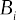

1.  LINUX

> 1.LINUX

Linux is a full-featured general-purpose [OS](#_bookmark17), that has been adapted and improved over the last decade to be used as a [RTOS](#_bookmark22), becoming a viable option as a [RTOS](#_bookmark22) for many relevant workloads. This section shortly presents the background for real-time Linux, along with a description of the tracing subsystem, that is frequently used in the analysis of the timing behavior of the kernel.

> Linux 是一种功能齐全的通用[OS]（#\_bookmark17），在过去十年中进行了调整和改进，用作[ROS]（#\_bookmark22），成为许多相关工作负载的[ROS]的一种可行选择。本节简要介绍了实时 Linux 的背景，以及跟踪子系统的描述，该子系统经常用于分析内核的计时行为。

## Linux as a real-time operating system

Real-time Linux has been a recurring topic in both research ([CALANDRINO et](#_bookmark247) [al.](#_bookmark247), [2006](#_bookmark247); [PALOPOLI et al.](#_bookmark321), [2009](#_bookmark321); [BRANDENBURG; GÜL](#_bookmark243), [2016](#_bookmark243)) and industry ([DUBEY;](#_bookmark270) [KARSAI; ABDELWAHED](#_bookmark270), [2009](#_bookmark270); [GUTIÉRREZ et al.](#_bookmark280), [2018](#_bookmark280); [CUCINOTTA et al.](#_bookmark267), [2009](#_bookmark267);

> 实时 Linux 在这两项研究中都是一个反复出现的话题（[CALANDRINO 等人]（#\_bookmark247）[等人]（#\_bookmark248），[2006]（#\_bbookmark247）；[PALOPOLI 等人]（#\_bookmark321），[2009]（#\_bbookmark321）；[BRANDENBURG；GÜL]（#\_bookmark243），[2016]（#\_bbookmark243））和行业（[DUBEY；]（#\_bookmark270）[KARSAI；ABDELWAHED]；[GUTIÉRREZ 等人]（#\_bookmark280），[2018]（#\_bbookmark280）；[CUCINNOTTA 等人]（#\_bookmark267），[2009]（#\_bbookmark267）；

[CORBET, J.](#_bookmark260), [2010](#_bookmark260)), for more than a decade now. From the different initiatives for en- abling real-time Linux, such as RTAI ([MANTEGAZZA et al.](#_bookmark300), [2000](#_bookmark300)) and Xenomai ([GERUM](#_bookmark278), [2004](#_bookmark278); [BROWN; MARTIN](#_bookmark245), [2010](#_bookmark245)), the PREEMPT*RT became the \_de facto* standard. The difference between the other approaches and the PREEMPT_RT is that, rather than trying to run a real-time [OS](#_bookmark17) in parallel with Linux, the PREEMPT_RT aims to transform the Linux kernel into a [RTOS](#_bookmark22).

> [CORBET，J.]（#\_bookmark260），[2010]（#\_bbookmark260）），至今已有十多年。来自实时 Linux 的不同倡议，如 RTAI（[MANTEGAZZA 等人]（#\_bookmark300），[2000]（#\_bbookmark300））和 Xenomai（[GERUM]（#\_bookmark278），[2004]（#\_bBookmark278）；[BROWN；MARTIN]（#\_bookmark245），[2010]（#\_bbookmark245）），PREEMPT\*RT 成为事实上的标准。其他方法与 PREEMPT_RT 的不同之处在于，PREEMPT_RT 不是试图与 Linux 并行运行实时[OS]（#\_bookmark17），而是将 Linux 内核转换为[RTOS]（#\_bookmark22）。

Linux has three preemption models for kernel space activities. The preemption models range from the _non-preemptive_ mode, in which the kernel code schedules only on predefined preemption points, to the _preemptive_ mode, in which the kernel code is preemptive by default, unless when the preemption is explicitly disabled. It is worth noting that the user-space code is always preemptive, independently of the preemption model.

> Linux 有三种内核空间活动抢占模型。抢占模型的范围从*non-premive*模式（在该模式中内核代码仅在预定义的抢占点上进行调度）到*prempleptive*模式，在该模式下内核代码默认为抢占，除非明确禁用了抢占。值得注意的是，用户空间代码总是优先的，独立于优先模型。

In addition to the preemption models present in the vanilla kernel[1](#_bookmark53), The PREEMPT*RT patchset adds the \_fully-preemptive* model, which improves the _preemptive_ mode. Regarding the _fully-preemptive_ mode, Linux developers have extensively re- worked the Linux kernel to reduce the code sections that could delay the scheduling of the highest-priority thread. While PREEMPT_RT improves the responsiveness, it reduces the throughput of the system, and that justifies the maintenance of the multiple preemption modes on Linux.

> 除了香草内核[1]（#*bookmark53）中存在的抢占模型之外，PREEMPT*RT 补丁集还添加了\_fully-preemptive*模型，这改进了 preemptive 模式。关于\_fully-premive*模式，Linux 开发人员对 Linux 内核进行了广泛的重新设计，以减少可能延迟最高优先级线程调度的代码段。虽然 PREEMPT_RT 提高了响应性，但它降低了系统的吞吐量，这证明了在 Linux 上维护多种抢占模式的合理性。

The cyclictest is the primary tool adopted in the evaluation of the _fully-preem- ptive mode_ of PREEMPT*RT Linux ([CERQUEIRA; BRANDENBURG](#_bookmark251), [2013](#_bookmark251)), and it is used to compute the time difference between an expected activation time and the actual start of execution of the high-priority thread running on a [CPU](#_bookmark6). By configuring the mea- surement thread with the highest priority and running a background task set to generate disturbance, cyclictest is used in practice to measure the \_scheduling latency* of each CPU of the system. Maximum observed latency values generally range from a few mi- croseconds on single-CPU systems to 250 us on non-uniform memory access systems, which are acceptable values for a vast range of applications with sub-millisecond tim- ing precision requirements. In this way, PREEMPT_RT Linux closely fulfills theoretical 1 Vanilla kernel is the Linux kernel as-is from its main repository.

> 循环测试是评估 PREEMPT*RT Linux（[CERQUEIRA；BRANDENBURG]（#\_bookmark251），[2013]（#\_bbookmark251））的完整抢先模式时采用的主要工具，它用于计算预期激活时间与[CPU]（#\_bookmark6）上运行的高优先级线程的实际开始执行之间的时间差。通过配置具有最高优先级的测量线程并运行后台任务集以产生干扰，实际上使用 cyclectest 来测量系统每个 CPU 的调度延迟*。观察到的最大延迟值通常从单 CPU 系统上的几毫秒到非均匀内存访问系统上的 250 微秒不等，这对于具有亚毫秒级延迟精度要求的广泛应用来说是可接受的值。通过这种方式，PREEMPT_RTLinux 完全符合理论 1。Vanilla 内核是 Linux 内核，正如它的主存储库一样。

fully-preemptive systems assumptions that consider atomic scheduling operations, with neglectable overheads.

> 考虑原子调度操作的完全抢先系统假设，开销可忽略不计。

In the _fully-preemptive mode_, there are three different execution contexts: [non-](#_bookmark15) [maskable interrupt (NMI)](#_bookmark15), [maskable interrupts (IRQs)](#_bookmark13), and threads. Both the [NMI](#_bookmark15) and the [IRQs](#_bookmark13) are asynchronous [interrupts (INTs)](#_bookmark11), i.e., mechanisms used to deliver events coming either from external hardware or by code running on other CPUs via inter- processor interrupts. The interrupt controller manages interrupts, both queueing and dispatching one [NMI](#_bookmark15) per-CPU and multiple [IRQs](#_bookmark13). For each CPU, the [NMI](#_bookmark15) is the highest- priority interrupt, so it postpones and preempts [IRQs](#_bookmark13). As a design choice, Linux (in the _fully-preemptive mode_) handles [IRQs](#_bookmark13) with [IRQs](#_bookmark13) disabled. Hence an [maskable interrupt](#_bookmark12) [(IRQ)](#_bookmark12) cannot preempt another [IRQ](#_bookmark12). Threads have no control over the [NMI](#_bookmark15), but they can delay the execution of [IRQs](#_bookmark13) by temporarily disabling (masking) them. Note that when [IRQs](#_bookmark13) are masked, their occurrence is anyway stored in the interrupt controller. When [IRQs](#_bookmark13) are enabled again, the kernel is notified about the occurrence of such interrupts, and they are executed as soon as possible, possibly preempting the currently executing thread. Given the potential interference on threads execution, one of the design goals of the PREEMPT_RT was to reduce the code that executes in the interrupt context to the bare minimum, by moving most of it to thread context ([OLIVEIRA; OLIVEIRA](#_bookmark319), [2016](#_bookmark319)).

> 在\_fully-preempt 模式中，有三种不同的执行上下文：[非]（#\_bookmark15）[可屏蔽中断（NMI）]（#\_bookmark15）、[可屏蔽的中断（IRQ）]（#\_bookmark13）和线程。[NMI]（#\_bookmark15）和[IRQs]（#\_bbookmark13）都是异步[中断（INT）]（#\_bookmark11），即用于通过处理器间中断传递来自外部硬件或其他 CPU 上运行的代码的事件的机制。中断控制器管理中断，每个 CPU 排队和调度一个[NMI]（#\_bookmark15）和多个[IRQ]（#\_bookmark13）。对于每个 CPU，[NMI]（#\_bookmark15）是最高优先级的中断，因此它延迟并抢占[IRQs]（#\_bbookmark13）。作为一种设计选择，Linux（在完全抢占模式下）在[IRQs]（#\_bookmark13）被禁用的情况下处理[IRQ]（#\_bbookmark13）。因此，一个[可屏蔽中断]（#\_bookmark12）[（IRQ）]（#\_bookmark12）不能抢占另一个[IRQ]（#\_blaookmark12）。线程无法控制[NMI]（#\_bookmark15），但它们可以通过暂时禁用（屏蔽）[IRQs]（#\_bbookmark13）来延迟[IRQs]的执行。注意，当[IRQs]（#\_bookmark13）被屏蔽时，它们的出现无论如何都存储在中断控制器中。当[IRQs]（#\_bookmark13）再次启用时，内核会收到此类中断发生的通知，并尽快执行这些中断，可能会抢占当前正在执行的线程。考虑到对线程执行的潜在干扰，PREEMPT_RT 的设计目标之一是通过将大部分代码移动到线程上下文（[OLIVEIRA；OLIVEIRA]（#\_bookmark319），[2016]（#\_bbookmark319）），将在中断上下文中执行的代码减少到最小。

Despite the existence of different memory contexts in which a regular program can run, like user programs in the kernel-space, e.g., during a system call, kernel threads, or the process context in the user-space, from the scheduling viewpoint, they are all threads. Linux has not one but five schedulers, which are provided to fit the re- quirements of the manifold different applicative scenarios in which Linux is used. When invoked, the set of schedulers are queried in a fixed order. The following schedulers are checked:

> 尽管存在常规程序可以在其中运行的不同内存上下文，如内核空间中的用户程序，例如，在系统调用期间，内核线程或用户空间中的进程上下文，但从调度的角度来看，它们都是线程。Linux 只有五个调度程序，而不是一个，这些调度程序是为了满足使用 Linux 的多种不同应用场景的需求而提供的。调用时，将按固定顺序查询调度程序集。检查以下调度程序：

- STOP_MACHINE: a pseudo-scheduler used to execute kernel facilities;

> -STOP_MACHINE：用于执行内核设施的伪调度程序；

- SCHED_DEADLINE ([LELLI et al.](#_bookmark294), [2016](#_bookmark294)): An [earliest deadline first (EDF)](#_bookmark9) like real-time scheduler;

> -SCHED_DEADLINE（[LELLI 等人]（#\_bookmark294），[2016]（#\_bbookmark294））：类似于实时调度器的[最早截止日期优先（EDF）]（#\_bookmark9）；

- SCHED_FIFO and SCHED_RR: the fixed-priority real-time scheduler;

> -SCHED_FIFO 和 SCHED_RR：固定优先级实时调度器；

- SCHED_OTHER: the [completely fair scheduler (CFS)](#_bookmark4);

> -SCHED_OTHER:[完全公平的调度器（CFS）]（#\_bookmark4）；

- IDLE: a pseudo-scheduler that runs the _idle thread_.

> -IDLE：运行 IDLE thread\_的伪调度程序。

Since schedulers are queried in order, the querying order implements the first level of priority among the threads handled by each scheduler. Every time the scheduling- related code is executed by the kernel, the highest-priority thread is selected for a context switch. When no ready threads are available, the IDLE scheduler returns the _idle thread_, a particular thread always ready to run. For simplicity, we refer hereafter with the term _scheduler_ when mentioning the kernel code handling all the scheduling operations related to all five schedulers. The scheduler is called either voluntarily by a thread leaving the processor, or involuntarily, to cause a preemption. Any thread currently executing can postpone the execution of the scheduler while running in the kernel context by either disabling preemption or the [IRQs](#_bookmark13).

> 由于调度程序是按顺序查询的，因此查询顺序在每个调度程序处理的线程中实现了第一级优先级。每次内核执行与调度相关的代码时，都会为上下文切换选择最高优先级的线程。当没有就绪线程可用时，IDLE 调度程序返回 IDLE thread*，这是一个始终准备运行的特定线程。为了简单起见，当提到处理与所有五个调度器相关的所有调度操作的内核代码时，我们在下文中使用术语\_scheduler*。调度器由离开处理器的线程自动调用，或非自愿调用，以引起抢占。当前正在执行的任何线程都可以在内核上下文中运行时通过禁用抢占或[IRQs]（#\_bookmark13）来推迟调度器的执行。

## Task abstraction and context synchronization

As mentioned in the previous section, there are three main contexts in which code can run in the PREEMPT_RT. Two of them are [INTs](#_bookmark11): The [NMI](#_bookmark15), the [IRQ](#_bookmark12), and the other one is the thread context.

> 如前一节所述，代码可以在 PREEMPT_RT 中运行的主要环境有三种。其中两个是[INT]（#\_bookmark11）：[NMI]（#\_bookmark15）、[IRQ]（#\_blaookmark12），另一个是线程上下文。

Interrupts are events that indicate that a condition exists somewhere in the sys- tem, the processor, or within the currently executing thread that requires the attention of a processor. An interrupt occurrence results in a forced transfer of execution from the currently running thread to the interrupt handler. The interrupt handling scheduling is managed by the interrupt controller, provided by hardware[2](#_bookmark55). For instance, in the Intel processors, the prioritization of IRQs is done in the local [advanced programmable](#_bookmark2) [interrupt controller (APIC)](#_bookmark2) of each CPU.

> 中断是指示系统、处理器或当前执行线程中某个地方存在需要处理器注意的情况的事件。发生中断会导致强制将执行从当前运行的线程转移到中断处理程序。中断处理调度由硬件[2]（#\_bookmark55）提供的中断控制器管理。例如，在 Intel 处理器中，IRQ 的优先级排序是在每个 CPU 的本地[高级可编程]（#\_bookmark2）[中断控制器（APIC）]（#\_bookmark2）中完成的。

A thread can postpone the execution of an IRQ by temporarily disabling (or mask- ing) the IRQs in a given processor. Linux API provides two main methods to disable IRQs. The first is through the functions local_irq_disable() and local_irq_enable(). The second is through the functions local_irq_save() and local_irq_restore(), these functions (actually macros) save the processor flags only to be restored lately, which allows nesting calls to disable/enable interrupts ([LOVE](#_bookmark298), [2010](#_bookmark298)). The processor can also temporarily disable IRQs without OS intervention. Indeed, the processor tem- porarily disables all the maskable interrupts before dispatching an interrupt handler. In the PREEMPT_RT case, the interrupt handler continues executing with the interrupts disabled until the end return of the handler. Although the IRQ handlers context exists in the PREEMPT_RT, for most of them, their function is no longer to deal with the hardware but to wake up the kernel threads that execute the code of interrupt handlers. For the sake of completeness, it is worth mentioning that IRQs and threads cannot postpone an NMI execution.

> 线程可以通过临时禁用（或屏蔽）给定处理器中的 IRQ 来推迟 IRQ 的执行。LinuxAPI 提供了两种禁用 IRQ 的主要方法。第一个是通过函数 local_irq_disable（）和 local_irq \_enable（）。第二个是通过函数 local_irq_save（）和 local_irq \_restore（），这些函数（实际上是宏）保存处理器标志，仅在最近恢复，这允许嵌套调用禁用/启用中断（[LLOVE]（#\_bookmark298），[2010]（#\_bbookmark298））。处理器还可以在没有操作系统干预的情况下暂时禁用 IRQ。事实上，处理器在分派中断处理程序之前，通常会禁用所有可屏蔽中断。在 PREEMPT_RT 情况下，中断处理程序在中断被禁用的情况下继续执行，直到处理程序结束返回。尽管 IRQ 处理程序上下文存在于 PREEMPT_RT 中，但对于大多数 IRQ 处理，其功能不再是处理硬件，而是唤醒执行中断处理程序代码的内核线程。为了完整起见，值得一提的是 IRQ 和线程不能延迟 NMI 执行。

Linux processes are composed of a memory context and a set of one or more threads. Generally, a thread runs in the process memory context in user-space. How- ever, when a thread makes a _system call_ or causes an _trap_, for example, with a _page fault_, it changes its execution context from user-space to kernel-space, executing the kernel code in kernel-space on behalf of the process ([CORBET; RUBINI; KROAH-](#_bookmark264) [HARTMAN](#_bookmark264), [2005](#_bookmark264)). There is also the particular case of threads that only run in kernel- space, the so-called kernel threads, or kthreads.

> Linux 进程由一个内存上下文和一组一个或多个线程组成。通常，线程在用户空间中的进程内存上下文中运行。然而，当线程发出*system call*或导致*trap*（例如，发生\_page 错误）时，它会将其执行上下文从用户空间更改为内核空间，代表进程在内核空间中执行内核代码（[CORBET；RUBINI；KROAH-]（#\_bookmark264）[HARTMAN]（#\_bookmark264，[2005]（#\_bbookmark264））。还有一种特殊的情况，即仅在内核空间中运行的线程，即所谓的内核线程或 kthread。

2 See Intel*◯*R 64 and IA-32 Architectures Software Developer’s Manual.

> 2 参见 Intel*◯*R 64 和 IA-32 体系结构软件开发人员手册。

Threads are activated by events that change their state in the scheduler, from _sleeping_ to _ready to execute_. Ideally, when a lower priority thread awakens a higher priority thread, the scheduler should be called and promptly start the execution of the thread with higher priority. However, when preemption or interrupts are disabled, the lower priority thread runs until preemption or IRQ is enabled again, and the scheduler can decide to run a thread with higher priority. Differently from interrupts, Linux is responsible for scheduling threads. The scheduling decisions and the context switch takes place inside the schedule() function. The schedule() function consults all the schedulers, as described previously, and changes the context to the next selected thread as needed.

> 线程由在调度程序中更改其状态的事件激活，从*sleeping*到*ready 再到 execute*。理想情况下，当低优先级线程唤醒高优先级线程时，应调用调度器并立即开始执行具有较高优先级的线程。然而，当抢占或中断被禁用时，低优先级线程将运行，直到再次启用抢占或 IRQ，调度器可以决定运行具有较高优先级的线程。与中断不同，Linux 负责调度线程。调度决策和上下文切换发生在 schedule（）函数中。schedule（）函数参考所有调度器，如前所述，并根据需要将上下文更改为下一个选定线程。

The preemption of a processor can be disabled via the _preempt_disable()_ func- tion, and then enabled again with the function _preempt_enable()_. For each call of _pre- empt_disable()_ there should be a call to _preempt_enable()_. These calls can be nested, the number of nesting can be retrieved with the function _preempt_count()_ ([CORBET; RU-](#_bookmark264) [BINI; KROAH-HARTMAN](#_bookmark264), [2005](#_bookmark264)). The function _preempt_enable()_, when called, checks whether the preemption counter is 0, that is, whether the preemption system will be active again. When enabling preemption, if a higher priority task may be ready to run, the scheduling routine will be called.

> 处理器的抢占可以通过*preemt_disable（）函数禁用，然后通过函数\_preemt_enable（）再次启用。对于 pre-empt_disable（）*的每次调用，都应该调用 preempt*enable（）。这些调用可以嵌套，嵌套的数量可以用函数\_preemt_count（）*（[CORBET；RU-]（#\_bookmark264）[BINI；KROAH-HARTMAN]（#\_bookmark264，[2005]（#\_bbookmark264））检索。调用函数\_prempt_enable（）时，检查抢占计数器是否为 0，即抢占系统是否将再次激活。当启用抢占时，如果一个更高优先级的任务可以运行，则将调用调度例程。

## Mutual exclusion

The Linux kernel has several mechanisms for mutual exclusion. There are two reasons for these different mechanisms. The first comes from the needs of the diverse execution contexts, which have different constraints. For instance, in interrupt context, the code cannot use methods that put the interrupt handler to sleep, while a thread can sleep, allowing other threads to execute while the blocked task waits for the resource. In addition to the restrictions imposed by the execution contexts, the methods of mutual exclusion are optimized for some instances, some to improve performance, others seeking determinism.

> Linux 内核有几种互斥机制。这些不同的机制有两个原因。第一个来自不同执行环境的需求，这些环境具有不同的约束。例如，在中断上下文中，代码不能使用使中断处理程序休眠的方法，而线程可以休眠，从而允许其他线程在被阻塞的任务等待资源时执行。除了执行上下文所施加的限制之外，互斥方法还针对某些实例进行了优化，有些是为了提高性能，有些则是为了寻求确定性。

The next sections introduce the principal mutual exclusion primitives available in the Linux kernel, presenting the motivation for their usages and the behavior change in the PREEMPT_RT kernel. It is worth mentioning that this section does not aim to present an in-depth explanation of all synchronization methods but to introduce the terminology and some aspects that are later covered in the thesis.

> 下一节将介绍 Linux 内核中可用的主要互斥原语，介绍它们的使用动机以及 PREEMPT_RT 内核中的行为变化。值得一提的是，本节的目的不是对所有同步方法进行深入解释，而是介绍术语和本文稍后将涉及的一些方面。

1.  Spinlock

> 1.旋转锁

In a section protected by a spinlock, only one task is allowed access to a specific critical region. The behavior of a spinlock depends on whether the kernel is configured for single-core or multicore systems. In either case, the preemption is disabled before attempting to acquire a lock and is enabled after the release of the lock. In the single- core case, this action is already enough to protect the critical section.

> 在由自旋锁保护的分区中，只允许一个任务访问特定的关键区域。自旋锁的行为取决于内核是为单核系统还是多核系统配置的。在这两种情况下，抢占在尝试获取锁之前被禁用，在释放锁之后被启用。在单核情况下，这个动作已经足以保护关键部分。

In the multicore case, when a task tries to acquire a spinlock that is not held by any other task, the lock is acquired. Otherwise, the task needs to busy-wait for the resource to be released by a task running on another CPU. Although busy-waiting consumes CPU time in vain, it avoids a more complex control, involving changing the task from _ready_ to _sleeping_, calling the scheduler routines, causing context switch to another thread, and so on. Thus, the busy-waiting kernel spinlock is beneficial in the case of small critical sections. An important detail is that, before attempting to acquire a spinlock, the current task disables the preemption of the processor, enabling it again only after releasing the lock.

> 在多核情况下，当一个任务试图获取不被任何其他任务持有的自旋锁时，就会获取该锁。否则，任务需要忙着等待另一个 CPU 上运行的任务释放资源。虽然忙碌等待会白白消耗 CPU 时间，但它避免了更复杂的控制，包括将任务从*ready*更改为*sleeping*、调用调度程序例程、将上下文切换到另一个线程等等。因此，忙碌等待内核自旋锁在关键节段较小的情况下是有益的。一个重要的细节是，在尝试获取自旋锁之前，当前任务禁用处理器的抢占，只有在释放锁之后才能再次启用处理器。

The spin_lock() and spin_unlock() are the main functions for acquiring and releasing a spinlock. The [application programming interface (API)](#_bookmark1) of the spinlocks also implements versions that disable interrupts. Such functions are necessary to prevent deadlocks. For instance: if a thread acquires a spinlock, then an interrupt arrives and tries to acquire the same spinlock, a deadlock will happen because the thread will be waiting for the return of the interrupt handler, never releasing the spinlock. The spinlock is used mainly in parts of the kernel where a task can not sleep, such as interrupt handlers and non-preemptive sections. In the kernel with PREEMPT_RT, spinlocks are mostly converted to [real-time (RT)](#_bookmark20) mutexes. The reason for this change is described in Section [2.2.3.7](#_bookmark63).

> spin_lock（）和 spin_unlock（）是获取和释放自旋锁的主要函数。自旋锁的[应用程序编程接口（API）]（#\_bookmark1）也实现了禁用中断的版本。这些功能是防止死锁所必需的。例如：如果线程获取了一个自旋锁，那么一个中断到达并试图获取相同的自旋锁，就会发生死锁，因为线程将等待中断处理程序的返回，而不会释放自旋锁。自旋锁主要用于内核中任务无法休眠的部分，例如中断处理程序和非抢占部分。在带有 PREEMPT_RT 的内核中，自旋锁大多被转换为[实时（RT）]（#\_bookmark20）互斥锁。第[2.2.3.7]节（#\_bookmark63）描述了此更改的原因。

1.  Read-write spinlocks

> 1.读写自旋锁

In some cases, critical sections are accessed multiple times for data reads, but fewer times for an update. To improve the throughput, exclusive access to these data is required only when writing the data, while allowing concurrent accesses to read the data. In this case, there is contention only when a task waits to write, or tasks wait for a data being written.To acquire the read-write lock for reading one uses functions read_lock() and read_unlock() For writing it uses functions write_lock() and write_unlock().

> 在某些情况下，关键部分被多次访问以进行数据读取，但更新的次数更少。为了提高吞吐量，只有在写入数据时才需要独占访问这些数据，同时允许并发访问来读取数据。在这种情况下，只有当任务等待写入，或者任务等待写入数据时，才会发生争用。要获取读写锁以进行读取，需要使用函数 read_lock（）和 read_unlock（）。

The vanilla kernel uses spinlocks to protect the write access. Thus the read-write spinlocks disable preemption. The read-write spinlocks also have versions that disable interrupts and softirqs. It is not possible to upgrade the read_lock() to a write_lock(), as this causes a deadlock.

> 香草内核使用自旋锁来保护写访问。因此，读写自旋锁禁止抢占。读写自旋锁也有禁用中断和软中断的版本。无法将 read_lock（）升级为 write_lock（（），因为这会导致死锁。

An important detail is that the readers always take precedence over the writers. While there is a reader in the critical section, the writer can not run. Since readers can get the lock concurrently, even if a writer is waiting for the lock, new readers may acquire the lock and thus postpone indefinitely the acquiring of the lock by the writer.

> 一个重要的细节是读者总是优先于作者。当关键部分有读取器时，编写器无法运行。由于读卡器可以同时获取锁，即使写入器正在等待锁，新的读卡器也可能获取锁，从而无限期地推迟写入器获取锁。

In the kernel with PREEMPT_RT, control access to critical sections is made with the RT mutex, avoiding disabling the IRQs and preemption.

> 在具有 PREEMPT_RT 的内核中，对关键部分的控制访问是通过 RT 互斥进行的，避免了禁用 IRQ 和抢占。

1.  Semaphores

> 1.信号量

Unlike spinlocks, semaphores do not use busy-waiting. When a task tries to acquire an unavailable semaphore, the task is placed on a waiting list, its status changes to sleeping, and the task leaves the processor. When the semaphore becomes available, tasks in the queue are awakened accordingly with the lock acquired, continuing its execution. As the kernel has some restrictions on where a piece of code can sleep, semaphores can not be used in the context of interrupts.

> 与自旋锁不同，信号量不使用忙等待。当一个任务试图获取一个不可用的信号量时，该任务被放置在一个等待列表中，其状态变为睡眠状态，并且该任务离开处理器。当信号量变为可用时，队列中的任务将相应地被唤醒，并获取锁，继续执行。由于内核对一段代码的休眠位置有一些限制，因此信号量不能用于中断上下文。

Semaphores accept various tasks in its critical section. A counter, created at the initialization time, controls the access to a critical section. To implement mutual exclusion using a semaphore, one should initialize the semaphore with a counter equals to one. Two basic functions can be used to acquire a semaphore: down() and down_interruptible(). The difference between the two modes is the way that the task is put to sleep: state interruptible or uninterruptible.

> 信号灯在其关键部分接受各种任务。在初始化时创建的计数器控制对关键部分的访问。要使用信号量实现互斥，应该使用等于 1 的计数器初始化信号量。可以使用两个基本函数来获取信号量：down（）和 down_interrupt（）。这两种模式的区别在于任务进入睡眠状态的方式：状态可中断或不可中断。

If a thread in the interruptible state receives a signal, it awakens immediately and the signal delivered to the task. On the other hand, a task in state uninterrupt- ible is not waked up, thus delivering the signal is delayed until the task is awake and acquires the semaphore. Of these two, it is more common to use the so-called down_interruptible(). Function up() releases the semaphore.

> 如果处于可中断状态的线程接收到信号，它将立即唤醒，并将信号传递给任务。另一方面，处于不间断状态的任务不会被唤醒，因此信号的传递会被延迟，直到任务被唤醒并获取信号量。在这两种方法中，更常见的是使用所谓的 down_interruptible（）。函数 up（）释放信号量。

When compared with spinlocks, semaphores have an advantage: semaphores do not disable preemption throughout the critical section. However, semaphores cause higher overhead because they put the task to sleep and wake it up after some time. In cases of small critical sections, this overhead can be higher than the critical section itself, so it is advised only for large critical sections.

> 与自旋锁相比，信号量有一个优势：信号量不会在整个关键部分禁用抢占。然而，信号量会导致更高的开销，因为它们会将任务置于睡眠状态，并在一段时间后将其唤醒。在小临界段的情况下，该开销可能高于临界段本身，因此建议仅针对大临界段。

Another side effect is that by making the task to sleep, a high-priority task can suffer unlimited priority inversion.

> 另一个副作用是，通过使任务进入睡眠状态，高优先级任务可能会遭受无限的优先级反转。

1.  Read-write semaphores

> 1.读写信号量

Semaphores also have a read-write version. Read-write semaphores do not have counters. The rule is the same as read-write spinlocks: a writer requires mutual exclusion, but several concurrent readers are possible. The precedence of the readers over the writers is the same as with the read-write spinlocks. Hence, writers can be blocked indefinitely.

> 信号灯也有读写版本。读写信号量没有计数器。该规则与读写自旋锁相同：一个写入器需要互斥，但几个并发的读取器是可能的。读写器对写入器的优先级与读写自旋锁的优先级相同。因此，可以无限期地阻止编写器。

The function to acquire the semaphore for reading is down_read(). For writ- ing it is used the function down_write(). With read-write semaphores it is possible to downgrade the state writer to the state reader. This is done with the function downgrade_write().

> 获取用于读取的信号量的函数是 down_read（）。编写时使用函数 down_write（）。使用读写信号量，可以将状态写入器降级为状态读取器。这是通过函数降级 write（）完成的。

In the kernel with PREEMPT RT, control access to critical sections is made with the RT mutex, and the read-write logic is disabled: all read-write spinlocks end up converted to regular RT mutex.

> 在具有 PREEMPT RT 的内核中，对关键部分的控制访问是通过 RT 互斥锁实现的，并且读写逻辑被禁用：所有读写自旋锁最终都转换为常规 RT 互斥锁。

1.  Mutex

> 1.Mutex 公司

The mutex option was implemented as a simple mutual exclusion to put tasks on contention to sleep, mainly to replace semaphores initialized with a count of one. Despite having a behavior similar to a semaphore with a count of one, the mutex has a simpler interface, better performance, and more use restrictions, which facilitates system debugging ([LOVE](#_bookmark298), [2010](#_bookmark298)).

> 互斥选项被实现为一个简单的互斥，将任务争用到休眠状态，主要是替换计数为 1 的信号量。尽管互斥锁的行为类似于计数为 1 的信号量，但它具有更简单的接口、更好的性能和更多的使用限制，这有助于系统调试（[LLOVE]（#\_bookmark298），[2010]（#\_bbookmark298））。

To acquire a mutex, it is used the function mutex_lock(). If the mutex is not avail- able, the task is put to sleep. To release a mutex, the function used is mutex_unlock(). In comparison with spinlocks, mutexes have the same benefits and problems of count- ing semaphores initialized to one.

> 要获取互斥锁，使用函数 mutex_lock（）。如果互斥锁不可用，任务将进入休眠状态。要释放互斥锁，使用的函数是 mutex_unlock（）。与自旋锁相比，互斥锁具有相同的优点和问题，即将信号量初始化为 1。

1.  RT mutex

> 1.RT 互斥

The RT mutexes extend the semantics of mutexes with the priority inheritance protocol. In an RT mutex, when a low-priority task holds an RT mutex, and this RT mutex is blocking a task of higher priority, the low-priority task inherits the higher-priority task priority. If the task that inherited the priority blocks on another RT mutex, this propagates the priority to another task until the task that holds the RT mutex releases the mutex that blocked the highest-priority task. This approach helps to reduce the blocking time of high-priority tasks, avoiding unbounded priority inversion.

> RT 互斥体通过优先级继承协议扩展了互斥体的语义。在 RT 互斥体中，当一个低优先级任务持有一个 RT 互斥体，而这个 RT 互斥体阻塞了一个高优先级的任务时，低优先级任务继承了高优先级任务的优先级。如果继承优先级的任务在另一个 RT 互斥体上阻塞，则会将优先级传播到另一个任务，直到持有 RT 互斥体的任务释放阻塞最高优先级任务的互斥体。这种方法有助于减少高优先级任务的阻塞时间，避免无边界优先级反转。

1.  Spinlocks and RT mutex

> 1.自旋锁和 RT 互斥

In the PREEMPT RT, spinlocks and mutexes are converted to RT mutexes. Spin- locks are converted to RT spinlocks, using the RT mutex to implement mutual exclusion. This is possible because in the PREEMPT*RT many sections of the kernel, which were initially in interrupt context, were converted to threads running in the address space of the kernel, so the spinlocks used in these sections can be converted to RT mutex. In parts of the kernel that it can not sleep even with the PREEMPT_RT, the original spinlocks are used, with the prefix raw*, for example, raw_spin_lock().

> 在 PREEMPT RT 中，自旋锁和互斥锁被转换为 RT 互斥锁。自旋锁被转换为 RT 自旋锁，使用 RT 互斥实现互斥。这是可能的，因为在 PREEMPT*RT 中，内核的许多部分（最初在中断上下文中）被转换为在内核地址空间中运行的线程，因此这些部分中使用的自旋锁可以被转换为 RT 互斥锁。在即使使用 PREEMPT_RT 也无法休眠的内核部分，使用原始自旋锁，前缀为 raw*，例如 raw_spin_lock（）。

A major benefit of transforming spinlocks in RT mutexes comes from the fact that the RT mutexes do not disable preemption, reducing the latency. In fact, the use of RT mutexes instead of spinlocks and the execution of device interrupt handlers and softirqs in the context of threads are the two major causes for the decrease of latency in PREEMPT_RT, when compared to the vanilla kernel.

> 在 RT 互斥体中转换自旋锁的一个主要好处是 RT 互斥体不会禁用抢占，从而减少了延迟。事实上，与普通内核相比，使用 RT 互斥锁而不是自旋锁以及在线程上下文中执行设备中断处理程序和软中断是 PREEMPT_RT 延迟降低的两个主要原因。

Figure 3 – ftrace output.

> 图 3–ftrace 输出。

## Linux tracing

Linux has an advanced set of tracing methods, which are mainly applied in the runtime analysis of kernel latencies and performance issues[3](#_bookmark66). The most popular tracing methods are the function tracer that enables the trace of kernel functions ([ROSTEDT](#_bookmark333), [Steven](#_bookmark333), [2010](#_bookmark333)), and the tracepoint that enables the tracing of hundreds of events in the system, like the _wakeup_ of a new thread or the occurrence of an interrupt. But there are many other methods, like kprobes that enable the creation of dynamic tracepoints in arbitrary places in the kernel code, and composed arrangements like using the function tracer and tracepoints to examine the code path from the time a task is woken up to when it is scheduled.

> Linux 有一套高级的跟踪方法，主要应用于内核延迟和性能问题的运行时分析[3]（#\_bookmark66）。最流行的跟踪方法是启用跟踪内核函数的函数跟踪器（[ROSTEDT]（#\_bookmark333）、[Steven]（#\_bookmark333）、[2010]（#\_bbookmark333）），以及启用跟踪系统中数百个事件的跟踪点，如新线程的唤醒或中断的发生。但是还有很多其他方法，比如 kprobes，它允许在内核代码中的任意位置创建动态跟踪点，以及组合安排，比如使用函数跟踪器和跟踪点来检查从唤醒任务到计划任务的代码路径。

An essential characteristic of the Linux tracing feature is its efficiency. Nowadays, almost all Linux based [operating systems (OSes)](#_bookmark18) have these tracing methods enabled and ready to be used in production kernels. Indeed, these methods have nearly zero overhead when disabled, thanks to the extensive usage of runtime code modification techniques that allow for greater efficiency than using conditional jumps when trac- ing is disabled. For instance, when the function tracer is disabled, a no-operation assembly instruction is placed right at the beginning of all traceable functions. When the function tracer is enabled, the no-operation instruction is overwritten with an instruction that calls a function that will _trace_ the execution, for instance by appending information into an in-kernel trace buffer. This is done at runtime, without any need for a reboot. A tracepoint works similarly, but using a jump label ([CORBET, Jonathan](#_bookmark263), [2010](#_bookmark263)). The mentioned tracing methods are implemented in such a way that it is possible to specify how an event will be handled dynamically, at runtime. For example, when en- abling a tracepoint, the function responsible for handling the event is specified through a proper in-kernel [API](#_bookmark1).

> Linux 跟踪特性的一个基本特征是其效率。如今，几乎所有基于 Linux 的[操作系统（OS）]（#\_bookmark18）都启用了这些跟踪方法，并准备在生产内核中使用。事实上，这些方法在禁用时几乎没有开销，这要归功于运行时代码修改技术的广泛使用，与禁用跟踪时使用条件跳转相比，这些技术的效率更高。例如，当函数跟踪器被禁用时，无操作汇编指令被放置在所有可跟踪函数的开头。当启用函数跟踪程序时，无操作指令将被一条调用将跟踪执行的函数的指令覆盖，例如，通过将信息附加到内核内跟踪缓冲区中。这是在运行时完成的，无需重新启动。跟踪点的工作原理类似，但使用跳转标签（[CORBET，Jonathan]（#\_bookmark263），[2010]（#\_bbookmark263））。上述跟踪方法的实现方式可以指定如何在运行时动态处理事件。例如，当启用跟踪点时，负责处理事件的函数是通过适当的内核[API]（#\_bookmark1）指定的。

Currently, there are two main interfaces by which these features can be ac- cessed from user-space: perf and ftrace. Both tools can hook to the trace methods, processing the events in many different ways. The most common action is to record the occurrence of events into a trace-buffer for post-processing or human interpretation of the events. Figure [3](#_bookmark64) shows the output of the ftrace tracing functions and tracepoints. The recording of events is optimized by the usage of _per-CPU_ lock-less trace buffers. Furthermore, it is possible to take actions based on events. For example, it is possible 3 See _Linux Tracing Technologies_: [https://www](http://www.kernel.org/doc/html/latest/trace/index.html).ker[nel.org/doc/html/latest/trace/index.html.](http://www.kernel.org/doc/html/latest/trace/index.html)

> 目前，有两个主要界面可以从用户空间处理这些功能：perf 和 ftrace。这两种工具都可以与跟踪方法挂钩，以多种不同的方式处理事件。最常见的操作是将事件的发生记录到跟踪缓冲区中，以便对事件进行后处理或人工解释。图[3]（#*bookmark64）显示了 ftrace 跟踪函数和跟踪点的输出。通过使用\_per-CPU*无锁跟踪缓冲区来优化事件记录。此外，可以根据事件采取行动。例如，可以 3 参见\_Linux 跟踪技术：[https://www](http://www.kernel.org/doc/html/latest/trace/index.html).ker[nel.org/doc/html/update/trace/index.html](http://www.kernel.org/doc/html/latest/trace/index.html)

Table 1 – Mapping between mechanisms of the Linux kernel and abstractions of the response-time analysis.

> 表 1–Linux 内核机制和响应时间分析抽象之间的映射。

These tracing methods can also be leveraged for other purposes. Similarly to perf and ftrace, other tools can also hook a function to a tracing method, non- necessarily, to provide a trace of the system execution to the user-space. For example, the Live Patching feature of Linux uses the function tracer to hook and deviate the execution of a problematic function to a revised version of the function that fixes a problem ([POIMBOEUF](#_bookmark323), [2014](#_bookmark323)).

> 这些跟踪方法也可以用于其他目的。与 perf 和 ftrace 类似，其他工具也可以将函数挂接到跟踪方法，以向用户空间提供系统执行的跟踪。例如，Linux 的 Live Patching 功能使用函数跟踪器将有问题的函数的执行挂钩，并将其偏离到修复问题的函数修订版本（[PIMBOEUF]（#\_bookmark323），[2014]（#\_bbookmark323））。

## Characterization of real-time Linux tasks timeline

In ([OLIVEIRA; OLIVEIRA](#_bookmark319), [2016](#_bookmark319)), the authors described the timeline of the tasks in the PREEMPT_RT kernel, using the abstractions of the response-time analysis. The description of the timeline was aided by empirical information obtained by tracing the kernel with a custom-developed tool, based on ftrace. The next sections present a summary of this research that serves at the same time background and related work. The limitations and the lessons learned are presented at the end of the section, motivating for the development presented in this thesis.

> 在（[OLIVEIRA；OLIVEIRA]（#\_bookmark319），[2016]（#\_bbookmark319））中，作者使用响应时间分析的抽象描述了 PREEMPT_RT 内核中任务的时间线。通过使用基于 ftrace 的定制开发工具跟踪内核获得的经验信息，有助于描述时间线。下一节将对本研究进行总结，同时提供背景和相关工作。本节末尾介绍了局限性和经验教训，激励了本文的发展。

1.  Kernel mechanisms and

> 1.内核机制和

This Section presents the mapping of the Linux kernel synchronization mecha- nisms to the abstractions used in the response time analysis. This mapping is described in Table [1](#_bookmark67). The three execution contexts of Linux, i.e., NMI, IRQs, and threads, were mapped into the _task_ abstraction. The preemption and interrupt control, that can de- lay the start of the execution of the _task_ context, were mapped into the release _jitter abstaction_. Finally, all the mutual exclusion methods were mapped into the _blocking_ abstraction.

> 本节介绍了 Linux 内核同步机制与响应时间分析中使用的抽象的映射。表[1]（#*bookmark67）描述了该映射。Linux 的三个执行上下文，即 NMI、IRQ 和线程，被映射到\_task*抽象中。抢占和中断控制（可以取消任务上下文执行的开始）被映射到 release*jitter abstraction*中。最后，将所有互斥方法映射到*blocking*抽象中。

Table 2 – Linux events used in the parallel with the response-time analysis.

> 表 2–与响应时间分析并行使用的 Linux 事件。

_Scheduling overhead_

> _调度开销_

An important concept in [RTOS](#_bookmark22) design is the overhead imposed by the scheduler. The scheduling overhead is associated with selecting the next task to be scheduled and the context switching overhead. A Limitation of the classic response-time analysis model is the absence of scheduling overhead that resembles Linux behavior. Moreover, many theoretical studies, often the scheduling overhead, are considered negligible or considered part of the task’s execution time of the task ([SOUTO et al.](#_bookmark335), [2015](#_bookmark335)) ([BLOCK;](#_bookmark239) [ANDERSON](#_bookmark239), [2006](#_bookmark239)). However, many empirical studies consider the measurements of scheduling overhead. These overheads are measured primarily to determine an upper bound, or to compare different implementations of schedulers ([KENNA et al.](#_bookmark285), [2011](#_bookmark285)) ([BASTONI; BRANDENBURG; ANDERSON](#_bookmark236), [2010](#_bookmark236)). To demonstrate the impact of the scheduler overhead in the execution of threads, the work presented in ([OLIVEIRA;](#_bookmark319) [OLIVEIRA](#_bookmark319), [2016](#_bookmark319)) also considers the schedule() execution in the timeline description.

> [RTOS]（#\_bookmark22）设计中的一个重要概念是调度器强加的开销。调度开销与选择要调度的下一个任务和上下文切换开销相关联。经典响应时间分析模型的一个局限性是缺少类似于 Linux 行为的调度开销。此外，许多理论研究（通常是调度开销）被认为是可忽略的，或者被认为是任务执行时间的一部分（[SOUTO 等人]（#\_bookmark335），[2015]（#\_bbookmark335））（[BLOCK；]（#\_bookmark239）[ANDERSON]（#\_blaookmark239），[2006]（#\_bokmark239））。然而，许多实证研究考虑了调度开销的度量。测量这些开销主要是为了确定上限，或比较调度器的不同实现（[KENNA 等人]（#\_bookmark285），[2011]（#\_bbookmark285））（[BASTONI；BRANDENBURG；ANDERSON]（#\_bookmark236），[2010]（#\_bBookmark236））。为了证明调度程序开销对线程执行的影响，（[OLIVEIRA；]（#\_bookmark319）[OLIVEIRA]（#\_bookmark319），[2016]（#\_bbookmark319））中的工作还考虑了时间线描述中的 schedule（）执行。

1.  Trace-timeflow: empircal observation of the system

> 1.跟踪时间流：系统的外周观察

The ftrace tool ([ROSTEDT, Steven](#_bookmark333), [2010](#_bookmark333)) was adapted to trace the occurrence of interesting events in Linux. The adapted trace tool was called trace timeflow. The trace timeflow traces the events listed on Table [2](#_bookmark70). Sich events served to observe the execution of the three different kinds of tasks and the actions that could impact their timing behavior. For instance, the IRQ Handlers entry and exit report the _starting time_ and the _finishing time_ of a job of a given IRQ.

> ftrace 工具（[ROSTEDT，Steven]（#\_bookmark333），[2010]（#\_bbookmark333））适用于跟踪 Linux 中有趣事件的发生。经过调整的跟踪工具称为跟踪时间流。跟踪时间流跟踪表[2]（#\_bookmark70）中列出的事件。Sich 事件用于观察三种不同任务的执行情况以及可能影响其计时行为的行为。例如，IRQ 处理程序入口和出口报告给定 IRQ 的作业的启动时间和完成时间。

By tracing the execution of threads and interrupt handlers using the trace timeflow, it was possible to characterize the execution of these tasks using the real-time scheduling theory abstractions. An example of the trace timeflow output is shown in

> 通过使用跟踪时间流跟踪线程和中断处理程序的执行，可以使用实时调度理论抽象来描述这些任务的执行。跟踪时间流输出的示例如所示

Figure [4](#_bookmark72). In this example, the thread pi, with [process identification number (PID)](#_bookmark19) 838, was running in the [CPU](#_bookmark6) 0, when it caused a _read_ system call in Line 5 and 6. The task then called the function \_raw_spin_lock() to acquire a spinlock in Line 8. Then the preemption is disabled, and the lock mr_lock is acquired without contention, returning to the thread execution in 989 nanoseconds (Lines from 9 to 12). The thread then calls the function \_raw_spin_unlock(), releases the lock, and enables the preemption, in Lines from 13 to 16. Finally, the thread finishes its execution returning from the system call.

> 图[4]（#*bookmark72）。在本例中，具有[进程标识号（PID）]（#\_bookmark19）838 的线程 pi 在[CPU]（#\_bookmark6）0 中运行时，在第 5 行和第 6 行中引发了\_read*系统调用。然后，任务调用函数\_raw_spin_lock（）获取第 8 行中的自旋锁。然后，抢占被禁用，在没有争用的情况下获取锁 mr_lock，在 989 纳秒内返回线程执行（第 9 行到第 12 行）。然后，线程调用函数\_raw_spin_unlock（），释放锁，并在第 13 行到第 16 行中启用抢占。最后，线程完成从系统调用返回的执行。

Figure 4 – Trace timeflow output example.

> 图 4–跟踪时间流输出示例。

1.  Characterization of interrupt handlers timeline

> 1.中断处理程序时间线的表征

    Due to the different restrictions imposed on maskable and non-maskable inter- rupts, it was necessary to characterize the interrupts for these two different modes.

A non-maskable interrupt can be enabled at any time, and therefore must obey a set of very strict rules. For example, a non-maskable interrupt handler can not use mutual exclusion mechanisms, except when it is used only in this context, for synchro- nization with other NMIs running on another CPU. The code of NMI handlers can not be reentrant, i.e., a second NMI will not be handled during the execution of an NMI.

> 不可屏蔽中断可以在任何时候启用，因此必须遵守一组非常严格的规则。例如，一个不可屏蔽的中断处理程序不能使用互斥机制，除非它仅用于此上下文中，以便与另一个 CPU 上运行的其他 NMI 同步。NMI 处理程序的代码不可重入，即在执行 NMI 期间不会处理第二个 NMI。

From these restrictions and the trace of interrupts, it is possible to character- ize the execution of NMIs as in Figure [5](#_bookmark74), where the major quantities of interest, as introduced in Section [2.1](#_bookmark46) are visually highlighted.

> 根据这些限制和中断痕迹，可以对 NMI 的执行进行特征化，如图[5]（#\_bookmark74）所示，其中，第[2.1]节（#\_bbookmark46）中介绍的主要感兴趣的数量被视觉突出显示。

For NMIs, the response time _Ri_ is given by the delay between the IRQ activation and the return of the NMI handler. The release jitter _Ji_ will occur if the system is already handling a non-maskable interrupt. In this case, it is safe to assume the worst case:

> 对于 NMI，响应时间*Ri*由 IRQ 激活和 NMI 处理程序返回之间的延迟给出。如果系统已经在处理不可屏蔽中断，则会发生释放抖动*Ji*。在这种情况下，可以安全地假设最坏的情况：

that the second NMI was activated right after the first NMI was activated.

> 第二 NMI 在第一 NMI 被激活之后立即被激活。

> Figure 5 – Non-maskable interruption timeline.
> 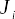

The busy window _Wi_ is defined as the time that the NMI held the CPU during its execution, being determined by the time interval between the call and the return of the IRQ handler. The blocking represented by variable _Bi_ must be implemented as busy waiting, which should occur only for synchronization between non-maskable interrupts in different processors. Finally, the runtime _Ci_ is determined by the busy window, discounting the time that the NMI may have been blocked by another NMI.

> 忙窗口*Wi*定义为 NMI 在执行期间占用 CPU 的时间，由调用和 IRQ 处理程序返回之间的时间间隔确定。由变量*Bi*表示的阻塞必须实现为忙等待，这只应发生在不同处理器中不可屏蔽中断之间的同步。最后，运行时*Ci*由繁忙窗口确定，不考虑 NMI 可能被另一个 NMI 阻塞的时间。

The characterization of the maskable interrupt handlers is shown in Figure [6](#_bookmark75).

> 可屏蔽中断处理程序的特性如图[6]（#\_bookmark75）所示。

> Figure 6 – Maskable interruption timeline.
> 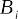

For maskable interrupts, the response time _Ri_ is determined by the time interval between the activation and the return of the interrupt handler. The release jitter _Ji_ can happen if the system has interrupts disabled, either by an action of the operating system or by the action of the processor itself, e.g., if it is already handling an interrupt. In this case, it is safe to assume that in the worst-case activation took place immediately after the disabling of interrupts.

> 对于可屏蔽中断，响应时间*Ri*由中断处理程序激活和返回之间的时间间隔确定。如果系统由于操作系统的动作或处理器本身的动作（例如，如果它已经在处理中断）而禁用了中断，则会发生释放抖动*Ji*。在这种情况下，可以安全地假设在最坏的情况下，在中断禁用之后立即激活。

Unlike non-maskable interrupts, maskable interrupts can suffer interference _Ii_ , caused by a non-maskable interrupt. The busy window _Wi_ is defined as the time that the interruption held the CPU during its execution, being determined by the time interval from start to finish of the interrupt handler. Blocking _Bi_ is always implemented as busy waiting. Lastly, the runtime _Ci_ is determined by the busy window discounting blocking and interference from other interrupt handlers.

> 与不可屏蔽中断不同，可屏蔽中断可能会受到由不可屏蔽的中断引起的干扰*Ii*。忙窗口*Wi*定义为中断在执行期间占用 CPU 的时间，由中断处理程序从开始到结束的时间间隔决定。阻塞*Bi*始终实现为忙等待。最后，运行时*Ci*由繁忙窗口决定，该窗口不考虑来自其他中断处理程序的阻塞和干扰。

1.  Characterization of the threads timeline

> 1.线程时间线的表征

The characterization of real-time threads is more complex than that of the inter- rupt handlers. Therefore, it was made in parts. The first part considers activation without blocking and interference. The second one identifies the different forms of blocking and interference, showing how they can affect the timing behavior of real-time threads. Figure [7](#_bookmark77) describes the execution of a real-time thread without interference or blocking.

> 实时线程的特性比中断处理程序的特性更复杂。因此，它是部分制造的。第一部分考虑无阻塞和干扰的激活。第二种方法识别了不同形式的阻塞和干扰，显示了它们如何影响实时线程的计时行为。图[7]（#\_bookmark77）描述了在没有干扰或阻塞的情况下执行实时线程。

> Figure 7 – Real-time thread.
> 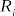 > 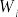 > 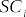

For threads, the response time _Ri_ is the time between the thread activation by the event sched*wakeup, and the context switch when the thread leaves the processor, suspending its execution in state S. The busy window \_Wi* is the time interval between the first context switch after the activation of the task and the context switch in which the task leaves the processor to sleep, finishing its execution. The release jitter _Ji_ can be associated with two reasons: preemption or interrupts being disabled by process of lower priority, and by a scheduler execution that removes the current task. Both must happen at the processor on which the task was activated.

> 对于线程，响应时间*Ri*是由事件 sched*唤醒激活线程与线程离开处理器时上下文切换之间的时间，暂停其在状态 S 下的执行。忙窗口\_Wi*是任务激活后的第一个上下文切换与任务离开处理器进入睡眠的上下文切换之间时间间隔，完成其执行。释放抖动可能与两个原因有关：优先级较低的进程禁用抢占或中断，以及删除当前任务的调度器执行。两者都必须发生在激活任务的处理器上。

After a task starts its execution, the scheduling routine that had suspended the task runs until it returns to the application code. The scheduling overhead is associated with the variable _SCi_ , comprising the exit-scheduling overhead, i.e., the time between the calling of function schedule() and the context switch, and the entry-scheduling over- head, that is the time between the context switch and the return of function schedule().

> 任务开始执行后，暂停任务的调度例程将运行，直到它返回到应用程序代码。调度开销与变量*SCi*相关，包括退出调度开销，即调用函数 schedule（）和上下文切换之间的时间，以及入口调度开销，也就是上下文切换和返回函数 schedule（）之间的时间。

Finally, the computation time _Ci_ is the time that the thread has executed its own code, which can be either in user space or kernel space, excluding scheduling overhead, blocking and interference.

> 最后，计算时间*Ci*是线程执行自己的代码的时间，可以是在用户空间或内核空间，不包括调度开销、阻塞和干扰。

Regarding the interference, _Ii_ , Figure [8](#_bookmark78) describes the two forms of interference that a task can suffer: from an interrupt handler and from another thread.

> 关于干扰*Ii*，图[8]（#\_bookmark78）描述了任务可能遭受的两种形式的干扰：来自中断处理程序的干扰和来自另一个线程的干扰。

Since the interrupt handlers are activated by the hardware, they do not need to be scheduled. The interference of an interrupt handler is given by the busy window _Wi_ of the interrupt handler.

> 由于中断处理程序由硬件激活，因此不需要对它们进行调度。中断处理程序的干扰由中断处理程序忙窗口*Wi*给出。

> Figure 8 – Forms of thread interference.
> 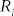  >  > 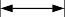 > 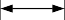 > 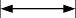 >  > 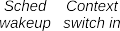

Differently from the interference of interrupt handlers, the interference caused by threads adds scheduling overhead to the currently running task. This overhead increases the scheduling overhead of the task itself. The interference of a high-priority thread is given by the time interval between the context switch that removes the current thread from the processor, and the context switch that gives back the processor to the thread. It is possible to identify whether a thread is suffering interference by the state that it is leaving the processor. When a real-time thread leaves the processor in R state, it is suffering interference.

> 与中断处理程序的干扰不同，线程造成的干扰增加了当前运行任务的调度开销。此开销增加了任务本身的调度开销。高优先级线程的干扰由上下文开关和上下文开关之间的时间间隔给出，上下文开关从处理器中移除当前线程，上下文开关将处理器返回给线程。可以通过线程离开处理器的状态来识别线程是否受到干扰。当实时线程离开处于 R 状态的处理器时，它会受到干扰。

Regarding locks, one thread can experience two forms of blocking: implemented as busy waiting, or implemented by suspending the execution of the thread. Figure [9](#_bookmark79) demonstrates both cases.

> 关于锁，一个线程可以经历两种形式的阻塞：实现为忙等待，或者通过暂停线程的执行来实现。图[9]（#\_bookmark79）展示了这两种情况。

> Figure 9 – Forms of thread blocking.
> 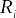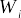 > 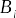 > 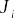  >  > 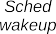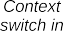

The first example of _Bi_ (left) is a busy-waiting lock, where the task keeps running on its context until another thread releases the lock. In the trace, it is possible to identify this blocking by the tracepoint lock_contended. After acquiring access to the critical section, tracepoint lock_acquired is shown. Thus, the blocking time is given by the time interval between these two tracepoints.

> _Bi_（左）的第一个示例是一个忙等待锁，其中任务在其上下文中一直运行，直到另一个线程释放锁。在跟踪中，可以通过跟踪点 lock_contend 来识别此阻塞。获取对关键部分的访问权限后，将显示跟踪点 lock_acquired。因此，阻塞时间由这两个跟踪点之间的时间间隔给出。

The second example is (right) the type of blocking that suspends the execution of the thread until it acquires the critical section. In this case, as the scheduling overhead happens due to the mutual-exclusion mechanism, it is considered that this time is part of the blocking time of the task, and the measurement is made in a manner analogous to the mechanisms that do not suspend execution: the time interval between tracepoints lock_contended and lock_acquired.

> 第二个例子是（右）暂停线程执行直到获取关键部分的阻塞类型。在这种情况下，由于互斥机制导致了调度开销，因此认为这段时间是任务阻塞时间的一部分，并且以与不暂停执行的机制类似的方式进行测量：跟踪点 lock_contend 和 lock_acquired 之间的时间间隔。

1.  Final remarks

> 1.最后备注

Although the work presented in ([OLIVEIRA; OLIVEIRA](#_bookmark319), [2016](#_bookmark319)) successfully de- scribes the execution of tasks on Linux using terms from real-time scheduling theory, it can be improved to cover all the possible states better a task can have in a single execution. For example, it shows the kinds of the _blocking_ a task may suffer, but it lacks the description of how many times a task can block, or that, a task can block during the scheduling actions or the possibility of nested locking. The interpretation can also be improved by adding a new set of variables that can better describe the particular behavior of Linux. To improve the state-of-art, we believe that a mathematical model is required. The model should be based on well-defined criteria that describe, in a deterministic way, enabling the analysis of all possible states a task can have on Linux. Toward the formalization of Linux execution tasks, the next section introduces concepts from formal methods theory, the modeling of [DES](#_bookmark8), followed by the modeling approaches applied in the modeling of complex systems.

> 尽管（[LOLIVEIRA；OLIVEIRA]（#*bookmark319），[2016]（#\_bbookmark319））中提出的工作使用实时调度理论的术语成功地描述了在 Linux 上执行任务，但可以改进它，以更好地覆盖任务在单个执行中可能具有的所有状态。例如，它显示了任务可能遭受的\_blocking*类型，但缺少对任务可以阻止多少次的描述，或者任务可以在调度操作期间阻止多少次，或者嵌套锁定的可能性。还可以通过添加一组新的变量来改进解释，这些变量可以更好地描述 Linux 的特定行为。为了提高技术水平，我们认为需要一个数学模型。该模型应基于定义良好的标准，以确定性的方式描述，从而能够分析任务在 Linux 上可能具有的所有状态。关于 Linux 执行任务的形式化，下一节将介绍形式化方法理论中的概念，[DES]（#\_bookmark8）的建模，以及在复杂系统建模中应用的建模方法。

1.  FORMAL METHODS

> 1.正式方法

Formal methods are fundamental in the development of cyber-physical systems. Mainly to systems that can cause major damage, including loss of life, which are the case of safety-critical hard real-time systems. Formal methods consist of a collection of mathematical methods to rigorously state the specification of a system. The spec- ifications of a system can then be used for multiple purposes, including the formal verification of the correctness of a program. The advantage of the usage of mathemati- cal notation is that it removes the ambiguous nature of natural language while enabling automatic verification of the system.

> 形式化方法是网络物理系统开发的基础。主要针对可能造成重大损害的系统，包括生命损失，这是安全关键型硬实时系统的情况。形式化方法由一组数学方法组成，以严格地描述系统的规范。系统规范可用于多种目的，包括程序正确性的正式验证。使用数学符号的优点在于，它消除了自然语言的模糊性，同时实现了系统的自动验证。

Spivey ([SPIVEY](#_bookmark337), [1989](#_bookmark337)) defines formal specification as:

> Spivey（[Spivey]（#\_bookmark337），[1989]（#\_bookmark337））将正式规范定义为：

- \*"Formal specification is the use of mathematical notation to describe in a pre- cise way the properties that an information system must have, without unduly constraining the way in which these properties are achieved."\* While O’Regan ([O’REGAN](#_bookmark305), [2017](#_bookmark305)) defines the properties of a system as follows:

> -\*“正式规范是使用数学符号以精确的方式描述信息系统必须具有的属性，而不过度限制实现这些属性的方式。”

- \*"The properties are a logical consequence of the mathematical definition, and the requirements may be amended where appropriate."* Several different specification formalisms can be used in the specifications of computing systems. These formalism can be classified into two different approaches: the *axiomatic or algebraic approach* ([CENTER et al.](#_bookmark250), [1976](#_bookmark250)) and the *model-oriented approach\* ([CLARKE; EMERSON; SIFAKIS](#_bookmark256), [2009](#_bookmark256)).

> -\*“属性是数学定义的逻辑结果，可以在适当的情况下修改要求。”*计算系统规范中可以使用几种不同的规范形式。这些形式可分为两种不同的方法：*公理化或代数方法*（[CENTER 等人]（#\_bookmark250），[1976]（#\_bookmark250））和*面向模型的方法\*（[CLARKE；EMERSON；SIFAKIS]（#\_blaookmark256），[2009]（#\_bbookmark256））。

The _axiomatic or algebraic approach_ dates from the mid-70s. This technic uses different mathematical structures from the modern algebra, such as groups, rings, fields, in the specification of data types, using then the equational logic as a specification mechanism ([EHRIG et al.](#_bookmark271), [1992](#_bookmark271)). The [calculus communicating systems (CCS)](#_bookmark3) and the [communicating sequential processes (CSP)](#_bookmark7) are example of specification languages using the _axiomatic or algebraic approach_.

> 代数方法可以追溯到 70 年代中期。该技术在数据类型的规范中使用了与现代代数不同的数学结构，例如群、环、域，然后使用等式逻辑作为规范机制（[EHRIG 等人]（#\_bookmark271），[1992]（#\_bbookmark271））。[演算通信系统（CCS）]（#\_bookmark3）和[通信顺序过程（CSP）]（#\_bookmark7）是使用\_axiomatic 或代数方法的规范语言的示例。

The _model-oriented approach_ uses a mathematical model for the specification of a system. In this context, a model is a mathematical abstraction of a system that exists in the real world, containing only the necessary details to explain a given behavior of the system. Discrete mathematics elements, such as set theory, functions and relations are applied to the modeling of computer systems, both directly, or as part of more complex forms, such as finite-state machines and automata. Many sorts of formal verification methods can be then applied to formal models of systems, such as _model checking_ and [RV](#_bookmark23).

> 面向模型的方法使用数学模型来描述系统。在这种情况下，模型是现实世界中存在的系统的数学抽象，只包含解释系统给定行为的必要细节。离散数学元素，如集合论、函数和关系，直接或作为更复杂形式的一部分，如有限状态机和自动机，应用于计算机系统的建模。然后，可以将多种形式验证方法应用于系统的形式模型，例如*model checking*和[RV]（#\_bookmark23）。

As presented in Chapter [3](#related-work), the usage of formal models for Linux has gained attention in the last year, motivating many different theoretical and practical work. Mo- tivated by this trend, along with other arguments explained in the next sections, this thesis follows the _model-oriented_ approach.

> 如第[3]章（#相关工作）所述，在过去一年中，Linux 正式模型的使用受到了关注，激发了许多不同的理论和实践工作。受这一趋势的激励，以及在下一节中解释的其他论点，本文遵循模型导向方法。

## Models

A model is an _abstraction_ (a set of mathematical equations) of a system, whereas a system is _something real_, e.g., an amplifier, a car, a factory, a human body, and so on. The process of modeling a system involves the definition of a set of measurable variables associated with the given system. The subset of variables acting on the sys- tem from outside is considered input variables. The subset of these variables, which is possible to measure while varying the input directly, is defined as the set of output vari- ables. The input variables can be thought as the _stimulus_, which produces a _response_ on output variables, as in Figure [10](#_bookmark83). It is possible that some variables are not associ- ated with either the input or the output, these are sometimes referred to as suppressed output variables. To complete a model, it is reasonable to postulate that there exists some mathematical relationship between the input and the output ([CASSANDRAS;](#_bookmark248) [LAFORTUNE](#_bookmark248), [2010](#_bookmark248)).

> 模型是一个系统的抽象（一组数学方程），而系统是一个实际的东西，例如放大器、汽车、工厂、人体等等。系统建模的过程涉及到与给定系统相关的一组可测量变量的定义。从外部作用于系统的变量子集被视为输入变量。这些变量的子集可以在直接改变输入的同时进行测量，定义为输出变量集。输入变量可以被认为是*stimulus*，它在输出变量上生成*response*，如图[10]（#\_bookmark83）所示。有些变量可能与输入或输出不相关，这些变量有时被称为抑制输出变量。为了完成一个模型，有理由假设输入和输出之间存在某种数学关系（[CASSANDRAS；]（#\_bookmark248）[LAFORTUNE]（#\_bookmark248），[2010]（#\_bbookmark248））。

It is essential to emphasize flexibility in the modeling process since no unique way to select input and output variables is imposed. Thus, it is the task of the modeler to identify these variables, depending on a particular point of view or on the constraints imposed by a specific application. Generally, the model only approximates the complete behavior of the system, and it is a good practice to try to simplify the model, following the "Ockham’s Razor" (law of parsimony) approach. The _adequacy_ is a crucial aspect during the definition of the level of abstraction used in the model. The _adequacy_ of a model determines how effectively the model represents the underlying behavior of the system ([O’REGAN](#_bookmark305), [2017](#_bookmark305)). When an _adequate_ model is found, the terms system and model can be interchangeably used. The following items are desirable characteristics of a software reliability model:

> 在建模过程中强调灵活性是至关重要的，因为选择输入和输出变量的唯一方法是不强加的。因此，建模者的任务是根据特定的观点或特定应用程序施加的约束来识别这些变量。通常，该模型仅近似于系统的完整行为，遵循“Ockham 的 Razor”（简约法则）方法来尝试简化模型是一种很好的做法。在定义模型中使用的抽象级别时，*等式是一个关键方面。模型的\_aequacy*决定了模型如何有效地表示系统的底层行为（[O'REGAN]（#\_bookmark305），[2017]（#\_bbookmark305））。当找到一个\_aequate_model 时，术语 system 和 model 可以互换使用。以下项目是软件可靠性模型的理想特征：

> Figure 10 – System and Model.
> 

- good theoretical foundation;

> -良好的理论基础；

- realistic assumptions;

> -现实假设；

- good empirical support;

> -良好的经验支持；

- as simple as possible;

> -尽可能简单；

- trustworthy and accurate.

> -值得信赖和准确。

A fundamental step in the development of a model is the clear definition of its purpose. As described in Section [2.1.1](#real-time-scheduling-theory), in the real-time scheduling theory, a system is modeled as a set of tasks. Based on this point of view, this work endeavors the creation of an explicit formal model for the tasks of Linux, including the variables that influence the timing behavior of the tasks.

> 开发模型的一个基本步骤是明确其目的。如第[2.1.1]节（#实时调度理论）所述，在实时调度理论中，系统被建模为一组任务。基于这一观点，这项工作努力为 Linux 的任务创建一个明确的形式化模型，包括影响任务计时行为的变量。

Generally, the specifications of computing systems are created in an early stage of the process and are used as a reference for the development and testing of the

> 通常，计算系统的规范是在过程的早期阶段创建的，并用作开发和测试

system. However, Linux already exists, and it is unrealistic to think about a complete redesign of the core features of the kernel. Thus, the purpose for the creation of an explicit model of the task of Linux are:

> 系统然而，Linux 已经存在，想要彻底重新设计内核的核心功能是不现实的。因此，创建 Linux 任务的显式模型的目的是：

- to promote the unambiguous understanding of the system from its formal specifi- cations: useful in the definition of the timing behavior of Linux;

> -从系统的形式规范中促进对系统的明确理解：有助于定义 Linux 的计时行为；

- to enable the validation of the model against the real execution of the system: a fundamental step to strengthen the trustworthy and accuracy of the model;

> -使模型能够根据系统的实际执行进行验证：这是加强模型可靠性和准确性的基本步骤；

- to verify violations of the specifications during the execution of the system: useful in the formal verification of Linux behavior. Despite the arguments in favor of the usage of formal methods, its application is generally restricted to specific sectors. The most commonly mentioned reasons for that are the complexity of the mathematical notation used in the specifications, along with limitations of computational space and processing time required for the verification of a system using formal methods. Regarding the complexity, it is a challenge for this work to find a formal specification notation that, at the same time, can be easily interpreted by kernel developers, useful to demonstrate the timing behavior of tasks, and able to verify the Linux kernel behavior appropriately. Regarding performance, a common problem faced by practitioners in the usage of formal methods is the _state explosion_ problem. As exemplified in ([CLARKE; EMERSON; SIFAKIS](#_bookmark256), [2009](#_bookmark256)), the composition of a model of a system with _n_ tasks, with each task with _m_ states, will result in a model with _mn_ states. Moreover, it is also important to consider the level of expressiveness of the specification notation. Generally, a more concise notation is likely to be more efficient than feature-rich notation.

> -在系统执行期间验证违反规范的行为：在 Linux 行为的正式验证中很有用。尽管有支持使用正式方法的论点，但它的应用通常限于特定部门。最常提到的原因是规范中使用的数学符号的复杂性，以及使用正式方法验证系统所需的计算空间和处理时间的限制。关于复杂性，这项工作的一个挑战是找到一个正式的规范符号，同时，它可以很容易地被内核开发人员解释，有助于演示任务的计时行为，并能够适当地验证 Linux 内核行为。关于性能，从业者在使用正式方法时面临的一个常见问题是状态爆炸问题。如（[CLARKE；EMERSON；SIFAKIS]（#*bookmark256），[2009]（#\_bbookmark256））所示，一个具有\_n 个任务的系统模型的组成，每个任务具有\_m*个状态，将产生一个具有*mn*个状态的模型。此外，考虑规范符号的表达水平也很重要。通常，更简洁的表示法可能比功能丰富的表示法更有效。

Hence, as important as defining the goals of a model, it is determining what are not the goals of a model, limiting its scope to avoid hitting the limitations of formal modeling. In this regard, a common motivation to create a model is to predict future behavior ([EPSTEIN](#_bookmark273), [2008](#_bookmark273)) In the case of the real-time system scheduling theory, the prediction of the future generally means the definition of the schedulability of a system, with many articles that explore this possibility ([FERSMAN; MOKRUSHIN, et al.](#_bookmark276), [2006](#_bookmark276); [NORSTROM; WALL; WANG YI](#_bookmark304), [1999](#_bookmark304); [AMNELL, T. et al.](#_bookmark228), [2002](#_bookmark228); [ABDEDDAÏM; MALER](#_bookmark222), [2001](#_bookmark222)). However, it is essential to clarify that this is not the main goal of this project. The justification for such choice is avoiding well-known restrictions on the use of formal methods with complex software such as the Linux kernel.

> 因此，与定义模型的目标一样重要的是，确定什么不是模型的目标，限制其范围以避免触及正式建模的限制。在这方面，创建模型的共同动机是预测未来行为（[EPSTEIN]（#\_bookmark273），[2008]（#\_bbookmark273））。在实时系统调度理论的情况下，对未来的预测通常意味着系统可调度性的定义，许多文章探讨了这种可能性（[FERSMAN；MOKRUSHIN 等人]（#\_bookmark276），[2006]（#\_bookmark276）；[NORSTROM；WALL；王怡]（#\_bookmark304），[1999]（#\_bbookmark304）；[AMNELL，T.等人]（#\_bookmark228），[2002]（#\_bbookmark228）；[ABDEDDA M；MALER]（#\_bookmark222），[2001]（#\_bbookmark222））。然而，必须澄清这不是本项目的主要目标。这种选择的理由是避免了众所周知的限制，即在复杂软件（如 Linux 内核）中使用正式方法。

From all available methods to formally describe a system, the methods used the [DES](#_bookmark8) demonstrated to be an appropriate choice for this research, mainly because:

> 从正式描述系统的所有可用方法中，[DES]（#\_bookmark8）所使用的方法被证明是本研究的适当选择，主要原因是：

1.  real-time systems models are generally formalized using discrete math methods;

> 1.实时系统模型通常使用离散数学方法形式化；

2.  [OS](#_bookmark17) developers are familiar with state-machine like descriptions;

> 2.[OS]（#\_bookmark17）开发人员熟悉类似状态机的描述；

3.  Linux possesses logical and event-based behavior;

> 3.Linux 具有逻辑和基于事件的行为；

4.  Linux has a vast set of events that can be traced efficiently;

> 4.Linux 有大量可以有效跟踪的事件；

5.  the previous attempt to describe Linux behavior was made using tracing;

> 5.先前描述 Linux 行为的尝试是使用跟踪进行的；

6.  a vast set of formal verification methods are available for [DES](#_bookmark8), such as [RV](#_bookmark23) and model checking.

> 6.[DES]（#\_bookmark8）有大量的形式验证方法可用，如[RV]（#\_bookmark23）和模型检查。

The next sections present the basics notions of [DES](#_bookmark8) and automata theory used in the development of the model.

> 下一节将介绍[DES]（#\_bookmark8）的基本概念和模型开发中使用的自动机理论。

## Discrete event systems

A set of appropriate models for [DES](#_bookmark8) was developed to adequately describe the behavior of these systems and provide a framework for analytic techniques to meet design, control, and performance evaluation goals. This section presents the most basic format for the description of a [DES](#_bookmark8): the _language_ formalism.

> 为[DES]（#*bookmark8）开发了一组适当的模型，以充分描述这些系统的行为，并为满足设计、控制和性能评估目标的分析技术提供框架。本节介绍[DES]（#\_bookmark8）描述的最基本格式：\_language*形式。

The evolution of a [DES](#_bookmark8) can be thought of as a sequence of visited states, and the associated events causing transitions. The description of the evolution is then done as a sequence of events, for instance, *e*1, *e*2, *e*3, ..., _en_, that describes the logical behavior of the system. All possible sequences of events define the language that describes the system. The issue of representing a language using appropriate modeling formalism is the key to do the analysis, control, and hence performance evaluation of a [DES](#_bookmark8).

> [DES]（#_bookmark8）的演变可以被认为是一系列被访问的状态，以及导致转换的相关事件。然后将进化描述为一系列事件，例如，*e*1，*e*2，*e*3_en_，描述系统的逻辑行为。所有可能的事件序列都定义了描述系统的语言。使用适当的建模形式表示语言的问题是进行[DES]（#\_bookmark8）分析、控制和性能评估的关键。

The starting point of a [DES](#_bookmark8) is the underlying finite event set _E_ associated with it. The set _E_ represents the “alphabet” used to form “strings” (or “words” or even “trace”) of event sequences that compose a language. This framework can be used either to define the language to be performed by a new system or to identify the language spoken by an existing system formally.

> [DES]（#_bookmark8）的起点是与其相关的底层有限事件集合\_E_。集合*E*表示用于构成语言的事件序列的“字符串”（或“单词”，甚至“轨迹”）的“字母表”。该框架既可以用于定义新系统要执行的语言，也可以用于正式识别现有系统所使用的语言。

A string composed of no events is called the empty string, and it is denoted by _ε_. The length of a string is the number of events contained in it, counting repeated events. If _s_ is a string, |_s_| will denote the length of _s_.

> 没有事件组成的字符串称为空字符串，用*ε*表示。字符串的长度是其中包含的事件数，包括重复的事件。如果*s*是字符串，|_s_|将表示*s*的长度。

1.  Language definition

> 1.语言定义

A language defined over an event set _E_ is a set of finite-length strings formed from events in _E_ .

> 在事件集*E*上定义的语言是由*E*中的事件形成的一组有限长度字符串。

For example, let the set _E_ be composed of {_a_, _b_, _c_}. It is possible to define the language *L*1 with the following four strings:

> 例如，让集合*E*由{_a_，_b_，_c_}组成。可以使用以下四个字符串定义语言*L*1：

> *L*1 = {_ε_, _a_, _ab_, _acc_} (4)

It is also possible to define the language *L*2 with four strings as following:

> 还可以使用以下四个字符串定义语言*L*2：

> *L*2 = {_strings with two elements starting with a_} (5) = {_ε_, _aa_, _ab_, _ac_}

Moreover, it is also possible to have a set with infinite elements. For instance:

> 此外，也可以有一个包含无限元素的集合。例如：

> *L*3 = {_all strings starting with a_} (6)

The concatenation is the base operation of the composition of a string, hence a language. Taking *L*1 as example, _acc_ can be seen as the concatenation of _a_, _c_ and _c_ again, or the concatenation of _a_ and _cc_, or even the concatenation of _ac_ and _c_. Regarding the empty string, since _aε_ = _εa_ = _a_ it is possible to classify _ε_ as the identity element of concatenation.

> 串联是字符串的基本操作，因此是一种语言。以*L*1 为例，*acc*可以再次被视为*a*、*c*和*c*的级联，或者是*a*和*cc 的级联，甚至是\_a*与*c*的串联。关于空字符串，由于*aε*=_εa_=_a_，可以将*ε*分类为串联的单位元素。

To be able to formally define concatenation, the Kleene-closure operation, de- noted by _∗_, must be presented. The Kleene-closure of a set _E_ is the set _E∗_ composed of all finite strings of elements from _E_ . Therefore, it is possible to state that _E_ is a subset of _E∗_. It is noteworthy that _E∗_ contains an infinity number of elements.

> 为了能够正式定义连接，必须给出 Kleene 闭包运算，用\*\**表示。集合*E*的 Kleene 闭包是集合*E\**，由来自*E*的所有有限元素串组成。因此，可以声明*E*是*E\**的子集。值得注意的是，*E\*\*包含无限数量的元素。

Formally, the Kleene-closure of a language _L_ is defined as: Let _L ⊆ E∗_, then

> 形式上，语言*L*的 Kleene 闭包定义为：Let\*L⊆E\*\*，则

> _L∗_ := {_ε_} _∪ L ∪ LL ∪ LLL ∪_ ... (7)

Therefore, concatenation is defined as follows:

> 因此，串联定义如下：

> Let _La_, _Lb ⊆ E∗_, then

> _LaLb_ := {_s ∈ E∗_ : (_s_ = _sasb_) _and_ (8) (_sa ∈ La_) _and_ (_sb ∈ Lb_)}

Another important operation is the prefix-closure. A language _L_ is said to be prefix-closed, denoted by _L_, if any prefix of any string in _L_ is also an element of _L_. Formally, Let _L ⊆ E∗_, then

> 另一个重要的操作是前缀闭包。如果*L*中任何字符串的任何前缀也是*L*的元素，则语言*L*被称为前缀封闭的，由*L*表示。形式上，设\*L⊆E\*\*，则

> _L_ := {_s ∈ E∗_ : (_∃t ∈ E∗_)\[_st ∈ L_\]} (9)

Finally, the following three terms are often used on strings operations: Let _s_ = _abc_, then:

> 最后，以下三个术语通常用于字符串操作：Let*s*=_abc_，则：

- _a_ is a prefix of _s_,

> -*是\_s*的前缀，

> Figure 11 – Example of automaton.
> 
> Figure 12 – Example of Petri net.
> _a Q_

- _b_ is a substring of _s_, and

> -*b*是*s*的子字符串，并且

- _c_ is a suffix of _s_.

> -c 是 s 的后缀。

It is important to note that _ε_ and _s_ are both prefix, suffix and a substring of _s_. Moreover, since languages are sets, usual set operations such as union, intersection, difference, and complement with respect to _E∗_ can be used.

> 需要注意的是，*ε*和*s*都是前缀、后缀和*s*的子字符串。此外，由于语言是集合，所以可以使用通常的集合操作，例如并集、交集、差集和关于\*E\*\*的补集。

1.  DES modeling formalism

> 1.DES 建模形式

Although languages enable the formal modeling of a [DES](#_bookmark8) by describing all pos- sible sequences of events that a [DES](#_bookmark8) can produce or process, the absence of an addi- tional level of structures to describe the logical behavior of a system makes its usage not always easy when modeling arbitrarily complex systems. However, it is possible to surpass this limitation with two formalism: _Petri nets_ and _automata_. Both formalisms can represent a language using a graphical state transition format, and enable a modular modeling approach, turning the development more intuitive and flexible. However, both formalism have different concepts and representations, as shown Figures [11](#_bookmark86) and [12](#_bookmark86).

> 尽管语言通过描述[DES]（#*bookmark8）可以产生或处理的所有可能的事件序列来实现[DES]的形式化建模（#\_bbookmark8），但由于缺乏描述系统逻辑行为的额外结构，因此在建模任意复杂的系统时，其使用并不总是容易的。然而，可以用两种形式来超越这一限制：\_Petri nets*和*automata*。这两种形式主义都可以使用图形状态转换格式表示语言，并支持模块化建模方法，使开发更加直观和灵活。然而，两种形式都有不同的概念和表示，如图[11]（#\_bookmark86）和[12]（#\_bookmark86）所示。

Both automata and Petri nets were tried with preliminary versions of the IRQ model ([OLIVEIRA, D. B. de et al.](#_bookmark306), [2017](#_bookmark306)). In both cases, it was possible to create simple models using a modular approach[4](#_bookmark88) and conduce non-functional verification of the models.

> 使用 IRQ 模型的初步版本尝试了自动机和 Petri 网（[OLIVEIRA，D.B.de 等人]（#\_bookmark306），[2017]（#\_bbookmark306））。在这两种情况下，都可以使用模块化方法[4]（#\_bookmark88）创建简单的模型，并对模型进行非功能验证。

However, the automata format showed to be a better option for this project. The automata format is simpler and more intuitive for [OS](#_bookmark17) developers, facilitating the 4 See Section [2.3.3.2](#_bookmark91).

> 然而，自动机格式对于这个项目来说是一个更好的选择。自动机格式对于[OS]（#\_bookmark17）开发人员来说更简单、更直观，便于 4 参见第[2.3.3.2]节（#\_bbookmark91）。

goal of promoting the unambiguous understanding of Linux, which was confirmed with developers during the development of models. For example, preliminary versions of the models were presented to the real-time Linux kernel community at the Real-time Linux Summit 2018 ([OLIVEIRA](#_bookmark316), [2018e](#_bookmark316)) and the general community at the Linux Plumbers Conference ([OLIVEIRA](#_bookmark317), [2018f](#_bookmark317),[d](#_bookmark313)).

> 目标是促进对 Linux 的明确理解，这一点在模型开发期间得到了开发人员的确认。例如，在 2018 年实时 Linux 峰会上，实时 Linux 内核社区（[OLIVEIRA]（#\_bookmark316）、[2018e]（#\_bookmark316））和 Linux Plumbers 会议上的普通社区（[OOLIVEIA]（#\_bookmark317）、[22018f]（#\_bookmark317）、[d]（#\_blaookmark313））都展示了模型的初步版本。

Moreover, the more sophisticated format of Petri nets resulted in longer process- ing times for composition and non-functional verification of the models, even for models with less than one hundred states in its automata version. Foreseeing a large number of states for the desired thread model, confirmed by the final thread model in Chapter [4](#a-thread-synchronization-model-for-the-preempt_rt-kernel) with more than nine thousand states, the choice for the automata formalism was made.

> 此外，更复杂的 Petri 网格式导致模型合成和非功能验证的处理时间更长，甚至对于自动机版本中状态少于 100 个的模型也是如此。预见到所需线程模型的大量状态，并在第[4]章（#a-thread-synchronization-model-for-the-preept_rt-kernel）的最终线程模型中得到了确认，该模型有 9000 多个状态，因此选择了自动机形式。

The next section presents the basics of automata theory, including the modeling approach used later in the project.

> 下一节将介绍自动机理论的基础知识，包括项目后期使用的建模方法。

## Automata theory

By using automaton formalism, it is possible to define a language according to well-defined rules. Automata are intuitive and easy to use, they are amenable to composition operations, and analysis as well, considering the finite-state case.

> 通过使用自动机形式，可以根据定义良好的规则定义语言。自动机是直观且易于使用的，考虑到有限状态的情况，它们可以进行组合运算和分析。

One of the key features of an automaton is its directed graph or state transition diagram representation. For example, let the event set be _E_ = {_a_, _b_, _c_}. Then, consider the state transition diagram in Figure [11](#_bookmark86), where nodes represent states, labeled arcs represent transitions between states, the arrow points to the initial state, and the nodes with double circles are marked states.

> 自动机的一个关键特征是其有向图或状态转换图表示。例如，让事件集为*E*={_a_，_b_，_c_}。然后，考虑图[11]（#\_bookmark86）中的状态转换图，其中节点表示状态，标记的弧表示状态之间的转换，箭头指向初始状态，带有双圆圈的节点表示状态。

Formally, a deterministic automaton, denoted by _G_, is a quintuple

> 形式上，由*G*表示的确定性自动机是五元组

> _G_ = {_X_ , _E_ , _f_ , *x*0, _Xm_} (10)

where:

> 哪里：

> - _X_ is the set of states
> - _E_ is the finite set of events
> - _f_ : _X × E → X_ is the transition function. It defines the state transition in the occurrence of a event from _E_ in the state _X_ .
> - *x*0 is the initial state
> - _Xm ⊆ X_ is the set of marked states

For instance, the automaton _G_ represented in Figure [11](#_bookmark86) can be defined as follows:

> 例如，图[11]（#*bookmark86）中表示的自动机\_G*可以定义如下：

> - _X_ = {_x_ , _y_ , _z_}
> - _E_ = {_a_, _b_, _g_}
> - _f_ =
>   - _f_ (_x_ , _a_) = _x_
>   - _f_ (_y_ , _a_) = _x_
>   - _f_ (_z_, _b_) = _z_
>   - _f_ (_x_ , _g_) = _z_
>   - _f_ (_y_ , _b_) = _y_
>   - _f_ (_z_, _a_) = _f_ (_z_, _g_) = _y_
> - *x*0 = _x_
> - _Xm_ = {_x_ , _z_}

It is also possible to add to the automaton the active event function (or feasible event function) Γ : _X_ =_⇒_ 2*E* . Γ(_x_ ) is the set of all events _e_ for which _f_ (_x_ , _e_) is defined in the state _x_ .

> 也可以将活动事件函数（或可行事件函数）Γ：_X_=_⇒_ 2*E*。Γ（_x_）是所有事件*e*的集合，其中在状态*x*中定义了*f*（_x_，_e_）。

The automaton works as follows. It starts at the initial state *x*0 and upon the occurrence of an event _e ⊆ E_ with _f_ (*x*0, _e_) defined, the state transition from *x*0 to _f_ (*x*0, _e_) will take place. This process continues based on the transitions for which _f_ is defined. For the sake of convenience, _f_ is always extended from domain _X × E_ to domain _X × E∗_ in the following recursive manner:

> 自动机的工作原理如下。它从初始状态*x*0 开始，并且在发生事件*e⊆e*并定义了*f*。该过程根据定义了*f*的转换继续。为了方便起见，*f*总是以以下递归方式从域*X×E*扩展到域\*X X E\*\*：

> _f_ (_x_ , _ε_) = _x_ (11)
> _f_ (_x_ , _se_) = _f_ (_f_ (_x_ , _s_), _e_) for _s ∈ E∗_ and _e ∈ E_ (12)

Informally, following the graph of Figure [11](#_bookmark86) it is possible to see that the occur- rence of the event _a_, followed by the event _g_ and _a_ will lead from the initial state to state _y_ . Using automaton formalism, the same can be formally specified as follows:

> 非正式地，根据图[11]（#*bookmark86）的图表，可以看到事件\_a*的发生，然后是事件*g*和*a*将从初始状态变为状态*y*。使用自动机形式，可以将其正式指定如下：

> _f_ (_x_ , _aga_) = _f_ (_f_ (_x_ , _ag_), _a_) = _f_ (_f_ (_f_ (_x_ ,
> _a_), _g_), _a_) (13)
> = _f_ (_f_ (_x_ , _g_)_a_) = _f_ (_z_, _a_) = _y_

The language generated by an automaton _G_ = {_X_ , _E_ , _f_ , *x*0, _Xm_} consists of all possible chains of events generated by the state transition diagram starting from the initial state, formally:

> 由自动机*G*={_X_，_E_，_f_，*X*0，_Xm_}生成的语言由状态转换图从初始状态开始生成的所有可能的事件链组成，形式上：

> _L_(_G_) = {_s ∈ E∗_|_f_ (*x*0, _s_) is defined} (14)

Therefore, _s ∈ L_(_G_) if and only if it is an admissible path in the state transition diagram, here _L_(_G_) is prefix-closed by definition. Another language generated by an automaton is the marked language. The marked language is composed of the set of words in _L_(_G_) that lead the state transition diagram to a marked state. Formally:

> 因此，_s∈L_。自动机生成的另一种语言是标记语言。标记语言由*L*（_G_）中的一组单词组成，这些单词将状态转换图引向标记状态。正式地：

> _Lm_(_G_) = {_s ∈ L_(_G_)|_f_ (*x*0, _s_) _∈ Xm_} (15)

_Lm_(_G_) does not need to be prefix-closed. The marked language is also called the language recognized by the automaton. When modeling systems, a marked state is generally interpreted as a possible final state for a system, and _Lm_(_G_) is the set of possible final states for a system.

> _Lm_（_G_）不需要前缀封闭。标记语言也称为自动机识别的语言。在对系统建模时，标记状态通常被解释为系统的可能最终状态，而*Lm*（_G_）是系统的一组可能最终状态。

1.  Operations with automata

> 1.自动机操作

An important automaton operation is the _Parallel Composition_. The Parallel com- position allows the merge of two or more automata models into one single model. The standard way of building a model of the entire system from models of individual systems components is by parallel composition ([CASSANDRAS; LAFORTUNE](#_bookmark248), [2010](#_bookmark248)).

> 一个重要的自动机操作是*并行组合*。并行组合允许将两个或多个自动机模型合并为一个模型。从单个系统组件的模型构建整个系统模型的标准方法是通过并行组合（[CASSANDRAS；LAFORTUNE]（#\_bookmark248），[2010]（#\_bbookmark248））。

Before describing the parallel composition, the operation _Accessible Part_ needs to be presented. From the definition of _L_(_G_) and _Lm_(_G_), it is possible to see that all states from _G_ that are not accessible, or reachable, from *x*0 (the initial state) can be deleted. When deleting a state, all the transitions attached to that event are also deleted. The operation that deletes states not accessible from *x*0 from a given automaton _G_ is defined as _Ac_(_G_), formally:

> 在描述并行组合之前，需要呈现操作*Accessible Part*。从*L*（_G_）和*Lm*（_G_。删除状态时，附加到该事件的所有转换也将被删除。从给定自动机*G*中删除不可从*x*0 访问的状态的操作定义为*Ac*（_G_），形式如下：

When modeling a system composed of interacting components, it is possible to distinguish two kinds of events, _private_ events and _common_ events. _Private_ events belong to a single component, while _common_ events are shared among components.

> 当对由交互组件组成的系统进行建模时，可以区分两种事件，即私有事件和公共事件*Private*事件属于单个组件，而*common*事件在组件之间共享。

Given two automata *G*1 and *G*2, their parallel composition is defined as:

> 给定两个自动机*G*1 和*G*2，它们的并行组合定义为：

>

where:

> 哪里：

>

undefined otherwise

> 否则未定义

In words, in the parallel composition, a private event, that is an event present in only one automaton, can execute whenever possible. On the other hand, a common event, that is, an event in *E*1 *∩ E*2, can only be executed if it is possible in all automata that contain the event, simultaneously.

> 换句话说，在并行合成中，私有事件（即仅存在于一个自动机中的事件）可以在任何可能的情况下执行。另一方面，只有在包含事件的所有自动机中都可能同时执行一个公共事件，即*E*1*´E*2 中的事件。

1.  Modeling approaches

> 1.建模方法

There are two possible approaches to model a system, the _monolithic_ and the _modular_ approach ([RAMADGE; WONHAM](#_bookmark327), [1987](#_bookmark327)).

> 对系统建模有两种可能的方法，*monolithic*和\_modular 方法（[RAMADGE；WONHAM]（#\_bookmark327），[1987]（#\_bookmark327））。

_The monolithic approach_

> _整体方法_

In the monolithic approach, firstly, an uncoordinated model of the system is built. This model should comprise all possible chains of events, including undesired sequences. This model is a named generator _G_. Then, based on a set of _specification_, a specification model _S_ is modeled. The specification _S_ controls the generator _G_ by disabling all undesired events in a given state. Finally, the specification _S_ and the generator _G_ are merged using the parallel composition _S_  _G_. The composition _S_  _G_ represents all the chain of events produced, or accepted, by the system. The resulting model is denoted by _S_/_G_, which is the specification _S_ controlling the generator _G_. The language _L_(_S_/_G_) is the language generated by _S_/_G_.

> 在整体方法中，首先，建立了系统的非协调模型。该模型应包括所有可能的事件链，包括不期望的序列。此模型是一个命名的生成器*G*。然后，基于一组*specification*，对规范模型*S*进行建模。规范*S*通过禁用给定状态下的所有不期望事件来控制生成器*G*。最后，使用并行组合*S**G*合并规范*S*和生成器*G*。组合*S**G*表示系统生成或接受的所有事件链。生成的模型由*S*/G*表示，这是控制生成器\_G*的规范*S*。语言*L*（_S_/G*）是由\_S\_\_G*生成的语言。

For example, suppose that three mechanisms compose a washer and dryer machine. One mechanism controls the door: it opens and closes the door. The second mechanism is the washing machine, it accepts two commands: to start washing and to finish washing. Finally, the drying mechanism accepts two commands, to start drying and to stop drying.

> 例如，假设三个机构组成洗衣机和烘干机。一个机制控制门：它打开和关闭门。第二个机制是洗衣机，它接受两个命令：开始洗涤和完成洗涤。最后，干燥机构接受两个命令，即开始干燥和停止干燥。

The alphabet of the system is defined in Table [3](#_bookmark92). The initial state of the system is neither washing nor drying and with the door closed. The initial state is also a safe state. The generator _G_ of the washer and drying machine, including all possible combinations of events, is presented in Figure [13](#_bookmark93).

> 表[3]（#_bookmark92）中定义了系统的字母表。系统的初始状态既不清洗也不干燥，且门关闭。初始状态也是安全状态。洗衣机和烘干机的发电机\_G_，包括所有可能的事件组合，如图[13]所示（#\_bookmark93）。

The specification model should be composed of the following specifications:

> 规范模型应由以下规范组成：

*S*1: both washer and dryer should not start working with the door open;

> *S*1：洗衣机和烘干机都不应在门打开的情况下开始工作；

*S*2: the door should not open while either washing or drying;

> *S*2：洗衣或烘干时，门不应打开；

Table 3 – Events of the washer and dryer machine.

> 表 3–洗衣机和烘干机事件。

Figure 13 – Monolithic generator _G_ of the washer and dryer machine.

> 图 13–洗衣机和烘干机的单片发电机*G*。
> 

*S*3: once start washing, the machine should finish washing before staring drying; and

> *S*3：一旦开始洗涤，机器应在开始干燥之前完成洗涤；和

*S*4: once start drying, the machine should finish drying before starting washing again.

> *S*4：一旦开始干燥，机器应在再次开始洗涤之前完成干燥。

By disabling undesired transitions, it is possible to find the specification model _S_ presented in Figure [14](#_bookmark94).

> 通过禁用不希望的转换，可以找到图[14]（#_bookmark94）所示的规范模型\_S_。

Then, given the generator _G_ and the specification _S_, the model _S_/_G_ is found by the synchronous product of _S_  _G_, as in Figure [15](#_bookmark94).

> 然后，给定生成器*G*和规范*S*，模型*S*/G*由\_S**G*的同步乘积找到，如图[15]（#\_bookmark94）所示。

_The modular approach_

> _模块化方法_

Although the monolithic approach is good for simple systems, it is not efficient in the modeling of complex systems, as the number of states increases exponentially. Moreover, it is not easy to understand which specification disabled a specific event. For systems composed of many independent sub-systems, with several specifications, the modular approach becomes more efficient.

> 虽然整体方法对简单系统很好，但在复杂系统的建模中效率不高，因为状态的数量呈指数增长。此外，很难理解哪个规范禁用了特定事件。对于由多个独立子系统组成的系统，具有多个规格，模块化方法变得更加有效。

In the modular approach, rather than specifying a single generator _G_, the gen- erator is modeled as a set of independent sub-systems, where each sub-system has its own alphabet. The generator _G_ is then composed by the parallel composition of all sub-systems. Similarly, rather than modeling a single specification _S_ to satisfy all specifications, each specification is modeled independently, using the alphabet of the sub-systems of the generator _G_ it aims to control. The parallel composition of all sub- systems then composes the generator _G_. This approach allows the module modeling of complex systems in a simpler way.

> 在模块化方法中，发电机被建模为一组独立的子系统，每个子系统都有自己的字母表，而不是指定一个发电机*G*。发电机*G*由所有子系统的并行组成。类似地，不同于为满足所有规范而对单个规范*S*进行建模，而是使用生成器*G*的子系统的字母表对每个规范进行独立建模。然后，所有子系统的并行组合构成生成器*G*。这种方法允许以更简单的方式对复杂系统进行模块建模。

Figure 14 – Monolithic specification model _S_ of the washer and dryer ma- chine.

> 图 14–洗衣机和烘干机的单片规格型号*S*。

Figure 15 – _S_/_G_ of the washer and dryer machine.

> 图 15–洗衣机和烘干机的*S*/G\_。
>  

Figure 16 – Generator: _Gdoor_ . Figure 17 – Generator: _Gwash_.

> 图 16–发电机：_Gdoor_。图 17–生成器：_Gwash_。
> 

Figure 18 – Generator: _Gdry_ .

> 图 18–发电机：_Gdry_。
> 

Using the same example, the generator can be naturally divided into three sub- systems: 1) door control; 2) washing; and 3) drying. These three generators are pre- sented in Figure [16](#_bookmark95), [17](#_bookmark95) and [18](#_bookmark95), respectively.

> 使用相同的例子，发电机可以自然地分为三个子系统：1）车门控制；2） 洗涤；和 3）干燥。这三个生成器分别如图[16]（#\_bookmark95）、[17]（#\_bbookmark95）和[18]（#\_bBookmark95）所示。

In the same way, each of the specifications can be modeled separately. In Figure [19](#_bookmark96), the specification *S*1 is modeled by blocking washing and drying start while the door is open. In Figure [20](#_bookmark96), the specification *S*2 is modeled by blocking the door opening while the machine is either washing or drying. In Figure [21](#_bookmark96), the starting of the dryer is blocked while washing, and in Figure [22](#_bookmark96), the starting of the washer is blocked while drying. These two later models are the modes for the specification *S*3 and *S*4, respectively.

> 同样，每个规范都可以单独建模。在图[19]（#\_bookmark96）中，规范*S*1 通过在门打开时阻止洗涤和干燥开始来建模。在图[20]（#\_bookmark96）中，规范*S*2 是通过在洗衣机或烘干机时堵住门来建模的。在图[21]（#\_bookmark96）中，洗衣机的启动在洗衣时受阻，而在图[22]（#\_bbookmark96），洗衣机启动在烘干时受阻。这两个稍后的模型分别是规范*S*3 和*S*4 的模式。

The generator _G_ is then defined as {_Gdoor Gwash Gdry_ }, resulting in the automaton in Figure [23](#_bookmark97). Note that the Modular _G_ and Monolithic _G_ (presented in Figure [13](#_bookmark93)) are equivalent models, but developed using different approaches.

> 然后将生成器*G*定义为{_Gdoor Gwash Gdy_}，生成图[23]中的自动机（#*bookmark97）。注意，模块\_G*和单片*G*（如图[13]（#\_bookmark93）所示）是等效模型，但使用不同的方法开发。


Figure 19 – Specification: *S*1. Figure 20 – Specification: *S*2.

> 图 19–规格：*S*1。图 20–规格：*S*2。
> 

Figure 21 – Specification: *S*3. Figure 22 – Specification: *S*4.

> 图 21-规格：*S*3。图 22–规格：*S*4。
>  

Figure 23 – Modular generator _G_ of the washer and dryer machine.

> 图 23–洗衣机和烘干机的模块化发电机*G*。
> 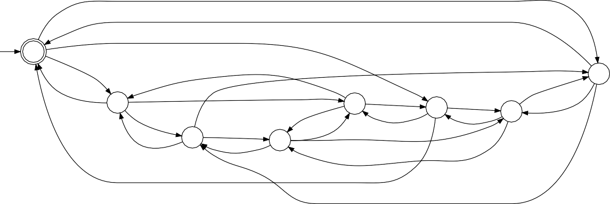

The modular specification _S_ is then defined as {*S*1 *S*2 *S*3 *S*4}, resulting in the automaton in Figure [24](#_bookmark98). Which is synchronized with _G_ to compose the controlled system in Figure [25](#_bookmark98).

> 然后将模块化规范*S*定义为{*S*1*S*2*S*3*S*4}，得到图[24]中的自动机（#*bookmark98）。与\_G*同步以构成图[25]中的受控系统（#\_bookmark98）。

As it is possible to see in Figure [25](#_bookmark98), the results of both monolithic and modular approaches are the same. However, the modular approach is more intuitive, helping in the understanding of each part of the system, and the specifications as well.

> 如图[25]（#\_bookmark98）所示，单片和模块方法的结果是相同的。然而，模块化方法更直观，有助于理解系统的每个部分以及规范。

The automaton modeling can be done using specialized software, like Supremica. Supremica is an integrated development environment used in the modeling of large scale models. Supremica implements monolithic and modular verification and synthesis algorithms for solving non-blocking, controllability, and combined non-blocking and controllability problems ([AKESSON et al.](#_bookmark224), [2006](#_bookmark224)).

> 自动机建模可以使用专门的软件完成，如 Supremica。Supremica 是用于大规模模型建模的集成开发环境。Supremica 实现了单片和模块化验证和综合算法，用于解决非阻塞性、可控性以及组合的非阻塞性和可控性问题（[AKSSON 等人]（#\_bookmark224），[2006]（#\_bbookmark224））。

Figure 24 – Modular specification _S_ of the washer and dryer machine.

> 图 24–洗衣机和烘干机的模块化规格*S*。

Figure 25 – Modular model _S_/_G_ of the washer and dryer machine.

> 图 25–洗衣机和烘干机的模块化型号*S*/G\_。
>  

## Runtime verification

Among the techniques available to the application of formal methods, Runtime Verification (RV) was chosen because of the runtime nature of the proposed model. [RV](#_bookmark23) presents a lightweight, yet rigorous, method that complements classical exhaustive verification techniques (such as model checking and theorem proving) with a more practical approach. At the price of a limited execution coverage, that analyses a single execution _trace_ of a system, [RV](#_bookmark23) can give precise information on the runtime behavior of the monitored system ([FALCONE et al.](#_bookmark274), [2018](#_bookmark274)).

> 在可用于形式化方法应用的技术中，选择运行时验证（RV）是因为所提出模型的运行时性质。[RV]（#\_bookmark23）提出了一种轻量级但严谨的方法，它以更实用的方法补充了经典的穷举验证技术（如模型检查和定理证明）。以分析系统的单个执行跟踪的有限执行覆盖率为代价，[RV]（#\_bookmark23）可以提供有关受监控系统的运行时行为的精确信息（[FALCONE 等人]（#\_bookmark274），[2018]（#\_blaookmark274））。

One of the crucial points that motivate the usage of RV is the usage of the _events_ and _trace_ the abstractions to analyze the runtime behavior of the system. Indeed, real- time Linux developers use the _trace_ features of Linux in the analysis of the runtime behavior of the system, and the work presented in Section [2.2.5](#characterization-of-real-time-linux-tasks-timeline) also bases in the _trace_ execution, which are the same abstractions used in previously described [DES](#_bookmark8). In [RV](#_bookmark23), a property can be abstractly described as a set of traces, and a specification is a concrete (textual) object describing property, and therefore it denotes a set of traces.

> 激励 RV 使用的关键点之一是使用*events*和*trace*抽象来分析系统的运行时行为。事实上，实时 Linux 开发人员在分析系统的运行时行为时使用了 Linux 的*trace*特性，第[2.2.5]节（#实时 Linux 任务时间线的表征）中介绍的工作也基于\_trace_execution，这与前面描述的[DES]（#\_bookmark8）中使用的抽象相同。在[RV]（#\_bookmark23）中，属性可以抽象地描述为一组跟踪，而规范是描述属性的具体（文本）对象，因此它表示一组跟踪。

When considering how to use [RV](#_bookmark23) to check if the runtime behavior of a system conforms to some specification, there are three necessary steps to be taken:

> 当考虑如何使用[RV]（#\_bookmark23）检查系统的运行时行为是否符合某些规范时，需要采取三个必要步骤：

1.  the specification of the desired, or undesired, behavior of the system;

> 1.系统的期望或不期望行为的规范；

2.  the generation of a monitor that interprets the specification;

> 2.生成解释规范的监视器；

3.  the connection between the monitor and the system to be observed.

> 3.监视器和待观察系统之间的连接。

The monitor of the system is the tool that connects the specification written in a mathematical format and the events generated by the system. The connection between the system and the monitor is made through the instrumentation of the system. The instrumentation exhibits the behavior of the system by generating a trace of its execution.

> 系统监视器是连接以数学格式编写的规范和系统生成的事件的工具。系统和监视器之间的连接通过系统的仪表进行。检测通过生成系统执行的跟踪来显示系统的行为。

Monitors can be classified as _offline_ and _online_ monitors. _Offline_ monitors pro- cess the traces generated by a system after the occurrence of the events, generally by reading the trace execution from a permanent storage system. _Online_ monitors process the trace during the execution of the system. _Online_ monitors are said to be _synchronous_ if the processing of an event is attached to the system execution, blocking the system during the event monitoring. On the other hand, an _asynchronous_ monitor has its execution detached from the system. Each type of monitor has a set of advan- tages. For example, _offline_ monitors can be executed on different machines but require operations to save the log to a file. _Asynchronous online_ monitors generally result in lower overhead by avoiding both blocking the execution of the system and the manipula- tion of files ([CASSAR; FRANCALANZA](#_bookmark249), [2015](#_bookmark249)). However, only the _synchronous online_ method can take actions at the exact moment a violation occurs, enabling additional data collection in the precise state in which the system shows a defect.

> 监视器可分为离线监视器和在线监视器*Offline*监视事件发生后系统生成的跟踪，通常通过从永久存储系统读取跟踪执行情况*在线监视器在系统执行期间处理跟踪*如果事件处理附加到系统执行，则在线监视器被称为同步监视器，在事件监视期间阻塞系统。另一方面，*asynchronous*监视器的执行与系统分离。每种类型的监视器都有一组优点。例如，*offline*监视器可以在不同的计算机上执行，但需要操作才能将日志保存到文件中*异步在线监视器通常通过避免阻止系统执行和文件操作而降低开销（[CASSAR；FRANCALANZA]（#\_bookmark249），[2015]（#\_bbookmark249））。然而，只有\_synchronous online*方法可以在违规发生的精确时刻采取行动，从而在系统显示缺陷的精确状态下进行额外的数据收集。

In the context of this work, the runtime verification will have a dual goal: initially, to verify the correctness of the model against the real execution of the system. Once a satisfactory model is found, the model will be used to verify the runtime behavior of the Linux kernel. To make this possible, this work aims to develop methods to connect the mathematical model specifying the behavior of tasks on Linux to the real trace of the Linux kernel, using Linux tracing features such as perf and ftrace.

> 在这项工作的背景下，运行时验证将具有双重目标：首先，根据系统的实际执行验证模型的正确性。一旦找到满意的模型，该模型将用于验证 Linux 内核的运行时行为。为了实现这一点，这项工作旨在开发方法，使用诸如 perf 和 ftrace 之类的 Linux 跟踪功能，将指定 Linux 上任务行为的数学模型与 Linux 内核的真实跟踪联系起来。

1.  FINAL REMARKS

> 1.最后备注

The success of Linux as a [general-purpose operating system (GPOS)](#_bookmark10) motivated its extension to be a [RTOS](#_bookmark22). Over the last decade, Linux has gained a lot of real-time features and improvements. Nowadays, Linux can perform scheduling decisions in the microseconds order, and this is motivating its usage on a new class of safety-critical systems. However, the timing analysis of Linux is based on an empirical evaluation, and such results are not enough to satisfy the safety requirements necessary in such a class of systems.

> Linux 作为[通用操作系统（GPOS）]（#\_bookmark10）的成功促使其扩展成为[RTOS]（#\_bookmark22）。在过去十年中，Linux 获得了许多实时特性和改进。如今，Linux 可以执行微秒级的调度决策，这促使其在一类新的安全关键系统上使用。然而，Linux 的时序分析是基于经验评估的，这样的结果不足以满足此类系统所需的安全要求。

To improve the runtime analysis and verification of the Linux kernel, a new set of methods needs to be developed, based not only on empirical testing but using sophisticated techniques from the theory of formal methods and real-time scheduling systems.

> 为了改进 Linux 内核的运行时分析和验证，需要开发一套新的方法，不仅基于经验测试，还使用形式化方法和实时调度系统理论中的复杂技术。

The timing analysis of the PREEMPT RT Linux kernel using the real-time schedul- ing terminology, presented in Section [2.2.5](#characterization-of-real-time-linux-tasks-timeline), represented an improvement in the un- derstanding of Linux and validated the idea of using the tracing features of Linux to enlighten its timing behavior. The weak point of the approach was the informal method used in the inspection and explanation of the trace.

> 第[2.2.5]节（#实时 Linux 任务时间线的表征）中介绍了使用实时调度术语对 PREEMPT RT Linux 内核进行的时序分析，代表了对 Linux 理解的改进，并验证了使用 Linux 的跟踪特性来启发其时序行为的想法。该方法的弱点是用于检查和解释痕迹的非正式方法。

As seen in Section [2.3](#_bookmark81), the usage of formal methods is highly recommended in the specifications of safety-critical systems, mainly on the verification of the properties of the system. In the model-based approach, the verification is conducted using an ab- stract model of the real system. The model is a simplified representation of the system. It aims to reduce its complexity, enabling the usage of more specialized methods that would not be possible in a complete and complex description of the system.

> 如第[2.3]节（#\_bookmark81）所示，强烈建议在安全关键系统规范中使用正式方法，主要是验证系统特性。在基于模型的方法中，使用真实系统的约束模型进行验证。该模型是系统的简化表示。它旨在降低其复杂性，从而能够使用更专业的方法，而这些方法在系统的完整和复杂描述中是不可能的。

The previous usage of tracing in the analysis of Linux witnesses the event-based nature of kernel. It also evidences the possibility of using the discrete event systems theory to create an abstract model of tasks on Linux, focusing on the events that influence the timing behavior of tasks, from the real-time scheduling theory point of view. From the formalisms available for the modeling of discrete event systems, the automata showed to be a viable option during early experiments. The graphical representation of an automaton hides the complexity of its formal notation, simplifying the understanding and modeling of a system. Moreover, automata operations enable creating a complex model from the composition of smaller and specialized models. The modular approach uses these operations to model a system from a set of independent generators and specifications.

> 以前在 Linux 分析中使用的跟踪见证了内核基于事件的本质。从实时调度理论的角度来看，它还证明了使用离散事件系统理论在 Linux 上创建任务抽象模型的可能性，重点关注影响任务计时行为的事件。从离散事件系统建模可用的形式来看，在早期实验中，自动机是一个可行的选择。自动机的图形表示隐藏了其形式表示法的复杂性，简化了系统的理解和建模。此外，自动机操作允许从较小和专门化模型的组合中创建复杂模型。模块化方法使用这些操作从一组独立的发电机和规范中对系统进行建模。

The abstract model of the Linux tasks has the potential to reduce the complexity of kernel code while enabling more sophisticated reasoning about the timing behavior of the system, and the application of runtime verification for the Linux kernel. Before starting exploring the creation of the model and its usage in the analysis and verification of Linux, a set of related work is presented in the next chapter.

> Linux 任务的抽象模型有可能降低内核代码的复杂性，同时能够对系统的计时行为进行更复杂的推理，并为 Linux 内核应用运行时验证。在开始探索模型的创建及其在 Linux 分析和验证中的应用之前，下一章将介绍一系列相关工作。

# RELATED WORK

This Chapter presents prior literature relevant to the work being presented in this thesis, spanning across three main areas: 1) formal methods applied to operating systems kernel; 2) use of automata in real-time and operating systems analysis; and

> 本章介绍了与本文工作相关的先前文献，涉及三个主要领域：1）应用于操作系统内核的形式化方法；2） 在实时和操作系统分析中使用自动机；和

3\) real-time Linux latency. The first two topics are fundamental for the development of the work presented in Chapters [4](#a-thread-synchronization-model-for-the-preempt_rt-kernel), and [5](#online-runtime-verification), while the last shows the prior work relevant to Chapter [6](#latency-analysis).

> 3\）实时 Linux 延迟。前两个主题是第[4]章（#a-thread-synchronization-model-for-The-preept_rt-kernel）和第[5]章（#online runtime verification）中所述工作开发的基础，而最后一个主题显示了与第[6]章（#latency analysis）相关的先前工作。

1.  FORMAL METHODS FOR OS KERNELS

> 1.OS 内核的形式化方法

A particularly challenging area is the one of verification of an operating system kernel and its various components. Some works that addressed this problem include the BLAST tool ([HENZINGER et al.](#_bookmark281), [2002](#_bookmark281)), where control flow automata have been used, combining existing techniques for a state-space reduction based on abstraction, for model checking verification of C code using counterexample-driven refinement, with _lazy abstraction_. This allows for an on-demand refinement of parts of the specification by choosing more specific predicates to add to the model while the model checker is running, without any need for revisiting parts of the state space that are not affected by the refinements. Interestingly, the authors applied the technique to the verification of safety properties of OS drivers for the Linux and Microsoft Windows NT kernels. The technique required instrumentation of the original drivers, inserting a conditional jump to an error handling piece of code, and a model of the surrounding kernel behavior to allow the model checker to verify whether or not the faulty code could ever be reached. The static code analyzer SLAM ([BALL; RAJAMANI](#_bookmark235), [2002b](#_bookmark235)) shares the primary objectives with BLAST, in that it allows for analyzing C programs to detect violation of certain conditions. The SLAM uses a specification language named _[specification](#_bookmark26) [language for interface checking (SLIC)](#_bookmark26)_ ([BALL; RAJAMANI](#_bookmark234), [2002a](#_bookmark234)). [SLIC](#_bookmark26) rules are composed by an static set of _states_ (organized as C structures), a set of _events_ and and its associated handler function, and a set of _annotations_ that connects the specification with the objects instance in the code.

> 一个特别具有挑战性的领域是操作系统内核及其各种组件的验证。解决这一问题的一些工作包括 BLAST 工具（[HENZINGER 等人]（#_bookmark281），[2002]（#\_bbookmark281）），其中使用了控制流自动机，结合了基于抽象的状态空间缩减的现有技术，使用反例驱动的细化和\_lazy 抽象对 C 代码进行模型检查验证。这允许在模型检查器运行时通过选择更具体的谓词添加到模型来按需细化规范的部分，而无需重新访问不受细化影响的状态空间的部分。有趣的是，作者将该技术应用于验证 Linux 和 Microsoft Windows NT 内核的 OS 驱动程序的安全属性。该技术需要插入原始驱动程序，向错误处理代码插入条件跳转，以及周围内核行为的模型，以允许模型检查器验证是否可以到达错误代码。静态代码分析器 SLAM（[BALL；RAJAMANI]（#\_bookmark235），[2002b]（#\_bookmark235））与 BLAST 共享主要目标，因为它允许分析 C 程序以检测某些条件的违反。SLAM 使用名为_[规范]（#_bookmark26）[接口检查语言（SLIC）]（#\_bookmark26）_（[BALL；RAJAMANI]（#_blaookmark234），[2002a]（#\_tookmark234）的规范语言。[SLIC]（#\_bookmark26）规则由一组静态的\_states_（组织为 C 结构）、一组*events*和及其相关的处理程序函数以及一组将规范与代码中的对象实例连接起来的\_annotations 组成。

The Microsoft [static driver verifier (SDV)](#_bookmark25) toolset uses SLAM to verify the correct usage of Windows [API](#_bookmark1) on kernel modules, especially device drivers. SDV aims to be a completely automatic tool, to be used at compile time by developers. Anytime SDV finds a problem in a driver, it shows the execution path in the driver that leads to a rule violation. Despite the high level of automatization, the SDV authors do not claim it is a _push buttom_ solution for verification. Instead, they mention that first, the specification of the properties to be verified needs to be modeled, which is not a straightforward step, requiring the understanding, and even the debugging, of the code. Secondly, the verification tooling needs to be integrated into the development environment to be practical. Last but not least, the problem of state space explosion reduces the application of the method for specific cases. The SDV authors clarify that the tool does not verify the complete operating system kernel, but sole the composition of some components of the system, such as the device drivers, with the highly abstract environmental model of the procedures of the Windows kernel ([BALL; LEVIN; RAJAMANI](#_bookmark233), [2011](#_bookmark233)).

> Microsoft[静态驱动程序验证器（SDV）]（#\_bookmark25）工具集使用 SLAM 验证内核模块（尤其是设备驱动程序）上 Windows[API]（#\_bookmark1）的正确使用。SDV 旨在成为一种完全自动化的工具，供开发人员在编译时使用。只要 SDV 在驱动程序中发现问题，它就会显示驱动程序中导致违反规则的执行路径。尽管自动化程度很高，但 SDV 的作者并没有声称这是一个用于验证的 push buttom 解决方案。相反，他们提到，首先，需要对要验证的属性的规范进行建模，这不是一个简单的步骤，需要理解甚至调试代码。第二，验证工具需要集成到开发环境中才能实用。最后但并非最不重要的是，状态空间爆炸问题减少了该方法在特定情况下的应用。SDV 作者澄清，该工具并不验证完整的操作系统内核，而是仅验证系统的某些组件的组成，如设备驱动程序，以及 Windows 内核过程的高度抽象环境模型（[BALL；LEVIN；RAJAMANI]（#\_bookmark233），[2011]（#\_bbookmark233））。

Different authors also proposed a similar approach for the Linux kernel, resulting in three different toolsets: DDVerify, Avinux, and [Linux driver verification (LDV)](#_bookmark14).

> 不同的作者还为 Linux 内核提出了类似的方法，从而产生了三个不同的工具集：DDVerify、Avinux 和[Linux 驱动程序验证（LDV）]（#\_bookmark14）。

([WITKOWSKI et al.](#_bookmark342), [2007](#_bookmark342)) proposed the DDVerify toolset, extending the capabil- ities of BLAST and SLAM, e.g., supporting interrupts, deferred tasks, timers, etc. It also includes specification rules about the usage of the synchronization primitives and the correct way to initialize variables before usage. The specifications are written in C code. It also relies on a set of self-developed scripts used in the extraction of information of the source files to generate a collection of information about the modules to be analyzed.

> （[WITKOWSKI 等人]（#\_bookmark342），[2007]（#\_bbookmark342））提出了 DDVerify 工具集，扩展了 BLAST 和 SLAM 的功能，例如支持中断、延迟任务、计时器等。它还包括关于同步原语使用的规范规则以及使用前初始化变量的正确方式。规范用 C 代码编写。它还依赖于一组用于提取源文件信息的自开发脚本，以生成关于要分析的模块的信息集合。

The Avinux ([POST; KÜCHLIN](#_bookmark325), [2007](#_bookmark325)) proposes an _public domain like_ reimple- mentation of the [SDV](#_bookmark25) for the device drivers of Linux, using an extended version of the [SLIC](#_bookmark26) specification language, named SLICx.

> Avinux（[POST；KÜCHLIN]（#\_bookmark325），[2007]（#\_bbookmark325））提出了一个公共域，如[SDV]（#\_bookmark25）的重新实现，用于 Linux 的设备驱动程序，使用名为 SLIC]（#\_blaookmark26）规范语言的扩展版本。

Both DDVerify and Avinux use the CBMC ([CLARKE; KROENING; LERDA](#_bookmark257), [2004](#_bookmark257)) static verification tool, but DDVerify also supports SATABS ([CLARKE; KROENING;](#_bookmark258) [SHARYGINA, et al.](#_bookmark258), [2005](#_bookmark258)). Moreover, both toolsets also present some integration with Eclipse IDE.

> DDVerify 和 Avinux 都使用 CBMC（[CLARKE；KROENING；LERDA]（#\_bookmark257），[2004]（#\_bbookmark257））静态验证工具，但 DDVerify 也支持 SATABS（[CLARKE；KROE 宁；]（#\_bookmark258）[SHARYGINA 等人]（#\_blaookmark258），[2005]（#\_bokmark258））。此外，这两个工具集还提供了与 EclipseIDE 的一些集成。

The LVD toolset aims to enable static code analysis for a diverse set of ker- nel modules ([ZAKHAROV, I. S. et al.](#_bookmark344), [2015](#_bookmark344)). The LDV is a newer project and tries to overcome the limitations of the previously mentioned toolsets. For example, instead of supporting a fixed set of static verification tools, they proposed a dynamically and con- figurable set, including, but not limited to, BLAST, CPAchecker ([BEYER; KEREMOGLU](#_bookmark237), [2011](#_bookmark237)), UFO ([ALBARGHOUTHI et al.](#_bookmark225), [2012](#_bookmark225)), and CBMC. Although it is mostly centered on Linux, its methodology can be extended for other [OS](#_bookmark17) kernels too. Regarding the specifications, they are done using the PI-process ([ZAKHAROV, I. et al.](#_bookmark345), [2013](#_bookmark345)). The commit logs of kernel patches fixing problems found by the LDV are generally tagged with the following message:

> LVD 工具集旨在为一组不同的内核模块实现静态代码分析（[ZAKHAROV，I.S.等人]（#\_bookmark344），[2015]（#\_bookmark344））。LDV 是一个较新的项目，它试图克服前面提到的工具集的局限性。例如，他们提出了一个动态和可配置的集合，包括但不限于 BLAST、CPAchecker（[BEYER；KEREMOGLU]（#\_bookmark237）、[2011]（#\_bbookmark237））、UFO（[ALBARGHOUTHI 等人]（#\_bookmark225）、[2012]（#\_backmark225）和 CBMC，而不是支持一组固定的静态验证工具。虽然它主要以 Linux 为中心，但它的方法也可以扩展到其他[OS]（#\_bookmark17）内核。关于规范，使用 PI 过程完成（[ZAKHAROV，I.等人]（#\_bookmark345），[2013]（#\_bbookmark345））。LDV 发现的内核补丁修复问题的提交日志通常标记有以下消息：

Found by Linux Driver Verification project (linuxtesting.org).

> 由 Linux 驱动程序验证项目（linuxtesting.org）找到。

This tag enables the collection of some interesting metrics. As of the version 5.6-rc6 of the Linux kernel, there are at least 351 kernel patches fixing problems found by LDV, from 18 different authors, with dates ranging from 2011 to 2019 [1](#_bookmark103). These numbers confirm the practical approach of LDV.

> 此标记允许收集一些有趣的指标。截至 Linux 内核 5.6-rc6 版本，LDV 发现的修复问题的内核补丁至少有 351 个，来自 18 位不同的作者，日期从 2011 年到 2019 年[1]（#\_bookmark103）。这些数字证实了 LDV 的实用方法。

1 Run git log –grep "Found by Linux Driver Verification project" in a git tree of the kernel to see the kernel commit logs related to LDV.

> 1 在内核的 git 树中运行 git log–grep“由 Linux 驱动程序验证项目发现”，查看与 LDV 相关的内核提交日志。

Chaki et al. ([CHAKI, S. et al.](#_bookmark252), [2004](#_bookmark252)) proposed MAGIC, a tool for automatic verification of sequential C programs against finite state machine specifications. The tool can analyze a directed acyclic graph of C functions, by extracting a finite state model from the C source code, then reducing the verification to a [boolean satisfiability (SAT)](#_bookmark24) problem. The verification is carried out checking the specification against a sequence of increasingly refined abstractions, until either it is verified, or a counter-example is found. This, along with its modular approach, allows the technique to be used with relatively large models avoiding the need for enumerating the state-space of the entire system. Interestingly, MAGIC has been used to verify the correctness of a number of functions in the Linux kernel involved in system calls handling mutexes, sockets, and packet sending. The tool has also been extended later to handle concurrent software systems ([CHAKI, Sagar et al.](#_bookmark253), [2005](#_bookmark253)), albeit authors focus on verifying correctness and deadlock-freedom in the presence of message-passing based concurrency, forbidding the sharing of variables. Authors were able to find a bug in the Micro-C/OS source code, albeit when they notified developers the bug had already been found and fixed in a newer release.

> Chaki 等人（[Chaki，S.等人]（#\_bookmark252），[2004]（#\_bbookmark252））提出了 MAGIC，一种根据有限状态机规范自动验证顺序 C 程序的工具。该工具可以通过从 C 源代码中提取有限状态模型，然后将验证简化为[布尔可满足性（SAT）]（#\_bookmark24）问题，来分析 C 函数的有向无环图。验证是根据一系列日益细化的抽象来检查规范的，直到验证或找到反例。这与其模块化方法一起，允许该技术用于相对较大的模型，避免了枚举整个系统的状态空间的需要。有趣的是，MAGIC 已用于验证 Linux 内核中涉及处理互斥锁、套接字和数据包发送的系统调用的许多函数的正确性。该工具后来也被扩展到处理并发软件系统（[CHAKI，Sagar 等人]（#\_bookmark253），[2005]（#\_bbookmark253）），尽管作者专注于在基于消息传递的并发情况下验证正确性和死锁自由，禁止共享变量。作者能够在 Micro-C/OS 源代码中发现一个 bug，尽管当他们通知开发人员该 bug 已经被发现并在较新版本中修复。

There have also been other remarkable works assessing formal correctness of a whole micro-kernel such as seL4 ([KLEIN et al.](#_bookmark287), [2009](#_bookmark287)), i.e., adherence of the compiled code to its expected behavior, stated in formal mathematical terms. seL4 has also been accompanied by precise WCET analysis ([BLACKHAM et al.](#_bookmark238), [2011](#_bookmark238)). These findings were possible thanks to the simplicity of the seL4 micro-kernel features, e.g., semi-preemptability.

> 也有其他显著的工作评估了整个微内核的形式正确性，如 seL4（[KLEIN 等人]（#\_bookmark287），[2009]（#\_bbookmark287）），即编译代码对其预期行为的遵守，用形式数学术语表示。seL4 还伴随着精确的 WCET 分析（[BLACKHAM 等人]（#\_bookmark238），[2011]（#\_bbookmark238））。这些发现之所以可能，是因为 seL4 微内核特性的简单性，例如半可抢占性。

_Remarks_

> _备注_

The works presented in this section, employing the static code analyzers of part of [OS](#_bookmark17) kernels, evidence the applicability of formal methods in this field. The usage of such technique is generally limited either to a specific interface between the kernel and their modules/drivers (SDV, DDVerify, Avinux, and LVD); or to a single function of the system (MAGIC); or applied on specialized/embedded OS kernels (seL4). Such restriction, as reported in ([BALL; LEVIN; RAJAMANI](#_bookmark233), [2011](#_bookmark233)), is a constraint to avoid state explosion.

> 本节介绍的工作使用了部分[OS]（#\_bookmark17）内核的静态代码分析器，证明了形式化方法在该领域的适用性。这种技术的使用通常限于内核与其模块/驱动程序（SDV、DDVerify、Avinux 和 LVD）之间的特定接口；或系统的单个功能（MAGIC）；或应用于专用/嵌入式 OS 内核（seL4）。如（[BALL；LEVIN；RAJAMANI]（#\_bookmark233），[2011]（#\_bbookmark233））中所述，这种限制是避免状态爆炸的约束。

However, the model proposed in this thesis is not limited to a single subsystem of the kernel, or a single function, but are the synchronization mechanisms embedded in the entire code. There are also relations between the events that are not written in the code. For instance, there is no annotation limiting the usage of mutexes to the preemptive sections of the code. Such cases would have to be handled via a manual specification of the system, which is precisely the purpose of this work.

> 然而，本文提出的模型不限于内核的单个子系统或单个功能，而是嵌入在整个代码中的同步机制。代码中未写入的事件之间也存在关系。例如，没有注释将互斥锁的使用限制在代码的抢先部分。这种情况必须通过系统的手动规范来处理，这正是本工作的目的。

Finally, the suggestion of using static code analysis to automatize the creation of the model was frequently raised during the development of this thesis. The answer to this question received special attention and is specially addressed in Section [4.3.1](#automate-or-not-to-automate-the-model-creation).

> 最后，在本文的开发过程中，经常提出使用静态代码分析来自动创建模型的建议。这个问题的答案受到了特别的关注，并在第[4.3.1]节（#自动化或不自动化模型创建）中得到了特别的解决。

## Formal methods in the Linux kernel community

The Linux kernel community is not new to the adoption of formal methods in the kernel development and debugging workflow. Indeed, a remarkable work in this area is the lockdep mechanism ([CORBET, J.](#_bookmark262), [2006](#_bookmark262)) built into the Linux kernel. Lock- dep is capable of identifying errors in using locking primitives that might eventually lead to deadlocks, by observing the order of execution and the calling context of lock calls. The mechanism includes detecting the mistaken order of acquisition of multiple (nested) locks throughout multiple kernel code paths and detecting common mistakes in handling spinlocks across IRQ handler vs. process context, e.g., acquiring a spinlock from process context with IRQs enabled as well as from an IRQ handler. The number of different lock states that have to be kept by the kernel is reduced by applying the technique based on locking classes rather than individual locks.

> Linux 内核社区对于在内核开发和调试工作流中采用正式方法并不陌生。事实上，这方面的一项杰出工作是 Linux 内核中内置的 lockdep 机制（[CORBET，J.]（#\_bookmark262），[2006]（#\_bbookmark262））。Lock-dep 能够通过观察锁调用的执行顺序和调用上下文来识别使用锁原语时可能最终导致死锁的错误。该机制包括检测在多个内核代码路径中获取多个（嵌套）锁的错误顺序，以及检测在 IRQ 处理程序与进程上下文之间处理自旋锁的常见错误，例如，从启用 IRQ 的进程上下文以及从 IRQ 处理程序获取自旋锁。通过应用基于锁定类而不是单个锁的技术，内核必须保持的不同锁状态的数量减少了。

In ([ALGLAVE et al.](#_bookmark226), [2018](#_bookmark226)), a formal memory model is introduced to automate verification of fundamental consistency properties of core kernel synchronization op- erations across the wide variety of supported architectures and associated memory consistency models. The memory model for Linux ended being part of the official Linux release, with the addition of the _[Linux kernel memory consistency model (LKMM)](#_bookmark16)_ sub- system, which is an array of tools that formally describe the Linux memory coherency model, and also produce “litmus tests” in the form of kernel code, which can be directly executed and tested.

> 在（[AGLAVE 等人]（#_bookmark226），[2018]（#\_bookmark226））中，引入了一种正式的内存模型，以自动验证各种受支持架构和相关内存一致性模型中内核同步操作的基本一致性属性。Linux 的内存模型最终成为正式 Linux 发行版的一部分，添加了_[Linux 内核内存一致性模型（LKMM）]（#*bookmark16）*子系统，这是一系列正式描述 Linux 内存一致性的工具，还以内核代码的形式生成了“石蕊测试”，可以直接执行和测试。

Moreover, the well-known TLA+ formalism ([LAMPORT](#_bookmark289), [1994](#_bookmark289)) has been success- fully applied to discover bugs in the Linux kernel. Examples of problems that were discovered or confirmed by using TLA+ goes from the correct handling of the memory management locking in the context switch to the fairness properties of the arm64 ticket spinlock implementation ([MARINAS](#_bookmark301), [2018](#_bookmark301)). These recent results raised interest in the potential of the usage of formal methods in the development of Linux.

> 此外，众所周知的 TLA+形式（[LAMPORT]（#\_bookmark289），[1994]（#\_bbookmark289））已经成功应用于发现 Linux 内核中的错误。通过使用 TLA+发现或确认的问题的示例从上下文切换中内存管理锁定的正确处理到 arm64 票证自旋锁实现的公平性属性（[MARINAS]（#\_bookmark301），[2018]（#\_bookmark301））。这些最近的结果引起了人们对在 Linux 开发中使用正式方法的潜力的兴趣。

_Remarks_

> _备注_

Lockdep is used on a daily bases in the kernel development, and is responsible for countless bug fixes, and mainly bug prevention, as developers generally use it even before proposing patches. Although lockdep does not use a formal specification format, it effectively creates a monitor and conduces a runtime check of the system. Such a runtime verification like approach is needed because the context, and the order, in which the locks are taken is highly dependant on the workload of the system, and the complexity to create a synthetic workload that represents all the user-cases is, at least, unreasonable. During the discussions with the Linux kernel community[2](#_bookmark106), developers agreed with the possibility of a formal version of lockdep, based on the approach presented in Chapter [5](#online-runtime-verification). Indeed, part of the model proposed in this thesis already overlaps with lockdep, as shown with the problem found with the model in Section [4.5.3](#using-a-real-time-mutex-in-an-interrupt-handler).

> Lockdep 每天都在内核开发中使用，它负责无数错误修复，主要是错误预防，因为开发人员甚至在提出补丁之前都会使用它。尽管 lockdep 没有使用正式的规范格式，但它有效地创建了一个监视器，并有助于系统的运行时检查。需要这样一种类似运行时验证的方法，因为获取锁的上下文和顺序高度依赖于系统的工作负载，并且创建代表所有用户情况的合成工作负载的复杂性至少是不合理的。在与 Linux 内核社区[2]（#\_bookmark106）的讨论中，开发人员同意基于第[5]章（#在线运行时验证）中提出的方法，开发 lockdep 的正式版本。事实上，本文中提出的模型的一部分已经与 lockdep 重叠，如第[4.5.3]节中模型发现的问题所示（#使用 real-time-mutex-in-in-in-interrupt-handler）。

The [LKMM](#_bookmark16) model and the usage of TLA+ confirms the trend of using model- based verification of the kernel, motivating the creation of other models, like the model proposed in this thesis.

> [LKMM]（#\_bookmark16）模型和 TLA+的使用证实了使用基于模型的内核验证的趋势，并激励了其他模型的创建，如本文中提出的模型。

1.  AUTOMATA-BASED REAL-TIME SYSTEMS ANALYSIS

> 1.基于自动化的实时系统分析

Automata and discrete-event systems theory have been extensively used to verify the timing properties of real-time systems. For example, in ([WANG; LI; WONHAM](#_bookmark341), [2016](#_bookmark341)), a methodology based on timed discrete event systems is presented to ensure that a real-time system with multiple-period tasks is reconfigured dynamically at run- time using a safe execution sequence, under the assumption of single-processor, non- preemptive scheduling. In ([YOVINE](#_bookmark343), [1997](#_bookmark343); [BOUAJJANI; TRIPAKIS; YOVINE](#_bookmark240), [1997](#_bookmark240); [DAWS; YOVINE](#_bookmark268), [1995](#_bookmark268)), the Kronos tool is used for checking properties of models based on multi-rate and parametric/symbolic timed automata.

> 自动机和离散事件系统理论已被广泛用于验证实时系统的时序特性。例如，在（[WANG；LI；WONHAM]（#\_bookmark341），[2016]（#\_bbookmark341））中，提出了一种基于定时离散事件系统的方法，以确保在单处理器、非抢占式调度的假设下，使用安全执行序列在运行时动态重新配置具有多周期任务的实时系统。在（[YOVINE]（#\_bookmark343），[1997]（#\_bbookmark343；[BOUAJJANI；TRIPAKIS；YOVIN]（#\_bookmark240），[1997]（#\_bbookmark240）；[DAWS；YOVINE]（#\_bookmark268），[1995]（#\_bbookmark268）），Kronos 工具用于基于多速率和参数/符号时间自动机检查模型的属性。

In ([CIMATTI; PALOPOLI; RAMADIAN](#_bookmark255), [2008](#_bookmark255)), parametric timed automata are used for the symbolic computation of the region of the parameters’ space guaranteeing schedulability of a given real-time task set, under fixed-priority scheduling. Authors extend the symbolic analysis of timed automata ([FERSMAN; PETTERSSON; YI](#_bookmark277), [2002](#_bookmark277)), by enriching the model with parametric guards and invariant constraints, which is then checked recurring to symbolic model checking. The approach is also applied to an industrial avionic case-study ([LE et al.](#_bookmark291), [2013](#_bookmark291)), where verification has been carried out using the UPPAAL model checker ([LI et al.](#_bookmark295), [2004](#_bookmark295)). A similar methodology can be found in ([ARTHO; ÖLVECZKY](#_bookmark230), [2014](#_bookmark230)), where parametric timed automata are used to perform sensitivity analysis in a distributed real-time system. It makes use of CAN- based communications and fixed priority CPU scheduling and solved with a tool called IMITATOR ([ANDRÉ et al.](#_bookmark229), [2012](#_bookmark229)). Similar in purposes is also the work in ([LARSEN et al.](#_bookmark290), [2014](#_bookmark290)), where a technique is proposed to compute the maximum allowed imprecision on a real-time system specification, still preserving desired timing properties. Additionally, some authors ([LAMPKA; PERATHONER; THIELE](#_bookmark288), [2013](#_bookmark288)) considered composability of automata-based timing specifications, so that timing properties of a complex real-time system can be verified with reduced complexity. Interesting work is presented in ([SUN;](#_bookmark338) [LIPARI](#_bookmark338), [2014](#_bookmark338)), where the authors use _Linear Hybrid Automaton_ to model an exact schedulability analysis for the fixed priority scheduler, considering preemptive tasks in 2 Discussions held at the Linux Plumbers Conference 2019 and the Kernel Recipes 2019.

> 在（[CIMATTI；PALOPOLI；RAMADIAN]（#\_bookmark255），[2008]（#\_bbookmark255））中，在固定优先级调度下，参数时间自动机用于参数空间区域的符号计算，以保证给定实时任务集的可调度性。作者扩展了时间自动机的符号分析（[FERSMAN；PETTERSSON；YI]（#\_bookmark277），[2002]（#\_bbookmark277）），通过使用参数保护和不变约束来丰富模型，然后通过符号模型检查来重复检查。该方法还应用于工业航空电子案例研究（[LE 等人]（#\_bookmark291），[2013]（#\_bbookmark291）），其中使用 UPPAAL 模型检查器（[LI 等人]（#\_bookmark295），[2004]（#\_bbookmark295））进行了验证。类似的方法可以在（[ARTHO；ÖLVECZKY]（#\_bookmark230），[2014]（#\_bbookmark230））中找到，其中参数化时间自动机用于在分布式实时系统中执行灵敏度分析。它利用基于 CAN 的通信和固定优先级 CPU 调度，并使用名为 IMITATOR 的工具解决（[ANDRÉ 等人]（#\_bookmark229），[2012]（#\_bbookmark229））。目的类似的还有（[LARSEN 等人]（#\_bookmark290），[2014]（#\_bbookmark290））中的工作，其中提出了一种技术来计算实时系统规范上允许的最大不精确性，同时仍保持期望的定时特性。此外，一些作者（[LAMPKA；PERATHONER；THIELE]（#\_bookmark288），[2013]（#\_bbookmark288））考虑了基于自动机的时序规范的可组合性，从而可以以降低的复杂性验证复杂实时系统的时序特性。有趣的工作在（[SUN；]（#\_bookmark338）[LIPARI]（#\_bookmark338），[2014]（#\_bbookmark338））中介绍，其中作者使用\_Linental Hybrid Automaton 为固定优先级调度器建模精确的可调度性分析，考虑到 2019 年 Linux Plumbers 大会和 2019 年内核配方会议上举行的 2 次讨论中的优先任务。

a multiprocessor system.

> 多处理器系统。

Similarly to the approach of UPPAAL ([LI et al.](#_bookmark295), [2004](#_bookmark295)), the TIMES tool has been used ([AMNELL T. A. F., E. et al.](#_bookmark227), [2004](#_bookmark227)) with an automata-based formalism to describe a network of distributed real-time components for analyzing their temporal behavior from the viewpoint of schedulability.

> 类似于 UPPAAL 的方法（[LI 等人]（#\_bookmark295），[2004]（#\_bbookmark295）），TIMES 工具已被使用（[AMNELL T.A.F.，E.等人]（#\_bookmark227），[2004]#\_bookmark 227））和基于自动机的形式来描述分布式实时组件的网络，用于从可调度性的角度分析其时间行为。

Further works exist introducing mathematical frameworks for analyzing real-time systems, such as in ([KAYNAR et al.](#_bookmark284), [2003](#_bookmark284); [LYNCH; SEGALA; VAANDRAGER](#_bookmark299), [2003](#_bookmark299)), making use of Hybrid and Timed Input/Output Automata to prove safety, liveness and performance properties of a system.

> 还存在引入用于分析实时系统的数学框架的进一步工作，如（[KAYNAR 等人]（#\_bookmark284），[2003]（#\_bbookmark284）；[LYNCH；SEGALA；VAANDRAGER]（#\_bookmark299），[2003]（#\_bbookmark299）），利用混合和定时输入/输出自动机证明系统的安全性、活跃性和性能特性。

_Remarks_

> _备注_

The mentioned methodologies focus on modeling the timing behavior of the ap- plications and their reciprocal interference due to scheduling. Compared to the work being presented here, they neglect the exact sequence of steps executed by an operat- ing system kernel, to let, for example, a higher-priority task preempt a lower-priority one. None of these works formalize the details of what exact steps are performed by the kernel and within its scheduler and context-switch code path. However, as it will be clar- ified later, these details can be fundamental to ensure the build of an accurate formal model of the possible interferences among tasks, as commonly used in the real-time analysis literature.

> 上述方法侧重于对应用程序的时序行为及其由于调度而产生的相互干扰进行建模。与本文所介绍的工作相比，他们忽略了操作系统内核执行的步骤的精确顺序，例如，让一个高优先级的任务抢先一个低优先级的任务。这些工作都没有将内核及其调度器和上下文切换代码路径中执行的确切步骤的细节形式化。然而，如稍后所述，这些细节对于确保建立任务间可能干扰的精确形式模型至关重要，正如实时分析文献中常用的那样。

## Automata-based models for Linux

In ([POSADAS et al.](#_bookmark324), [2010](#_bookmark324)), a model of an RT system involving Linux is presented, with two timing domains: a _real-time_ and a _non-real-time_ one. These are abstracted as a seven-state and three-state model, respectively.

> 在（[POSADAS 等人]（#*bookmark324），[2010]（#\_bbookmark324））中，提出了一个涉及 Linux 的 RT 系统模型，该模型具有两个定时域：\_real-time*和*non-real-time*。这些分别被抽象为七态和三态模型。

Matni and Dagenais ([MATNI; DAGENAIS](#_bookmark302), [2009](#_bookmark302)) proposed using automata to analyze traces generated by the kernel of an operating system. Automata is used to describe patterns of problematic behavior. An off-line analyzer checks for their occur- rences. It uses the Linux Trace Toolkit next generation (LTTng) to search for three scenarios: chroot jail escape, locking validation, and real-time constraints checking.

> Matni 和 Dagenais（[MANI；Dagenais]（#\_bookmark302），[2009]（#\_bbookmark302））提出使用自动机来分析操作系统内核生成的痕迹。自动机用于描述有问题的行为模式。离线分析仪检查其发生情况。它使用下一代 Linux 跟踪工具包（LTTng）来搜索三种场景：chroot 越狱、锁定验证和实时约束检查。

The usage of trace and automata to verify conditions in the kernel is also pre- sented in ([MATNI; DAGENAIS](#_bookmark302), [2009](#_bookmark302)). The paper presents models for SYN-flood, es- caping from a chroot jail, and, more interestingly, locking validation and real-time con- straints validation. The models are compared against the kernel execution using the LTTng tracer ([SPEAR; LEVY; DESNOYERS](#_bookmark336), [2012](#_bookmark336)).

> 在（[MANI；DAGENAIS]（#\_bookmark302），[2009]（#\_bbookmark302））中也提出了使用跟踪和自动机来验证内核中的条件。本文介绍了 SYN 洪水模型，从 chroot 监狱捕获，以及更有趣的是，锁定验证和实时约束验证。使用 LTTng 跟踪器（[SPEER；LEVY；DESNOYERS]（#\_bookmark336），[2012]（#\_bbookmark336））将模型与内核执行进行比较。

An important area that makes use of a formal definition of the system is the State based/Stateful robustness testing ([LEI et al.](#_bookmark293), [2010](#_bookmark293)). Robust testing is a fault tolerance technique ([PULLUM](#_bookmark326), [2001](#_bookmark326)) also applied in the OS context. In ([COTRONEO; DI LEO,](#_bookmark265) [et al.](#_bookmark265), [2011](#_bookmark265)), a case study of state-based robustness testing, including the OS states, is presented. The OS under investigation is a real-time version of Linux. The results show that the OS state plays an important role in testing for corner cases not covered by traditional robustness. Another project that uses Linux is SABRINE ([COTRONEO;](#_bookmark266) [LEO, et al.](#_bookmark266), [2013](#_bookmark266)), an approach for state-aware robustness testing of OSs using trace and automata. SABRINE works as follows: In the first step, it traces the interactions between OS components. Then, the software automatically extracts state models from the traces. In this phase, the traces are processed in such a way to find sequences of functions that are similar, to be grouped, forming a pattern. Later, patterns that are similar are grouped in clusters. Finally, it generates the behavioral model from the clusters. A behavioral model consists of states connected by events, in the format of finite-state automata (FSA).

> 利用系统正式定义的一个重要领域是基于状态/有状态鲁棒性测试（[LEI 等人]（#\_bookmark293），[2010]（#\_bbookmark293））。鲁棒测试是一种容错技术（[PULLUM]（#\_bookmark326），[2001]（#\_bbookmark326）），也适用于操作系统环境。在（[COTRONEO；DI LEO，]（#\_bookmark265）[等人]（#\_bookmark265，[2011]（#\_bbookmark265））中，提出了基于状态的鲁棒性测试的案例研究，包括 OS 状态。正在调查的操作系统是 Linux 的实时版本。结果表明，OS 状态在测试传统鲁棒性未覆盖的角落情况中起着重要作用。另一个使用 Linux 的项目是 SABRINE（[COTRONEO；]（#\_bookmark266）[LEO 等人]（#\_bookmark266），[2013]（#\_bbookmark266）），这是一种使用跟踪和自动机对操作系统进行状态感知鲁棒性测试的方法。SABRINE 的工作原理如下：第一步，它跟踪操作系统组件之间的交互。然后，软件自动从轨迹中提取状态模型。在这一阶段，对轨迹进行处理，以找到相似的函数序列，并将其分组，形成一个模式。稍后，将相似的模式分组到集群中。最后，它从集群中生成行为模型。行为模型由事件连接的状态组成，其格式为有限状态自动机（FSA）。

The TIMEOUT approach ([SHAHPASAND; SEDAGHAT; PAYDAR](#_bookmark334), [2016](#_bookmark334)) later improved SABRINE by recording the time spent in each state. The FSA is then created using timed automata. The worst-case execution time observed during the profiling phase is used as the timing parameter of the Timed-FSA, and so it is also possible to detect timing faults.

> 超时方法（[SHAHPASAND；SEDAGHAT；PAYDAR]（#\_bookmark334），[2016]（#\_bookmark334））后来通过记录在每个状态下花费的时间来改进 SABRINE。然后使用时间自动机创建 FSA。在分析阶段观察到的最坏情况执行时间被用作定时 FSA 的定时参数，因此也可以检测定时故障。

_Remarks_

> _备注_

The model presented ([POSADAS et al.](#_bookmark324), [2010](#_bookmark324)), is a high-level one and does not consider the internal details of the Linux kernel. Similarly, the models presented in ([MATNI; DAGENAIS](#_bookmark302), [2009](#_bookmark302)) are proof of concept of these ideas, and are very simple: the largest model, about locking validation, has only five states. The real-time con- straints model has only two states. But still, this paper corroborates the idea of the connection between automata and tracing as a translation layer from kernel to formal methods, also for problems in the real-time features of Linux.

> 所提出的模型（[POSADAS 等人]（#\_bookmark324），[2010]（#\_bbookmark324））是一个高级模型，没有考虑 Linux 内核的内部细节。类似地，（[MANI；DAGENAIS]（#\_bookmark302），[2009]（#\_bbookmark302））中提出的模型是这些想法的概念证明，并且非常简单：关于锁定验证的最大模型只有五个状态。实时约束模型只有两种状态。但是，本文仍然证实了自动机和跟踪之间的联系，作为从内核到形式化方法的转换层，这也适用于 Linux 实时特性中的问题。

The possibility of extracting models from the operating system, like SABRINE and TIMEOUT, depends on the specification of the operating system components and their interfaces. The object of this paper is not a component of the system, but the set of mechanisms used to synchronize the operations of NMI, IRQs, and threads. The events analyzed in this paper, such as disabling interruptions and preemption, or locks, are present in most of the subsystems. Both works can be seen as complementary. The approach proposed by SABRINE can be used to define the internal models between states of the model proposed by this paper, or inside the values of each variable introduced in Chapter [6.2](#_bookmark183). For example, the model presented in this paper identifies the synchronization events that cause a delay in the activation of the highest priority thread. Many different code paths are taken between the event that blocks the scheduling and the event that re-enables the scheduling. It is worth to note that the overhead involved in tracing all functions is not negligible, and can considerably influence in the results of the timing analysis, even more than the sole verification of the system, as presented in Chapter [5](#online-runtime-verification). A further discussion about the automatic creation of models is presented in Section [4.3.1](#automate-or-not-to-automate-the-model-creation).

> 从操作系统中提取模型（如 SABRINE 和 TIMEOUT）的可能性取决于操作系统组件及其接口的规范。本文的目标不是系统的一个组件，而是用于同步 NMI、IRQ 和线程操作的一组机制。本文中分析的事件，如禁用中断、抢占或锁定，都存在于大多数子系统中。这两项工作可以看作是互补的。SABRINE 提出的方法可用于定义本文提出的模型状态之间的内部模型，或在第[6.2]章（#\_bookmark183）中介绍的每个变量的值内部。例如，本文中提出的模型识别了导致最高优先级线程激活延迟的同步事件。在阻止调度的事件和重新启用调度的事件之间采用许多不同的代码路径。值得注意的是，跟踪所有功能所涉及的开销是不可忽略的，并且会对时序分析的结果产生重大影响，甚至比第[5]章（#在线运行时验证）中所述的系统的唯一验证更大。关于模型自动创建的进一步讨论见第[4.3.1]节（#自动或不自动创建模型）。

These prior works demonstrate that the usage of automata format to test, verify, and explain the core dynamics of an operating system is not a new idea. Instead, it is a known field and motivates this thesis, which proposes a different model for different goals.

> 这些先前的工作表明，使用自动机格式来测试、验证和解释操作系统的核心动态并不是一个新想法。相反，这是一个已知的领域，并激励了本论文，该论文针对不同的目标提出了不同的模型。

1.  REAL-TIME LINUX LATENCY

> 1.实时 LINUX 延迟

Abeni et al. ([ABENI et al.](#_bookmark223), [2002](#_bookmark223)) defined a metric similar to cyclictest, called OS latency that quantifies the difference between the actual schedule produced by the kernel and the ideal schedule, evaluating various OS latency components of several standards and real-time Linux kernels existing at the time (2002). They also examined the effects of the OS latency on a real application, an audio/video player, concluding that full kernel preemptability can significantly improve the real-time performance of Linux. During the 18 years since that paper indeed several aspects of Linux preemptability were enhanced.

> Abeni 等人（[Abeni 等人]（#\_bookmark223），[2002]（#\_bbookmark223））定义了一个类似于 cyclectest 的度量，称为 OS 延迟，该度量量化了内核产生的实际调度与理想调度之间的差异，评估了当时存在的几个标准和实时 Linux 内核的各种 OS 延迟组件（2002）。他们还研究了操作系统延迟对实际应用程序（音频/视频播放器）的影响，得出结论，全内核可抢占性可以显著提高 Linux 的实时性能。自那篇论文发表以来的 18 年里，Linux 的几个方面确实得到了增强。

Cerqueira and Brandenburg ([CERQUEIRA; BRANDENBURG](#_bookmark251), [2013](#_bookmark251)) described experiments with cyclictest to evaluate the scheduling latency experienced by real- time tasks under LITMUS<sup>RT</sup>, vanilla Linux and Linux with the PREEMPT_RT patch. Three scenarios were considered: idle system, CPU-bound background workload, and I/O-bound background workload. Several histograms of observed scheduling latency in different scenarios and test conditions are presented. These histograms are the results of measuraments made with cyclictest adpted to LITMUS<sup>RT</sup>. The authors also discussed the advantages and limitations of using cyclictest as a metric for estimating a system’s capability to provide temporal guarantees. A similar experimental study is presented in ([FAYYAD-KAZAN; PERNEEL; TIMMERMAN](#_bookmark275), [2013](#_bookmark275)).

> Cerqueira 和 Brandenburg（[Cerqueira；Brandenburg]（#\_bookmark251），[2013]（#\_bbookmark251））描述了使用 cyclectest 的实验，以评估在 LITMUS ＜ sup ＞ RT</sup>、普通 Linux 和带有 PREEMPT_RT 补丁的 Linux 下实时任务所经历的调度延迟。考虑了三种情况：空闲系统、CPU 受限后台工作负载和 I/O 受限后台工作负荷。给出了在不同场景和测试条件下观察到的调度延迟的几个直方图。这些直方图是用 LITMUS ＜ sup ＞ RT</sup ＞的循环测试进行的测量结果。作者还讨论了使用循环测试作为评估系统提供时间保证能力的指标的优点和局限性。（[FAYAD-KAZAN；PERNEEL；TIMMERMAN]（#\_bookmark275），[2013]（#\_bbookmark275））中介绍了类似的实验研究。

Reghanzani et al. ([REGHENZANI; MASSARI; FORNACIARI](#_bookmark329), [2017](#_bookmark329)) empirically measured the latencies of a real-time Linux system under stress conditions in a mixed- criticality environment. They also indicate the use of tracing (i.e., feathertrace) to obtain fine-grained measurements. No detailed description of the source of the mea- sured delays is provided in the paper.

> Reghanzani 等人（[REGHENZANI；MASSARI；FORNACIARI]（#\_bookmark329），[2017]（#\_bookmark329））根据经验测量了混合临界环境中实时 Linux 系统在压力条件下的延迟。它们还表明使用跟踪（即羽毛跟踪）来获得细粒度测量。本文未详细描述测量延迟的来源。

Herzog et al. ([HERZOG et al.](#_bookmark282), [2018](#_bookmark282)) presented a tool that systematically mea- sures interrupt latency, at run-time, in the Linux vanilla kernel. It is based on tracepoint. Examples are provided for two distinct platforms (ARM and Intel). The tool is used to measure interrupt latencies, identify jitter causes, and reveal inter-dependencies be- tween interrupt handlers and user-space workloads. No attempt is made to model Linux kernel scheduling. Regnier et al. ([REGNIER; LIMA; BARRETO](#_bookmark330), [2008](#_bookmark330)) presented an evaluation of the timeliness of interrupt handling in Linux.

> Herzog 等人（[Herzog 等人]（#\_bookmark282），[2018]（#\_bbookmark282））提出了一种在运行时系统地测量 Linux 香草内核中断延迟的工具。它基于跟踪点。提供了两种不同平台（ARM 和 Intel）的示例。该工具用于测量中断延迟，识别抖动原因，并揭示中断处理程序和用户空间工作负载之间的相互依赖关系。没有尝试对 Linux 内核调度进行建模。Regnier 等人（[Regnier；LIMA；BARRETO]（#\_bookmark330），[2008]（#\_bbookmark330））对 Linux 中断处理的及时性进行了评估。

The ftrace’s preemptirqsoff tracer ([ROSTEDT, Steven](#_bookmark332), [2009](#_bookmark332)) enables the tracing of function when either preempt or IRQs are disabled, trying to capture the longest window.

> ftrace 的抢占式关闭跟踪器（[ROSTEDT，Steven]（#\_bookmark332），[2009]（#\_bbookmark332））在抢占式或 IRQ 被禁用时启用函数跟踪，试图捕获最长的窗口。

Finally, among the works that try to conjugate theoretic analytical real-time sys- tem models with empirical worst-case estimations based on a Linux OS, we can find ([B](#_bookmark232). [B. BRANDENBURG](#_bookmark232), [2011](#_bookmark232)). There, the author introduced an “overhead-aware” evalu- ation methodology for a variety of considered analysis techniques, with multiple steps: first, each scheduling algorithm to be evaluated is implemented on the LITMUS RT platform, then hundreds of benchmark task sets are run, gathering average and maxi- mum values for what authors call scheduling overheads. These figures are injected into overhead-aware real-time analysis techniques.

> 最后，在尝试将理论分析实时系统模型与基于 Linux OS 的经验最坏情况估计相结合的工作中，我们可以找到（[B]（#\_bookmark232）。[B.布兰登伯格]（#\_bookmark232），[2011]（#\_bbookmark232））。在那里，作者为各种考虑的分析技术引入了一种“开销感知”评估方法，包括多个步骤：首先，要评估的每个调度算法都在 LITMUS RT 平台上实现，然后运行数百个基准任务集，收集作者所称的调度开销的平均值和最大值。这些数据被注入到开销感知实时分析技术中。

_Remarks_

> _备注_

The scheduling latency is, undoubtedly, the main metric for the PREEMPT*RT, and so motivated many different works. However, most of them considered Linux as a \_black-box*, trying to observe the consequences of the synchronization in the delay, but not the root causes, as in ([ABENI et al.](#_bookmark223), [2002](#_bookmark223); [CERQUEIRA; BRANDENBURG](#_bookmark251), [2013](#_bookmark251); [REGHENZANI; MASSARI; FORNACIARI](#_bookmark329), [2017](#_bookmark329)).

> 毫无疑问，调度延迟是 PREEMPT\*RT 的主要指标，因此激发了许多不同的工作。然而，他们中的大多数人都认为 Linux 是一个弱肉强食的系统，试图观察延迟中同步的后果，而不是根本原因，如（[ABENI 等人]（#\_bookmark223），[2002]（#\_bbookmark223）；[CERQUEIRA；布兰登堡]（#\_bookmark251），[2013]（#\_bbookmark251）；[REGHENZANI；MASSARI；FORNACIARI]（#\_bookmark329），[2017]（#\_bookmark329））。

Some other works try to find the root cause but based only on empirical anal- ysis of the system. The approach in ([ROSTEDT, Steven](#_bookmark332), [2009](#_bookmark332)) does not differentiate between interference due to interrupts and the contribution due to different code seg- ments disabling preemption or interrupts. However, by adding tracing of functions, it adds overhead to the measurement, thus potentially heavily affecting the result, often mispointing the real source of the latency.

> 其他一些工作试图找到根本原因，但仅基于对系统的实证分析。（[ROSTEDT，Steven]（#\_bookmark332），[2009]（#\_bbookmark332））中的方法没有区分由于中断引起的干扰和由于禁用抢占或中断的不同代码段引起的影响。然而，通过添加函数跟踪，它会增加测量的开销，从而可能严重影响结果，通常会误导延迟的真正来源。

The discussion about outliers in ([B. B. BRANDENBURG](#_bookmark232), [2011](#_bookmark232)), along with the explicit admission of the need for removing some of them manually throughout the experimentation, witnesses the need for a more insightful model that provides more accurate information of those overheads.

> （[B.B.B.B.B.BRANDENBURG]（#\_bookmark232），[2011]（#\_bbookmark232））中关于异常值的讨论，以及明确承认需要在整个实验过程中手动删除其中一些异常值，见证了需要一个更具洞察力的模型来提供这些开销的更准确信息。

Regarding latency, this thesis targets explaining, at a finer-grained level of detail, what these scheduling overheads are, where they originate from, and why. This work aims to enable a more analytical view of Linux, fulfilling the part of the gap that exists between real-time Linux and real-time scheduling theory.

> 关于延迟，本论文的目标是在更细粒度的细节层次上解释这些调度开销是什么、它们来自何处以及原因。这项工作旨在实现对 Linux 的更具分析性的观点，以弥补实时 Linux 和实时调度理论之间存在的部分差距。

1.  FINAL REMARKS

> 1.最后备注

This set of related work demonstrates the value of the endeavor of applying formal methods to improve Linux. [SDV](#_bookmark25), [LDV](#_bookmark14) are practical examples of the potential of such techniques. It is also clear that no single solution will solve all the problems: the state explosion requires a meticulous selection of the goals and acceptable limitations of each methodology. The runtime verification-like method used on lockdep inspires the development of a similar approach based on a formal set of specifications.

> 这组相关工作证明了应用形式化方法来改进 Linux 的价值。[SDV]（#\_bookmark25）、[LDV]（#\_bookmark14）是此类技术潜力的实际示例。很显然，没有一个单一的解决方案能够解决所有问题：状态爆炸需要对每种方法的目标和可接受的局限性进行细致的选择。lockdep 上使用的类似运行时验证的方法启发了基于一组正式规范的类似方法的开发。

The usage of automata for the description and analysis of Linux was also ex- plored. However, the vast majority of the work uses straightforward models for very specialized specifications. The complexity of the presented models is not comparable with the ones presented by this thesis, so they do not require the use of a more so- phisticated approach. Still, the previous work demonstrates that the path taken was not unknown and motivates further exploration.

> 还探讨了使用自动机来描述和分析 Linux。然而，绝大多数工作都使用非常专门的规范的直接模型。所提出的模型的复杂性与本文提出的模型不可比较，因此它们不需要使用更复杂的方法。尽管如此，之前的工作表明，所走的道路并非未知，并激发了进一步的探索。

Finally, the fact that real-time latency is still measured using a _black-box_ ap- proach shows that the constraints imposed by the synchronization to the Linux tasks are indeed complex. The complexity, as shown in the next chapter, is given by the im- pressive number of events and possible sequences that they can have. The translation of the informal knowledge of Linux, to the level of precision utilized in the real-time scheduling theory, requires an intermediary step, removing the code complexity, while enabling the formal definition of the specification and properties of the synchronization of the task of Linux.

> 最后，实时延迟仍然使用\_black-bex_ap 方法来测量这一事实表明，同步对 Linux 任务施加的约束确实很复杂。如下一章所示，复杂性取决于事件的可压缩数量及其可能的序列。将 Linux 的非正式知识转化为实时调度理论中使用的精度水平，需要中间步骤，消除代码复杂性，同时实现 Linux 任务同步的规范和属性的正式定义。

# A THREAD SYNCHRONIZATION MODEL FOR THE PREEMPT_RT KERNEL

Despite all developments made on real-time Linux presented in Section [2.2](#_bookmark51), there is still a gap between the restrictions imposed in the task model used in aca- demic work and the restrictions imposed by the synchronization needed in the real Linux implementation. For instance, the frequent use of assumptions like _tasks are completely independent_, _the operating system is (fully) preemptive_, and _operations are atomic_ ([BRANDENBURG, B. B.; ANDERSON, J. H.](#_bookmark242), [2007](#_bookmark242); [CALANDRINO et al.](#_bookmark247), [2006](#_bookmark247)) is a frequent critique from Linux developers. They argue that such restrictions do not reproduce the reality of real-time applications running on Linux, raising doubts about the results of the development of theoretical schedulers when putting in prac- tice ([GLEIXNER](#_bookmark279), [2010](#_bookmark279)). On the other hand, Linux was not designed as a real-time [OS](#_bookmark17), and so does not use the conventions already established in the real-time academic community For example, the main evaluation metric used on Linux, the _latency_, is an oversimplification of the main metric utilized in the academy, i.e., the response time of tasks ([BRANDENBUG; ANDERSON](#_bookmark241), [2009](#_bookmark241)).

> 尽管在第[2.2]节（#*bookmark51）中对实时 Linux 进行了所有开发，但在用于半自动工作的任务模型中施加的限制与真实 Linux 实现中所需的同步所施加的限制之间仍存在差距。例如，经常使用的假设，如任务是完全独立的，操作系统是（完全）优先的，操作是原子的（[BRANDENBURG，B.B.；ANDERSON，J.H.]（#\_bookmark242），[2007]（#\_bbookmark242）；[CCALANDRINO 等人]（#\_bookmark247），[2006]（#\_bbookmark247））是 Linux 开发人员经常提出的批评。他们认为，这样的限制并没有再现在 Linux 上运行的实时应用程序的现实，这引发了对理论调度器开发结果的质疑（[GLEIXNER]（#\_bookmark279），[2010]（#\_bbookmark279））。另一方面，Linux 没有被设计为实时[OS]（#\_bookmark17），因此没有使用实时学术界已经建立的惯例。例如，Linux 上使用的主要评估指标\_latency*是对学院中使用的主要指标的过度简化，即任务的响应时间（[BRANDENBUG；ANDERSON]（#\_bookmark241），[2009]（#\_bookmark241））。

The developers of Linux observe and debug their timing properties using the tracing features present in the kernel ([ROSTEDT, S.](#_bookmark331), [2011](#_bookmark331); [SPEAR; LEVY; DESNOY](#_bookmark336)- [ERS](#_bookmark336), [2012](#_bookmark336); [TOUPIN](#_bookmark339), [2011](#_bookmark339); [BRANDENBURG, Bjorn B.; ANDERSON, James H.](#_bookmark244), [2007](#_bookmark244)).

> Linux 的开发人员使用内核中存在的跟踪特性（[ROSTEDT，S.]（#\_bookmark331），[2011]（#\_bbookmark331）；[SPEAR；LEVY；DESNOY]（#\_bookmark336）-[ERS]（#\_bookmark336），[2012]（#\_bbookmark336）；[TOUPIN]（#\_bookmark339），[2011]（#\_bbookmark339）；[BRANDENBURG，Bjorn B.；ANDERSON，James H.]（#\_bookmark244），[2007]（#\_bbookmark244））。

They interpret a chain of events, trying to identify the states that cause “_latencies_” in the activation of the highest priority thread, and then try to change kernel algorithms to avoid such delays. For instance, they use ftrace ([ROSTEDT, Steven](#_bookmark333), [2010](#_bookmark333)) or perf[1](#_bookmark111) to trace kernel events like interrupt handling, wakeup of a new thread, context switch, etc., while cyclictest[2](#_bookmark112) measures the “_latency_ ” of the system.

> 他们解释一系列事件，试图确定在激活最高优先级线程时导致“_latencies_”的状态，然后尝试更改内核算法以避免此类延迟。例如，他们使用 ftrace（[ROSTEDT，Steven]（#_bookmark333），[2010]（#\_bbookmark333））或 perf[1]（#\_bockmark111）跟踪内核事件，如中断处理、新线程唤醒、上下文切换等，而 cyclectest[2]（#\_bokmark112）测量系统的“\_latency_”。

The notion of _events_, _traces_ and _states_ used by developers are common to Discrete Event Systems (DES). The admissible sequences of events that a DES can produce or process can be formally modeled through a _language_. The _language_ of a DES can be modeled in many formats, like regular expressions, Petri nets, and automata.

> 开发人员使用的*events*、*traces*和*states*的概念对于离散事件系统（DES）来说是通用的。DES 可以产生或处理的可接受事件序列可以通过*language*正式建模。DES 的语言可以用多种格式建模，如正则表达式、Petri 网和自动机。

This chapter presents an automata-based model describing the possible inter- leaving sequences of kernel events in the code path handling the execution of threads, IRQs and NMIs in the kernel, on a single-core system. The model also covers ker- nel code related to locking mechanisms, such as mutexes, read/write semaphores, and read/write locks, including the possibility of nested locks, such as in the locking primitives’ own code ([OLIVEIRA, Daniel Bristot de et al.](#_bookmark320), [2018](#_bookmark320)).

> 本章介绍了一个基于自动机的模型，描述了在单核系统上处理内核中线程、IRQ 和 NMI 执行的代码路径中内核事件的可能互离开序列。该模型还涵盖了与锁定机制相关的 ker-nel 代码，如互斥锁、读/写信号量和读/写锁，包括嵌套锁的可能性，如锁定原语自己的代码（[OLIVEIRA，Daniel Bristot de 等人]（#\_bookmark320），[2018]（#\_bookmark320））。

This chapter also presents the extension of the kernel tracing mechanism used to capture traces of the kernel events used in the model, to enable _validation of the model_ by applying a modified perf tool running in user-space against traces captured from the live running system. This article also presents a major result achieved during the validation of the presented model: three problems found in the kernel code, one regarding an inefficiency in the scheduler, another one in the tracing code itself leading to occasional loss of event data, and erroneous usage of a real-time mutex. These problems were reported to the Linux kernel community, including suggestions of fixes, with some of them already present in the current Linux code.

> 本章还介绍了内核跟踪机制的扩展，该机制用于捕获模型中使用的内核事件的跟踪，通过应用在用户空间中运行的修改的 perf 工具对从实时运行系统中捕获的跟踪来启用模型的验证。本文还介绍了在验证所提出的模型期间取得的一个主要结果：在内核代码中发现的三个问题，一个是调度程序效率低下，另一个是跟踪代码本身导致偶尔丢失事件数据，以及错误使用实时互斥锁。这些问题被报告给了 Linux 内核社区，包括修复建议，其中一些已经出现在当前的 Linux 代码中。

1 </span>More information at: <http://man7.org/linux/man-pages/man1/perf.1.html>.

> 1</span>更多信息，请访问：<http://man7.org/linux/man-pages/man1/perf.1.html>.

2 The tool is available within the rt-utils software available at: [https://git.kernel.org/pub/scm/](https://git.kernel.org/pub/scm/utils/rt-tests/rt-tests.git) [utils/rt-tests/rt-tests.git](https://git.kernel.org/pub/scm/utils/rt-tests/rt-tests.git)

> 2 该工具可在 rt utils 软件中获得，网址为：[https://git.kernel.org/pub/scm/](https://git.kernel.org/pub/scm/utils/rt-tests/rt-tests.git)[utils/rt tests/rt tests.git](https://git.kernel.org/pub/scm/utils/rt-tests/rt-tests.git)

1.  MODELING APPROACH

> 1.建模方法

Following the approach presented in Figure [26](#_bookmark115), the knowledge about Linux tasks is modeled as an automaton using the modular approach. The main sources of infor- mation, in order of importance, are the observation of the system’s execution using various tracing tools ([ROSTEDT, Steven](#_bookmark333), [2010](#_bookmark333)), the kernel code analysis, academic documentation about Linux and real-time systems ([OLIVEIRA; OLIVEIRA](#_bookmark319), [2016](#_bookmark319)) ([B. B](#_bookmark232). [BRANDENBURG](#_bookmark232), [2011](#_bookmark232)), and hardware documentation. At the same time, we observe a real system running. The development of the model uses the Linux vanilla kernel with the PREEMPT*RT patchset applied. The Linux kernel has many different preemption modes, varying from \_non-preemptive*, to _fully-preemptive_. This work is based on the _fully-preemptive_ mode only, that is the mode utilized by the real-time Linux community. The _fully-preemptive_ mode also enables the real-time alternative for locks. For instance, it converts mutexes into real-time mutexes and read/write semaphores into real-time read/write semaphores. Moreover, in the _fully-preemptive_ mode, the vast majority of the work done in the hard and soft IRQ context is moved to the thread context. The work left in the hard IRQ context is mostly related to the notification of events from hardware to the threads that will handle the request, or to decisions that cannot be delayed by the scheduler of threads. For example, the timer that notifies the SCHED*DEADLINE about the throttling of a thread must run in this context to avoid being delayed by the task it aims to throttle. The configuration options of this kernel are based on the configuration of the Red Hat Enterprise Linux for Real Time, an enterprise version of Linux with the PREEMPT_RT patchset. However, the kernel was configured to run on a single CPU. The development of the model started with the version \_4.14* of the PREEMPT*RT, passing by the version \_4.19*. It is currently based on version _5.0_.

> 按照图[26]（#*bookmark115）所示的方法，使用模块化方法将有关 Linux 任务的知识建模为自动机。信息的主要来源（按重要性排序）是使用各种跟踪工具（[ROSTEDT，Steven]（#\_bookmark333），[2010]（#\_bbookmark333））观察系统的执行情况，内核代码分析，关于 Linux 和实时系统的学术文档（[LOLIVEIRA；OLIVEIRA]（#\_bookmark319），[2016]（#\_bBookmark319））（[B.B]（#\_blaookmark232）。[BRANDENBURG]（#\_bookmark232）、[2011]（#\_bbookmark232））和硬件文档。同时，我们观察到一个真实的系统正在运行。模型的开发使用了应用了 PREEMPT\*RT 补丁集的 Linux 香草内核。Linux 内核有许多不同的抢占模式，从“非抢占”到“完全抢占”。这项工作仅基于\_fully-premive*模式，即实时 Linux 社区使用的模式。*fully-premive*模式还启用了锁的实时替代。例如，它将互斥体转换为实时互斥体，并将读/写信号量转换为实时读/写信息量。此外，在*fully-premive*模式下，在硬 IRQ 和软 IRQ 上下文中完成的大部分工作都转移到线程上下文中。硬 IRQ 上下文中剩下的工作主要与硬件向处理请求的线程发出的事件通知有关，或者与线程调度程序无法延迟的决策有关。例如，通知 SCHED*DEADLINE 线程限制的计时器必须在此上下文中运行，以避免被其目标限制的任务延迟。此内核的配置选项基于 Red Hat Enterprise Linux for Real Time 的配置，这是一个带有 PREEMPT_RT 补丁集的企业版 Linux。然而，内核被配置为在单个 CPU 上运行。模型的开发从 PREEMPT*RT 的版本*4.14*开始，经过版本\_4.19*。目前基于版本\_5.0*。

2.  EVENTS

> 2.事件

The most important part of the modeling is the choice of events used in the model. As a computer program, Linux itself is already a model. However, it is a model with millions of lines of code and complex data structures. The difficulty is then to reduce the model to the set of events that contributes more to the purpose of the model. The level of abstraction used in the model is the one used by real-time Linux developers while discussing the base of scheduling and synchronization problems, in the terms of real-time systems. The level of abstraction was also highly influenced by the previous experience, described in Section [2.2.5](#characterization-of-real-time-linux-tasks-timeline).

> 建模最重要的部分是选择模型中使用的事件。作为一个计算机程序，Linux 本身已经是一个模型。然而，它是一个具有数百万行代码和复杂数据结构的模型。然后，难点是将模型简化为对模型的目的有更多贡献的事件集。模型中使用的抽象级别是实时 Linux 开发人员在讨论实时系统中调度和同步问题的基础时使用的抽象。抽象级别也受到了先前经验的高度影响，如第[2.2.5]节（#实时 linux 任务时间线的表征）所述。

Figure 26 – Modeling approach.

> 图 26–建模方法。
> 

Linux schedules threads on the processors, but threads are not the sole ex- ecution context. In addition to the threads, interrupts are considered a distinguished execution context. Interrupts are used by external devices to notify asynchronous events. For example, a network card uses interrupts to inform of the arrival of network packets, which are handled by the driver to deliver the packet contents to an application. Linux recognizes two different kinds of interrupts: IRQs or _Maskable Interrupts_ are those for which it is possible to postpone the handling by temporarily disabling them, and NMIs or _Non-Maskable interrupts_, that are those that cannot be temporarily disabled. Likewise, on Linux, the model considers these three execution contexts: Threads, IRQs, and NMI, modeling the context and the synchronization of these classes of tasks. To validate the level of abstraction and events, the model was discussed with the main real-time Linux developers at the Real-time Linux Summit 2018 ([OLIVEIRA](#_bookmark316), [2018e](#_bookmark316)) and The Linux Plumbers Conference 2018 ([OLIVEIRA](#_bookmark317), [2018f](#_bookmark317),[d](#_bookmark313)).

> Linux 在处理器上调度线程，但线程不是唯一的执行上下文。除了线程之外，中断被认为是一种独特的执行上下文。外部设备使用中断来通知异步事件。例如，网卡使用中断来通知网络数据包的到达，这些数据包由驱动程序处理以将数据包内容传递给应用程序。Linux 识别两种不同类型的中断：IRQ 或*Maskable interrupts*是可以通过暂时禁用它们来推迟处理的中断，NMI 或\_Non-Maskable interrupts 是不能暂时禁用的中断。同样，在 Linux 上，模型考虑了这三个执行上下文：线程、IRQ 和 NMI，对这些任务类的上下文和同步进行建模。为了验证抽象和事件的级别，在 2018 年实时 Linux 峰会（[OLIVEIRA]（#\_bookmark316）、[2018e]（#\_bookmark316））和 2018 年 Linux Plumbers 大会（[OLIVIIRA]）（#\_bbookmark317）、[22018f]（#\_blaookmark317）和[d]（#\_tookmark313）上，与主要实时 Linux 开发人员讨论了该模型。

During the development of the model, the abstractions from the kernel are trans- formed into automata models. Initially, the identification of the system is made us- ing the tracepoints already available. However, the existing tracepoints were not enough to explain the behavior of the system satisfactorily. For example, although the sched:sched_waking tracepoint includes the prio field containing the priority of the just awakened thread, it is not enough to determine whether the thread has the highest priority or not. For instance, the SCHED_DEADLINE does not use the prio field, but the thread’s absolute deadline. When a thread becomes the highest priority one, the flag TIF_NEED_RESCHED is set for the current running thread. This causes invocation of the scheduler at the next scheduling point. Hence, the event that most precisely defines that another thread has the highest priority task is the event that sets the TIF_NEED_RESCHED flag. Since the standard set of Linux’s tracepoints does not include an event to notify the setting of TIF_NEED_RESCHED, a new tracepoint had to be added. In such cases,

> 在模型的开发过程中，内核的抽象被转换为自动机模型。最初，使用已经可用的跟踪点来识别系统。然而，现有的跟踪点不足以令人满意地解释系统的行为。例如，尽管 sched:sched_waking 跟踪点包含包含刚唤醒线程的优先级的 prio 字段，但它不足以确定线程是否具有最高优先级。例如，SCHED_DEADLINE 不使用 prio 字段，而是使用线程的绝对截止日期。当线程成为最高优先级线程时，将为当前正在运行的线程设置标志 TIF_NED_RESCHED。这将导致在下一个调度点调用调度器。因此，最准确地定义另一个线程具有最高优先级任务的事件是设置 TIF_NED_RESCHED 标志的事件。由于 Linux 的标准跟踪点集不包含通知 TIF_NED_RESCHED 设置的事件，因此必须添加一个新的跟踪点。在这种情况下，

Table 4 – Interrupt related events.

> 表 4–中断相关事件。

Tables [4](#_bookmark116), [5](#_bookmark117) and [6](#_bookmark118) present the events used in the automata modeling and their related kernel events. When a kernel event refers to more than one automaton event, the extra fields of the kernel event are used to distinguish between automaton events. tracepoints in **bold font** are the ones added to the kernel during the modeling phase. Linux kernel evolves very fast. For instance, in a very recent release (_4.17_ ), around 1559000 lines were changed (690000 additions, 869000 deletions) ([CORBET,](#_bookmark261) [J.](#_bookmark261), [2018](#_bookmark261)). This makes natural the rise of the question: _How often do the events and abstractions utilized in this model change?_ Despite the continuous evolution of the kernel, some principles stay stable over time. IRQs and NMI context, and the possibility of masking IRQs are present in Linux since its very early days. The _fully preemp- tive_ mode, and the functions to disable preemption are present since the beginning of the PREEMPT_RT, dating back to year 2005 ([MCKENNEY](#_bookmark303), [2005](#_bookmark303)). Moreover, the scheduling and locking related events are implementation independent. For instance, the model does not refer to any detail about how specific schedulers’ implementations define which thread to pick next (highest priority, earliest deadline, virtual runtime, etc.). Hence, locking and schedulers might even change, but the events and their effects in the timeline of threads stay invariable.

> 表[4]（#*bookmark116）、[5]（#\_bbookmark117）和[6]（#\_bockmark118）显示了自动机建模中使用的事件及其相关的内核事件。当内核事件引用多个自动机事件时，内核事件的额外字段用于区分自动机事件。**bold 字体**中的跟踪点是在建模阶段添加到内核的跟踪点。Linux 内核发展非常快。例如，在最近的一个版本（\_4.17）中，大约 1559000 行被更改（690000 次添加，869000 次删除）（[CORBET，]（#\_bookmark261）[J.]（#\_bookmark261），[2018]（#\_blaookmark 261））。这就自然而然地产生了这样一个问题：*这个模型中使用的事件和抽象多久发生一次变化？*尽管内核不断进化，但一些原则随着时间的推移保持稳定。IRQ 和 NMI 上下文，以及屏蔽 IRQ 的可能性在 Linux 的早期就已经存在。自 PREEMPT_RT 开始以来，就存在\_fully preemp-active*模式和禁用抢占的功能，可追溯到 2005 年（[MCKENEY]（#\_bookmark303），[2005]（#\_bbookmark303））。此外，与调度和锁定相关的事件是独立于实现的。例如，该模型没有涉及特定调度程序的实现如何定义下一个选择哪个线程的任何细节（最高优先级、最早截止时间、虚拟运行时等）。因此，锁定和调度程序可能会发生变化，但事件及其在线程时间线中的影响保持不变。

Table 6 – Locking related events.

> 表 6–锁定相关事件。

1.  MODELING

> 1.建模

The automata model was developed using the Supremica IDE ([AKESSON et al.](#_bookmark224), [2006](#_bookmark224)). Supremica is an integrated environment for verification, synthesis, and simulation of discrete event systems using finite automata. Supremica allows exporting the result of the modeling in the DOT format that can be plotted using graphviz ([ELLSON et al.](#_bookmark272), [2002](#_bookmark272)), for example.

> 自动机模型是使用 Supremica IDE 开发的（[AKSSON 等人]（#\_bookmark224），[2006]（#\_bbookmark224））。Supremica 是一个使用有限自动机对离散事件系统进行验证、综合和仿真的集成环境。例如，Supremica 允许以 DOT 格式导出建模结果，可以使用 graphviz（[ELLSON 等人]（#\_bookmark272），[2002]（#\_bbookmark272））绘制。

The model was developed using the modular approach. All generators and spec- ifications were developed manually. The generators are the system’s events modeled as a set of independent sub-systems. Each sub-system has a private set of events. Similarly, each specification is modeled independently, but using the events of the sub-systems of the generators it aims to synchronize.

> 该模型采用模块化方法开发。所有发电机和规范均由人工制定。发电机是作为一组独立子系统建模的系统事件。每个子系统都有一组专用事件。类似地，每个规范都是独立建模的，但使用发电机子系统的事件来同步。

Examples of generators are shown in Figure [27](#_bookmark122) and [28](#_bookmark123)[3](#_bookmark120). The _Need Resched_ generator (_G05_) has only one event and one state. The _Sleepable or Runnable_ gen- erator (_G01_) has two states. Initially, the thread is in the sleepable state. The events sched*waking and sched_set_state_runnable cause a state change to runnable. The event sched_set_state- \_sleepable returns the task to the initial state. The \_Schedul- ing Context* (_G04_) models the call and return of the main scheduling function of Linux, which is scheduler().

> 生成器的示例如图[27]（#*bookmark122）和[28]（#\_bbookmark123）[3]（#\_bBookmark120）所示。\_Need Resched*生成器（_G05_）只有一个事件和一个状态。可休眠或可运行发电机（_G01_）有两种状态。最初，线程处于可休眠状态。事件 sched*waging 和 sched_set_state_runnable 会导致状态更改为 runnable。事件 sched_set_state-\_sleepable 将任务返回到初始状态。\Schedul-ing Context*（_G04_）对 Linux 的主要调度函数（scheduler（））的调用和返回进行建模。

Table [7](#_bookmark121) shows statistics about the generators and specifications that compose the Model. The complete Model is generated from the parallel composition of all gen3 The _generators_ and _specifications_ of the model are presented during the development of next Chap- ters, as required.

> 表[7]（#\_bookmark121）显示了关于构成模型的生成器和规范的统计信息。根据所有第 3 代的并行组合生成完整的模型。模型的生成器和规格将在下一章的开发过程中根据需要提供。

Table 7 – Automata models.

> 表 7–自动机模型。

Figure 27 – Examples of generators: _G05_ need resched (left) and _G04_ Scheduling context (right).

> 图 27–生成器示例：*G05*需要救援（左）和*G04*调度上下文（右）。
> sched\*need_resched

Figure 28 – Examples of generators: \_G01\* sleepable and runnable.

> 图 28–生成器示例：\_G01\*可休眠和可运行。

erators and specifications. The parallel composition is done via the Supremica tool, automatically. The Model has 34 events, 9017 states, and 20103 transitions. Moreover, the Model has only one marked state, has no forbidden states, and it is deterministic and non-blocking.

> 发电机和规格。平行合成是通过 Supremica 工具自动完成的。该模型有 34 个事件、9017 个状态和 20103 个转变。此外，该模型只有一个标记状态，没有禁止状态，并且具有确定性和非阻塞性。

The complete Model exposes the complexity of Linux. At first glance, the number of states seems to be excessively high. But, for instance, as it is not possible to mask NMIs, these can take place in all states, doubling the number of states, and adding two more transitions for each state. The complexity, however, can be simplified if analyzed at the generators and specifications level. By breaking the complexity into small specifi- cations, the understanding of the system becomes more natural. For instance, the most complex specification has only seven events. The complete Model, however, makes the validation of the trace more efficient, as a single automaton is validated. Hence, both the modules and the complete model are useful in the modeling and validation processes.

> 完整的模型揭示了 Linux 的复杂性。乍一看，各州的数量似乎过高。但是，例如，由于不可能屏蔽 NMI，所以这些可以在所有状态下发生，使状态数量加倍，并为每个状态增加两个过渡。然而，如果在生成器和规范级别进行分析，则可以简化复杂性。通过将复杂性分解为小规格，对系统的理解变得更加自然。例如，最复杂的规范只有七个事件。然而，完整的模型使跟踪的验证更加有效，因为验证了单个自动机。因此，模块和完整模型在建模和验证过程中都很有用。

## Automate or not to automate the model creation?

One frequent question made during the development of this work was: _Is it possible to automatically create a model from the trace output? For instance, tools such as SABRINE ([COTRONEO; LEO, et al.](#_bookmark266), [2013](#_bookmark266)) has done this before, so why not?_ It is certainly possible to trace the events used in this work and transform them into an automaton or a direct acyclic graph (DAG). However, some difficulties arise from such an approach.

> 在这项工作的开发过程中经常出现的一个问题是：是否可以从跟踪输出中自动创建模型？例如，SABRINE（[COTRONEO；LEO，等人]（#\_bookmark266），[2013]（#\_bbookmark266））等工具以前就做过这件事，为什么不呢当然，可以跟踪本工作中使用的事件，并将其转换为自动机或直接非循环图（DAG）。然而，这种方法产生了一些困难。

To help in the explanation, cosider the set of events presented in Figure [29](#_bookmark125) as a reference:

> 为了帮助解释，将图[29]（#\_bookmark125）中的一组事件合并为参考：

- _all sequences of events_ is the cartesian product of all events.

> -所有事件序列是所有事件的笛卡尔乘积。

- the _possible sequences of events_ are the sequences that can occur in the system Figure 29 – Sets of sequences of event.

> -可能的事件序列是系统中可能出现的序列图 29–事件序列集合。

- the _existing sequences of events_ are the sequences that exist in the current code of Linux;

> -events\_的存在序列是存在于 Linux 的当前代码中的序列；

- the _observed sequences of events_ are the sequences that a given trace of the execution of the system shows. The modeling approach presented in this work starts with the outer set: the synchronization of all _generators_ creates an automaton with _all_ sequences of events. The synchronization of the _generators_ and _specifications_ reduces the set of events to those events that are _possible_ in the system.

> -观察到的事件序列是系统执行的给定轨迹所显示的序列。本文提出的建模方法从外部集合开始：所有生成器的同步创建了一个具有所有事件序列的自动机。*generators*和*specifications*的同步将事件集减少为系统中可能发生的事件。

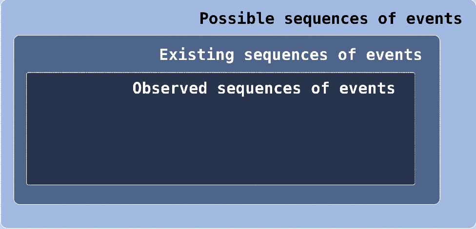

The validation approach of this work starts from the inner set, observing the sequences of events that happened in a given system. However, there is no guarantee that _all existing_ sequences of events will be _observed_ in a given system, or in reason- able time. Similarly to what happens with code coverage in software testing, in order to observe a set of interesting event sequences that may possibly trigger critical conditions, the system has to be traced for a sufficiently long time, and it must be stimulated with a sufficiently diverse set of workload conditions. For example, the chances of observing NMIs occurring in all possible states they could happen are meager, given that they do not happen very often. Moreover, there are sequences of events that _do not exist_ in the code but are _possible_, as they do not violate any of the specifications. For instance, if the system is not _idle_, and the current thread disables the preemption to call the scheduler, there is no place in the code in which interrupts get intentionally disabled before calling the scheduler. This does not mean it is not a _possible_ sequence, as long as interrupts get enabled before calling the scheduler, because the kernel will not break if such a sequence appears in the future.

> 这项工作的验证方法从内部集合开始，观察在给定系统中发生的事件序列。然而，不能保证在给定的系统中或在合理的时间内观察到所有存在的事件序列。与软件测试中的代码覆盖情况类似，为了观察可能触发关键条件的一组有趣的事件序列，必须对系统进行足够长的跟踪，并且必须用一组足够多样的工作负载条件来刺激系统。例如，观察到 NMI 在所有可能发生的状态下发生的可能性很小，因为它们并不经常发生。此外，有些事件序列在代码中不存在，但可能发生，因为它们不违反任何规范。例如，如果系统不是 idle*，并且当前线程禁用了调用调度程序的抢占，那么在调用调度程序之前，代码中没有中断被故意禁用的地方。这并不意味着它不是一个\_possible*序列，只要在调用调度器之前启用了中断，因为如果将来出现这样的序列，内核将不会中断。

Figure 30 – perf task_model report dynamic.

> 图 30–perf task_model 报告动态。
> 

Hence, the refinement of the approach presented in this thesis has the potential to define all the _possible sequences of events_ accurately. While an automatic approach can build an automaton with all _observed_ sequences of events, the amount of time and resources required to observe all existing sequences of events is undoubtedly challenging.

> 因此，本文提出的方法的改进有可能准确定义所有可能的事件序列。虽然自动方法可以构建一个包含所有观察到的事件序列的自动机，但观察所有现有事件序列所需的时间和资源无疑是具有挑战性的。

The major problem, however, comes from the occurrence of an event that is not present in the model. In the modular approach, it is possible to analyze each generator and specification separately, avoiding the analysis in the global model. A hypothetical automatically generated model would require the analysis of the global automaton, which is not reasonable, given the number of states and transitions of the global model. Furthermore, in the likely presence of non-possible sequences in the kernel, the automated mode is prone to include non-possible sequences in the model.

> 然而，主要问题来自模型中不存在的事件的发生。在模块化方法中，可以单独分析每个生成器和规范，避免在全局模型中进行分析。假设的自动生成的模型需要分析全局自动机，考虑到全局模型的状态和转变的数量，这是不合理的。此外，在内核中可能存在不可能的序列的情况下，自动模式倾向于在模型中包含不可能的顺序。

However, these methods are complementary: The modeling approach presented in this thesis was validated by observing the kernel execution. By observing the kernel events, the automaton generated by the kernel is compared against the model, as described in the next section.

> 然而，这些方法是互补的：本文提出的建模方法通过观察内核执行进行了验证。通过观察内核事件，将内核生成的自动机与模型进行比较，如下一节所述。

1.  MODEL VALIDATION

> 1.模型验证

The perf tracing tool was extended to automate the validation of the model against the execution of the real system. The perf extension is called thread*model, and it was developed as a \_built-in command*. A perf _built-in command_ is a very efficient way to extend perf features: They are written in C and compiled in the perf binary. The perf thread_model has two operation modes: the record mode and the report mode. The record mode configures the tracing session and collects the data. This phase involves both the Linux kernel tracing features and perf itself in the user-space. In the kernel side, tracepoints are enabled, recording the events in the trace buffer. Once set, tracepoints collect data using lock-free primitives that do not generate events considered in the model, not influencing in the model validation. In the user- space side, perf continues running, collecting the trace data from the kernel space, saving it in a perf.data file.

> 对性能跟踪工具进行了扩展，以根据实际系统的执行自动验证模型。perf 扩展名为 thread*模型，它是作为一个\built-in 命令*开发的。perf_built-in 命令是扩展 perf 特性的一种非常有效的方法：它们用 C 编写，并用 perf 二进制编译。perfthread_model 有两种操作模式：记录模式和报告模式。记录模式配置跟踪会话并收集数据。这一阶段涉及 Linux 内核跟踪功能和用户空间中的性能本身。在内核端，启用跟踪点，将事件记录在跟踪缓冲区中。设置后，跟踪点使用无锁原语收集数据，这些原语不会生成模型中考虑的事件，不会影响模型验证。在用户空间端，perf 继续运行，从内核空间收集跟踪数据，并将其保存在 perf.data 文件中。

Figure 31 – perf\*tool definition inside the task_model structure.

> 图 31–task_model 结构中的 perf\*工具定义。

Figure 32 – task_model and \_perf_tool\* initialization.

> 图 32–task_model 和\perf_tool\*初始化。

The record phase challenge is to deal with the high-frequency of events. A Linux system, even without a workload, generates a considerable amount of events due to housekeeping activities. For example, the periodic scheduler tick, RCU callbacks, net- work and disk operations, and so on. Moreover, the user-space side of perf generates events itself. A typical 30 seconds record of tracing of the system running cyclictest as workload generates around 27000000 events, amounting to 2.5 GB of data. To re- duce the effect of the tracing session itself, and the loss of tracing data, a 1 GB trace buffer was allocated in the kernel, and the data was collected every 5 seconds.

> 记录阶段的挑战是处理高频事件。即使没有工作负载，Linux 系统也会由于内务管理活动而生成大量事件。例如，周期性调度程序滴答声、RCU 回调、网络和磁盘操作等等。此外，perf 的用户空间本身生成事件。当工作负载生成大约 27000000 个事件，总计 2.5GB 的数据时，跟踪系统运行周期的典型记录为 30 秒。为了减少跟踪会话本身的影响和跟踪数据的丢失，内核中分配了 1GB 的跟踪缓冲区，每 5 秒收集一次数据。

After recording, the trace analysis is done using the perf thread_model report mode. The report mode has three basic arguments: the model exported by Supremica in the .dot format; the perf.data file containing the trace; and the pid of the thread to analyze. The modules of the tool are presented in Figure [30](#_bookmark126). When starting, perf interface opens the trace file, and uses the Graphviz library[4](#_bookmark130) to open and parse the .dot file. The connection between the trace file and the automata is done in the Trace to Event Interpreter layer.

> 记录后，使用 perfthread_model 报告模式完成跟踪分析。报告模式有三个基本参数：Supremica 以.dot 格式导出的模型；包含跟踪的 perf.data 文件；以及要分析的线程的 pid。该工具的模块如图[30]所示（#\_bookmark126）。启动时，perf 接口打开跟踪文件，并使用 Graphviz 库[4]（#\_bookmark130）打开和解析.dot 文件。跟踪文件和自动机之间的连接在跟踪到事件解释器层中完成。

In the _built-in command_ source, the Trace to Event Interpreter is imple- mented as a perf_tool. The definition of the tool is shown in Figures [31](#_bookmark128) and [32](#_bookmark129). Two callbacks implement the tool, one to handle tracing samples, and another to no4 More information is available at: <http://graphviz.org/>.

> 在\_built-In command_source 中，跟踪到事件解释器被实现为 perf_tool。工具的定义如图[31]（#\_bookmark128）和[32]（#\_bbookmark129）所示。两个回调实现了该工具，一个用于处理跟踪样本，另一个用于 no4。更多信息请访问：<http://graphviz.org/>.

Figure 33 – perf thread_model: Events to callback mapping.

> 图 33–perfthread_model:事件到回调映射。

Figure 34 – Handler for the irq_vectors:nmi_entry tracepoint.

> 图 34–irq_vectors 的处理程序：nmi_entry 跟踪点。

tify the loss of tracing events. While processing the events, perf calls the function process_sample_event for each trace entry. Another important point of the tool is that the default handler for the kernel events is substituted by a custom handler, as shown in Figure [33](#_bookmark131).

> tify 跟踪事件的丢失。在处理事件时，perf 为每个跟踪条目调用函数 process_sample_event。该工具的另一个重要点是，内核事件的默认处理程序由自定义处理程序替换，如图[33]（#\_bookmark131）所示。

The process*sample_event waits for the initial condition of the automaton to be reached in the trace. After the initial condition is met, the callback functions start to be called. Figure [34](#_bookmark132) shows an example of a tracepoint callback handler. The tracepoint handlers translate the raw trace to an \_event* string used in the model.

> 进程*sample_event 等待在跟踪中达到自动机的初始条件。满足初始条件后，开始调用回调函数。图[34]（#\_bookmark132）显示了跟踪点回调处理程序的示例。跟踪点处理程序将原始跟踪转换为模型中使用的\_event*字符串。

The process_event function, in Figure [35](#_bookmark133), is used to run the automaton. If the automaton accepts the event, the regular output is printed. Otherwise, an error message is printed, the tool resets the automaton and discards upcoming events in the trace until the initial condition of the automaton is recognized again. Finally, because of the high- frequency of events, it might be the case that the trace buffer discards some events, causing the loss of synchronization between the trace and the automaton. When an event loss is detected, perf is instructed to call the function process_lost_event (see Figure [32](#_bookmark129)), notifying the user, and resetting the model. Either way, the trace continues to be parsed and evaluated until the end of the trace file.

> 图[35]（#\_bookmark133）中的 process_event 函数用于运行自动机。如果自动机接受事件，则打印常规输出。否则，将打印错误消息，工具重置自动机并丢弃跟踪中即将发生的事件，直到再次识别自动机的初始状态。最后，由于事件的频率很高，跟踪缓冲区可能会丢弃一些事件，从而导致跟踪和自动机之间的同步丢失。当检测到事件丢失时，会指示 perf 调用函数 process_lost_event（参见图[32]（#\_bookmark129）），通知用户并重置模型。无论哪种方式，跟踪都将继续被分析和评估，直到跟踪文件结束。

The model validation is done using the complete model. The advantage of using the complete model is that one kernel transition generates only one transition in the model. Hence the validation of the events is done in constant time (_O(1)_) for each event. This is a critical point, given the number of states in the model, and the amount of data from the kernel. On the adopted platform, each GB of data is evaluated in nearly 8 seconds. One example of output provided by perf thread model is shown in Figure [36](#_bookmark134).

> 使用完整的模型进行模型验证。使用完整模型的优点是，一个内核转换在模型中只生成一个转换。因此，对每个事件的验证都是在恒定时间（_O（1）_）内完成的。考虑到模型中的状态数量和内核中的数据量，这是一个临界点。在所采用的平台上，每 GB 的数据在近 8 秒内得到评估。perf 线程模型提供的输出示例如图[36]（#\_bookmark134）所示。

Figure 35 – _process_event_ : trying to run the automata.

> 图 35–_process_event_：尝试运行自动机。

Figure 36 – Example of the perf thread_model output: a thread activation.

> 图 36–perfthread_model 输出示例：线程激活。

When in a given state, if the kernel event is not possible in the automaton, the tool prints an error message. It is then possible to use the Supremica simulation mode to identify the state of the automaton, and the raw trace to determine the events generated by the kernel. If the problem is in some automaton, it should be adapted to include the behavior presented by the kernel. However, it could be a problem in the kernel code or the perf tool. Indeed, during the development of the model, three problems were reported to the Linux community. More details will follow in Section [4.5](#_bookmark136). The source code of the model in the format used by Supremica, the kernel patch with kernel and perf modifications and more information about how to use the model and reproduce the experiments are available at the paper’s page[5](#_bookmark138).

> 当处于给定状态时，如果内核事件在自动机中不可能发生，则工具将打印一条错误消息。然后，可以使用 Supremica 模拟模式来识别自动机的状态，并使用原始跟踪来确定内核生成的事件。如果问题是在某个自动机中，则应将其调整为包含内核所呈现的行为。然而，这可能是内核代码或 perf 工具中的问题。事实上，在开发模型的过程中，有三个问题被报告给了 Linux 社区。更多细节将在第[4.5]节（#\_bookmark136）中介绍。Supremica 使用的格式的模型源代码、带有内核和性能修改的内核补丁，以及有关如何使用模型和再现实验的更多信息，请参见论文的第[5]页（#\_bbookmark138）。

Figure 37 – Kernel trace excerpt.

> 图 37–内核跟踪摘录。

1.  OFFLINE RUNTIME VERIFICATION

> 1.离线运行时验证

This section presents three problems found in the kernel while validating the model, in an example that validates the usage of the model for offline runtime verification of the kernel. The first problem shows an optimization case, the second is a problem in the tracing, and the third is regarding an invalid usage of real-time mutex in an interrupt handler.

> 本节介绍了在验证模型时在内核中发现的三个问题，在一个验证模型用于内核离线运行时验证的示例中。第一个问题显示了一个优化案例，第二个问题是跟踪中的问题，第三个问题是中断处理程序中实时互斥的无效使用。

## Scheduling in vain

In Linux, the main scheduler function ( schedule()) is always called with pre- emption disabled, as shown in Figure [70](#_bookmark178). In the model, it can be seen as the event that precedes a scheduler call. The specification in Figure [38](#_bookmark139) presents the condi- tions for the thread under analysis to disable preemption to call the scheduler. In the initial state, in which the thread is not running, the preempt*disable_sched event is recognized, because other threads can indeed schedule. The sched_switch_in switches the state of the thread to running. The running state recognizes three events, the sched_set_state_sleepable, the sched_need_resched, and the preempt_disable sched. In the case of the occurrence of the event sched_set_state_sleepable, the thread changes the state to sleepable, where the preempt_disable_sched is rec- ognized as well. In these states, the \_sufficient* conditions to call the scheduler exist. However, in the sleepable state, the thread can return to the previous state with the occurrence of the event sched*set_state_runnable, and so the scheduler will not \_necessarily* be called.

> 在 Linux 中，主调度程序函数（schedule（））总是在禁用抢占的情况下调用，如图[70]（#\_bookmark178）所示。在模型中，它可以看作是调度程序调用之前的事件。图[38]（#\_bookmark139）中的规范给出了被分析线程禁用抢占以调用调度器的条件。在线程未运行的初始状态下，会识别 preempt*disable_sched 事件，因为其他线程确实可以进行调度。sched_switch_in 将线程的状态切换为正在运行。运行状态识别三个事件，sched_set_state_sleepable、sched_need_resched 和 preempt_disablesched。在发生 sched_set_state_sleepable 事件的情况下，线程将状态更改为 sleepable，其中 preempt_disable_sched 也被识别。在这些状态下，存在调用调度程序的条件。然而，在可休眠状态下，线程可以返回到发生事件 sched*set_state_runnable 时的前一状态，因此不必调用调度器。

Figure 38 – _S18_ Scheduler call sufficient and necessary conditions.

> 图 38–*S18*调度器调用充分和必要的条件。
> 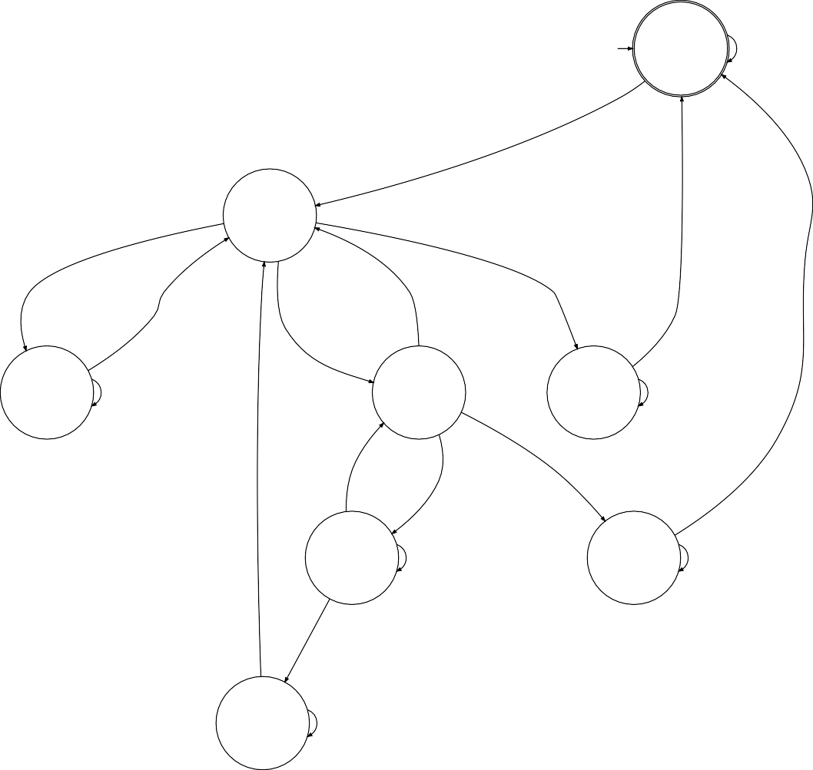witch_suspend witch_blocking

In the sleepable state, in the case of the occurrence of the event sched*need_resched, the preempt_disable_sched will become possible, moving the thread to the state preempt runnable. In this state, though, it is not possible to return to the running state without a sched_switch_in event, meaning that a preemption will occur. As the preemption only occurs in the scheduling context, the sched_need_resched event is both a \_necessary* and a _sufficient_ condition to call the scheduler.

> 在可休眠状态下，在发生事件 sched\*need_sched 的情况下，preempt_disable_sched 将成为可能，从而将线程移动到 preempt-runable 状态。但是，在这种状态下，如果没有 sched_switch_In 事件，就不可能返回到运行状态，这意味着将发生抢占。由于抢占仅发生在调度上下文中，sched_need_resched 事件既是调用调度器的必要条件，也是充分条件。

In the running state, it is already possible to call the scheduler, bringing to a state named vain, which is a special case. Taking the trace of Figure [37](#_bookmark135), considering the thread kworker- /0:2 in analysis, and the model in Figure [38](#_bookmark139) in the initial state, the events and state transitions of Table [8](#_bookmark140) take place.

> 在运行状态下，已经可以调用调度程序，从而进入名为 vain 的状态，这是一种特殊情况。采用图[37]（#\_bookmark135）的轨迹，考虑到分析中的线程 kworker-/0:2，以及图[38]（#\_bbookmark139）中的模型处于初始状态，表[8]（#\_bockmark140）的事件和状态转换发生。

The thread kworker/0:2 started to run at Line 1. From the running state, it sets its state to sleepable in Line 2, followed by the need*resched event in Line 3, causing the preemption to be disabled in Line 4, to call the scheduler in Line 5. Then, the thread switched the context in preemption and left the processor. At Line 7 the thread is awak- ened, switching the state to preempt_to_runnable. At Line 8 the context_switch_in takes place, and the thread starts to run. However, right after returning from the sched- uler function, the thread disables the preemption to call the scheduler again at Line 9 and 10, calling the scheduler in vain state. In fact, as shown in Figure [37](#_bookmark135), the call to the scheduler was in \_vain*, at Line 11, as no real context switch takes place.

> 线程 kworker/0:2 在第 1 行开始运行。从运行状态开始，它在第 2 行将其状态设置为可休眠，然后在第 3 行发生 need*resched 事件，导致在第 4 行禁用抢占，从而调用第 5 行中的调度器。然后，线程在抢占中切换上下文并离开处理器。在第 7 行，线程被唤醒，将状态切换为 preempt_to_runable。在第 8 行，context_switch_in 发生，线程开始运行。然而，在从 sched-uler 函数返回之后，线程在第 9 行和第 10 行禁用了再次调用调度器的抢占，从而在无效状态下调用调度器。事实上，如图[37]（#\_bookmark135）所示，对调度程序的调用在第 11 行的\_vain*中，因为没有发生真正的上下文切换。

Table 8 – Events and state transitions of Figure [37](#_bookmark135).

> 表 8–图[37]（#\_bookmark135）的事件和状态转换。

In a deeper analysis, before calling schedule() to cause a context switch, the schedule() function runs sched_submit_work() to dispatch deferred work that was postponed to the point that the thread is leaving the processor voluntarily, as an optimization. The optimization, however, caused a preemption, that caused the scheduler to be called in the path to call the scheduler. Hence, calling the scheduler twice. Calling the scheduler twice does not cause a logical problem. But it causes the strange effect of calling the scheduler in vain, doubling the scheduler overhead.

> 在更深入的分析中，在调用 schedule（）导致上下文切换之前，schedule 函数运行 sched_submit_work（）来调度延迟的工作，该工作被延迟到线程自愿离开处理器的程度，作为优化。然而，优化导致了抢占，导致在调用调度器的路径中调用调度器。因此，调用调度程序两次。两次调用调度程序不会导致逻辑问题。但这会导致调用调度程序无效的奇怪效果，使调度程序开销加倍。

This behavior was reported to the Linux community, along with a suggestion of fix. The suggestion was submitted to the real-time Linux kernel development list, and it was accepted for mainline integration ([OLIVEIRA](#_bookmark308), [2018a](#_bookmark308)).

> 此行为已报告给 Linux 社区，并提出了修复建议。该建议已提交给实时 Linux 内核开发列表，并被接受用于主线集成（[OLIVEIRA]（#\_bookmark308），[2018a]（#\_Bookmark 308））。

## Tracing dropping events

During the validation phase, sometimes, the output of the perf

> 在验证阶段，有时，perf 的输出

thread_model pointed to an error in the conditions in which either the sched_waking

> thread_model 指出在以下情况下出错：

or sched_need_resched events happen, like in Figure [39](#_bookmark142).

> 或发生 sched_need_resched 事件，如图[39]（#\_bookmark142）所示。

Both mentioned events require the preemption and IRQs to be disabled, as modeled in Figure [74](#_bookmark180), which raised the attention for a possible problem in the kernel. While analyzing the problem, it was noticed that the thing in common with all the occurrences of these errors was that they took place in the _wakeup_ of threads that are generally awakened by interrupts. For instance, the trace in Figure [40](#_bookmark143) shows the raw trace from kernel for the case evaluated in Figure [39](#_bookmark142), in which the thread that handles the IRQ of an HDD controller was being awakened.

> 上述两个事件都要求禁用抢占和 IRQ，如图[74]（#\_bookmark180）所示，这引发了对内核中可能存在问题的关注。在分析问题时，我们注意到所有这些错误的共同点是，它们发生在通常被中断唤醒的线程的唤醒过程中。例如，图[40]（#\_bookmark143）中的跟踪显示了图[39]（#\_bbookmark142）中评估的情况下内核的原始跟踪，其中处理 HDD 控制器 IRQ 的线程被唤醒。

By checking the kernel code, it is possible to see that the wakeup of a thread and the setting of _need resched_ flag always occur with the rq_lock taken, and this ensures that both IRQs and preemption are disabled. Also, checking with the ftrace function tracer, it was possible to observe that interrupts and preemption were always disabled on the occurrence of the sched_waking or sched_need_resched events by checking the flags of the events.

> 通过检查内核代码，可以看到线程的唤醒和\_need-reched_flag 的设置总是在执行 rq_lock 时发生，这确保 IRQ 和抢占都被禁用。此外，通过使用 ftrace 函数跟踪程序进行检查，可以通过检查事件的标志，观察到在发生 sched_ewaging 或 sched_eneed_sched 事件时，中断和抢占总是被禁用的。

> Figure 39 – Missing kernel events: the output of perf thread_model.
> Figure 40 – Missing kernel events: the output of kernel tracepoints.
> Figure 41 – Pseudo-code of tracing recurrence.

A bug report was sent to the Linux kernel developers ([OLIVEIRA](#_bookmark311), [2018c](#_bookmark311)). The problems turned out to be in the tracing recursion control.

> 向 Linux 内核开发人员发送了一份错误报告（[OLIVEIRA]（#\_bookmark311），[2018c]（#\_bookmark311））。问题原来是在跟踪递归控制中。

Despite being lock-free and lightweight, tracing operations are not atomic, re- quiring the execution of functions to register the trace into the trace-buffer, as in the pseudo-code in Figure [41](#_bookmark144).

> 尽管跟踪操作是无锁和轻量级的，但它不是原子的，需要执行将跟踪注册到跟踪缓冲区的函数，如图[41]（#\_bookmark144）中的伪代码所示。

Many kernel functions are set as non-traceable, avoiding this problem. However, setting functions as non-traceable might not always be desirable, as some of these functions may be of interest for the developer in other call sites. To overcome this problem, the trace subsystem uses a _context-aware recursive lock_. When the trace function is called, it will try to take the lock. Considering the execution of a thread, if the lock was not taken, the trace function will proceed normally. If the lock was already taken, the trace function returns without tracing, avoiding the recursion problem.

> 许多内核函数被设置为不可跟踪，从而避免了这个问题。然而，将函数设置为不可跟踪可能并不总是可取的，因为这些函数中的一些可能对其他调用站点的开发人员很感兴趣。为了解决这个问题，跟踪子系统使用了一个\_context-aware 递归锁。当调用跟踪函数时，它将尝试获取锁。考虑到线程的执行，如果没有获取锁，跟踪函数将正常运行。如果锁已经被取下，跟踪函数返回而不进行跟踪，从而避免了递归问题。

However, the recursion is allowed for the case of a task in another context. For example, if a thread owns the lock when an IRQ takes place, it is desired that the IRQ can take the recursive lock to trace its execution. Likewise for NMIs. Hence, the recursive lock avoids recursion of the trace in the same task context, but not on a different task context.

> 但是，对于另一个上下文中的任务，允许递归。例如，如果在 IRQ 发生时线程拥有锁，则希望 IRQ 可以使用递归锁来跟踪其执行。NMI 也是如此。因此，递归锁避免了同一任务上下文中跟踪的递归，而不是不同任务上下文中的递归。

Figure 42 – Trace excerpt with comments of where the IRQ context is identified in the trace.

> 图 42–跟踪摘录，带有跟踪中识别 IRQ 上下文的注释。

The _context-aware recursive lock_ works correctly. The problem is that the vari- able with information about the task context is set after the execution of the first functions of the IRQ and NMI handlers, as in Figure [42](#_bookmark145). Hence, if an interrupt takes place during the recording of a trace entry, the function do_IRQ() will be detected as a recursion in the trace, and will not be registered, likewise, the tracepoints that take place before the operation that sets the current context to the IRQ context.

> \_context-aware 递归锁工作正常。问题是，在执行 IRQ 和 NMI 处理程序的第一个函数之后，设置了任务上下文信息的变量，如图[42]（#\_bookmark145）所示。因此，如果在记录跟踪条目期间发生中断，函数 do_IRQ（）将被检测为跟踪中的递归，并且不会被注册，同样，在将当前上下文设置为 IRQ 上下文的操作之前发生的跟踪点也不会被注册。

The solution for this bug requires modification in the detection of the current context by the tracing sub-system. A proof-of-concept patch fixing this problem was proposed by the authors to the Linux kernel developers ([OLIVEIRA](#_bookmark312), [2019b](#_bookmark312)). It involves detecting the current task context before executing any C code.

> 此错误的解决方案需要跟踪子系统在检测当前上下文时进行修改。作者向 Linux 内核开发人员提出了解决此问题的概念验证补丁（[OLIVEIRA]（#\_bookmark312），[2019b]（#\_bookmark312））。它涉及在执行任何 C 代码之前检测当前任务上下文。

## Using a real-time mutex in an interrupt handler

While validating the model against the _4.19-rt_ kernel version, the unexpected event in Figure [43](#_bookmark146) took place. In words, a mutex_lock operation was tried with interrupts disabled, to handle an IRQ.

> 在针对*4.19-rt*内核版本验证模型时，发生了图[43]（#\_bookmark146）中的意外事件。换句话说，在禁用中断的情况下尝试互斥锁操作，以处理 IRQ。

This operation is not expected, due to the specifications _S12_ and _S22_, as in Figures [67](#_bookmark176) and [45](#_bookmark149). The raw trace showed that a real-time mutex was being taken in the timer interrupt, as shown in Figure [46](#_bookmark150). The interrupt in case was the timer interrupt, local_irq_disable local_irq_enable preempt_enable_sched sched_set_state_runnable sched_set_state_sleepable sched_switch_in sched_switch_in_o sched_switch_out_o sched_switch_preempt sched_switch_suspend sched_switch_blocking schedule_entry schedule_exit mutex_abandon mutex_acquired mutex_blocked mutex_lock write_abandon write_acquired write_blocked mutex_abandon mutex_acquired mutex_blocked mutex_lock read_abandon read_acquired read_blocked read_lock write_abandon write_acquired while running the watchdog timer. Figure [47](#_bookmark151) shows the stack of functions, from the interrupt to the mutex.

> 由于规范*S12*和*S22*，如图[67]（#\_bookmark176）和[45]（#\_bbookmark149）所示，预计不会进行此操作。原始跟踪显示，在定时器中断中获取了实时互斥锁，如图[46]所示（#\_bookmark150）。如果中断是定时器中断，local_irq_disable local_irq_enable preempt_enable_sched schedule_state_runnable schedule_state schedule_strate_sleepable schedule_switch_in schedule_sched switch_in sched switch_out_o schedule_setche_preempt schedule_scend switch_suspend schedule_blocking schedule_entry schedule_exit mutex \_abandon mutex \_acquired mutex \_blocked mutex \_lock write_abandon write_acquiled write_blocked 互斥锁运行看门狗计时器时，互斥锁 read_abandon read_acquired read_blocked read_lock write_abandon write_acquiled。图[47]（#\_bookmark151）显示了从中断到互斥锁的函数堆栈。

> Figure 44 – _S12_ Events blocked in the IRQ context.
> write*lock read_abandon read_acquired read_blocked read_lock
> Figure 45 – \_S22* Lock while interruptible.
> Figure 46 – Trace of mutex_lock taken in the timer interrupt handler.
> Figure 47 – Function stack, from the timer IRQ to the mutex_lock, used in the report for the Linux kernel developers.

This BUG was the first regression found with the model. The model was first built and verified against the _4.14-rt_ kernel ([OLIVEIRA; CUCINOTTA; OLIVEIRA](#_bookmark318), [2019](#_bookmark318)), and this problem was not present. A change in the watchdog behavior added this problem: previously, the watchdog used to run as a dedicated per-cpu thread, awakened by the timer interrupt. This thread used to run with the highest FIFO priority. With the addition of the SCHED*DEADLINE, the watchdog thread started to be postponed by the threads running in the SCHED_DEADLINE. To overcome this limitation, the watchdog was moved to the stop_machine context, which runs with a priority higher than the SCHED_DEADLINE. The problem, though, is that the queue of work in the stop_machine uses mutexes. The patch that caused the problem was included in the kernel version \_4.19*. The bug was reported to the kernel developers ([OLIVEIRA](#_bookmark310), [2019a](#_bookmark310)).

> 该 BUG 是该模型发现的第一个回归。该模型最初是根据\_4.14-rt 内核（[OLIVEIRA；CUCINOTTA；OLIVEIRA]（#\_bookmark318），[2019]（#\_bookmark318））构建并验证的，但这个问题并不存在。看门狗行为的改变增加了这个问题：以前，看门狗作为专用的每 cpu 线程运行，被定时器中断唤醒。此线程过去以最高的 FIFO 优先级运行。随着 SCHED*DEADLINE 的添加，监视线程开始被 SCHED_DEADLINE 中运行的线程延迟。为了克服这个限制，看门狗被移动到 stop_machine 上下文，该上下文的运行优先级高于 SCHED_DEADLINE。然而，问题是 stop_machine 中的工作队列使用互斥锁。导致问题的补丁包含在内核版本\_4.19*中。该错误已报告给内核开发人员（[OLIVEIRA]（#\_bookmark310）、[2019a]（#\_bookmark310））。

1.  FINAL REMARKS

> 1.最后备注

Linux is a sophisticated operating system, where common assumptions like that the scheduling operation is atomic do not hold. The need for synchronization between the various task contexts, like threads, IRQs and NMIs; the scheduling operation that cannot re-entry, the lock nesting needed in the lock implementation, add a level of complexity that cannot be avoided for the correct development of theoretical work that aims Linux. The definition of the operations of the Linux kernel that affect the timing behavior of tasks is fundamental for the improvement of the real-time Linux state-of-the- art.

> Linux 是一个复杂的操作系统，在这里，诸如调度操作是原子操作之类的常见假设是不成立的。需要在各种任务上下文之间进行同步，如线程、IRQ 和 NMI；无法重新进入的调度操作，锁实现中需要的锁嵌套，增加了一个无法避免的复杂度，这对于正确开发针对 Linux 的理论工作来说是无法避免的。对影响任务计时行为的 Linux 内核操作的定义是改进实时 Linux 技术状态的基础。

Using the modular approach, it was possible to model the essential behavior of Linux utilizing a set of small and easily understood automata. For example, the explanation presented in Section [4.5](#_bookmark136) used only a set of specifications and not all of the models. The synchronization of these small automata resulted in an automaton that represents the entire system. The development of the validation method/tooling was simplified because of the shared abstraction of “events”. The problems found later in the kernel, mainly in the trace, endorse the manual modeling: an automatically generated model from traces, albeit interesting, would potentially include errors induced by possible problems in the kernel.

> 使用模块化方法，可以利用一组小型且易于理解的自动机来模拟 Linux 的基本行为。例如，第[4.5]节（#\_bookmark136）中给出的解释仅使用了一组规范，而不是所有模型。这些小型自动机的同步产生了代表整个系统的自动机。由于“事件”的共享抽象，验证方法/工具的开发被简化。后来在内核中发现的问题，主要是在跟踪中发现的，支持手动建模：从跟踪中自动生成的模型，尽管很有趣，但可能会包含内核中可能出现的问题所导致的错误。

The idea of using the automata model to verify the kernel was presented to the leading Linux kernel developers, and there is a consensus that the approach should be integrated into the kernel code, mainly to improve testing of the logical correctness of the kernel ([OLIVEIRA](#_bookmark313), [2018d](#_bookmark313)), but also for timing regressions, with the creation of new metrics for the PREEMPT_RT kernel ([OLIVEIRA](#_bookmark309), [2018b](#_bookmark309)). The sole limitation to offline verification using perf is its efficiency: the need to copy a large volume of trace data to the user-space is unpractical for many use-cases. The next chapter presents a method that transforms the offline verification presented in this chapter into online runtime verification, processing the events in-kernel, with overheads that turn its usage possible even in production systems.

> 使用自动机模型验证内核的想法已提交给领先的 Linux 内核开发人员，共识是该方法应集成到内核代码中，主要是为了改进内核逻辑正确性的测试（[OLIVEIRA]（#\_bookmark313）、[2018d]（#\_bookmark313，通过为 PREEMPT_RT 内核创建新的度量（[OLIVEIRA]（#\_bookmark309）、[2018b]（#\_bookmark309））。使用 perf 进行离线验证的唯一限制是其效率：对于许多用例来说，需要将大量跟踪数据复制到用户空间是不切实际的。下一章将介绍一种方法，该方法将本章中介绍的离线验证转换为在线运行时验证，在内核中处理事件，即使在生产系统中也可以使用该方法。

# ONLINE RUNTIME VERIFICATION

Real-time variants of the Linux [OS](#_bookmark17) have been successfully used in many safety- critical and real-time systems belonging to a wide spectrum of applications, going from sensor networks ([DUBEY; KARSAI; ABDELWAHED](#_bookmark270), [2009](#_bookmark270)), robotics ([GUTIÉRREZ](#_bookmark280) [et al.](#_bookmark280), [2018](#_bookmark280)), factory automation ([CUCINOTTA et al.](#_bookmark267), [2009](#_bookmark267)) to the control of military drones ([CONDLIFFE](#_bookmark259), [2014](#_bookmark259)) and distributed high-frequency trading systems ([CORBET](#_bookmark260), [J.](#_bookmark260), [2010](#_bookmark260); [CHISHIRO](#_bookmark254), [2016](#_bookmark254)), just to mention a few. However, for a wider adoption of Linux in next-generation cyber-physical systems, like self-driving cars ([LINUX FOUNDATION](#_bookmark296), [2016](#_bookmark296)), automatic testing and formal verification of the code base is increasingly becom- ing a non-negotiatable requirement. However, Linux lacks a methodology for runtime verification that can be applied broadly throughout all of the in-kernel subsystems.

> Linux[OS]（#_bookmark17）的实时变体已经成功地应用于许多安全关键型和实时系统中，这些系统属于广泛的应用领域，包括传感器网络（[DUBEY；KARSAI；ABDELWAHED]（#\_bookmark270）、[2009]（#\_bbookmark270））、机器人（[GUTIÉRREZ]（#\_blaookmark280）[等人]（#_，工厂自动化（[CUCINNOTTA 等人]（#\_bookmark267），[2009]（#\_bbookmark267））到军用无人机（[CONDLIFE]（#\_bookmark259），[2014]（#\_bBookmark259））和分布式高频交易系统（[CORBET]（#\_blaookmark260），[J.]（#\_tookmark260），[2010]（#\_bokmark260）；[CHISHIRO]（#\_bookmark254），[2016]（#\_bbookmark254）），仅举几个例子。然而，随着 Linux 在下一代网络物理系统中的广泛应用，如自动驾驶汽车（[Linux FOUNDATION]（#\_bookmark296），[2016]（#\_bookmark296）），代码库的自动测试和正式验证越来越成为不可协商的要求。然而，Linux 缺乏一种可广泛应用于所有内核内子系统的运行时验证方法。

The approach presented in Section [4.5](#_bookmark136) relies on tracing events into an in-kernel buffer, then moving the data to user-space where it is saved to disk, for later post- processing. Although functional, when it comes to tracing high-frequency events, the act of in-kernel recording, copying to user-space, saving to disk and post-processing the data related to kernel events profoundly influences the timing behavior of the system. For instance, tracing scheduling and synchronization-related events can generate as many as 900000 events per second, and more than 100 MB per second of data, per CPU, making the approach non-practical, especially for big muti-core platforms.

> 第[4.5]节（#\_bookmark136）中介绍的方法依赖于将事件跟踪到内核缓冲区中，然后将数据移动到用户空间，然后将其保存到磁盘中，以供后续处理。尽管功能强大，但当涉及到跟踪高频事件时，内核内记录、复制到用户空间、保存到磁盘以及对与内核事件相关的数据进行后处理的行为会深刻影响系统的计时行为。例如，跟踪与调度和同步相关的事件每秒可生成多达 900000 个事件，每 CPU 每秒可生成超过 100MB 的数据，这使得该方法不实用，尤其是对于大型多核平台。

An alternative could be hard-coding the verification in the Linux kernel code. This alternative, however, is prone not to become widely adopted in the kernel. It would require a considerable effort for acceptance of the code on many subsystems. Mainly because complex models can easily have thousands of states. A second alternative would be maintaining the verification code as an external _patchset_, requiring the users to recompile the kernel before doing the checking, what would inhibit the full utilization of the method as well. An efficient verification method for Linux should unify the flexibility of using the dynamic tracing features of the kernel while being able to perform the verification with low overhead.

> 另一种方法是在 Linux 内核代码中对验证进行硬编码。然而，这种替代方案很可能不会在内核中被广泛采用。在许多子系统上接受代码需要相当大的努力。主要是因为复杂的模型很容易有数千个状态。第二种选择是将验证代码保持为外部*patchset*，要求用户在执行检查之前重新编译内核，这也会阻碍该方法的充分利用。Linux 的有效验证方法应该统一使用内核动态跟踪特性的灵活性，同时能够以低开销执行验证。

This chapter presents an efficient automata-based verification method for the Linux kernel, capable of verifying the correct sequences of in-kernel events as happen- ing at runtime, against a theoretical automata-based model that has been previously created. The method starts from an automata-based model, as produced through the well-known Supremica modeling tool, then it auto-generates C code with the ability of efficient transition look-up time in _O(1)_ for each hit event. The generated code em- bedding the automaton is compiled as a module, loaded _on-the-fly_ into the kernel and dynamically associated with kernel tracing events. This enables the run-time verification of the observed in-kernel events, compared to the sequences allowed by the model, with any mismatch being readily identified and reported. The verification is carried out

> 本章为 Linux 内核提供了一种高效的基于自动机的验证方法，能够根据先前创建的基于自动机理论模型验证运行时发生的内核内事件的正确序列。该方法从一个基于自动机的模型开始，该模型是通过著名的 Supremica 建模工具生成的，然后它自动生成 C 代码，能够为每个命中事件在*O（1）*中有效地转换查找时间。生成的嵌入自动机的代码被编译为一个模块，加载到内核中，并与内核跟踪事件动态关联。与模型允许的序列相比，这使得可以在运行时验证观察到的内核内事件，并且可以容易地识别和报告任何不匹配。进行了验证

> Figure 48 – Verification approach.
> **Code generation**

**Compile and load**

> **编译和加载**

> Figure 49 – Wake-up In Preemptive (_WIP_) Model.

in kernel space way more efficiently than it was possible to do in user-space, because there is no need to store and export the whole trace of occurred events. Indeed, results from performance analysis of a kernel under verification show that the overhead of the verification of kernel operations is very limited, and even lower than merely activating tracing for all of the events of interest.

> 在内核空间中比在用户空间中更有效，因为不需要存储和导出已发生事件的整个跟踪。事实上，对正在验证的内核进行性能分析的结果表明，内核操作验证的开销非常有限，甚至低于仅激活对所有感兴趣事件的跟踪。

1.  EFFICIENT FORMAL VERIFICATION FOR THE LINUX KERNEL

> 1.LINUX 内核的有效形式验证

An overarching view of the approach being proposed in this paper is displayed in Figure [48](#_bookmark154). It has three major phases. First, the behavior of a part of the Linux kernel is modeled using automata, using the set of events that are available in the tracing infrastructure[1](#_bookmark157). The model is represented using the _.dot_ Graphviz format ([ELLSON](#_bookmark272) [et al.](#_bookmark272), [2002](#_bookmark272)). The _.dot_ format is open and widely used to represent finite-state machines and automata. For example, the Supremica modeling tool ([AKESSON et al.](#_bookmark224), [2006](#_bookmark224)) supports exporting automata models using this format.

> 图[48]（#_bookmark154）显示了本文提出的方法的总体视图。它有三个主要阶段。首先，使用自动机对 Linux 内核的一部分的行为进行建模，使用跟踪基础设施[1]中可用的一组事件（#\_bookmark157）。该模型使用_.dot*Graphviz 格式表示（[ELLSON]（#\_bookmark272）[等人]（#\_bookmark272），[2002]（#\_bbookmark272））。dot*格式是开放的，广泛用于表示有限状态机和自动机。例如，Supremica 建模工具（[AKSSON 等人]（#\_bookmark224），[2006]（#\_bbookmark224））支持使用此格式导出自动机模型。

Figure [49](#_bookmark155) presents the example of an automaton for the verification of in-kernel scheduling-related events. The model specifies that the event _sched_waking_ cannot take place while preemption is enabled, in order not to cause concurrency issues with the scheduler code.

> 图[49]（#*bookmark155）展示了用于验证内核内调度相关事件的自动机示例。该模型指定，在启用抢占时，事件\_sched_waking*不能发生，以免导致调度程序代码出现并发问题。

In the second step, the .dot file is translated into a C data structure, using the dot2c tool [2](#_bookmark158). The auto-generated code follows a naming convention that allows it to be

> 在第二步中，使用 dot2c 工具[2]（#\_bookmark158）将.dot 文件转换为 C 数据结构。自动生成的代码遵循命名约定

1 These can be obtained for example by running: sudo cat /sys/kernel/debug/tra- cing/available_events.

> 1 例如，可以通过运行：sudo cat/sys/kernel/debug/tracing/available_events 来获得这些信息。

2 The tools, the verification modules, the BUG report, high-resolution figures and FAQ are available in the companion page ([OLIVEIRA](#_bookmark314), [2019c](#_bookmark314)).

> 2 工具、验证模块、BUG 报告、高分辨率数字和常见问题解答可在伴随页面（[OLIVEIRA]（#\_bookmark314）、[2019c]（#\_bookmark314））中找到。

linked with a kernel module skeleton that is already able to refer to the generated data structures, performing the verification of occurring events in the kernel, according to the specified model. For example, the automaton in Figure [49](#_bookmark155) is transformed into the code in Figure [50](#_bookmark159).

> 与已经能够引用生成的数据结构的内核模块框架链接，根据指定的模型对内核中发生的事件进行验证。例如，图[49]（#\_bookmark155）中的自动机被转换为图[50]（#\_bbookmark159）中的代码。

Figure 50 – Auto-generated code from the automaton in Figure [49](#_bookmark155).

> 图 50–图[49]中自动机自动生成的代码（#\_bookmark155）。

The enum states and events provide useful identifiers for states and events. As the name suggests, the struct automaton contains the automaton structure definition. Its corresponding C version contains the same elements of the formal definition. The most critical element of the structure is function, a matrix indexed in constant time _O(1)_ by curr_state and event (as shown in the get_next_state() function in Figure [51](#_bookmark160)). Likewise, for debugging and reporting reasons, it is also possible to translate the event and state indexes into strings in constant time, using the state_names and event_names vectors.

> 枚举状态和事件为状态和事件提供了有用的标识符。顾名思义，结构自动机包含自动机结构定义。其对应的 C 版本包含形式定义的相同元素。结构中最关键的元素是函数，这是一个在常数时间*O（1）*中由 curr_state 和 event 索引的矩阵（如图[51]（#\_bookmark160）中的 get_next_state（）函数所示）。同样，出于调试和报告的原因，也可以使用 state_names 和 event_names 向量在恒定时间内将事件和状态索引转换为字符串。

Regarding scalability, although the matrix is not the most efficient solution with respect to the memory footprint, in practice, the values are reasonable for nowadays common computing platforms. For instance, the thread synchronization model from Chapter [4](#a-thread-synchronization-model-for-the-preempt_rt-kernel), with 9017 states and 20103 transitions, resulted in a binary object of less than 800KB, a reasonable value even for nowadays Linux-based embedded systems. The automaton structure is static, so no element changes are allowed during the verification. This simplifies greatly the needed synchronization for accessing it. The only information that changes is the variable that saves the _current state_ of the automata, so it can easily be handled with atomic operations, that can be a single variable for a model that represents the entire system. For instance, the model in Figure [49](#_bookmark155) represents the state of a CPU (because the preemption enabling status is a _per-cpu_ status variable in Linux), so there is a _current state_ variable _per-cpu_, with the cost of (_1 Byte \* the number of CPUs of the system_). The simplicity of automaton definition is a crucial factor for this method: all verification functions are _O(1)_, the definition itself does not change during the verification and the sole information that changes has a minimal footprint.

> 关于可扩展性，尽管矩阵在内存占用方面不是最有效的解决方案，但实际上，这些值对于当今常见的计算平台来说是合理的。例如，第[4]章中的线程同步模型（#a-thread-synchronization-model-For-the-preept*rt-kernel）具有 9017 个状态和 20103 个转换，导致二进制对象小于 800KB，即使对于当今基于 Linux 的嵌入式系统也是合理的值。自动机结构是静态的，因此在验证期间不允许元素更改。这大大简化了访问它所需的同步。唯一发生变化的信息是保存自动机当前状态的变量，因此它可以很容易地用原子操作来处理，原子操作可以是表示整个系统的模型的单个变量。例如，图[49]（#\_bookmark155）中的模型表示 CPU 的状态（因为抢占启用状态在 Linux 中是一个 per-CPU*状态变量），因此存在一个*current 状态变量 per-CPU，代价为（1 字节\*系统的 CPU 数量）。自动机定义的简单性是该方法的一个关键因素：所有验证函数都是\_O（1）*，定义本身在验证过程中不会发生变化，唯一发生变化的信息占用空间最小。

Figure 51 – Helper functions to get the next state.

> 图 51–获取下一个状态的 Helper 函数。

In the last step, the auto-generated code from the automata, along with a set of helper functions that associate each automaton event to a kernel event, are com- piled into a kernel module (a .ko file). The model in Figure [49](#_bookmark155) uses only tracepoints. The _preempt_disable_ and _preempt_enable_ automaton events are connected to the preemptirq:preempt*disable and preemptirq:preempt_enable kernel events, respec- tively, while the \_sched_waking* automaton event is connected to the sched:sched*waking kernel event. The Sleeping While in Atomic (\_SWA*) model in Figure [52](#_bookmark161) also uses trace- points for _preempt_disable_ and _enable_, as well as for _local_irq_disable_ and _enable_. But the _SWA_ model also uses function tracers.

> 在最后一步中，来自自动机的自动生成的代码，以及将每个自动机事件与内核事件关联的一组帮助函数，被组合成内核模块（.ko 文件）。图[49]（#*bookmark155）中的模型仅使用跟踪点。\_preempt_disable*和*preempt_enable*自动机事件分别连接到抢占 q:apreempt*disable 和抢占 q:ppreempt_enable 内核事件，而\sched_wake*自动机事件连接到 sched:sched*唤醒内核事件。图[52]（#\_bookmark161）中的原子睡眠（\SWA*）模型也使用了*preept_disable*和*enable*以及*local_irq_disable\_\_和\_enable 的跟踪点。但\_SWA*模型也使用函数跟踪器。

One common source of problems in the PREEMPT*RT Linux is the execution of functions that might put the process to sleep, while in a non-preemptive code section. The event \_might_sleep_function* represents these functions. At initialization time, the _SWA_ module _hooks_ to a set of functions that are known to eventually putting the thread to sleep.

> PREEMPT*RTLinux 中的一个常见问题源是在非抢占代码段中执行可能会使进程休眠的函数。事件\_might_sleep_function*表示这些函数。在初始化时，*SWA*模块*hooks*指向一组已知的函数，这些函数最终会使线程进入休眠状态。

Note that another noteworthy characteristic of the proposed framework is that, by using user-space probes ([DRONAMRAJU](#_bookmark269), [2019](#_bookmark269)), it is also possible to perform an integrated automata-based verification of both user and kernel-space events, without requiring code modifications.

> 注意，所提出的框架的另一个值得注意的特征是，通过使用用户空间探测（[DRONAMRAJU]（#\_bookmark269），[2019]（#\_bookmark269）），也可以对用户和内核空间事件执行基于集成自动机的验证，而无需修改代码。

The kernel module produced as just described can be loaded at any time during the kernel execution. During initialization, the module connects the functions that handle the automaton events to the kernel tracing events, and the verification can start. The verification keeps going on until it is explicitly disabled at runtime by unloading the module.

> 如上所述生成的内核模块可以在内核执行期间的任何时间加载。在初始化过程中，模块将处理自动机事件的函数连接到内核跟踪事件，验证就可以开始了。验证将继续进行，直到在运行时通过卸载模块显式禁用。

The verification output can be observed via the tracing file regularly produced by

> 可通过由

Figure 52 – Sleeping While in Atomic (_SWA_) model.

> 图 52–在原子（_SWA_）模型中睡觉。

Figure 53 – Example of output from the proposed verification module, as occurring when a problem is found.

> 图 53–当发现问题时，拟议验证模块的输出示例。

Ftrace. As performance is a major concern for runtime verification, debug messages can be disabled of course. In this case, the verification will produce output only in case of problems.

> F 赛跑。由于性能是运行时验证的主要关注点，当然可以禁用调试消息。在这种情况下，只有在出现问题时，验证才会产生输出。

An example of output is shown in Figure [53](#_bookmark162). In this example, in Line 1 a _debug_ message is printed, notifying the occurrence of the event _preempt_enable_, moving the automaton from the state _non_preemptive_ to _preemptive_. In Line 2, _sched_waking_ is not expected in the state _preemptive_, causing the output of the _stack trace_, to report the code path in which the problem was observed.

> 输出示例如图[53]（#*bookmark162）所示。在本例中，在第 1 行中，将打印一条\_debug*消息，通知事件*preement_enable*的发生，将自动机从状态*non_pemptive*移动到*preemptive*。在第 2 行中，*sched_waking*不应处于状态*preseptive*，这会导致\_stack 跟踪的输出报告观察到问题的代码路径。

The problem reported in Figure [53](#_bookmark162) is the output of a _real bug_ found in the kernel while developing this approach. The bug was reported to the Linux kernel mailing list, including the verification module as the test-case for reproducing the problem [2](#_bookmark158).

> 图[53]（#\_bookmark162）中报告的问题是开发这种方法时在内核中发现的\_real 错误的输出。该错误被报告给了 Linux 内核邮件列表，包括验证模块作为重现问题[2]的测试用例（#\_bookmark158）。

Figure 54 – Phoronix Stress-NG Benchmark Results: _as-is_ is the system without tracing nor verification; _SWA_ is the system while verifying _Sleeping While in Atomic_ automata in Figure [56](#_bookmark169) and with the code in Figure [50](#_bookmark159); and the _trace_ is the system while tracing the same events used in the _SWA_ verification.

> 图 54–Phoronix 应力 NG 基准结果：*as-is*是没有跟踪和验证的系统*SWA*是在图[56]（#*bookmark169）中的 Atomic*自动机和图[50]（#*bbookmark159）中的代码中验证休眠时的系统；\_trace*是跟踪在*SWA*验证中使用的相同事件的系统。

1.  PERFORMANCE EVALUATION

> 1.绩效评估

Being efficient is a key factor for a broader adoption of a verification method. Indeed, an efficient method has the potential to increase its usage among Linux devel- opers and practitioners, mainly during development, when the vast majority of complex testing takes place. Therefore, this section focuses on the performance of the proposed technique, by presenting evaluation results on a real platform verifying models, in terms of the two most important performance metrics for Linux kernel (and user-space) devel- opers: _throughput_ and _latency_.

> 高效是更广泛采用验证方法的关键因素。事实上，一种有效的方法有可能提高 Linux 开发人员和实践者的使用率，主要是在开发期间，当大多数复杂的测试发生时。因此，本节重点介绍了所提出的技术的性能，通过在真实平台上验证模型，根据 Linux 内核（和用户空间）开发的两个最重要的性能指标：*throughput*和*latency*给出了评估结果。

The measurements were conducted on an HP ProLiant BL460c G7 server, with two six-cores Intel Xeon L5640 processors and 12GB of RAM, running a Fedora 30 Linux distribution. The kernel selected for the experiments is the Linux PREEMPT*RT version \_5.0.7-rt5*. The real-time kernel is more sensible to synchronization as the mod- eled preemption and IRQ-related operations occur more frequently than in the mainline kernel.

> 测量是在 HP ProLiant BL460c G7 服务器上进行的，该服务器具有两个六核 Intel Xeon L5640 处理器和 12GB RAM，运行 Fedora 30 Linux 发行版。为实验选择的内核是 Linux PREEMPT*RT 版本\5.0.7-rt5*。实时内核对同步更敏感，因为与主线内核相比，模块化抢占和 IRQ 相关操作的发生频率更高。

## Throughput evaluation

Throughput evaluation was made using the _Phoronix Test Suite_ benchmark ([PHORONIX](#_bookmark322), [2020](#_bookmark322)), and its output is shown in Figure [54](#_bookmark163). The same experiments were repeated in three different configurations. First, the benchmark was run in the system _as-is_, without any tracing nor verification running. Then, it was run in the system after enabling verification of the _SWA_ model. Finally, a run was made with the system being traced, only limited to the events used in the verified automaton. It is worth mentioning that tracing in the experiments means only recording the events. The complete verifica- tion in user-space would still require the copy of data to user-space and the verification itself, which would add further overhead.

> 吞吐量评估使用*Phoronix 测试套件*基准（[Phoronix]（#*bookmark322），[2020]（#\_Bookmark 322））进行，其输出如图[54]（#\_bbookmark163）所示。在三种不同的配置中重复相同的实验。首先，基准测试在 system_as-is*中运行，没有任何跟踪或验证运行。然后，在启用*SWA*模型的验证后，在系统中运行。最后，运行被跟踪的系统，仅限于被验证自动机中使用的事件。值得一提的是，实验中的追踪意味着只记录事件。用户空间中的完整验证仍然需要将数据复制到用户空间和验证本身，这将增加进一步的开销。

On the CPU bound tests (Crypto, CPU Stress and Memory Copying), both trace and verification have a low impact on the system performance. In contrast, the bench- marks that run mostly on kernel code highlights the overheads of both methods. In all cases, the verification performs better than tracing. The reason is that, despite the efficiency of tracing, the amount of data that has to be manipulated costs more than the simple operations required to do the verification, essentially the cost of looking up the next state in memory in _O(1)_, and storing the next state with a single memory write operation.

> 在 CPU 绑定测试（加密、CPU 压力和内存复制）中，跟踪和验证对系统性能的影响很小。相比之下，主要在内核代码上运行的基准点突出了这两种方法的开销。在所有情况下，验证比跟踪执行得更好。原因是，尽管跟踪效率很高，但必须处理的数据量的成本比进行验证所需的简单操作更高，基本上是在*O（1）*中查找内存中的下一个状态，并通过单个内存写入操作存储下一个态度的成本。

## Latency evaluation

Latency is the main metric used when working with the PREEMPT_RT kernel. The latency of interest is defined as the delay the highest real-time priority thread suffers from, during a new activation, due to in-kernel synchronization. Linux practitioners use the cyclictest tool to measure this latency, along with rteval as background workload, generating intensive kernel activation.

> 延迟是使用 PREEMPT_RT 内核时使用的主要度量。感兴趣的延迟被定义为最高实时优先级线程在新激活期间由于内核内同步而遭受的延迟。Linux 从业者使用 cyclectest 工具来测量这种延迟，并将 rteval 作为后台工作负载，从而产生密集的内核激活。

Two models were used in the latency experiment. Similarly to Section [5.2.1](#throughput-evaluation), the _SWA_ model was evaluated against the kernel _as-is_, and the kernel simply tracing the same set of events. In addition, the _Need Re-Schedule_ (_NRS_) model in Figure [77](#_bookmark182) was evaluated. It describes the synchronization events that influence the latency, and is modeled as the _specification 19_ from Chapter [4](#a-thread-synchronization-model-for-the-preempt_rt-kernel). The _NRS_ measurements were made on the same system but configured as a single CPU.

> 在潜伏期实验中使用了两个模型。与第[5.2.1]节（#吞吐量评估）类似，针对内核*as-is*对*SWA*模型进行了评估，内核只需跟踪同一组事件。此外，对图[77]（#_bookmark182）中的\_Need Re-Schedule_（_NRS_）模型进行了评估。它描述了影响延迟的同步事件，并被建模为第[4]章中的规范 19*（#a-thread-synchronization-model for the-preept_rt-kernel）。\_NRS*测量是在同一系统上进行的，但配置为单个 CPU。

Consistently with the results obtained in the throughput experiments, the pro- posed verification mechanism is more efficient than the sole tracing of the same events. This has the effect that the cyclictest latency obtained under the proposed method, shown in Figure [56](#_bookmark169) (_SWA_/_NRS_ curves), is more similar to the one of the kernel _as-is_ than what is obtained while just tracing the events.

> 与吞吐量实验中获得的结果一致，提出的验证机制比单独跟踪相同事件更有效。这产生的效果是，在图[56]（#_bookmark169）（\_SWA_/NRS*曲线）中所示的所提出的方法下获得的循环测试延迟与仅跟踪事件时获得的内核\_as-is*延迟更相似。

Figure 55 – Need re-sched forces scheduling (_NRS_ model).

> 图 55–需要重新调度部队调度（*NRS*模型）。

local_irq_disable local_irq_enable hw_local_irq_disable hw_local_irq_enable schedule_entry

> local_irq_disable local_irq_enable hw_local_irq_disable-hw_local_rq_enable schedule_entry

1.  FINAL REMARKS

> 1.最后备注

The increasing complexity of the Linux kernel code-base, along with its increas- ing usage in safety-critical and real-time systems, pushed towards a stronger need for applying formal verification techniques to various kernel subsystems. Nonetheless, two factors represent a barrier in this regard: 1) the need for complex setups, even including modifications and re-compilation of the kernel; 2) the excessively poor performance exhibited by the kernel while under tracing, for collecting data needed in the verification, typically carried out in user-space.

> Linux 内核代码库的日益复杂，以及其在安全关键型和实时系统中的日益增加的使用，推动了对各种内核子系统应用正式验证技术的更大需求。尽管如此，在这方面有两个因素构成了障碍：1）需要复杂的设置，甚至包括内核的修改和重新编译；2） 内核在跟踪时表现出的性能太差，用于收集验证所需的数据，通常在用户空间中进行。

The solution for both problems seemed to be controversial: the usage of in- kernel tracing along with user-space post-processing reduces the complexity of the setup, but incurs the problem of having to collect, transfer to user-space and process large amounts of data. On the other hand, the inclusion of verification code “hard-coded” in the kernel requires more complex setups, with the need for applying custom patches and recompiling the kernel, with said patches being quite cumbersome to maintain as the kernel evolves over time.

> 这两个问题的解决方案似乎都有争议：内核内跟踪和用户空间后处理的使用降低了设置的复杂性，但也带来了必须收集、传输到用户空间和处理大量数据的问题。另一方面，在内核中包含“硬编码”验证代码需要更复杂的设置，需要应用自定义补丁并重新编译内核，随着内核的不断发展，所述补丁维护起来相当麻烦。

> Figure 56 – Latency evaluation, using the _SWA_ model (top) and the _NRS_ model (bot- tom).
> 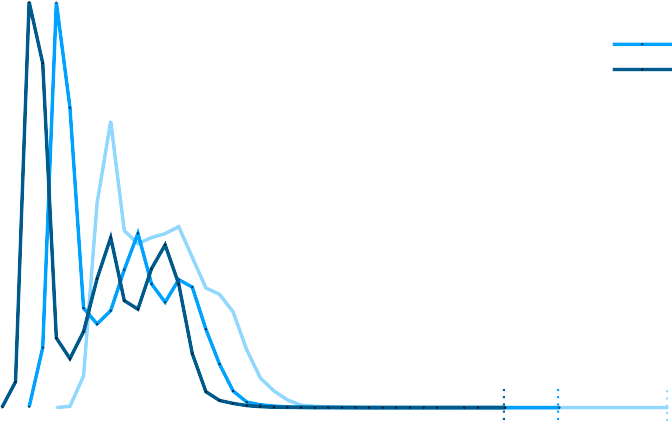250000
> 700000

This chapter tackled these two problems by using the standard tracing infras- tructure available in the Linux kernel to dynamically attach verification code to a non- modified running kernel, by exploiting the mechanism of dynamically loadable kernel modules. Furthermore, the verification code is semi-automatically generated from stan- dard automata description files, as can be produced with open editors. The presented benchmark results show that the proposed technique overcomes standard tracing and user-space processing of kernel events to be verified in terms of performance. More- over, the proposed technique is more efficient than merely tracking the events of interest just using tracing features available in the kernel.

> 本章通过利用可动态加载内核模块的机制，利用 Linux 内核中可用的标准跟踪基础结构，将验证代码动态附加到未修改的运行内核，从而解决了这两个问题。此外，验证代码是从标准自动机描述文件半自动生成的，可以使用开放编辑器生成。所给出的基准测试结果表明，所提出的技术在性能方面克服了要验证的内核事件的标准跟踪和用户空间处理。更重要的是，所提出的技术比仅使用内核中可用的跟踪功能来跟踪感兴趣的事件更有效。

The results of this research attracted the attention of the Linux kernel devel- opment community. In addition to the academic conferences, the results of this chap- ter were presented at the main open-source conference venues, including the Linux Plumbers Conference 2019 and the Embedded Linux Conference Europe 2019, being an invited talk at the Kernel Recipes conference in 2019.

> 这项研究的结果引起了 Linux 内核开发社区的关注。除学术会议外，本章的成果还将在主要的开源会议场所展示，包括 2019 年 Linux Plumbers 会议和 2019 年嵌入式 Linux 欧洲会议，这是 2019 年内核配方会议的特邀演讲。

# LATENCY ANALYSIS

This chapter presents the final results of the thesis, being the motivation for the development of the model. It aims to validate that the model developed in Section [4](#a-thread-synchronization-model-for-the-preempt_rt-kernel) has the potential to describe the PREEMPT*RT execution unambiguously, overcoming the main limitation of the timeline presented in ([OLIVEIRA; OLIVEIRA](#_bookmark319), [2016](#_bookmark319)), starting by the principal PREEMPT_RT metric: the \_scheduling latency*.

> 本章介绍了论文的最终结果，作为模型开发的动机。它旨在验证第[4]节中开发的模型（#a-thread-synchronization-model-for-the-preept_rt-kernel）有可能明确地描述 preempt*rt 执行，克服了（[OLIVEIRA；OLIVEIRA]（#\_bookmark319），[2016]（#\_bbookmark319））中提出的时间线的主要限制，从主要的 preempt_rt 度量开始：\_scheduling latency*。

Regarding the _scheduling latency_, Linux developers have extensively reworked the Linux kernel to reduce the code sections that could delay the scheduling of the highest-priority thread. Cyclictest is the primary tool adopted in the evaluation of the fully-preemptive mode of PREEMPT*RT Linux ([CERQUEIRA; BRANDENBURG](#_bookmark251), [2013](#_bookmark251)), and it is used to compute the time difference between an expected activation time and the actual start of execution time of a high-priority thread running on a CPU. By configuring the measurement thread with the highest priority and running a back- ground taskset to generate disturbance, cyclictest is used in practice to measure the \_scheduling latency* of each CPU of the system. Maximum observed latency values gen- erally range from a few microseconds on single-CPU systems to 250 us on non-uniform memory access systems ([RED HAT. INC](#_bookmark328), [2020](#_bookmark328)), which are acceptable values for a vast range of applications with sub millisecond timing precision requirements. In this way, PREEMPT_RT Linux closely fulfills theoretical fully-preemptive systems assumptions that consider atomic scheduling operations, with neglectable overheads.

> 关于*scheduling latency*，Linux 开发人员已经对 Linux 内核进行了大量修改，以减少可能延迟最高优先级线程调度的代码段。Cyclectest 是评估 PREEMPT*RT Linux（[CERQUEIRA；BRANDENBURG]（#\_bookmark251），[2013]（#\_bbookmark251））的完全抢占模式时采用的主要工具，它用于计算 CPU 上运行的高优先级线程的预期激活时间和实际开始执行时间之间的时间差。通过配置具有最高优先级的测量线程并运行后台任务集以产生干扰，cyclectest 在实践中用于测量系统每个 CPU 的调度延迟*。观察到的最大延迟值通常从单 CPU 系统上的几微秒到非统一内存访问系统上的 250 us（[RED HAT.INC]（#\_bookmark328），[2020]（#\_bookmark328）），这对于具有亚毫秒计时精度要求的广泛应用来说是可接受的值。通过这种方式，PREEMPT_RT-Linux 以可忽略的开销紧密地满足了考虑原子调度操作的理论上的完全抢占式系统假设。

Despite its practical approach and the contributions to the current state-of-art of real-time Linux, cyclictest has some known limitations. The main limitation arises from the opaque nature of the latency value provided by cyclictest ([BRANDENBUG;](#_bookmark241) [ANDERSON](#_bookmark241), [2009](#_bookmark241)). Indeed, it only informs about the latency value, without providing insights on its root causes. Tracing features of Linux are often applied by developers to help in the investigation. However, the indiscriminate usage of tracing is not enough to solve the problem: the tracing overhead can easily mask the real sources of latency, and the excessive amount of data often drives the developer to conjunctures that are not the actual cause of the problem. For these reasons, the debug of a latency spike on Linux generally takes a reasonable amount of hours of very specialized resources.

> 尽管 cyclectest 采用了实用的方法，并且对实时 Linux 的最新技术做出了贡献，但它仍有一些已知的局限性。主要限制来自 cyclectest 提供的延迟值的不透明性质（[BRANDENBUG；]（#\_bookmark241）[ANDERSON]（#\_bookmark241，[2009]（#\_bbookmark241））。事实上，它只告知延迟值，而没有提供其根本原因的见解。开发人员经常应用 Linux 的跟踪功能来帮助调查。然而，不分青红皂白地使用跟踪并不足以解决问题：跟踪开销可以很容易地掩盖延迟的真实来源，而过多的数据往往会驱使开发人员陷入并非问题实际原因的困境。由于这些原因，在 Linux 上调试延迟峰值通常需要相当多的专用资源。

A common approach in the real-time systems theory is the categorization of a system as a set of independent variables and equations that describe its integrated timing behavior. However, the complexity of the execution contexts and fine-grained synchronization of the PREEMPT_RT make it difficult the application of classical real- time analysis for Linux. Linux kernel complexity is undoubtedly a barrier for both expert operating system developers and real-time systems researchers. The absence of a theoretically-sound definition of Linux behavior is widely known, and it inhibits the appli- cation of the rich arsenal of already existing techniques from the real-time theory. Also, it inhibits the development of theoretically sound analysis that fits all the peculiarities of the Linux task model ([GLEIXNER](#_bookmark279), [2010](#_bookmark279)).

> 实时系统理论中的一种常见方法是将系统分类为一组描述其集成时序行为的独立变量和方程。然而，PREEMPT_RT 的执行上下文的复杂性和细粒度同步使得经典实时分析在 Linux 上的应用变得困难。Linux 内核的复杂性无疑是专家操作系统开发人员和实时系统研究人员的障碍。Linux 行为缺乏一个理论上合理的定义是众所周知的，它阻碍了实时理论中丰富的现有技术的应用。此外，它抑制了理论上合理的分析的发展，该分析符合 Linux 任务模型的所有特点（[GLEIXNER]（#\_bookmark279），[2010]（#\_bbookmark279））。

In this Chapter, the model presented in Chapter [4](#a-thread-synchronization-model-for-the-preempt_rt-kernel) is used to derive a set of properties and rules defining the Linux kernel behavior from a scheduling perspec- tive. These properties are then leveraged to derive a theoretically-sound bound to the scheduling latency that comprehensively considers the sources of delays, including the all possible synchronization flows in the kernel code. The analysis builds upon a set of practically-relevant modeling variables inspired by the foundational principles behind the development of the PREEMPT_RT Linux Kernel. This chapter also presents an efficient tracing method, using the same approach presented in Chapter [5](#online-runtime-verification), to observe the kernel events, interpreting them to define observed values for the variables used in the analysis while reducing the runtime overhead and storage space to values that make its use feasible in practice. The tool also analyses the trace, serving to distinguish the various sources of the latency. Moreover, by exploring the interference caused by adopting different interrupt characterizations, it also derives possible latency bounds based on real trace execution. Finally, the experimental section compares the results obtained by the cyclictest and the proposed tool, showing that the proposed method can find sound bounds faster with acceptable overhead.

> 在本章中，第[4]章中介绍的模型（#a-thread-synchronization-model-for-the-preept_rt-kernel）用于从调度角度导出一组定义 Linux 内核行为的属性和规则。然后利用这些属性来推导与调度延迟相关的理论上的合理值，该值综合考虑了延迟的来源，包括内核代码中所有可能的同步流。该分析建立在一组实际相关的建模变量的基础上，这些变量受到 PREEMPT_RT Linux 内核开发背后的基本原则的启发。本章还介绍了一种有效的跟踪方法，使用第[5]章（#在线运行时验证）中介绍的相同方法来观察内核事件，解释它们以定义分析中使用的变量的观察值，同时将运行时开销和存储空间减少到实际可行的值。该工具还分析跟踪，以区分延迟的各种来源。此外，通过探索采用不同中断特征所引起的干扰，它还基于实际跟踪执行导出了可能的延迟边界。最后，实验部分比较了循环测试和所提出的工具获得的结果，表明所提出的方法可以以可接受的开销更快地找到声音边界。

1.  SYSTEM MODEL

> 1.系统模型

This work uses the _Thread Synchronization Model_, presented in Chapter [4](#a-thread-synchronization-model-for-the-preempt_rt-kernel), as the description of a single-cpu PREEMPT_RT Linux system configured in the fully- preemptive mode. The advantages of using the model is many-fold: (1) it was devel- oped in collaboration with kernel developers, and widely discussed with both practition- ers ([OLIVEIRA](#_bookmark316), [2018e](#_bookmark316),[f](#_bookmark317)) and academia ([OLIVEIRA; CUCINOTTA; OLIVEIRA](#_bookmark318), [2019](#_bookmark318);

> 这项工作使用了第[4]章（#a-Thread-Synchronization-Model-for-the-preept*rt-kernel）中介绍的\_Thread Synchronization Model*，作为以完全抢占模式配置的单 cpu preempt_rt Linux 系统的描述。使用该模型的优点有很多方面：（1）它是与内核开发人员合作开发的，并与实践人员（[OLIVEIRA]（#\_bookmark316）、[2018e]（#\_bookmark316）、[f]（#\_blaookmark317））和学术界（[OOLIVEIRA；CUCINOTTA；OLIVEIRA]（#\_tookmark318）、[2019]（#\_Tookmark318）进行了广泛讨论；

[OLIVEIRA, D. B. de et al.](#_bookmark306), [2017](#_bookmark306)); (2) the model is deterministic, i.e, in a given state a given event can cause only one transition; (3) the model was extensively verified, both for functional and non-functional properties; indeed, the non-functional runtime verification of the model was capable of identifying bugs in the Linux kernel that no other kernel mechanism could discover ([OLIVEIRA; OLIVEIRA; CUCINOTTA](#_bookmark307), [2020](#_bookmark307)) but mainly; (4) it abstracts the code complexity by using a set of small automata, each one precisely describing a single behavior of the system.

> [OLIVEIRA，D.B.de 等人]（#\_bookmark306），[2017]（#\_bbookmark306））；（2） 该模型是确定性的，即，在给定状态下，给定事件只能导致一次转换；（3） 该模型在功能性和非功能性方面得到了广泛验证；事实上，模型的非功能运行时验证能够识别 Linux 内核中其他内核机制无法发现的错误（[OLIVEIRA；OLIVEIRA；CUCINOTTA]（#\_bookmark307），[2020]（#\_bookmark307；（4） 它通过使用一组小自动机来抽象代码的复杂性，每个自动机精确地描述系统的单个行为。

>

NMIs, IRQs, and threads are subject to the scheduling hierarchy discussed in Sec- tion [2.2](#_bookmark51), i.e., the NMI has always a higher priority than IRQs, and IRQs always have higher priority than threads. Given a thread _\tau_ <sup>THD</sup>, at a given point in time, the set of threads with a higher-priority than _\tau_ <sup>THD</sup> is denoted by Γ<sup>THD</sup>. Similarly, the set of tasks

> NMI、IRQ 和线程受制于第[2.2]节（#_bookmark51）中讨论的调度层次结构，即 NMI 的优先级始终高于 IRQ，IRQ 的优先级始终低于线程。给定一个线程_\tau*<sup>THD</sup>，在给定的时间点，优先级高于*\tau\_<sup>THD</sup>的一组线程由 Γ<sup>THD</sub>表示。同样，任务集

> _i_ HP*i*

with priority lower than _\tau_ <sup>THD</sup> is denoted by Γ<sup>THD</sup>. Although the schedulers might have threads with the same priority in their queues, only one among them will be selected to have its context load, and consequently, starting to run. Hence, when scheduling, the schedulers elect a single thread as the highest-priority one.

> 优先级低于* \tau*＜ sup ＞ THD ＜/sup ＞的 THD 由 Γ ＜ sup ＜ THD ＜/sup ＞表示。尽管调度程序的队列中可能有具有相同优先级的线程，但将只选择其中一个线程来加载其上下文，从而开始运行。因此，在调度时，调度器选择单个线程作为最高优先级线程。

> _i_ LP*i*
> Figure 57 – NMI generator (O1).

The system model is formalized using the modular approach, where the _gener- ators_ model the independent action of tasks and synchronization primitives, and the _specification_ models the synchronized behavior of the system. The next sections ex- plains the _generators_ as the basic operations of the system, and the specifications as a set of _rules_ that explains the system behavior.

> 使用模块化方法对系统模型进行形式化，其中生成器对任务和同步原语的独立动作进行建模，而规范对系统的同步行为进行建模。下一节将介绍\_generators 作为系统的基本操作，并将规范作为解释系统行为的一组\_rules。

## Basic Operations

This section describes _generators_ relevant for the scheduling latency analysis, starting by the interrupt behavior:

> 本节介绍与调度延迟分析相关的*generators*，从中断行为开始：

- **O1**: The NMI context starts with the entry of the NMI handler (nmi_entry), and exits in the return of the handler (nmi_exit). This operation is modeled as in Figure [57](#_bookmark172).

> -**O1**：NMI 上下文以 NMI 处理程序的条目（NMI_entry）开始，并在处理程序的返回（NMI_exit）中退出。该操作如图[57]（#\_bookmark172）所示建模。

- **O2**: Linux allows threads to temporarily mask interrupts (local_irq_disable), in such a way to avoid access to shared data in an inconsistent state. Threads need to unmask interrupts (local_irq_enable) at the end of the critical section, as modeled in Figure [58](#_bookmark174).

> -**O2**：Linux 允许线程临时屏蔽中断（local_irq_disable），以避免在不一致状态下访问共享数据。线程需要在关键部分末尾取消屏蔽中断（local_irq_enable），如图[58]（#\_bookmark174）所示。

- **O3**: To enforce synchronization, the processor masks interrupts before calling an interrupt handler on it. IRQs stays masked during the entire execution of an inter- rupt handler (hw_local_irq_disable). Interrupts are unmasked after the return of the handler (hw_local_irq_enable), as shown in Figure [59](#_bookmark174). In the model, these events are used to identify the begin and the return of an IRQ execution. The reference model considers two threads: the thread under analysis and an arbitrary other thread (including the idle thread). The corresponding operations are discussed next.

> -**O3**：为了强制同步，处理器在调用中断处理程序之前屏蔽中断。在中断处理程序（hw_local_irq_disable）的整个执行过程中，irq 保持屏蔽状态。在返回处理程序（hw_local_irq_enable）后，中断被屏蔽，如图[59]（#\_bookmark174）所示。在模型中，这些事件用于标识 IRQ 执行的开始和返回。参考模型考虑两个线程：被分析的线程和任意其他线程（包括空闲线程）。接下来将讨论相应的操作。

- **O4**: The thread is not running until its context is loaded in the processor (sched_switch_in). The context of a thread can be unloaded by a suspension

> -**O4**：线程在其上下文加载到处理器（sched_switch_in）之前不会运行。线程的上下文可以通过挂起卸载

(sched_switch_suspend), blocking (sched_switch_blocking), or preemption (sched_switch_preempt), as in Figure [60](#_bookmark174).

> （sched_switch_suspend）、阻塞（sched_stch_blocking）或抢占（sched_sswitch_preempt），如图[60]（#\_bookmark174）所示。

> Figure 58 – IRQ disabled by software (O2).
> Figure 59 – IRQs disabled by hardware
> Figure 60 – Context switch generator (04).
> Figure 61 – Context switch generator
> Figure 62 – Preempt disable (06).
> Figure 63 – Scheduling context (07).
> Figure 64 – Thread runnable/sleepable (08).
> Figure 65 – Need re-schedule operation

- **O5**: The model considers that there is always _another thread_ ready to run. The reason is that, on Linux, the _idle state_ is implemented as a thread, so at least the _idle thread_ is ready to run. The other thread can have its context unloaded (sched_switch_out_o) and loaded (sched_switch_in_o) in the processor, as mod- eled in Figure [61](#_bookmark174).

> -**O5**：模型认为总是有其他线程准备运行。原因是，在 Linux 上，idle 状态被实现为线程，因此至少 idle 线程可以运行了。另一个线程可以在处理器中卸载（sched_switch_out_o）和加载（sched_sswitch_in_o）其上下文，如图[61]（#\_bookmark174）所示。

- **O6**: The preemption is enabled by default. Although the same _function_ is used to disable preemption, the model distinguishes the different reasons to disable preemption, as modeled in Figure [62](#_bookmark174). The preemption can be disabled either to postpone the scheduler execution (preempt*disable), or to protect the scheduler execution of a recursive call (preemp_disable_sched). Hereafter, the latter mode is referred to as \_preemption disabled to call the scheduler* or _preemption disabled to schedule_.

> -**O6**：默认情况下启用抢占。尽管相同的*function*用于禁用抢占，但该模型区分了禁用抢占的不同原因，如图[62]（#\_bookmark174）所示。可以禁用抢占以推迟调度程序的执行（preempt*disable），或者保护递归调用的调度程序执行（preep_disable_sched）。此后，后一种模式被称为\preception disabled 以调用调度器*或\_preception disabled 以调度。

- **O7**: The scheduler starts to run selecting the highest-priority thread (schedule_entry, in Figure [63](#_bookmark174)), and returns after scheduling (schedule_exit).

> -**O7**：调度器选择最高优先级的线程（schedule_entry，见图[63]（#\_bookmark174））开始运行，并在调度后返回（schedule.ext）。

- **O8**: Before being able to run, a thread needs to be awakened (sched*waking). A thread can set its state to \_sleepable* (sched_set_state_sleepable) when in need of resources. This operation can be undone if the thread sets its state to runnable again (sched_set_state_runnable). The state-machine that illustrates the interaction among these events is shown in Figure [64](#_bookmark174).

> -**O8**：在能够运行之前，需要唤醒线程（sched*唤醒）。当需要资源时，线程可以将其状态设置为\sleepable*（sched_set_state_sleepable）。如果线程再次将其状态设置为可运行（sched_set_state_runnable），则可以撤消此操作。图[64]（#\_bookmark174）显示了说明这些事件之间交互的状态机。

- **O9**: The need re-schedule (sched_need_resched) notifies that the currently run- ning thread is not the highest-priority anymore, and so the current CPU needs to re-schedule, in such way to select the new highest-priority thread (Figure [65](#_bookmark174)).

> -**O9**：需要重新调度（sched_need_resched）通知当前正在运行的线程不再是最高优先级，因此当前 CPU 需要重新调度，以选择新的最高优先级线程（图[65]（#\_bookmark174））。

1.  ## Rules

> 1.##规则

The _Thread Synchronization Model_ ([OLIVEIRA; OLIVEIRA; CUCINOTTA](#_bookmark307), [2020](#_bookmark307)) includes a set of _specifications_ defining the synchronization rules among _generators_ (i.e., the basic operations discussed in Section [6.1.1](#basic-operations)). Next, we summarize a subset of rules extracted from the automaton, which are relevant to analyze the scheduling latency. Each rule points to a related specification, graphically illustrated with a corresponding figure.

> _Thread Synchronization Model_（[OLIVEIRA；OLIVEIRA；CUCINOTTA]（#\_bookmark307），[2020]（#\_bookmark307））包括一组规范，定义了\_generators 之间的同步规则（即第[6.1.1]节中讨论的基本操作（#basic operations））。接下来，我们总结了从自动机中提取的规则子集，这些规则与分析调度延迟相关。每个规则都指向一个相关的规范，并用相应的图形加以说明。

**IRQ and NMI rules.** First, we start discussing rules related to IRQs and NMI.

> **IRQ 和 NMI 规则。**首先，我们开始讨论与 IRQ 和 NMI 相关的规则。

- **R1**: There is no specification that blocks the execution of a NMI (**O1**) in the au- tomaton.

> -**R1**：没有规范阻止自动执行 NMI（**O1**）。

- **R2**: There is a set of events that are not allowed in the NMI context (Figure [66](#_bookmark176)), including:

> -**R2**：NMI 上下文中不允许出现一组事件（图[66]（#\_bookmark176）），包括：

- **R2a**: set the need resched (**O9**).

> -**R2a**：设置需要救援（**O9**）。

- **R2b**: call the scheduler (**O7**).

> -**R2b**：调用调度器（**O7**）。

- **R2c**: switch the thread context (**O4** and **O5**)

> -**R2c**：切换线程上下文（**O4**和**O5**）

- **R2d**: enable the preemption to schedule (**O6**).

> -**R2d**：启用调度优先权（**O6**）。

- **R3**: There is a set of events that are not allowed in the IRQ context (Figure [67](#_bookmark176)), including:

> -**R3**：IRQ 上下文中不允许出现一组事件（图[67]（#\_bookmark176）），包括：

- **R3a**: call the scheduler (**O7**).

> -**R3a**：调用调度器（**O7**）。

- **R3b**: switch the thread context (**O4** and **O5**).

> -**R3b**：切换线程上下文（**O4**和**O5**）。

- **R3c**: enable the preemption to schedule (**O6**).

> -**R3c**：启用调度优先权（**O6**）。

- **R4**: IRQs are disabled either by threads (**O2**) or IRQs (**O3**), as in the model in Figure [68](#_bookmark177). Thus, it is possible to conclude that: Figure 66 – NMI blocks all other operations (R2).

> -**R4**：IRQ 被线程（**O2**）或 IRQ（**O3**）禁用，如图[68]（#\_bookmark177）中的模型所示。因此，可以得出如下结论：图 66–NMI 阻止了所有其他操作（R2）。

hw_local_irq_disable hw_local_irq_enable local_irq_disable local_irq_enable preempt_disable preempt_enable preempt_disable_sched preempt_enable_sched sched_need_resched sched_set_state_runnable sched_set_state_sleepable sched_switch_blocking sched_switch_in sched_switch_in_o sched_switch_out_o sched_switch_preempt sched_switch_suspend sched_waking schedule_entry local_irq_disable local_irq_enable preempt_enable_sched sched_set_state_runnable sched_set_state_sleepable sched_switch_in sched_switch_in_o sched_switch_out_o sched_switch_preempt sched_switch_suspend sched_switch_blocking schedule_entry

> hw_local_irq_disable hw_local-irq_enable local_irq_disablelocal_irq \_enable preempt_disable preempt_enable preempt \_disable_sched preempt \_enable_sched schedule_resched schedule_set_state_runable schedule_state_sleepable schedule_switch_blocking schedule_sched switch_in in schedule_schd_switch_in_o schedule_set-out_o sched switch_preept schedule_shanged schedule_shung schedule_entry local_irq_disable local_id_enable 抢占已启用的已缓存计划设置状态不可运行的计划设置状态可休眠的计划切换进入计划切换退出计划切换重新启用计划切换暂停计划切换锁定计划条目

Figure 67 – Operations blocked in the IRQ context (R3).

> 图 67–IRQ 上下文中被阻止的操作（R3）。

Figure 68 – IRQ disabled by thread or IRQs (R4).

> 图 68–线程或 IRQ（R4）禁用 IRQ。

Figure 69 – The scheduler is called with in- terrupts enabled (R5).

> 图 69–在启用中断的情况下调用调度器（R5）。

Figure 70 – The scheduler is called with preemption disabled to call the scheduler (R6).

> 图 70–在禁用抢占的情况下调用调度器以调用调度器（R6）。

- **R4a**: by disabling IRQs, a thread postpones the beginning of the IRQ han- dlers.

> -**R4a**：通过禁用 IRQ，线程延迟 IRQ 处理器的开始。

- **R4b**: when IRQs are not disabled by a thread, IRQs can run.

> -**R4b**：当 IRQ 未被线程禁用时，IRQ 可以运行。

**Thread context.** Next, synchronization rules related to the thread context are discussed. We start presenting the necessary conditions to call the scheduler (**O7**).

> **线程上下文。**接下来，讨论与线程上下文相关的同步规则。我们开始提供调用调度器的必要条件（**O7**）。

## Necessary conditions to call the scheduler.

- **R5**: The scheduler is called (and returns) with interrupts enabled (Figure [69](#_bookmark178)). Figure 71 – The scheduler context does not enable the preemption (R7).

> -**R5**：在启用中断的情况下调用（并返回）调度器（图[69]（#\_bookmark178））。图 71–调度器上下文未启用抢占（R7）。

> preempt_disable preempt_enable preempt_disable_sched preempt_enable_sched

Figure 72 – The context switch occurs with interrupts and preempt disabled (R8).

> 图 72–上下文切换在中断和抢占被禁用的情况下发生（R8）。

Figure 73 – The context switch occurs in the scheduling context (R9).

> 图 73–上下文切换发生在调度上下文（R9）中。

Figure 74 – Wakeup and need resched requires IRQs and preemption disabled (R10 and R11).

> 图 74–唤醒和需要救援需要 IRQ 和抢占禁用（R10 和 R11）。

Figure 75 – Disabling preemption to sched- ule always causes a call to the scheduler (R12).

> 图 75–禁用调度程序的抢占总是会导致调用调度程序（R12）。

Figure 76 – Scheduling always causes con- text switch (R13).

> 图 76–调度总是导致文本切换（R13）。

- **R6**: The scheduler is called (and returns) with preemption disabled to call the scheduler (Figure [70](#_bookmark178)). Rule R7 ensures that the scheduler always run with the preemption disabled.

> -**R6**：在禁用抢占的情况下调用（并返回）调度器以调用调度器（图[70]（#\_bookmark178））。规则 R7 确保调度程序始终在禁用抢占的情况下运行。

- **R7**: The preemption is never enabled by the scheduling context (Figure [71](#_bookmark179)). Regarding the context switch (**O4** and **O5**), the following conditions are required.

> -**R7**：调度上下文从未启用抢占（图[71]（#\_bookmark179））。关于上下文开关（**O4**和**O5**），需要以下条件。

## Necessary conditions for a context switch.

- **R8**: The context switch occurs with interrupts disabled by threads (**O2**) and pre- emption disabled to schedule (**O6**, Figure [72](#_bookmark179)).

> -**R8**：上下文切换发生时，线程禁用了中断（**O2**），并禁用了调度的抢占（**O6**，图[72]（#\_bookmark179））。

- **R9**: The context switch occurs in the scheduling context (**O7**, Figure [73](#_bookmark180)). The necessary conditions to set the need resched (**O9**) and to wakeup a thread (**O8**) are the same. They are listed below, and showed in Figure [74](#_bookmark180).

> -**R9**：上下文切换发生在调度上下文中（**O7**，图[73]（#\_bookmark180））。设置需要救援（**O9**）和唤醒线程（**O8**）的必要条件是相同的。它们列在下面，如图[74]（#\_bookmark180）所示。

## Necessary conditions to set the need resched and to wakeup a thread.

- **R10**: preemption should be disabled, by any mean (**O6**).

> -**R10**：应通过任何方式禁用抢占（**O6**）。

- **R11**: IRQs should be masked, either to avoid IRQ (**O2**) or to postpone IRQs (**O3**). Until here, we were mentioned necessary conditions. From now on, we will be considering sufficient conditions.

> -**R11**：应屏蔽 IRQ，以避免 IRQ（**O2**）或推迟 IRQ（**O3**）。在此之前，我们提到了必要条件。从现在起，我们将考虑充分的条件。

## Sufficient conditions to call the scheduler and to cause a context switch.

- **R12**: disabling preemption to schedule (**O6**) always causes a call to the scheduler (**O7**, Figure [75](#_bookmark181)).

> -**R12**：禁用调度抢占（**O6**）总是会调用调度器（**O7**，图[75]（#\_bookmark181））。

- **R13**: calling the scheduler (**O7**) always results in a context switch (**O4**,**O5**). Recall that if the system is idle, the idle thread is executed after the context switch (Figure [76](#_bookmark181)).

> -**R13**：调用调度器（**O7**）总是导致上下文切换（**O4**，**O5**）。回想一下，如果系统处于空闲状态，则在上下文切换之后执行空闲线程（图[76]（#\_bookmark181））。

- **R14**: setting need resched (**O9**) always results in a context switch (**O4**,**O5**, Fig- ure [77](#_bookmark182)). Figure 77 – Setting need resched always causes a context switch (R14).

> -**R14**：设置需要救援（**O9**）总是会导致上下文切换（**O4**，**O5**，图[77]（#\_bookmark182））。图 77–需要救援的设置总是会导致上下文切换（R14）。

1.  DEMYSTIFYING THE REAL-TIME LINUX SCHEDULING LATENCY

> 1.揭开实时 LINUX 调度延迟的神秘面纱

2.  ## Problem statement

> 2.##问题陈述

We start defining the scheduling latency (hereafter only latency) and then we leverage the rules presented in Section [6.1](#_bookmark171) and the related automaton model to derive an upper bound reflecting all the peculiarities of Linux. The _latency_ experienced by a _thread instance_ (also called _job_) may be informally defined as the maximum time elapsed between the instant in which it becomes ready while having the highest-priority among all ready threads, and the time instant in which it is allowed to execute its own code after the context switch has already been performed. By extension, the latency of a thread is defined as reported in Definition [1](#_bookmark185).

> 我们开始定义调度延迟（以下仅为延迟），然后利用第[6.1]节（#_bookmark171）中的规则和相关的自动机模型来导出反映 Linux 所有特性的上限。\_thread instance_（也称为*job*）所经历的*latency*可以被非正式地定义为它在所有就绪线程中具有最高优先级的同时准备就绪的时刻与在已经执行上下文切换之后允许它执行自己的代码的时刻之间经过的最长时间。通过扩展，线程的延迟定义如定义[1]（#\_bookmark185）中所述。

**Definition 1** (Thread Scheduling Latency)**.** _The scheduling latency experienced by an arbitrary thread \tau <sup>THD</sup> ∈_ Γ*<sup>THD</sup> is the longest time elapsed between the time A in which* any _job of \tau <sup>THD</sup> becomes ready and with the highest priority, and the time F in which the scheduler returns and allows \tau <sup>THD</sup> to execute its code, in any possible schedule in which \tau <sup>THD</sup> is not preempted by any other thread in the interval_ \[_A_, _F_ \]_._

> **定义 1**（线程调度延迟）**.**_任意线程\tu<sup>THD</sup>∈_，在任何可能的调度中，\tau ＜ sup ＞ THD ＜/sup ＞不被间隔内的任何其他线程抢占\_

For brevity, we refer next to the event that causes any job of _\tau_ <sup>THD</sup> becoming ready _and_ with the maximum priority as RHP*i* event[1](#_bookmark188). With Definition [1](#_bookmark185) in place, this paper aims at computing a theoretically-sound upper bound to the latency experienced by an arbitrary _\tau_ <sup>THD</sup> _∈_ Γ<sup>THD</sup> under analysis. To this end, we extract next some formal properties and lemmas from the operations and rules presented in Section [6.1](#_bookmark171). We begin determining which types of entities may prolong the latency of _\tau_ <sup>THD</sup>.

> 为简洁起见，我们接下来将导致 THD</sup>的任何作业就绪并具有最大优先级的事件称为 RHP*i*事件[1]（#_bookmark188）。在定义[1]（#\_bookmark185）就位的情况下，本文旨在计算分析中任意_\tau*<sup>THD</sup>*∈_Γ<sup>THD</sup>所经历的延迟的理论上合理上限。为此，我们接下来从第[6.1]节（#\_bookmark171）中给出的操作和规则中提取一些形式属性和引理。我们开始确定哪些类型的实体可以延长 THD</sup>的延迟。

**Property 1.** _The scheduling latency of an arbitrary thread \tau <sup>THD</sup> ∈_ Γ*<sup>THD</sup>* cannot _be_prolonged due to high-priority interference from other threads \tau <sup>THD</sup> ∈_ Γ*<sup>THD</sup>.*

> **属性 1.**\_由于来自其他线程的高优先级干扰，任意线程的调度延迟不能延长\*

_Proof._ By contradiction, assume the property does not hold. Then, due to the priority ordering, it means that either: **(i)** _\tau_ <sup>THD</sup> was not the highest-priority thread at the begin- ning of the interval \[_A_, _F_ \] (as defined in Definition [1](#_bookmark185)), or **(ii)** _\tau_ <sup>THD</sup> has been preempted in \[_A_, _F_ \]. Both cases contradict Definition [1](#_bookmark185), hence the property follows.

> *证明。*通过矛盾，假设财产不成立。然后，由于优先级排序，这意味着：**（i）**_\tau_<sup>THD</sup>不是间隔\[A*，\_F*]开始时的最高优先级线程（如定义[1]（#_bookmark185）中所定义），或者**（ii）**_\tau*<sup>THD</sub>在\[A*、_F_]中被抢占。这两种情况都与定义[1]（#\_bookmark185）相矛盾，因此属性如下。

Differently, Property [2](#_bookmark187) shows that the latency of a thread may be prolonged due to _priority-inversion blocking_ caused by other threads _\tau_ <sup>THD</sup> _∈_ Γ<sup>THD</sup> with a lower priority.

> 不同的是，属性[2]（#_bookmark187）表明，由于优先级较低的其他线程_\tau*<sup>THD</sup>*∈\_。

**Property 2.** \*The latency of an arbitrary thread \tau <sup>THD</sup

> **属性 2.**\*任意线程的延迟\tau ＜ sup ＞ THD ＜/sup

_Proof._ The property follows by noting that, for example, a low-priority thread may dis- able the preemption to postpone the scheduler, potentially prolonging the latency of

> *证明。*该属性随后指出，例如，低优先级线程可能会禁用抢占以推迟调度程序，从而可能延长

1 Note that RHP*<sub>i</sub>* is an event external to _the model_, for instance, it can be a hardware event that dis- patches an IRQ, or the event that causes a thread to activate another thread.

> 1 注意，RHP*<sub>i</sub>*是模型外部的事件，例如，它可以是对 IRQ 进行修补的硬件事件，也可以是导致线程激活另一个线程的事件。

With Property [1](#_bookmark186) and Property [2](#_bookmark187) in place, we bound the Linux latency as follows, referring to an arbitrary thread _\tau_ <sup>THD</sup> under analysis. First, as a consequence of Prop- erty [1](#_bookmark186), only the NMI and IRQs may prolong the latency due to high-priority interference, and such an interference is equal for all threads _\tau_ <sup>THD</sup> _∈_ Γ<sup>THD</sup> since NMI and IRQs have higher priorities than threads. We model the interference due to the NMI and IRQs in a time window of length _t_ with the functions *I*NMI(_t_ ) and *I*IRQ(_t_ ), respectively. We then show next in Section [6.3](#_bookmark206) how to derive such functions. Besides interference, the latency is caused by constant kernel overheads (e.g., due to the execution of the kernel code for performing the context switch) and priority-inversion blocking (see Property [2](#_bookmark187)), which we bound with a term *L*IF. In principle, the delays originating *L*IF may be different for each thread _\tau_ <sup>THD</sup _∈_ Γ<sup>THD</sup>. However, for simplicity, we conservatively bound *L*IF in a thread-independent manner as discussed next in Section [6.2.2](#_bookmark190) and [6.3](#_bookmark206). The latency of _\tau_ <sup>THD</sup> is then a function of the above delays, and is bounded by leveraging standard techniques for response-time analysis in real-time systems ([AUDSLEY et al.](#_bookmark231), [1993](#_bookmark231); [JOSEPH; PANDYA](#_bookmark283), [1986](#_bookmark283); [LEHOCZKY; SHA; DING](#_bookmark292), [1989](#_bookmark292)), i.e., by the least positive value fulfilling the following equation:

> 在属性[1]（#_bookmark186）和属性[2]（#\_bbookmark187）就位的情况下，我们将 Linux 延迟绑定如下，参考分析中的任意线程_\tau*<sup>THD</sup>。首先，作为 Prop-erty[1]（#\_bookmark186）的结果，由于高优先级干扰，只有 NMI 和 IRQ 可以延长延迟，并且这种干扰对于所有线程来说都是相等的，因为 NMI 和 IRCQ 具有比线程更高的优先级。我们分别用函数*I*NMI（\_t*）和*I*IRQ（_t_。接下来，我们将在第[6.3]节（#_bookmark206）中展示如何导出此类函数。除了干扰之外，延迟是由恒定的内核开销（例如，由于执行上下文切换的内核代码的执行）和优先级反转阻塞（请参见属性[2]（#\_bookmark187））引起的，我们将其与项*L*IF 绑定。原则上，对于每个线程，源自*L*IF 的延迟可能不同。然而，为了简单起见，我们以线程无关的方式保守地绑定了*L*IF，如第[6.2.2]节（#\_bookmark190）和[6.3]节（#\_bookmark206）所述。然后，_\tau\_<sup>THD</sup>的延迟是上述延迟的函数，并通过利用实时系统中响应时间分析的标准技术（[AUDSLEY 等人]（#\_bbookmark231），[1993]（#\_bokmark231）；[JOSEPH；PANDYA]（#\_bookmark283），[1986]（#\_bookmark283）；[LEHOCZKY；SHA；DING]（#\_bookmark292），[1989]（#\_bookmark292）），即满足以下等式的最小正值：

> _L_ = *L*IF + _I_<sup>NMI</sup>(_L_) + _I_<sup>IRQ</sup>(_L_). (18)

Next, we show how to bound *L*IF.

> 接下来，我们将展示如何绑定*L*IF。

1.  **Bounding** \*L**\*IF**

> 1.**边界**\*L**\*IF**

**Analysis Approach.** As discussed in Section [6.1](#_bookmark171), after the RHP*i* event occurs (i.e., when _\tau_ <sup>THD</sup> becomes the ready thread with the highest priority), the kernel identifies the need to schedule a new thread when the set_need_resched event takes place. Then, an ordered sequence of events occurs. Such events are motivated by the operations and rules discussed in Section [6.1](#_bookmark171), graphically illustrated in the lower part of Figure [78](#_bookmark182), and discussed below.

> **分析方法。**如第[6.1]节（#_bookmark171）所述，在 RHP*i*事件发生后（即，当_\tau\_<sup>THD</sup>成为具有最高优先级的就绪线程时），内核确定在发生 set_need_resched 事件时需要调度新线程。然后，发生一系列有序的事件。此类事件的动机是第[6.1]节（#\_bookmark171）中讨论的操作和规则，如图[78]（#\_bbookmark182）的下部所示，并在下面讨论。

**EV1** The necessary conditions to call the scheduler need to be fulfilled: IRQs are enabled, and preemption is disabled to call the scheduler. It follows from rule R5 and R6;

> **EV1**需要满足调用调度器的必要条件：启用 IRQ，禁用抢占以调用调度器。它遵循规则 R5 和 R6；

**EV2** The scheduler is called. It follows from R12;

> **EV2**调度程序被调用。它来自 R12；

**EV3** In the scheduler code, IRQs are disabled to perform a context switch. It follows from rule R8;

> **EV3**在调度器代码中，IRQ 被禁用以执行上下文切换。它遵循规则 R8；

**EV4** The context switch occurs. It follows from rule R13 and R14; **EV5** Interrupts are enabled by the scheduler. It follows from R5; **EV6** The scheduler returns;

> **EV4**发生上下文切换。它遵循规则 R13 和 R14**EV5**中断由调度器启用。其源自 R5**EV6**调度器返回；

**EV7** The preemption is enabled, returning the thread its own execution flow.

> **EV7**启用抢占，返回线程自己的执行流。

Note that, depending on what the processor is executing when the RHP*i* event occurs, not all the events may be involved in (and hence prolong) the scheduling latency. Figure [77](#_bookmark182) illustrates all the allowed sequences of events from the occurrence of the set*need_resched event (caused by RHP*i* ) until the context switch (EV4), allowing the occurrence of the other events (EV5-EV7). According to the automaton model, there are five possible and mutually-exclusive cases, highlighted with different colors in Figure [77](#_bookmark182). Our strategy for bounding *L*IF consists in deriving an individual bound for each of the five cases, taking the maximum as a safe bound. To derive the five cases, we first distinguish between: **(i)** if RHP*i* occurs when the current thread *\tau\_ <sup>THD</sup the scheduler execution flow, both voluntarily, or involuntarily as a consequence of a previous set_need_resched occurrence, after disabling the preemption to call the scheduler and, **(ii)** otherwise.

> 注意，根据 RHP*i*事件发生时处理器正在执行的内容，并非所有事件都可能涉及（并因此延长）调度延迟。图[77]（#\_bookmark182）说明了从集合*need_sched 事件（由 RHP*i*引起）的发生到上下文切换（EV4）的所有允许的事件序列，允许其他事件（EV5-EV7）的发生。根据自动机模型，有五种可能的互斥情况，在图[77]（#\_bookmark182）中用不同颜色突出显示。我们的绑定*L*IF 的策略包括为五种情况中的每一种导出单独的绑定，将最大值作为安全绑定。为了导出这五种情况，我们首先区分：**（i）**如果 RHP*i*发生在当前线程*\tau\_<sup>THD</sup 调度程序执行流时，在禁用调用调度程序的抢占之后，由于先前的 set_need_resched 发生而自愿或非自愿地发生，**（ii）**否则。

We can distinguish three mutually-exclusive sub-cases of (i):

> 我们可以区分（i）的三个互斥子情况：

1.  if RHP*i* occurs between events EV1 and EV2, i.e., after that preemption has been disabled to call the scheduler and before the actual scheduler call (black in Fig- ure [77](#_bookmark182));

> 1.如果 RHP*i*发生在事件 EV1 和 EV2 之间，即，在该抢占被禁用以调用调度器之后，在实际调度器调用之前（图[77]中的黑色（#\_bookmark182））；

2.  if RHP*i* occurs in the scheduler between EV2 and EV3, i.e., after that the scheduler has already been called and before interrupts have been disabled to cause the context switch (pink in Figure [77](#_bookmark182));

> 2.如果 RHP*i*出现在 EV2 和 EV3 之间的调度器中，即，在调度器已经被调用之后并且在中断被禁用以导致上下文切换之前（图[77]中的粉红色（#\_bookmark182））；

3.  if RHP*i* occurs in the scheduler between EV3 and EV7, i.e., after interrupts have already been masked in the scheduler code and when the scheduler returns (brown in Figure [77](#_bookmark182)); In case (ii), RHP*i* occurred when the current thread _\tau_ <sup>THD</sup uler execution flow. Based on the automaton of Figure [77](#_bookmark182), two sub-cases are further differentiated:

> 3.如果 RHP*i*出现在 EV3 和 EV7 之间的调度器中，即，在调度器代码中已经屏蔽了中断之后，以及调度器返回时（图[77]中的棕色（#_bookmark182））；在情况（ii）中，RHP*i*发生在当前线程_\tau\_<sup>THD</supuler 执行流时。基于图[77]（#\_bookmark182）的自动机，进一步区分了两个子情况：

4.  when RHP*i* is caused by an IRQ, and the currently executing thread may delay RHP*i* only by disabling interruptions (green in Figure [77](#_bookmark182)).

> 4.当 RHP*i*由 IRQ 引起时，当前执行的线程可能仅通过禁用中断来延迟 RHP*i*（图[77]中的绿色（#\_bookmark182））。

5.  otherwise (blue in Figure [77](#_bookmark182)).

> 5.否则（图[77]中的蓝色（#\_bookmark182））。

**Variables Selection.** One of the most important design choices for the analysis consists in determining the most suitable variables to be used for deriving the analytical bound. Since the very early stages of its development, the PREEMPT_RT Linux had as a target to minimize the code portions executed in interrupt context and the code sections in which the preemption is disabled. One of the advantages of this design choice consists indeed in the reduction of scheduling delays. Nevertheless, disabling the preemption or IRQs is sometimes merely mandatory in the kernel code. As pointed out in Property [2](#_bookmark187), threads may also disable the preemption or IRQs, e.g., to enforce synchronization, thus impacting on the scheduling latency. Building upon the design principles of the fully-preemptive PREEMPT_RT kernel, Table [9](#_bookmark191) presents and discusses the set of variables selected to bound the latency, which are more extensively discussed next in Sections [6.3](#_bookmark206), and graphically illustrated in Figure [78](#_bookmark182). Such variables considers the longest intervals of time in which the preemption and/or IRQs are disabled, taking into consideration the different disabling modes discussed in Section [6.1](#_bookmark171).

> **变量选择。**分析最重要的设计选择之一是确定用于导出分析边界的最合适变量。自开发的早期阶段起，PREEMPT_RT Linux 就以最小化在中断上下文中执行的代码部分和禁用抢占的代码部分为目标。这种设计选择的优点之一确实在于减少调度延迟。然而，在内核代码中，禁用抢占或 IRQ 有时只是强制性的。如属性[2]（#\_bookmark187）中所指出的，线程还可以禁用抢占或 IRQ，例如，以强制同步，从而影响调度延迟。基于完全抢占式 PREEMPT_RT 内核的设计原则，表[9]（#\_bookmark191）给出并讨论了为限制延迟而选择的一组变量，接下来将在第[6.3]节（#\_bbookmark206）中进行更广泛的讨论，并在图[78]（#\_bockmark182）中进行了图示。考虑到第[6.1]节（#\_bookmark171）中讨论的不同禁用模式，此类变量考虑了禁用抢占和/或 IRQ 的最长时间间隔。

Table 9 – Parameters used to bound *L*IF.

> 表 9–用于绑定*L*IF 的参数。

**Deriving the bound.** Before discussing the details of the five cases, we present a bound on the interference-free duration of the scheduler code in Lemma [1](#_bookmark192).

> **推导界限。**在讨论这五种情况的细节之前，我们在引理[1]（#\_bookmark192）中给出了调度器代码的无干扰持续时间的界限。

**Lemma 1.** _The interference-free duration of the scheduler code is bounded by DPSD._

> **引理 1.**_调度器代码的无干扰持续时间由 DPSD 限制_

_Proof._ It follows by noting that by rule R6 the scheduler is called and returns with the preemption disabled to call the scheduler and, by rules R2d, R3c, and R7, the preemption is not enabled again until the scheduler returns.

> *证明。*接下来要注意的是，根据规则 R6，调度器被调用并返回，而抢占被禁用以调用调度器，并且根据规则 R2d、R3c 和 R7，直到调度器返回，抢占才被再次启用。

Next, we provide a bound to *L*IF in each of the five possible chains of events.

> 接下来，我们在五个可能的事件链中的每一个中提供一个到*L*IF 的绑定。

**Case (i).** In case (i), the preemption is already disabled to call the scheduler, hence either set*need_resched has already been triggered by another thread *\tau* <sup>THD</sup> */_= _\tau\_ <sup>THD</sup

> **情况（i）。**在情况（i）中，抢占已被禁用，无法调用调度器，因此，另一个线程*\tu*<sup>THD</sup>_/_=*\tu\_<sup>THD</sup 已经触发了 set*need_sched

the current thread voluntarily called the scheduler. Then, due to rules R13 and R14, a context switch will occur. Consequently, the processor continues executing the sched- uler code. Due to rule R5, the scheduler is called with interrupts enabled and preemp- tion disabled, hence RHP*i* (and consequently set_need_resched) must occur because of an event triggered by an interrupt. By rule R2, NMI cannot cause set_need_resched; consequently, it must be caused by an IRQ or the scheduler code itself. Due to EV3, IRQs are masked in the scheduler code before performing the context switch. We recall that case (i) divides into three possible sub-cases, depending on whether RHP*i* occurs between EV1 and EV2 (case i-a), EV2 and EV3 (case i-b), or EV3 and EV7 (case i-c). Lemma [2](#_bookmark193) bounds *L*IF for cases (i-a) and (i-b).

> 当前线程自愿调用调度器。然后，由于规则 R13 和 R14，将发生上下文切换。因此，处理器继续执行 sched-uler 代码。由于规则 R5，在启用中断和禁用预占的情况下调用调度程序，因此由于中断触发的事件，必须发生 RHP*i*（以及 set_need_resched）。根据规则 R2，NMI 不能导致 set_need_resched；因此，它必须由 IRQ 或调度器代码本身引起。由于 EV3，在执行上下文切换之前，IRQ 在调度器代码中被屏蔽。我们记得，根据 RHP*i*是否发生在 EV1 和 EV2（情况 i-a）、EV2 和 EV3（情况 i-b）或 EV3 和 EV7（情况 i-c）之间，情况（i）分为三种可能的子情况。引理[2]（#\_bookmark193）对于情况（i-a）和（i-b）的界*L*IF。

**Lemma 2.** _In cases (i-a) and (i-b), it holds_

> **引理 2.**_在情况（i-a）和（i-b）下成立_

_Proof._ In both cases it holds that preemption is disabled to call the scheduler and IRQs have not been disabled yet (to perform the context switch) when RHP*i* occurs. Due to rules R2 and R5, RHP*i* may only be triggered by an IRQ or the scheduler code itself. Hence, when RHP*i* occurs set*need_resched is triggered and the scheduler per- forms the context switch for *\tau\_ <sup>THD</sup>. Furthermore, in case (i-b) the processor already started executing the scheduler code when RHP*i* occurs. It follows that *L*IF is bounded by the interference-free duration of the scheduler code. By Lemma [1](#_bookmark192), such a duration is bounded by *D*PSD. In case (i-a), the scheduler has not been called yet, but preemptions have already been disabled to schedule. By rule R12, it will immediately cause a call to the scheduler, and the preemption is not enabled again between EV1 and EV2 (rules R2d, R3c, and R7). Therefore, also for case (i-a) *L*IF is bounded by *D*PSD, thus proving the lemma.

> *证明。*在这两种情况下，它都认为在 RHP*i*发生时，抢占被禁用以调用调度器，IRQ 尚未被禁用（以执行上下文切换）。由于规则 R2 和 R5，RHP*i*只能由 IRQ 或调度器代码本身触发。因此，当 RHP*i*发生时，将触发 set*need_sched，并且调度器 per-形成*\tu\_<sup>THD</sup>的上下文开关。此外，在情况（i-b）中，当 RHP*i*发生时，处理器已经开始执行调度器代码。因此，*L*IF 受到调度器代码的无干扰持续时间的限制。根据引理[1]（#\_bookmark192），这样的持续时间由*D*PSD 限定。在情况（i-a）中，调度程序尚未被调用，但抢占已被禁用以进行调度。根据规则 R12，它将立即调用调度器，并且 EV1 和 EV2 之间不会再次启用抢占（规则 R2d、R3c 和 R7）。因此，对于情形（i-a）*L*IF 也由*D*PSD 有界，从而证明了引理。

Differently, case (i-c), in which RHP*i* occurs between EV3 and EV7, i.e., after interrupts are disabled to perform the context switch, is discussed in Lemma [3](#_bookmark195).

> 不同的是，在引理[3]（#\_bookmark195）中讨论了情况（i-c），其中 RHP*i*发生在 EV3 和 EV7 之间，即，在中断被禁用以执行上下文切换之后。

**Lemma 3.** _In case (i-c), it holds_

> **引理 3.**_In 情形（i-c）成立_

_Proof._ In case (i), the scheduler is already executing to perform the context switch of a thread _\tau_ <sup>THD</sup> _/_= _\tau_ <sup>THD</sup>. Due to rules R2 and R5, RHP*i* may only be triggered by an IRQ or the scheduler code itself. If the scheduler code itself caused RHP*i* before the context switch (i.e., between EV3 and EV4), the same scenario discussed for case (i-b) occurs, and the bound of Equation [19](#_bookmark194) holds. Then, case (i-c) occurs for RHP*i* arriving between EV4 and EV7 for the scheduler code, or EV3 and EV7 for IRQs. IRQs may be either disabled to perform the context switch (if RHP*i* occurs between EV3 and EV5), or already re-enabled because the context switch already took place (if RHP*i* occurs between EV5 and EV7). In both cases, thread _\tau_ <sup>THD</sup> needs to wait for the scheduler code to complete the context switch for _\tau_ <sup>THD</sup>. If RHP*i* occurred while IRQs were disabled (i.e., between EV3 and EV5), the IRQ causing RHP*i* is executed, triggering set_need_resched, when IRQs are enabled again just before the scheduler returns (see rule R5).

> *证明。*在情况（i）中，调度器已经在执行线程*\tau*<sup>THD</sup>_/\_\_=_\tau*<sup>THD</sup>的上下文切换。由于规则 R2 和 R5，RHP*i*只能由 IRQ 或调度器代码本身触发。如果调度程序代码本身在上下文切换之前（即，在 EV3 和 EV4 之间）导致 RHP*i*，则发生针对情况（i-b）讨论的相同场景，并且方程[19]（#\_bookmark194）的界限成立。然后，对于调度程序代码，RHP*i*到达 EV4 和 EV7 之间，或者对于 IRQ 到达 EV3 和 EV7，出现情况（i-c）。IRQ 可以被禁用以执行上下文切换（如果 RHP*i*发生在 EV3 和 EV5 之间），或者已经被重新启用，因为上下文切换已经发生（如果 RHP*i*出现在 EV5 和 EV7 之间）。在这两种情况下，线程*\tau*<sup>THD</sup>都需要等待调度程序代码完成*\tau\_<sup>THD</sub>的上下文切换。如果在 IRQ 被禁用时（即，在 EV3 和 EV5 之间）发生 RHP*i*，则当 IRQ 在调度器返回之前再次启用时，执行导致 RHP*i*的 IRQ，触发 set_need_resched（参见规则 R5）。

Hence, due to rule R14, the scheduler needs to execute again to perform a second context switch to let _\tau_ <sup>THD</sup> execute. As shown in the automaton of Figure [77](#_bookmark182), there may exist a possible system state in case (i-c) (the brown one in Figure [77](#_bookmark182)) in which, after RHP*i* occurred and before the scheduler code is called again, both the preemption and IRQs are enabled before calling the scheduler (state pe*ie in Figure [77](#_bookmark182)). This system state is visited when the kernel is executing the non-atomic function to enable preemption, because the previous scheduler call (i.e., the one that caused the context switch for *\tau* <sup>THD</sup>) enabled IRQs before returning (EV5). Consequently, we can bound *L*IF in case (i-c) by bounding the interference-free durations of the three intervals: *I*ST, which lasts from EV3 to EV7, *I*PAIE, which accounts for the kernel being in the state pe_ie of Figure [77](#_bookmark182) while executing EV7, and *I*S, where preemption is disabled to call the scheduler and the scheduler is called again to schedule *\tau\_ <sup>THD</sup> (from EV1 to EV7). By definition and due to Lemma [1](#_bookmark192) and rules R2d, R3c, R7, and R12, *I*ST, *I*PAIE, and *I*S cannot be longer than *D*ST, *D*PAIE, and *D*PSD, respectively. The lemma follows by noting that the overall duration of *L*IF is bounded by the sum of the individual bounds on *I*ST, *I*PAIE, and *I*S.

> 因此，由于规则 R14，调度器需要再次执行，以执行第二个上下文切换，让*\tau*<sup>THD</sup>执行。如图[77]（#\_bookmark182）的自动机所示，在情况（i-c）中可能存在一种系统状态（图[77]中的棕色状态（#\_bbookmark182）），其中，在 RHP*i*发生之后，在再次调用调度器代码之前，在调用调度器之前，抢占和 IRQ 都被启用（图[7]（#\_bockmark182）中的状态 pe*ie）。当内核执行非原子函数以启用抢占时，会访问该系统状态，因为之前的调度程序调用（即，导致*\tu*<sup>THD</sup>上下文切换的调用）在返回之前启用了 IRQ（EV5）。因此，我们可以通过限制三个间隔的无干扰持续时间来限制情况（i-c）中的*L*IF：*i*ST，其从 EV3 持续到 EV7，*i*PAIE，其说明内核在执行 EV7 时处于图[77]（#\_bookmark182）的状态 pe_ie，以及*i*S，其中禁止抢占以调用调度器，并且再次调用调度器以调度*\tu\_＜ sup ＞ THD ＜/sup ＞（从 EV1 到 EV7）。根据定义，由于引理[1]（#\_bookmark192）和规则 R2d、R3c、R7 和 R12，*I*ST、*I*PAIE 和*I*S 不能分别长于*D*ST、*D*PAIE、和*D*PSD。引理随后注意到，*L*IF 的总持续时间由*I*ST、*I*PAIE 和*I*S 上的单个边界的和来限定。

**Case (ii).** In case (ii), RHP*i* occurs when the current thread _\tau_ <sup>THD</sup> _∈_ Γ<sup>THD</sup> is not in the scheduler execution flow. As a consequence of the RHP*i* events, set*need_resched is triggered. By rule R14, triggering set_need_resched always result in a context switch and, since RHP*i* occurred outside the scheduler code, the scheduler needs to be called to perform the context switch (rule R9). Hence, we can bound *L*IF in case (ii) by individually bounding two time intervals *I*S and *I*SO in which the processor is \_executing* or _not executing_ the scheduler execution flow (from EV1 to EV7), respectively. As already discussed, the duration of *I*S is bounded by *D*PSD (Lemma [1](#_bookmark192)). To bound *I*SO, we need to consider individually cases (ii-a) and (ii-b). Lemma [4](#_bookmark197) and Lemma [5](#_bookmark199) bound *L*IF for cases (ii-a) and (ii-b), respectively.

> **情况（ii）。**在情况（ii）中，当当前线程*\tau*<sup>THD</sup>*∈*Γ<sup>THD</sup>不在调度器执行流中时，发生 RHP*i*。作为 RHP*i*事件的结果，set*need_sched 被触发。根据规则 R14，触发 set_need_resched 总是导致上下文切换，并且由于 RHP*i*发生在调度器代码之外，因此需要调用调度器来执行上下文切换（规则 R9）。因此，在情况（ii）中，我们可以通过分别单独绑定两个时间间隔*I*S 和*I*SO 来绑定*L*IF，其中处理器正在执行*或不执行调度器执行流（从 EV1 到 EV7）。如上所述，*I*S 的持续时间由*D*PSD（引理[1]（#\_bookmark192））限定。为了绑定*I*SO，我们需要单独考虑情况（ii-a）和（ii-b）。对于情形（ii-a）和（ii-b），引理[4]（#\_bookmark197）和引理[5]（#\_bbookmark199）分别绑定*L*IF。

**Lemma 4.** _In case (ii-a), it holds_

> **引理 4.**_在情形（ii-a）中成立_

_Proof._ In case (ii-a) RHP*i* occurs due to an IRQ. Recall from Operation O3 that when an IRQ is executing, it masks interruptions. Hence, the IRQ causing RHP*i* can be delayed by the current thread or a lower-priority IRQ that disabled IRQs. When RHP*i* occurs, the IRQ triggering the event disables the preemption (IRQs are already masked) to fulfill R10 and R11, and triggers set_need_resched. If preemption was enabled before executing the IRQ handler and if set_need_resched was triggered, when the IRQ returns, it first disables preemptions (to call the scheduler, i.e., preempt_disable_sched). It then unmasks interrupts (this is a safety measure to avoid stack overflows due to multiple scheduler calls in the IRQ stack). This is done to fulfill the necessary conditions to call the scheduler discussed in rules R5 and R6. Due to rules R3a and R12, the scheduler is called once the IRQ returns. Hence, it follows that in the whole interval *I*SO, either the preemption or interrupts are disabled. Then it follows that *I*SO is bounded by *D*POID, i.e., by the length of the longest interval in which either the preemption or IRQs are disabled. The lemma follows recalling that the duration of *I*S is bounded by *D*PSD.

> *证明。*如果（ii-a）RHP*i*由于 IRQ 而发生。回想操作 O3，当执行 IRQ 时，它会屏蔽中断。因此，导致 RHP*i*的 IRQ 可以被当前线程或禁用 IRQ 的较低优先级 IRQ 延迟。当 RHP*i*发生时，触发事件的 IRQ 禁用抢占（IRQ 已被屏蔽）以实现 R10 和 R11，并触发 set_need_resched。如果在执行 IRQ 处理程序之前启用了抢占，并且触发了 set_need_resched，当 IRQ 返回时，它首先禁用抢占（以调用调度器，即 preempt_disable_sched）。然后它取消屏蔽中断（这是一种安全措施，以避免由于 IRQ 堆栈中的多个调度程序调用而导致堆栈溢出）。这样做是为了满足调用规则 R5 和 R6 中讨论的调度器的必要条件。由于规则 R3a 和 R12，一旦 IRQ 返回，就调用调度器。因此，在整个间隔*I*SO 中，抢占或中断被禁用。然后，*I*SO 受*D*POID 的限制，即，受禁止抢占或 IRQ 的最长间隔长度的限制。引理如下：回想*I*S 的持续时间受*D*PSD 的限制。

**Lemma 5.** _In case (ii-b), it holds_

> **引理 5.**_在情况（ii-b）中，它成立_

_Proof._ In case (ii-b) the currently executing thread delayed the scheduler call by dis- abling the preemption or IRQs. The two cases in which the RHP*i* event is triggered either by a thread or an IRQ are discussed below.

> *证明。*在情况（ii-b）中，当前执行的线程通过禁用抢占或 IRQ 来延迟调度程序调用。下面讨论 RHP*i*事件由线程或 IRQ 触发的两种情况。

1.  _RHPi is triggered by an IRQ._ Consider first that RHP*i* is triggered by an IRQ. Then, the IRQ may be postponed by a thread or a low-priority IRQ that disabled inter- rupts. When the IRQ is executed, it triggers set_need_resched. When returning, the IRQ returns to the previous preemption state[2](#_bookmark204), i.e, if it was disabled before the execution of the IRQ handler, preemption is disabled, otherwise it is enabled. If the preemption was enabled before executing the IRQ, the same scenario discussed for case (ii-a) occurs, and the bound of Equation [21](#_bookmark198) holds. Otherwise, if the preemption was disabled to postpone the scheduler execution, the scheduler is delayed due to priority-inversion blocking. Then it follows that when delaying the scheduler execution, either the preemp- tion or IRQs are disabled. When preemption is re-enabled by threads and interrupts are enabled, the preemption needs to be disabled again (this time not to postpone the scheduler execution, but to call the scheduler) to fulfill the necessary conditions listed in rules R5 and R6, hence necessarily traversing the pe_ie state (shown in Fig- ure [77](#_bookmark182)), where both preemptions and interrupts are enabled. Hence, it follows that *I*SO is bounded by *D*POID + *D*PAIE if RHP*i* is triggered by an IRQ.

> 1.*RHPi 由 IRQ 触发。*首先考虑 RHP*i*由 IRQ 触发。然后，IRQ 可以由线程或禁用中断的低优先级 IRQ 延迟。执行 IRQ 时，它会触发 set_need_resched。当返回时，IRQ 返回到先前的抢占状态[2]（#\_bookmark204），即，如果在执行 IRQ 处理程序之前禁用了抢占，则禁用抢占，否则启用抢占。如果在执行 IRQ 之前启用了抢占，则会出现针对情况（ii-a）所讨论的相同情况，并且方程[21]（#\_bookmark198）的界限成立。否则，如果抢占被禁用以推迟调度器的执行，则由于优先级反转阻塞，调度器将被延迟。然后，当延迟调度器执行时，预占或 IRQ 被禁用。当线程重新启用抢占并启用中断时，需要再次禁用抢占（这次不是为了推迟调度程序的执行，而是为了调用调度程序），以满足规则 R5 和 R6 中列出的必要条件，因此必须遍历 pe_ie 状态（如图[77]（#\_bookmark182）所示），其中同时启用了抢占和中断。因此，如果 RHP*I*由 IRQ 触发，则*I*SO 由*D*POID+*D*PAIE 界定。

1.  _RHPi is triggered by a thread._ In this case, a thread causes set*need_resched. Since the set_need_resched event requires IRQs and preemption disabled, the sched- uler execution is postponed until IRQs and preemption are enabled (pe_ie state). Once both are enabled, the preemption is disabled to call the scheduler. Then it follows that *I*SO is bounded by *D*POID + *D*PAIE if RHP*i* is triggered by a thread. Then it follows that *I*SO is bounded by *D*POID + *D*PAIE in case (ii-b). The lemma follows recalling that \_IS* is bounded by *D*PSD.

> 1.*RHPi 由线程触发。*在这种情况下，线程会导致 set*need_sched。由于 set_need_resched 事件要求禁用 IRQ 和抢占，因此 sched-uler 执行将被推迟，直到 IRQ 和抢先被启用（pe_ie 状态）。一旦两者都被启用，抢占将被禁用以调用调度器。然后，如果 RHP*I*由线程触发，则*I*SO 由*D*POID+*D*PAIE 限定。然后，在情况（ii-b）中，*I*SO 由*D*POID+*D*PAIE 定界。引理如下：回想\_IS*由*D*PSD 界定。

By leveraging the individual bounds on *L*IF in the five cases discussed above, Lemma [6](#_bookmark201) provides an overall bound that is valid for all the possible events sequences.

> 通过在上述五种情况下利用*L*IF 上的单个边界，引理[6]（#\_bookmark201）提供了对所有可能事件序列有效的整体边界。

## Lemma 6.

_LIF ≤ max_ (_DST_, _DPOID_) + _DPAIE_ + _DPSD_, (23)

> _LIF≤ 最大值（\_DST_，_DPOID_）+_DPAIE_+_DPSD_，（23）

_Proof._ The lemma follows by noting that cases (i-a), (i-b), (i-c), (ii-a), (ii-b) are mutually- exclusive and cover all the possible sequences of events from the occurrence of RHP*i* and set*need_resched, to the time instant in which *\tau\_ <sup>THD</sup> is allowed to execute (as required by Definition [1](#_bookmark185)), and the right-hand side of Equation [23](#lemma-6.) simultaneously upper bounds the right-hand sides of Equations [19](#_bookmark194), [20](#_bookmark196), [21](#_bookmark198), and [22](#_bookmark200).

> *证明。*引理通过注意情况（i-a）、（i-b）、（i-c）、（ii-a）和（ii-b）是互斥的，并且涵盖了从 RHP*i*和 set*need_sched 的发生到允许执行*\tau\_<sup>THD</sup>的时刻的所有可能的事件序列（如定义[1]（#\_bookmark185）所要求的），方程[23]（#lemma-6）的右手边同时上界方程[19]（#\_bookmark194）、[20]（#\_bbookmark196）、[21]（#\_bBookmark198）和[22]（#\_backmark200）的右手侧。

Theorem [1](#_bookmark203) summarizes the results derived in this section.

> 定理[1]（#\_bookmark203）总结了本节得出的结果。

2 Note that, internally to the IRQ handler, the preemption state may be changed, e.g., to trigger

> 2 注意，在 IRQ 处理器内部，抢占状态可以改变，例如，触发

Figure 79 – rt_sched_latency: tool kit components.

> 图 79–rt_sched_latency：工具包组件。

**Theorem 1.** _The scheduling latency experienced by an arbitrary thread \tau <sup>THD</sup> is bounded_ _by the least positive value that fulfills the following recursive equation:_

> **定理 1.**_任意线程经历的调度延迟\tu<sup>THD</sup>由满足以下递归方程的最小正值限制：_

> _L_ = _max_ (_DST_, _DPOID_) + _DPAIE_ + _DPSD_ + _I<sup>NMI</sup>_(_L_) + _I<sup>IRQ</sup>_(_L_) (24)

_Proof._ The theorem follows directly from Lemmas [6](#_bookmark201) and Equation [18](#_bookmark189).

> *证明。*该定理直接来自引理[6]（#\_bookmark201）和方程[18]（#\_bbookmark189）。

1.  RT_SCHED_LATENCY: EFFICIENT SCHEDULING LATENCY ESTIMATION TOOL KIT

> 1.RT_SCHED_LATENCY：高效调度延迟估计工具包

The validation tool used in the development of the _Thread Synchronization Model_ ([OLIVEIRA; OLIVEIRA; CUCINOTTA](#_bookmark307), [2020](#_bookmark307)) exports all the kernel events to the user-space using perf, for later analysis. Although useful for the model validation purpose, the low granularity nature of the synchronization primitives generates a pro- hibitive amount of information for a performance measurement tool. For instance, one second of trace could generate more than 800 MB of data per CPU. Doing the whole trace analysis in-kernel has shown to be very efficient, as presented in Chapter [5](#online-runtime-verification). The problem for such an approach lies in the amount of information that can be stored in kernel memory. While only the worst observed value for some variables, such as *D*POID, are used in the analysis, the IRQ and NMI analysis required the recording of all interrupts occurrence during the measurements. So the experimental tool kit devel- oped in this work, called rt_sched_latency, has a hybrid approach: it uses an in-kernel event parsing and an extension to the perf script tool for a post-processing phase. Figure [79](#_bookmark205) describes the interaction of the tools in the tool kit. The tool kit comprises the latency parser and the perf script extension, named rtsl.

> 开发线程同步模型时使用的验证工具（[OLIVEIRA；OLIVEIRA；CUCINOTTA]（#\_bookmark307），[2020]（#\_bookmark307））使用 perf 将所有内核事件导出到用户空间，以便稍后分析。虽然对模型验证有用，但同步原语的低粒度特性为性能测量工具生成了大量信息。例如，一秒钟的跟踪可以为每个 CPU 生成超过 800MB 的数据。如第[5]章（#在线运行时验证）所述，在内核中进行整个跟踪分析非常有效。这种方法的问题在于可以存储在内核内存中的信息量。虽然在分析中仅使用某些变量（如*D*POID）的最差观测值，但 IRQ 和 NMI 分析需要记录测量期间发生的所有中断。因此，这项工作中开发的实验工具包 rt_sched_latency 采用了一种混合方法：它使用内核内事件解析和对 perf 脚本工具的扩展，用于后期处理阶段。图[79]（#\_bookmark205）描述了工具包中工具的交互。该工具包包括延迟解析器和名为 rtsl 的 perf 脚本扩展。

The latency parser uses the kernel tracepoints from the _Thread Synchro- nization Model_ to observe their occurrence from inside the kernel. The latency parser registers a _callback function_ to the kernel tracepoints. When a tracepoint from the model is hit, rather than writing the trace to the trace buffer (a buffer maintained by the perf tool to store trace data) the respective _function_ is called. The _callback functions_ are used to pre-process the events, transforming them into relevant information. For example, _nmi_entry_ event records the arrival time (all the values are _observed values_, but the _observed_ qualifiers are omitted for simplicity) without printing the occurrence of the event. When the _nmi_exit_ occurs, it computes the execution time of the NMI, and prints the arrival time and the execution time of the NMI. A similar behavior is implemented for other metrics, for instance for the IRQ occurence. The difference is that the interference must be removed from other metrics. For example, if an NMI and an IRQ occur while measuring a candidate *D*POID, the IRQ and the NMI execution time are discounted from the measured value.

> 延迟解析器使用*Thread Synchronization Model*中的内核跟踪点从内核内部观察它们的出现。延迟解析器向内核跟踪点注册一个*callback 函数。当命中模型中的跟踪点时，而不是将跟踪写入跟踪缓冲区（perf 工具维护的缓冲区，用于存储跟踪数据），将调用相应的\_function*。回调函数用于预处理事件，将其转换为相关信息。例如，*nmi_entry*事件记录到达时间（所有值都是*observed 值，但为简单起见省略了\_observed*限定符），而不打印事件的发生。发生*nmi_exit*时，它计算 nmi 的执行时间，并打印 nmi 的到达时间和执行时间。类似的行为也适用于其他度量，例如 IRQ 事件。不同之处在于，必须从其他度量中消除干扰。例如，如果在测量候选*D*POID 时发生 NMI 和 IRQ，则 IRQ 和 NMI 执行时间从测量值中扣除。

The latency parser communicates with perf using a new set of tracepoints, and these are printed to the trace buffer. The following events are generated by the latency parser:

> 延迟解析器使用一组新的跟踪点与 perf 通信，这些跟踪点被打印到跟踪缓冲区。延迟分析器生成以下事件：

- **irq_execution**: prints the IRQ identifier, starting time, and execution time;

> -**irq_execution**：打印 irq 标识符、开始时间和执行时间；

- **nmi_execution**: prints the starting time, and execution time;

> -**nmi_execution**：打印开始时间和执行时间；

- **max_poid**: prints the new maximum observed *D*POID duration;

> -**max_poid**：打印新的最大观察值*D*poid 持续时间；

- **max_psd**: prints the new maximum observed *D*PSD duration;

> -**max_psd**：打印新的最大观测值*D*psd 持续时间；

- **max_dst**: prints the new maximum observed *D*ST duration;

> -**max_dst**：打印新的最大观察值*D*ST 持续时间；

- **max_paie**: prints the new maximum observed *D*PAIE duration;

> -**max_paie**：打印新的最大观察值*D*paie 持续时间；

By only tracing the return of interrupts and the new maximum values for the thread metrics, the amount of data generated is reduced to the order of 200KB of data per second per CPU. Hence, reducing the overhead of saving data to the trace buffer, while enabling the measurements to run for hours by saving the results to the disk. The data collection is done by the perf rtsl script. It initiates the latency parser and start recording its events, saving the results to the perf.data file. The command also accepts a workload as an argument. For example, the following command line will start the data collection while running cyclictest concurrently:

> 通过仅跟踪中断的返回和线程度量的新最大值，生成的数据量减少到每 CPU 每秒 200KB 数据的数量级。因此，减少了将数据保存到跟踪缓冲区的开销，同时通过将结果保存到磁盘，使测量能够运行数小时。数据收集由 perf-rtsl 脚本完成。它启动延迟分析器并开始记录其事件，将结果保存到 perf.data 文件中。该命令还接受工作负载作为参数。例如，以下命令行将在并发运行 cyclectest 时启动数据收集：

    perf script record rtsl cyclictest –smp -p95 -m -q

Indeed, this is how the data collection is made for Section [6.4](#_bookmark208). The trace analysis is done with the following command line: perf script report rtsl. The perf script will read the perf.data and perform the analysis. A cyclictest.txt file with cyclictest output is also read by the script, adding its results to the analysis as well. The script to run the analysis is implemented in python, which facilitates the handling of data, needed mainly for the IRQ and NMI analysis.

> 实际上，这就是第[6.4]节（#\_bookmark208）的数据收集方式。跟踪分析使用以下命令行完成：perf script report rtsl。perf 脚本将读取 perf.data 并执行分析。脚本还会读取一个带有 cyclectest 输出的 cyclectest.txt 文件，并将其结果添加到分析中。运行分析的脚本在 python 中实现，这有助于处理数据，主要用于 IRQ 和 NMI 分析。

**IRQ and NMI analysis** While the variables used in the analysis are clearly defined (Table [9](#_bookmark191)), the characterization of IRQs and NMI interference is delegated to functions (i.e., *I*NMI(_L_) and *I*IRQ(_L_)), for which different characterizations are proposed next. The reason being is that there is no consensus on what could be the single best character- ization of interrupt interference. For example, in a discussion among the Linux kernel developers, it is a common opinion that the classical sporadic model would be too pes- simistic ([OLIVEIRA](#_bookmark315), [2019d](#_bookmark315)). Therefore, this work assumes that there is no single way to characterize IRQs and NMIs, opting to explore different IRQs and NMI characterizations in the analysis. Also, the choice to analyze the data in user-space using python scripts were made to facilitate the extension of the analysis by other users or researchers. The tool presents the latency analysis assuming the following interrupts characterization:

> **IRQ 和 NMI 分析**虽然分析中使用的变量已明确定义（表[9]（#_bookmark191）），但 IRQ 和 NMI 干扰的表征被委托给函数（即，*i*NMI（\_L_）和*i*IRQ（\_L）），接下来将提出不同的表征。原因是，对于中断干扰的最佳特性，目前还没有达成共识。例如，在 Linux 内核开发人员之间的一次讨论中，人们普遍认为，经典的零星模型过于雷同（[OLIVEIRA]（#\_bookmark315），[2019d]（#\_bookmark315））。因此，这项工作假设没有单一的方法来表征 IRQ 和 NMI，选择在分析中探索不同的 IRQ 和 NMI 表征。此外，选择使用 python 脚本分析用户空间中的数据是为了方便其他用户或研究人员扩展分析。该工具提供了假设以下中断特征的延迟分析：

- **No Interrupts**: the interference-free latency (*L*IF);

> -**无中断**：无干扰延迟（*L*IF）；

- **Worst single interrupt**: a single IRQ (the worst over all) and a single NMI occur- rence;

> -**最坏的单个中断**：发生单个 IRQ（最坏的）和单个 NMI；

- **Single (worst) of each interrupt**: a single (the worst) occurrence of each inter- rupt;

> -**每个中断的单个（最坏）**：每个中断的一次（最坏的）发生；

- **Sporadic**: sporadic model, using the observed minimum inter-arrival time and WCET;

> -**零星**：零星模型，使用观测到的最小到达时间和 WCET；

- **Sliding window**: using the worst-observed arrival pattern of each interrupt and the observed execution time of individual instances;

> -**滑动窗口**：使用观察到的每个中断的最差到达模式和观察到的单个实例的执行时间；

- **Sliding window with oWCET**: using the worst-observed arrival pattern of each interrupt and the observed worst-case execution time among all the instances (oWCET). These different characterization lead to different implementations of *I*NMI(_L_) and

> -**带 oWCET 的滑动窗口**：使用每个中断的最差观察到达模式和所有实例中观察到的最差执行时间（oWCET）。这些不同的特征导致*I*NMI（_L_）和

> *I*IRQ(_L_).

**perf rtsl output.** The perf rtsl tool has two outputs: the textual and the graphical one. The textual output prints a detailed description of the latency analysis, including the values for the variables defined in Section [6.2](#_bookmark183). By doing so, it becomes clear what are the contributions of each variable to the resulting scheduling latency. An excerpt from the output is shown in Figure [80](#_bookmark207). The tool also creates charts displaying the latency results for each interrupt characterization, as shown in the experiments in Section [6.4](#_bookmark208). When the dominant factor of latency is an IRQ or NMI, the textual output already serves to isolate the context in which the problem happens. However, when the dominant factor arises from a thread, the textual output points only to the vari- able that dominates the latency. Then, to assist in the search for the code section, the tracepoints that prints each occurrence of the variables from latency parser can be used. These events are not used during the measurements because they occur too frequently, but they can be used in the debug stage. For example, Figure [81](#_bookmark207) shows the example of the poid tracepoint traced using perf, capturing the stack trace of the occurrence of a *D*POID value higher than 60 microseconds[3](#_bookmark209). In this example, it is possible to see that the spike occurs in the php thread while waking up a process during a fork operation. This trace is precious evidence, mainly because it is already isolated from other variables, such as the IRQs, that could point to the wrong direction.

> **perfrtsl 输出。**perfrtsl 工具有两个输出：文本输出和图形输出。文本输出打印了延迟分析的详细描述，包括第[6.2]节（#\_bookmark183）中定义的变量值。通过这样做，可以清楚地知道每个变量对生成的调度延迟的贡献。输出的摘录如图[80]（#\_bookmark207）所示。该工具还创建图表，显示每个中断特征的延迟结果，如第[6.4]节（#\_bookmark208）中的实验所示。当延迟的主要因素是 IRQ 或 NMI 时，文本输出已经用于隔离问题发生的上下文。然而，当主导因素来自线程时，文本输出仅指向主导延迟的变量。然后，为了帮助搜索代码段，可以使用跟踪点来打印延迟解析器中的变量的每次出现。这些事件不会在测量期间使用，因为它们发生得太频繁，但可以在调试阶段使用。例如，图[81]（#\_bookmark207）显示了使用 perf 跟踪的 poid 跟踪点的示例，捕获了超过 60 微秒[3]（#\_bbookmark209）的*D*poid 值的堆栈跟踪。在本例中，可以看到在 fork 操作期间唤醒进程时，php 线程中出现了尖峰。这一痕迹是宝贵的证据，主要是因为它已经与其他变量（如 IRQ）隔离，这些变量可能指向错误的方向。

Figure 80 – perf rtsl output: excerpt from the textual output (time in nanoseconds).

> 图 80–perf-rtsl 输出：文本输出的摘录（以纳秒为单位的时间）。

Figure 81 – Using perf and the _latency parser_ to find the cause of a large *D*POID value.

> 图 81–使用 perf 和\_latency 解析器查找大*D*POID 值的原因。

1.  EXPERIMENTAL ANALYSIS

> 1.实验分析

    This section presents latency measurements, comparing the results found by cyclictest and perf rtsl while running concurrently in the same system. The main objective of this experimental study is to corroborate the practical applicability of the analysis tool. To this end, we show that the proposed approach provides latency bounds respecting the under millisecond requirement in scheduling precision (which is typical of applications using PREEMPT*RT) for most of the proposed interrupt characterizations. The proposed perf rtsl tool individually characterizes the various sources of latency and composes them leveraging a theory-based approach allowing to find highly latency- intensive schedules in a much shorter time than cyclictest. The experiment was made in a workstation with one Intel \_i7-6700K CPU @ 4.00GHz* processor, with eight cores,

3 The _latency parser_ tracepoints are also available via ftrace.

> 3 *latency parser*跟踪点也可以通过 ftrace 获得。

and in a server with two Non-Uniform Memory Access (NUMA) Intel _Xeon L5640 CPU @ 2.27GHz_ processors with six cores each. Both systems run the Fedora 31 Linux distribution, using the kernel-rt _5.2.21-rt14_. The systems were tuned according to the best practices of real-time Linux systems ([KLECH et al.](#_bookmark286), [2020](#_bookmark286)).

> 在一台服务器上，有两个非统一内存访问（NUMA）Intel *Xeon L5640 CPU@2.27GHz处理器，每个处理器有六个内核。这两个系统都使用内核 rt \_5.2.21-rt14*运行 Fedora 31 Linux 发行版。根据实时 Linux 系统的最佳实践对系统进行了调整（[KLECH 等人]（#\_bookmark286），[2020]（#\_bookmark286））。

The first experiment runs on the workstation three different workloads for 30 minutes. In the first case, the system is mostly _idle_. Then workloads were generated using two phoronix-test-suite (pts) tests: the openssl stress test, which is a _CPU intensive_ workload, and the fio, stress-ng and build-linux-kernel tests together, causing a mixed range of _I/O intensive_ workload ([PHORONIX](#_bookmark322), [2020](#_bookmark322)). Different columns are reported in each graph, corresponding to the different characterization of interrupts discussed in Section [6.3](#_bookmark206). The result of this experiment is shown in Figure [82](#_bookmark210): 1.a, 1.b and 1.c, respectively. In the second experiment, the _I/O intensive_ workload was exe- cuted again, with different test durations, as described in 2.a, 2.b, and 2.c. The results from cyclictest did not change substantially as the time and workload changes. On the other hand, the proposed approach results change, increasing the hypothetical bounds as the kernel load and experiment duration increase. Consistently with cyclictest results, the _No Interrupts_ column also do not vary substantially. The difference comes from the interrupt workload: the more overloaded the system is, and the longer the tests run, the more interrupts are generated and observed, influencing the results. In all the cases, the _sporadic task model_ appears to be overly pessimistic for IRQs: regularly, the _oWCET_ of IRQs were longer than the minimal observed inter-arrival time of them. The _Sliding Window with oWCET_ also stand out the other results. The results are truncated in the charts 2.b and 2.c: their values are 467 and 801 microseconds, respectively.

> 第一个实验在工作站上运行三个不同的工作负载 30 分钟。在第一种情况下，系统主要是 idle*。然后使用两个 phoronix 测试套件（pts）测试生成工作负载：openssl 压力测试，这是一个\_CPU 密集型工作负载，以及 fio、stress ng 和 build linux 内核测试，导致 I/O 密集型工作负荷的混合范围（[phoronix]（#\_bookmark322），[2020]（#\_Bookmark 322））。每个图中报告了不同的列，对应于第[6.3]节（#\_bookmark206）中讨论的中断的不同特征。该实验的结果如图[82]（#\_bbookmark210）所示：分别为 1.a、1.b 和 1.c。在第二个实验中，按照 2.a、2.b 和 2.c 中所述，使用不同的测试持续时间再次执行 I/O 强度工作负载。循环测试的结果不会随着时间和工作负载的变化而发生实质性变化。另一方面，所提出的方法结果会发生变化，随着内核负载和实验持续时间的增加，假设边界会增加。与循环测试结果一致，\_No Interrupts*列也没有显著变化。不同之处在于中断工作负载：系统负载越大，测试运行时间越长，产生和观察到的中断越多，影响结果。在所有情况下，*sporadic 任务模型似乎对 IRQ 过于悲观：通常，IRQ 的\_oWCET*比它们的最小观测到达时间长。带有 oWCET\_的滑动窗口也突出了其他结果。结果在图表 2.b 和 2.c 中被截断：它们的值分别为 467 和 801 微秒。

Although the reference automata model was developed considering single-core systems, the same synchronization rules are replicated in the multiple-core (_mc_) config- uration, considering the local scheduling latency of each CPU. The difference between single and multiple-core cases resides in the inter-core synchronization using, for ex- ample, spinlocks. However, such synchronization requires preemption and IRQs to be disabled, hence, taking place inside the already defined variables. Moreover, when cyclictest runs in the –smp mode, it creates a thread per-core, aiming to measure the local scheduling latency. In a _mc_ setup, the workload experiment was replicated in the workstation. Furthermore, the _I/O intensive_ experiment was replicated in the server. The results of these experiments are shown in Figure [83](#_bookmark211). In these cases, the effects of the high kernel activation on I/O operations becomes evident in the workstation exper- iment (3.c) and in the server experiment(4.a). Again the _Sliding Window with oWCET_ also stand out the other results, crossing the milliseconds barrier. The source of the higher values in the thread variables (Table [9](#_bookmark191)) is due to cross-core synchronization using spinlocks. Indeed, the trace in Figure [81](#_bookmark207) was observed in the server running the _I/O_ workload. The php process in that case was part of the phoronix-test-suit used

> 尽管参考自动机模型是在考虑单核系统的情况下开发的，但考虑到每个 CPU 的本地调度延迟，在多核（*mc）配置中复制了相同的同步规则。单核和多核情况的区别在于使用例如自旋锁的核间同步。然而，这种同步要求抢占和 IRQ 被禁用，因此，在已经定义的变量内进行。此外，当 cyclectest 在–smp 模式下运行时，它为每个内核创建一个线程，旨在测量本地调度延迟。在\_mc 设置中，工作负载实验在工作站中复制。此外，在服务器上复制了 I/O 强度实验。这些实验的结果如图[83]（#\_bookmark211）所示。在这些情况下，高内核激活对 I/O 操作的影响在工作站实验（3.c）和服务器实验（4.a）中变得明显。同样，带有 oWCET*的滑动窗口也突出了其他结果，跨越了毫秒的障碍。线程变量中较高值的来源（表[9]（#\_bookmark191））是由于使用自旋锁的跨核同步。实际上，在运行\_I/O 工作负载的服务器中观察到了图[81]（#\_bookmark207）中的跟踪。在这种情况下，php 过程是所使用的 phoronix 测试服的一部分

> Figure 82 – Workstation experiments: single-core system.
> Figure 83 – Workstation and Server experiments: multicore systems.

Finally, by running cyclictest with and without using the perf rtsl tool, it was possible to observe that the trace impact in the minimum, average and maximum values are in the range from one to four microseconds, which is an acceptable range, given the frequency in which events occurs, and the advantages of the approach.

> 最后，通过使用或不使用 perf-rtsl 工具运行 cyclectest，可以观察到最小值、平均值和最大值的跟踪影响在 1 到 4 微秒的范围内，考虑到事件发生的频率和该方法的优点，这是一个可接受的范围。

1.  FINAL REMARKS

> 1.最后备注

The work done by developers, reworking the Linux kernel to reduce the code sections that could delay the scheduling of the highest-priority thread, was done em- pirically, aided by cyclictest. However, the outcomes of such effort were known, and developers implicitly knew the model. The problem was that it is not trivial for the kernel developers to express their knowledge using the formalism used in the real-time the- ory. The challenge was then to connect these two non-trivial areas of knowledge, one expressed in C code, and another expressed in mathematical formalism, explicitly ([EP-](#_bookmark273) [STEIN](#_bookmark273), [2008](#_bookmark273)).

> 开发人员所做的工作，重新设计 Linux 内核，以减少可能会延迟最高优先级线程调度的代码段，是在 cyclectest 的帮助下进行的。然而，这种努力的结果是已知的，开发人员隐含地知道模型。问题是，对于内核开发人员来说，使用实时报告中使用的形式来表达他们的知识并不容易。然后，挑战是将这两个非平凡的知识领域连接起来，一个用 C 代码表示，另一个用数学形式表示（[EP-]（#\_bookmark273）[STEIN]（#\_bookmark273，[2008]（#\_bbookmark273））。

The usage of the model was an essential intermediary step between the real- time theory and Linux, facilitating the information exchange among the related, but intricate domains. The analysis, built upon a set of practically-relevant variables, ends up concluding what is informally know: the preemption and IRQ disabled sections, along with interrupts, are the evil for the scheduling latency. The real benefits come from the decomposition of the variables, and the efficient method for observing the values. Now users and developers have precise information regarding the sources of the latency on their systems, facilitating the tune their systems, and the definition of where to improve Linux’s code, respectively. The improvement of the tool and its integration with the Linux kernel and perf codebase is the practical continuation of this work. But also researchers can take benefits from the approach in the creation of novel real-time related algorithms for Linux, taking into consideration realistic considerations regarding the non-negligible synchronizations of Linux and their associated delays.

> 该模型的使用是实时理论和 Linux 之间的重要中介步骤，促进了相关但复杂的领域之间的信息交换。该分析建立在一组实际相关变量的基础上，最终得出了非正式的结论：抢占和 IRQ 禁用部分以及中断是调度延迟的罪魁祸首。真正的好处来自于变量的分解，以及观察值的有效方法。现在，用户和开发人员分别获得了有关系统延迟源的精确信息，有助于调整系统，以及如何改进 Linux 代码的定义。该工具的改进及其与 Linux 内核和 perf 代码库的集成是这项工作的实际延续。但研究人员也可以从为 Linux 创建新的实时相关算法的方法中获益，同时考虑到有关 Linux 的不可忽略的同步及其相关延迟的现实考虑。

# FINAL REMARKS

Linux is complex, and it is fair to say that nobody knows all the details of its implementation. In practice, the analysis and development of the PREEMPT_RT do not require the knowledge of all the details of Linux, but the sole understanding of some execution context and synchronization mechanism, and this fact inspired the development of this thesis. The work presented in ([OLIVEIRA; OLIVEIRA](#_bookmark319), [2016](#_bookmark319)) is the first step in this regard, and it shows that, empirically, the kernel developers can make parallels with the terms used in the academy, and vice-versa. The problem was that empirical evidence is not enough when dealing with safety-critical systems, and the real-time systems theory is highly motivated for such a class of systems.

> Linux 很复杂，可以公平地说，没有人知道它实现的所有细节。在实践中，PREEMPT_RT 的分析和开发不需要了解 Linux 的所有细节，而只需要了解一些执行上下文和同步机制，这一事实启发了本论文的发展。（[LOLIVEIRA；OLIVEIRA]（#\_bookmark319），[2016]（#\_bbookmark319））中介绍的工作是这方面的第一步，它表明，根据经验，内核开发人员可以与学术界使用的术语进行比较，反之亦然。问题是，在处理安全关键系统时，经验证据是不够的，而实时系统理论对于此类系统具有很强的动机。

The development of an abstract model using formal methods was a natural an- swer to unveil the complexity of Linux in a deterministic way. However, given the known limitations of the application for formal methods on complex systems, the selection of the formalism and methodology was not straightforward.

> 使用形式化方法开发抽象模型是以确定性的方式揭示 Linux 复杂性的自然选择。然而，考虑到在复杂系统上应用形式化方法的已知局限性，形式主义和方法论的选择并不简单。

The real-time characteristic of the system would naturally point to timed formal- ism, such as timed automata, and the runtime nature of the system led to simulation prone formats such as Petri nets. Still, they did not seem to match with the daily routine of a kernel developer. The option for the simple automata format for the model was taken because, for a kernel developer, the occurrence of the events, as read in the trace, was enough to the understanding of the system. Limiting the model for the goal of explaining the system dynamics, instead of simulating the system execution with more complex formalism, certainly contributed to avoiding hitting the limits imposed by the current state-of-art of formal methods.

> 系统的实时特性自然会指向定时形式主义，例如定时自动机，而系统的运行时特性导致了易于模拟的格式，例如 Petri 网。然而，它们似乎与内核开发人员的日常生活不符。选择模型的简单自动机格式是因为，对于内核开发人员来说，跟踪中读取的事件的发生足以理解系统。为了解释系统动力学而限制模型，而不是用更复杂的形式来模拟系统执行，当然有助于避免达到当前形式化方法的技术水平所施加的限制。

The modular approach was another crucial factor in the choice. The guarantee of not forgetting any transition by synchronizing the generators and creating small and specialized specifications enabled an easy and secure way to specify the system. The feedback from the developers that the specification in the formal format was of straightforward understanding added a level of confidence that the modeling process was taking the right direction[1](#_bookmark214). Finally, it is worth mentioning that the Supremica IDE played a central role in the modeling phase, mainly by automatizing the automata operations and the non-functional verification of the model. It also allows the simulation of the model, which was fundamental during the debugging of problems.

> 模块化方法是选择的另一个关键因素。通过同步发电机和创建小型专用规范，确保不会忘记任何过渡，从而为指定系统提供了一种简单、安全的方式。开发人员的反馈是，正式格式的规范是直接理解的，这增加了建模过程正朝着正确方向[1]（#\_bookmark214）的信心。最后，值得一提的是，Supremica IDE 在建模阶段发挥了核心作用，主要通过自动化自动机操作和模型的非功能验证。它还允许对模型进行模拟，这在问题调试过程中至关重要。

The simplicity of the automata format and the flexibility of the modular approach was the perfect match for connecting these three complex areas: the Linux kernel, real- time systems theory, and formal methods. This conclusion is confirmed with the usage of automata models (both the complete model, or the specifications) in the verification of the _logical_ behavior of the system, and in the analysis of the _timing_ behavior of the

> 自动机格式的简单性和模块化方法的灵活性是连接这三个复杂领域的完美匹配：Linux 内核、实时系统理论和形式化方法。在验证系统的逻辑行为和分析系统的定时行为时，使用自动机模型（完整模型或规范）证实了这一结论

Regarding the _logical_ behavior, the automata formalism turned possible the verification at a low overhead, enabling the usage of a very frequent event set with a little impact in the system, as shown in Chapter [5](#online-runtime-verification). The practical outcomes of this research received significant attention from the Linux developers, mainly for those that prospect using Linux on safety-critical systems.

> 关于*logical*行为，自动机形式使验证以较低的开销成为可能，从而能够使用非常频繁的事件集，对系统影响很小，如第[5]章（#在线运行时验证）所示。这项研究的实际结果受到了 Linux 开发人员的极大关注，主要是那些希望在安全关键系统上使用 Linux 的开发人员。

Regarding the _timing_ behavior, the approach taken in Chapter [6](#latency-analysis) shows that it was possible to describe the properties and the dynamics of part of the Linux kernel behavior without actually touching the kernel code. These findings closed an important problem that was described and discussed with the Linux kernel community by researchers back in 2009 ([BRANDENBUG; ANDERSON](#_bookmark241), [2009](#_bookmark241)). It is important to note that this problem stayed open not because of a _rivalry_ but because of the complexity of translating the kernel behavior to the real-time scheduling formalism. The proposed model successfully filled this gap.

> 关于*timing*行为，第[6]章（#延迟分析）中采用的方法表明，可以在不实际接触内核代码的情况下描述部分 Linux 内核行为的属性和动态。这些发现解决了一个重要问题，研究人员早在 2009 年就与 Linux 内核社区讨论过这个问题（[BRANDENBUG；ANDERSON]（#_bookmark241），[2009]（#\_bbookmark241））。需要注意的是，这个问题之所以悬而未决，并不是因为\_rivary_，而是因为将内核行为转换为实时调度形式的复杂性。提出的模型成功地填补了这一空白。

1.  THE FUTURE OF THE MODEL

> 1.模型的未来

At this point, it is necessary to discuss the future of the model. The event set used in the thread synchronization model roots the addition of the [symmetric multiprocessing](#_bookmark27) [(SMP)](#_bookmark27) support and the early development of the PREEMPT_RT, being part of the kernel for at least one decade. For instance, the research presented in ([OLIVEIRA; OLIVEIRA](#_bookmark319), [2016](#_bookmark319)) uses almost the same event set, and it is the result of a study that started back in 2010. Given the maturity of the current model and the satisfactory results, now formally unveiled and confirmed in Chapter [6](#latency-analysis), it is reasonable to assume that no changes are expected in the foreseeable future.

> 此时，有必要讨论该模型的未来。线程同步模型中使用的事件集源于[对称多处理]（#\_bookmark27）[（SMP）]（#\_bookmark27）支持的增加和 PREEMPT_RT 的早期开发，PREEMPT_RT 至少在十年内一直是内核的一部分。例如，（[LOLIVEIRA；OLIVEIRA]（#\_bookmark319），[2016]（#\_bbookmark319））中的研究使用了几乎相同的事件集，这是 2010 年开始的一项研究的结果。考虑到当前模型的成熟度和令人满意的结果（现已在第[6]章（#延迟分析）中正式公布和确认），有理由假设在可预见的未来不会发生任何变化。

Nevertheless, it is the nature of the kernel to change, but that is not the end of the model. Instead, it will be a chance to show another value of the model. The model assumes that the current design is correct, based on the fact that the kernel has been working in this way for a long time. So, during the development, the non-functional verifications enabled by the automata formalism were used to ensure that the model was following this assumption, for instance, by not presenting deadlocks or livelocks. The future changes of Linux might be tried first in the model, enabling the powerful arsenal of formal methods that requires a model, especially model checking ([CLARKE;](#_bookmark256) [EMERSON; SIFAKIS](#_bookmark256), [2009](#_bookmark256)).

> 尽管如此，内核的本质是改变，但这并不是模型的终点。相反，这将是一个展示模型另一价值的机会。该模型假设当前的设计是正确的，这是基于内核长期以来一直以这种方式工作的事实。因此，在开发过程中，使用自动机形式实现的非功能验证来确保模型遵循这一假设，例如，不呈现死锁或活锁。Linux 的未来变化可能会首先在模型中尝试，从而实现需要模型的强大形式方法库，尤其是模型检查（[CARKE；]（#\_bookmark256）[EMERSON；SIFAKIS]（#\_bookmark256，[2009]（#\_bbookmark256））。

The modular approach will facilitate the changes in the model, but that is not the sole benefit. With the modular approach, it will be possible to identify which spec- ifications changed. As a consequence, the technologies that were built upon these specifications will have to be updated. Knowing this is an essential factor for the sus- tainability of the Linux ecosystem as a whole, mainly for the safety-critical community. But, it is fair to say that the model will receive attention only if it shows practical value over time, being used daily by developers. This topic opens the future work section.

> 模块化方法将促进模型的变化，但这不是唯一的好处。采用模块化方法，可以确定哪些规范发生了变化。因此，必须更新基于这些规范的技术。了解这一点是整个 Linux 生态系统可持续性的一个重要因素，主要是安全关键社区。但是，可以公平地说，该模型只有在开发人员每天都在使用的情况下，随着时间的推移显示出实用价值，才会受到关注。本主题将打开未来的工作部分。

1.  FUTURE WORK

> 1.未来工作

The proof of concept runtime verification method presented this thesis has the potential to be used in practice. Still, it needs to be enhanced with the addition of an intuitive interface. The interface could be similar to the ftrace, including some existing models already compiled with the kernel, but still enabling the dynamic load of new models. The runtime verification options, such as the actions to be taken in the occur- rence of a violation, could have a configuration interface as well. Extending the dot2c tool to support more complex automata methods, such as the timed automata, is also another possible work. Finally, the method will be proposed for upstream integration, enabling the verification at the development time. Indeed, the feedback from the kernel developers is that this tool will be very useful for the [continuous integration (CI)](#_bookmark5) effort[2](#_bookmark217). The latency measurement tool already has a practical interface. It will also be extended, including the usage of a database that could record multiple trace sections, enabling the collection of many days of tracing of the same system or the trace of the same system with different kernels. The latency parser tool that runs in-kernel will be proposed upstream as well, being ready to use without involving compiling an external module by the users.

> 本文提出的概念验证运行时验证方法具有实际应用的潜力。不过，它还需要通过添加直观的界面来增强。该接口可能类似于 ftrace，包括一些已经用内核编译的现有模型，但仍然支持新模型的动态加载。运行时验证选项（如发生冲突时要采取的操作）也可以具有配置界面。扩展 dot2c 工具以支持更复杂的自动机方法，例如定时自动机，也是另一项可能的工作。最后，将提出用于上游集成的方法，以便在开发时进行验证。事实上，内核开发人员的反馈是，该工具对于[持续集成（CI）]（#\_bookmark5）工作[2]（#\_bbookmark217）非常有用。延迟测量工具已经有了一个实用的接口。它还将被扩展，包括使用一个可以记录多个跟踪部分的数据库，从而能够收集同一系统的多天跟踪，或使用不同内核对同一系统进行跟踪。在内核中运行的延迟解析器工具也将在上游提出，可以随时使用，而不需要用户编译外部模块。

The model presented in this thesis, like any model, can be extended to include other aspects. The first aspect would be the inclusion of the synchronization mechanism used in multicore systems. This effort would include the spin-based locking, described in Section [2.2](#_bookmark51), and the migration control. Another essential aspect would be the addition of other elements in the single-core (or per-cpu) model. For example, the more fine- grained operations involving the cache memory or concurrent access require memory ordering. The model could also be extended as is, with the inclusion of parameters or the timing aspects already existing in the automata formalism. Although this future work sounds contradictory after the argumentation in favor of the basic automata format, it is not: the simplest format was also selected because of the unknown number of states and transitions that the final model would have, but this is not a problem after the development of this thesis. Moreover, the usage of the simple format was also made with the awareness of the fact that it could be extended later.

> 与任何模型一样，本文提出的模型可以扩展到包括其他方面。第一个方面是包含多核系统中使用的同步机制。这项工作将包括第[2.2]节（#\_bookmark51）中描述的基于旋转的锁定和迁移控制。另一个重要方面是在单核（或每 cpu）模型中添加其他元素。例如，涉及缓存内存或并发访问的更细粒度操作需要内存排序。该模型还可以按原样进行扩展，包括自动机形式中已经存在的参数或时序方面。尽管在支持基本自动机格式的论证之后，这项未来的工作听起来有些矛盾，但事实并非如此：由于最终模型将具有未知数量的状态和跃迁，因此选择了最简单的格式，但这在本论文的发展之后并不是问题。此外，简单格式的使用也是在意识到它可以在以后扩展的情况下进行的。

Another possible research branch from this work would be the definition of a set of _non-negligible_ or _non-atomic_ operations involving the scheduling of tasks on Linux. These operations are useful for the definition of a more appropriate task model to be used in the development of novel scheduling algorithms that would fit better in the context of Linux. The approach for the definition of these operations, their behavior, and the way they influence the timing aspects of the scheduler could be similar to the one presented in Chapter [6](#latency-analysis).

> 这项工作的另一个可能的研究分支是定义一组涉及 Linux 上任务调度的非可忽略或非原子操作。这些操作有助于定义更合适的任务模型，以便在开发更适合 Linux 环境的新调度算法时使用。这些操作的定义、它们的行为以及它们影响调度器定时方面的方式可能与第[6]章（#延迟分析）中介绍的方法类似。

1.  LIST OF PUBLICATIONS

> 1.出版物列表

The following papers were published based on the research work that has been presented in this thesis:

> 以下论文是基于本论文中的研究工作发表的：
