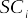

# ACKNOWLEDGEMENTS

In the first place, I would like to thank my friends and family for supporting me during the development of this research. In particular, I would like to thank Alessandra de Oliveira for motivating me to pursue a Ph.D. degree since I was a teenager. But also for allowing me to use her computer, which was “my” first computer. I also would like to thank Bianca Cartacci, for the unconditional support in the hardest days of these last years.

I would like to thank Red Hat, Inc. for allowing me to continue my academic research in concurrency with my professional life. I would also like to thank the pro- fessionals that motivated me to remain in the academy and supported this research, including Nelson Campaner, Steven Rostedt, Juri Lelli and Arnaldo Carvalho de Mello. In special, I would like to thank Clark Williams, not only for his effort in supporting my research at Red Hat but, mainly, for his adivises and personal support.

I would like to thank my Ph.D. colleagues from UFSC and Sant’Anna, in special Karila Palma Silva, Marco Pagani, Paolo Pazzaglia and Daniel Casini, all the members of the Retis Lab, and the administrave staff of the TeCIP institute at Sant’Anna and the PPGEAS at UFSC for the support in the cotutela agreement, in special for Enio Snoeijer.

Finally, and most importantly, I dedicate this work to my advisors. Thanks, Pro- fessor Tommaso Cucinotta and Professor Rômulo Silva de Oliveira for supporting me and guiding me in this journey, not only as an academic but as a human as well.

# RESUMO

Sistemas de tempo real são sistemas computacionais em que o comportamento cor- reto não depende apenas do comportamento lógico, mas também do comportamento temporal. Na teoria de sistemas de tempo real, um sistema é uma abstração, mode- lada usando um conjunto de variáveis que descrevem tão somente o comportamento temporal de seus componentes. O Linux é uma implementação de um sistema opera- cional (SO), que atualmente suporta algumas das abstrações fundamentais da teoria sistemas de tempo real. Apesar de todas as melhorias da última década, classificar o Linux como um SO de tempo real ainda é uma fonte de atrito entre as comunidades de desenvolvimento do Linux e da teoria de sistemas de tempo real. O principal mo- tivo para este conflito está na análise empírica feitas pelos desenvolvedores do Linux, visto que na teoria, espera-se que as propriedades de um sistema derivem de uma descrição matemática de seu comportamento. Geralmente, um conjunto rigoroso de provas se faz necessário antes de obter qualquer conclusão sobre a previsibilidade do comportamento de tempo de execução de um sistema de tempo real. A diferença entre o Linux de tempo real e a teoria de tempo real nasce na complexidade do ker- nel do Linux. Isto se dá pelo grande esforço necessário para se entender todas as restrições impostas às tarefas de tempo real no Linux. O desafio é então descrever essas operações, usando um nível de abstração que remova a complexidade inerente ao código do kernel. Esta descrição deve utilizar-se de formato formal que facilite o entendimento da dinâmica do Linux pelos pesquisadores, sem ficar muito longe da maneira como os desenvolvedores observam e melhoram o Linux. Portanto, para melhorar a análise e verificação do Linux de tempo real, esta tese apresenta um modelo formal de sincronização de threads para o kernel PREEMPT*RT do Linux. Esse mod- elo é construído com base na teoria de autômatos, usando uma abordagem modular que permite a criação de um modelo baseado em um conjunto de subsistemas in- dependentes e nas especificações que definem seu comportamento sincronizado. A tese também apresenta uma metodologia de modelagem, incluindo a estratégia de validação e ferramentas que comparam o modelo com a execução real do sistema. Esse modelo é usado como base para a criação de uma metodologia de verificação em tempo de execução para o kernel do Linux. O método de verificação em tempo de execução usa a geração automática de código do modelo para facilitar o desenvolvi- mento do sistema de monitoramento. Além disso, este método utiliza-se dos recursos de \_tracing* dinâmico do Linux para permitir a verificação _on-the-fly_ do sistema, com uma baixa sobrecarga do sistema. Por fim, a modelagem formal do comportamento do kernel é usada como uma etapa intermediária, facilitando o entendimento das regras e propriedades que regem o comportamento de temporização das tarefas do Linux. Por fim, um conjunto de especificações do modelo é utilizado como uma passo lógico na definição de um conjunto de regras e propriedades que definem o comportamento de tempo das tarefas do Linux. Essas propriedades são usadas na definição formal dos componentes e na composição da principal métrica usada pelos desenvolvedores do Linux de tempo real, a latência de escalonamento, no mesmo nível de abstração usado pelos pesquisadores de tempo real. Os valores para essas variáveis são então medidos e analisados por uma ferramenta proposta nesta tese.

**Palavras-chave**: Tempo real. Kernel do Linux. Métodos formais. Automatos. Verifi- cação.

# RESUMO EXPANDIDO

Sistemas de tempo real são sistemas de computacionais que a corretude não depende apenas do comportamento lógico, mas também do comportamento temporal. Em out- ras palavras, a resposta a uma solicitação está correta apenas se o resultado lógico estiver correto e produzido dentro de um tempo limite ou _deadline_. Caso contrário, o sistema apresentará uma falha ([BUTTAZZO](#_bookmark246), [2011](#_bookmark246)).

Na teoria de escalonamento de tempo real um sistema é uma abstração, modelada usando um conjunto de variáveis que descrevem tão somente o comportamento tem- poral de seus componentes. Por exemplo, geralmente um sistema é composto por um conjunto de _n_ tarefas _\tau_ = {*\tau*1, *\tau*2, ..., _\taun_}. Cada tarefa é definida com um conjunto de variáveis definidas pelo _modelo de tarefa_ do sistema. Por exemplo, no _modelo de tarefa esporádico_, cada tarefa _\taui_ é caracterizada por um tempo mínimo entre chegadas _Pi_ e um tempo de execução _Ci_ . Essas tarefas são escalonadas em um conjunto de _m_ processadores _\pho_ = {*\pho*1, *\pho*2, ..., _\phom_} e também podem compartilhar _q_ recursos _\sigmal_ = {*\sigmal*1, *\sigmal*2, ..., _\sigmalq_ } que requerem exclusão mútua. Nesse contexto, o principal objetivo do escalonador é atribuir, de alguma forma, o tempo dos processadores de _\pho_ e os recursos de _\sigmal_ às tarefas de _\tau_ a fim de concluir todas as ativações de todas as tarefas de _\tau_ cumprindo as restrições de tempo de cada tarefa. A demonstração de que um determinado algoritmo de escalonamento cumpre esse objetivo é feita por métodos analíticos conhecidos como _análise de escalonamento_.

_Linux como um sistema operacional de tempo real_

O Linux é uma implementação de um sistema operacional (SO) que atualmente su- porta algumas das abstrações fundamentais da teoria de escalonamento de tempo real. No Linux, do ponto de vista do escalonador, as tarefas são as _threads_. O objetivo dos escalonadores é atribuir o tempo dos processadores às _threads_ do sistema. Com o SCHED*DEADLINE ([LELLI et al.](#_bookmark294), [2016](#_bookmark294)), o Linux suporta o \_modelo de tarefa es- porádico*, permitindo a configuração do _tempo de execução_ e do _período_, equivalentes ao _Ci_ e _Pi_ , de uma determinada _thread_. Outra tecnologia importante que habilita o Linux para sistemas de tempo real é o PREEMPT*RT. Os desenvolvedores do PRE- EMPT_RT reformularam extensivamente o kernel do Linux para reduzir as seções de código que poderiam atrasar o escalonamento da \_thread* de mais alta prioridade, com o objetivo de transformar o Linux em um sistema operacional preemptivo, aproximando o comportamento Linux ao dos sistemas preemptivos teóricos. Essa característica permite o uso do Linux para uma ampla variedade de aplicações que requerem baixa latência na resposta a uma solicitação. De fato, o Linux de tempo real tem sido usado com sucesso em vários projetos acadêmicos e industriais, desde infra-estruturas dis- tribuídas e orientadas a serviços ([VARDHAN et al.](#_bookmark340), [2009](#_bookmark340)), robótica ([GUTIÉRREZ et al.](#_bookmark280), [2018](#_bookmark280)), redes de sensores ([DUBEY; KARSAI; ABDELWAHED](#_bookmark270), [2009](#_bookmark270)) e automação in- dustrial ([CUCINOTTA et al.](#_bookmark267), [2009](#_bookmark267)), até no controle de drones militares ([CONDLIFFE](#_bookmark259), [2014](#_bookmark259)) e sistemas de bolsas de valores ([CORBET, J.](#_bookmark260), [2010](#_bookmark260)).

Apesar de todas as melhorias da última década, classificar o Linux como um sistema operacional de tempo real ainda é uma fonte de conflito entre os desenvolvedores do Linux e a academia. Em resumo, existem dois pontos principais de divergência: a maneira como o Linux é analisado e as suposições usadas no desenvolvimento de novos algoritmos teóricos.

O uso frequente de suposições como _as tarefas são completamente independentes_ e _as operações são atômicas_ ([BRANDENBURG, B. B.; ANDERSON, J. H.](#_bookmark242), [2007](#_bookmark242); [CALAN-](#_bookmark247) [DRINO et al.](#_bookmark247), [2006](#_bookmark247)) são consideradas uma simplificação excessiva do comportamento de um sistema moderno pelos desenvolvedores do kernel do Linux ([GLEIXNER](#_bookmark279), [2010](#_bookmark279)). No Linux, as tarefas podem interferir entre si de uma maneira não negligenciável. Estas interferências causam atrasos, como por exemplo, o atraso que sofre a tarefa de mais alta prioridade em começar a sua execução. Esse atraso é conhecido como _atraso de escalonamento_ ou _latência de escalonamento_. Reduzir o atraso de escalonamento é a meta principal dos desenvolvedores do PREEMPT_RT. Os desenvolvedores do PREEMPT_RT medem este atraso usando o cyclictest. O cyclictest simula uma tarefa de mais alta prioridade e mede a diferença entre o tempo esperado para o início da sua execução e o tempo efetivo de início da execução, deste modo, medindo o atraso de escalonamento.

Apesar de ser útil, a forma com que o cyclictest mede o atraso de escalonamento é considerada uma simplificação excessiva do problema pela academia. Para a academia, as propriedades de um sistema de tempo real devem derivar de uma descrição matemática do seu comportamento. Além do mais, um conjunto rigoroso de provas é necessário para qualquer conclusão sobre a previsibilidade do comportamento de tempo de execução de um sistema.

A diferença entre o Linux de tempo real e a teoria de tempo real nasce na complexidade do kernel do Linux. O esforço necessário para entender todas as restrições impostas às tarefas de tempo real no Linux não é desprezível. Pode levar anos para um ini- ciante entender os aspectos internos do kernel do Linux. A complexidade é de fato uma barreira, não apenas para pesquisadores, mas também para desenvolvedores. O entendimento das primitivas de sincronização e como elas afetam o comportamento temporal das _threads_ é fundamental para a definição do Linux nos termos da teoría de sistemas de tempo real. O desafio então é descrever essas operações, usando um nível de abstração que remova a complexidade do código no kernel, sem perder em detalhes.

_Métodos formais, modelos formais e runtime verification_

Os métodos formais consistem em uma coleção de técnicas matemáticas utilizadas na especificação de um sistema. As especificações de um sistema podem ser usadas para vários propósitos. Por exemplo, para fornecer uma prova rigorosa de que o pro- grama implementado satisfaz algumas propriedades. A vantagem de usar a notação matemática é que ela remove a natureza ambígua da linguagem natural enquanto permite a verificação automática do sistema.

Apesar dos argumentos a favor do uso de métodos formais, a sua aplicação é geral- mente restrita a setores específicos. As razões mais comumente citadas para tal são a complexidade da notação matemática usada nas especificações e os requisitos de espaço em memória e tempo de processamento necessários para a verificação de um sistema usando métodos formais.

Um modelo é uma _abstração_ (um conjunto de equações matemáticas) de um sistema, enquanto um sistema é _algo real_, por exemplo, um amplificador, um carro, uma fábrica, um corpo humano, etc. O processo de modelagem de um sistema envolve a definição de um conjunto de variáveis mensuráveis associadas ao sistema em questão. Fre- qüentemente, o modelo apenas aproxima o comportamento completo do sistema. A _adequação_ é um aspecto crucial durante a definição do nível de abstração usado no modelo. A _adequação_ de um modelo determina com que eficácia ele representa o com- portamento subjacente do sistema ([O’REGAN](#_bookmark305), [2017](#_bookmark305)). Os termos sistema e modelo podem ser usados alternadamente quando um modelo _adequado_ é encontrado.

Portanto, representa um desafio para este trabalho definir um nível de abstração _ade- quado_ que, ao mesmo tempo, explique o comportamento em tempo de execução das tarefas de tempo real do Linux, evitando a conhecida limitação dos métodos formais.

Entre as técnicas disponíveis para a aplicação de métodos formais, foi escolhida a téc- nica de _runtime verification_ (RV) devido à natureza do tempo de execução do modelo proposto. _Runtime verification_ é um método leve, porém rigoroso, que complementa as técnicas de verificação exaustivas clássicas (como _model checking_ e _theorem proving_) com uma abordagem mais prática. Ao preço de uma cobertura de execução limitada, que analisa uma única execução _trace_ de um sistema, RV pode fornecer informações precisas sobre o comportamento em tempo de execução do sistema monitorado ([FAL-](#_bookmark274) [CONE et al.](#_bookmark274), [2018](#_bookmark274)).

## Objetivo

Com o objetivo de melhorar a análise e verificação do kernel Linux de tempo real, esta tese propõe a criação de um modelo formal para as tarefa do Linux, incluindo as primitivas de sincronização que influenciam seu comportamento temporal. Este modelo deve permitir a verificação formal do comportamento _lógico_ do sistema, bem como a análise formal do seu comportamento _temporal_.

## Contribuições

As contribuições desta tese para o estado da arte estão divididas em três etapas, descritas a seguir.

_Um modelo formal para as sincronização das threads do Linux de tempo real_

Esta etapa compreende o desenvolvimento de um modelo formal para as sincronização das _threads_ do Linux de tempo real, e inclui:

- a definição de uma metodologia de modelagem usando a teoria dos autômatos e a abordagem modular;
- o modelo de sincronização das _threads_ para o kernel PREEMPT_RT Linux;
- uma ferramenta de verificação de tempo de execução _offline_ que pode ser usada na validação de modelo e na verificação de tempo de execução do kernel.

_Um método eficiente para a verificação formal do kernel do Linux_

Esta etapa compreende o aperfeiçoamento da técnica de verificação, possibilitando a verificação do comportamento lógico do sistema eficientemente em tempo de execução, e inclui:

- o desenvolvimento de uma abordagem dinâmica de verificação em tempo de exe- cução para o kernel Linux, permitindo o monitoramento do sistema em produção;
- o desenvolvimento de uma ferramenta de geração automática de código do kernel a partir de um modelo de autômato;
- a análise de desempenho do método, demonstrando seu baixo impacto no de- sempenho do sistema.

_Análise temporal do comportamento do kernel do Linux_

A última etapa utiliza o modelo proposto anteriormente para extrair um conjunto de regras e propriedades que definem o comportamento de temporal do atraso de escalon- amento. As principais contribuições desta etapa são:

- a definição de um conjunto de regras e propriedades sobre a dinâmica básica de sincronização do kernel Linux, necessária para a definição formal do atraso de escalonamento;
- a definição formal do conjunto de variáveis e da equação que define o atraso de escalonamento da tarefa de mais alta prioridade;
- uma ferramenta eficiente utilizada na medição e análise do atraso de escalona- mento.

## Considerações finais

O desenvolvimento de um modelo abstrato usando métodos formais foi uma resposta natural para desvendar a complexidade do Linux de uma maneira determinística. A simplicidade do formato dos autômatos e a flexibilidade da abordagem modular foram a combinação perfeita para conectar essas três áreas complexas: o kernel do Linux, a teoria dos sistemas em tempo real e os métodos formais. Com relação ao compor- tamento _lógico_, o formalismo dos autômatos tornou possível a verificação com baixo _overhead_. Com relação ao comportamento _temporal_, a definição formal do conjunto de variáveis e da equação que define o atraso de escalonamento da tarefa de mais alta prioridade permitiu a análise do Linux usando um método aceito pela comunidade acadêmica, algo que era fonte de atrito por mais de uma década ([BRANDENBUG;](#_bookmark241) [ANDERSON](#_bookmark241), [2009](#_bookmark241)). É importante observar que esse problema permaneceu aberto não por causa de uma _rivalidade_, mas por causa da complexidade de traduzir o com- portamento do kernel para o formalismo de escalonamento de tempo real.

# ABSTRACT

Real-time systems are computing systems where the correct behavior does not depend only on the functional behavior, but also on the timing behavior. In the real-time schedul- ing theory, a system is an abstraction, modeled using a set of variables that describe the sole timing behavior of its components. Linux is an implementation of an [operating](#_bookmark17) [system (OS)](#_bookmark17), that nowadays supports some of the fundamental abstractions from the real-time scheduling theory. Despite all improvements of the last decade, classifying Linux as a [real-time operating system (RTOS)](#_bookmark22) is still a source of conflict between real- time Linux and scheduling communities. The central reasons for this conflict lie in the empirical analysis of the timing properties of Linux made by practitioners, as it is ex- pected that the properties of a real-time system derive from a mathematical description of the behavior of the system. Generally, a rigorous set of proofs is required for any con- clusion about the predictability of the runtime behavior of a real-time system. The gap between the real-time Linux and real-time theory roots in the Linux kernel complexity. The amount of effort required to understand all the constraints imposed on real-time tasks on Linux is not negligible. The challenge is then to describe such operations, using a level of abstraction that removes the complexity due to the in-kernel code. The description must use a formal format that facilitates the understanding of Linux dynam- ics for real-time researchers, without being too far from the way developers observe and improve Linux. Hence, to improve the real-time Linux runtime analysis and verification, this thesis presents a formal thread synchronization model for the PREEMPT*RT Linux kernel. This model is built upon the automata formalism, using a modular approach that enables the creation of a model based on a set of independent sub-systems and the specifications that define their synchronized behavior. The thesis also presents a viable modeling methodology, including the validation strategy and tooling that compares the model against the real execution of the system. This model is then used as the base for the creation of a runtime verification of the method for the Linux kernel. The runtime verification method uses automatic code generation from the model to facilitate the development of the monitoring system. Moreover, it uses the dynamic tracing features of Linux to enable \_on-the-fly* verification of the system, at a low overhead. Finally, the formal modeling of the kernel behavior is used as an intermediary step, facilitating the understanding of the rules and properties that rule the timing behavior of Linux tasks. These properties are then used in the formal definition of the components and compo- sition of the main metric used by the real-time Linux developers, the scheduling latency, in the same level of abstraction used by real-time researchers. The values for these variables are then measured and analyzed by a tool proposed in this thesis.

**Keywords**: Real-time Systems. Linux kernel. Formal methods. Automata. Runtime Verification.

# LIST OF FIGURES

> [Figure 1 – Thesis approach and contributions](#_bookmark41) 27
> [Figure 2 – Response-time analysis abstractions in a timeline](#_bookmark50) 32
> [Figure 3 – ftrace output.](#_bookmark64) 40
> [Figure 4 – Trace timeflow output example](#_bookmark72) 43
> [Figure 5 – Non-maskable interruption timeline](#_bookmark74) 44
> [Figure 6 – Maskable interruption timeline](#_bookmark75) 44
> [Figure 7 – Real-time thread.](#_bookmark77) 45
> [Figure 8 – Forms of thread interference](#_bookmark78) 46
> [Figure 9 – Forms of thread blocking.](#_bookmark79) 46
> [Figure 10 – System and Model.](#_bookmark83) 49
> [Figure 11 – Example of automaton.](#_bookmark86) 53
> [Figure 12 – Example of Petri net.](#_bookmark86) 53
> [Figure 13 – Monolithic generator _G_ of the washer and dryer machine](#_bookmark93) 58
> [Figure 14 – Monolithic specification model _S_ of the washer and dryer machine](#_bookmark94) 59
> [Figure 15 – _S_/_G_ of the washer and dryer machine](#_bookmark94) 59
> [Figure 16 – Generator: _Gdoor_](#_bookmark95) 59
> [Figure 17 – Generator: _Gwash_](#_bookmark95) 59
> [Figure 18 – Generator: _Gdry_](#_bookmark95) 59
> [Figure 19 – Specification: *S*1](#_bookmark96) 60
> [Figure 20 – Specification: *S*2](#_bookmark96) 60
> [Figure 21 – Specification: *S*3](#_bookmark96) 60
> [Figure 22 – Specification: *S*4](#_bookmark96) 60
> [Figure 23 – Modular generator _G_ of the washer and dryer machine](#_bookmark97) 60
> [Figure 24 – Modular specification _S_ of the washer and dryer machine](#_bookmark98) 61
> [Figure 25 – Modular model _S_/_G_ of the washer and dryer machine](#_bookmark98) 61
> [Figure 26 – Modeling approach.](#_bookmark115) 76
> [Figure 27 – Examples of generators: _G05_ need resched (left) and _G04_ Scheduling context (right).](#_bookmark122) 80
> [Figure 28 – Examples of generators: _G01_ sleepable and runnable](#_bookmark123) 80
> [Figure 29 – Sets of sequences of event.](#_bookmark125) 81
> [Figure 30 – perf task_model report dynamic.](#_bookmark126) 82
> [Figure 31 – perf_tool definition inside the task_model structure](#_bookmark128) 83
> [Figure 32 – task*model and \_perf_tool* initialization.](#_bookmark129) 83
> [Figure 33 – perf thread_model: Events to callback mapping.](#_bookmark131) 84
> [Figure 34 – Handler for the irq_vectors:nmi_entry tracepoint](#_bookmark132) 84
> [Figure 35 – _process_event_ : trying to run the automata.](#_bookmark133) 85
> [Figure 36 – Example of the perf thread_model output: a thread activation.](#_bookmark134) 85
> [Figure 37 – Kernel trace excerpt.](#_bookmark135) 86
> [Figure 38 – _S18_ Scheduler call sufficient and necessary conditions](#_bookmark139) 87
> [Figure 39 – Missing kernel events: the output of perf thread_model.](#_bookmark142) 89
> [Figure 40 – Missing kernel events: the output of kernel tracepoints](#_bookmark143) 89
> [Figure 41 – Pseudo-code of tracing recurrence](#_bookmark144) 89
> [Figure 42 – Trace excerpt with comments of where the IRQ context is identifiedin the trace](#_bookmark145) 90
> [Figure 43 – mutex_lock not permitted with interrupts disabled.](#_bookmark146) 90
> [Figure 44 – _S12_ Events blocked in the IRQ context.](#_bookmark148) 91
> [Figure 45 – _S22_ Lock while interruptible](#_bookmark149) 91
> [Figure 46 – Trace of mutex_lock taken in the timer interrupt handler](#_bookmark150) 91
> [Figure 47 – Function stack, from the timer IRQ to the mutex_lock, used in the](#_bookmark151) [report for the Linux kernel developers](#_bookmark151) 92
> [Figure 48 – Verification approach.](#_bookmark154) 95
> [Figure 49 – Wake-up In Preemptive (_WIP_) Model.](#_bookmark155) 95
> [Figure 50 – Auto-generated code from the automaton in Figure](#_bookmark159) [49.](#_bookmark155) 96
> [Figure 51 – Helper functions to get the next state](#_bookmark160) 97
> [Figure 52 – Sleeping While in Atomic (_SWA_) model.](#_bookmark161) 98
> [Figure 53 – Example of output from the proposed verification module, as occurring when a problem is found.](#_bookmark162) 98
> [Figure 54 – Phoronix Stress-NG Benchmark Results: _as-is_ is the system without](#_bookmark163) [tracing nor verification; _SWA_ is the system while verifying _Sleeping_](#_bookmark163) [_While in Atomic_ automata in Figure](#_bookmark163) [56](#_bookmark169) [and with the code in Figure](#_bookmark163) [50;](#_bookmark159) [and the _trace_ is the system while tracing the same events usedin the _SWA_ verification.](#_bookmark163) 99
> [Figure 55 – Need re-sched forces scheduling (_NRS_ model).](#_bookmark167) 101
> [Figure 56 – Latency evaluation, using the _SWA_ model (top) and the _NRS_ model](#_bookmark169) [(bottom).](#_bookmark169) 102
> [Figure 57 – NMI generator (O1).](#_bookmark172) 105
> [Figure 58 – IRQ disabled by software (O2).](#_bookmark174) 106
> [Figure 59 – IRQs disabled by hardware (O3).](#_bookmark174) 106
> [Figure 60 – Context switch generator (04).](#_bookmark174) 106
> [Figure 61 – Context switch generator (05).](#_bookmark174) 106
> [Figure 62 – Preempt disable (06).](#_bookmark174) 106
> [Figure 63 – Scheduling context (07).](#_bookmark174) 106
> [Figure 64 – Thread runnable/sleepable (08).](#_bookmark174) 106
> [Figure 65 – Need re-schedule operation (09).](#_bookmark174) 106
> [Figure 66 – NMI blocks all other operations (R2).](#_bookmark176) 108
> [Figure 67 – Operations blocked in the IRQ context (R3).](#_bookmark176) 108
> [Figure 68 – IRQ disabled by thread or IRQs (R4).](#_bookmark177) 108
> [Figure 69 – The scheduler is called with interrupts enabled (R5).](#_bookmark178) 108
> [Figure 70 – The scheduler is called with preemption disabled to call the scheduler [(R6).](#_bookmark178) 108
> [Figure 71 – The scheduler context does not enable the preemption (R7).](#_bookmark179) 109
> [Figure 72 – The context switch occurs with interrupts and preempt disabled (R8).](#_bookmark179) 109 > [Figure 73 – The context switch occurs in the scheduling context (R9).](#_bookmark180) 109
> [Figure 74 – Wakeup and need resched requires IRQs and preemption disabled (R10 and R11).](#_bookmark180) 109
> [Figure 75 – Disabling preemption to schedule always causes a call to the scheduler (R12).](#_bookmark181) 109
> [Figure 76 – Scheduling always causes context switch (R13).](#_bookmark181) 109
> [Figure 77 – Setting need resched always causes a context switch (R14).](#_bookmark182) 111
> [Figure 78 – Reference Timeline](#_bookmark182) 111
> [Figure 79 – rt_sched_latency: tool kit components](#_bookmark205) 119
> [Figure 80 – perf rtsl output: excerpt from the textual output (time in nanosec-](#_bookmark207) [onds).](#_bookmark207) 122
> [Figure 81 – Using perf and the _latency parser_ to find the cause of a large *D*POID value](#_bookmark207) 122
> [Figure 82 – Workstation experiments: single-core system.](#_bookmark210) 124
> [Figure 83 – Workstation and Server experiments: multicore systems](#_bookmark211) 124

**LIST OF TABLES**

> [Table 1 – Mapping between mechanisms of the Linux kernel and abstractions of the response-time analysis](#_bookmark67) 41
> [Table 2 – Linux events used in the parallel with the response-time analysis](#_bookmark70) 42
> [Table 3 – Events of the washer and dryer machine](#_bookmark92) 58
> [Table 4 – Interrupt related events](#_bookmark116) 77
> [Table 5 – Scheduling related events](#_bookmark117) 77
> [Table 6 – Locking related events](#_bookmark118) 78
> [Table 7 – Automata models](#_bookmark121) 79
> [Table 8 – Events and state transitions of Figure](#_bookmark140) [37.](#_bookmark135) 88
> [Table 9 – Parameters used to bound *L*IF](#_bookmark191) 115

# LIST OF ABBREVIATIONS AND ACRONYMS

> API application programming interface
> APIC advanced programmable interrupt controller CCS calculus communicating systems
> CFS completely fair scheduler
> CI continuous integration
> CPU central processing unit
> CSP communicating sequential processes
> DES discrete event system
> EDF earliest deadline first
> GPOS general-purpose operating system
> INTs interrupts
> IRQ maskable interrupt
> IRQs maskable interrupts
> LDV Linux driver verification
> LKMM Linux kernel memory consistency model NMI nonmaskable interrupt
> OS operating system
> OSes operating systems
> PID process identification number
> RT real-time
> RTA response-time analysis
> RTOS real-time operating system
> RV runtime verification
> SAT boolean satisfiability
> SDV static driver verifier
> SLIC specification language for interface checking SMP symmetric multiprocessing
> WCET worst-case execution time

# CONTENTS

```
    1.  [INTRODUCTION](#introduction) 21
        1.  [LINUX AS A REAL-TIME OPERATING SYSTEM](#_bookmark30) 22
        2.  [FORMAL METHODS](#_bookmark31) 23
            1.  [Formal models](#formal-models) 24
            2.  [Runtime verification](#runtime-verification) 25
        3.  [GOALS OF THIS THESIS](#_bookmark35) 25
            1.  [A formal model for Linux tasks](#a-formal-model-for-linux-tasks) 25
            2.  [Runtime verification of the logical behavior of Linux](#runtime-verification-of-the-logical-behavior-of-linux) 26
            3.  [Runtime analysis of the timing behavior of Linux](#runtime-analysis-of-the-timing-behavior-of-linux) 26
        4.  [CONTRIBUTIONS OF THIS THESIS](#_bookmark39) 26
            1.  [First stage: modeling the timing behavior of tasks on real-time Linux](#first-stage-modeling-the-timing-behavior-of-tasks-on-real-time-linux) 26
            2.  [Second stage: efficient runtime verification for the Linux kernel](#second-stage-efficient-runtime-verification-for-the-linux-kernel) 27
            3.  [Third stage: formal definition of the latency components](#third-stage-formal-definition-of-the-latency-components) 28
        5.  [ORGANIZATION OF THIS THESIS](#_bookmark44) 28
    2.  [BACKGROUND](#background) 29

        1.  [REAL-TIME SYSTEMS](#_bookmark46) 29

            1.  [Real-time scheduling theory](#real-time-scheduling-theory)
                29

            2.  [Response-time analysis](#response-time-analysis) 31

        2.  [LINUX](#_bookmark51) 32

            1.  [Linux as a real-time operating
                system](#linux-as-a-real-time-operating-system) 33

            2.  [Task abstraction and context
                synchronization](#task-abstraction-and-context-synchronization)
                35

            3.  [Mutual exclusion](#mutual-exclusion) 36

                1.  [Spinlock](#_bookmark57) 36

                2.  [Read-write spinlocks](#_bookmark58) 37

                3.  [Semaphores](#_bookmark59) 38

                4.  [Read-write semaphores](#_bookmark60) 38

                5.  [Mutex](#_bookmark61) 39

                6.  [RT mutex](#_bookmark62) 39

                7.  [Spinlocks and RT mutex in the PREEMPT RT](#_bookmark63)
                    39

            4.  [Linux tracing](#linux-tracing) 40

            5.  [Characterization of real-time Linux tasks
                timeline](#characterization-of-real-time-linux-tasks-timeline)
                41

                1.  [Kernel mechanisms and the response time
                    analysis](#_bookmark69) 41

                2.  [Trace-timeflow: empircal observation of the
                    system](#_bookmark71) 42

                3.  [Characterization of interrupt handlers
                    timeline](#_bookmark73) 43

                4.  [Characterization of the threads timeline](#_bookmark76)
                    45

                5.  [Final remarks](#_bookmark80) 47

        3.  [FORMAL METHODS](#_bookmark81) 47

            1.  [Models](#models) 48

            2.  [Discrete event systems](#discrete-event-systems) 51

                1.  [Language definition](#_bookmark85) 51

                2.  [DES modeling formalism](#_bookmark87) 53

            3.  [Automata theory](#automata-theory) 54

                1.  [Operations with automata](#_bookmark90) 56

                2.  [Modeling approaches](#_bookmark91) 57

            4.  [Runtime verification](#runtime-verification-1) 61

        4.  [FINAL REMARKS](#_bookmark100) 62

    3.  [RELATED WORK](#related-work) 64

        1.  [FORMAL METHODS FOR OS KERNELS](#_bookmark102) 64

            1.  [Formal methods in the Linux kernel
                community](#formal-methods-in-the-linux-kernel-community) 67

        2.  [AUTOMATA-BASED REAL-TIME SYSTEMS ANALYSIS](#_bookmark105) 68

            1.  [Automata-based models for
                Linux](#automata-based-models-for-linux) 69

        3.  [REAL-TIME LINUX LATENCY](#_bookmark108) 71

        4.  [FINAL REMARKS](#_bookmark109) 72

    4.  [A THREAD SYNCHRONIZATION MODEL FOR THE
        PREEMPT_RT](#a-thread-synchronization-model-for-the-preempt_rt-kernel)
        [KERNEL](#a-thread-synchronization-model-for-the-preempt_rt-kernel)
        74

        1.  [MODELING APPROACH](#_bookmark113) 75

        2.  [EVENTS](#_bookmark114) 75

        3.  [MODELING](#_bookmark119) 78

            1.  [Automate or not to automate the model
                creation?](#automate-or-not-to-automate-the-model-creation)
                80

        4.  [MODEL VALIDATION](#_bookmark127) 82

        5.  [OFFLINE RUNTIME VERIFICATION](#_bookmark136) 86

            1.  [Scheduling in vain](#scheduling-in-vain) 86

            2.  [Tracing dropping events](#tracing-dropping-events) 88

            3.  [Using a real-time mutex in an interrupt
                handler](#using-a-real-time-mutex-in-an-interrupt-handler)
                90

        6.  [FINAL REMARKS](#_bookmark152) 92

    5.  [ONLINE RUNTIME VERIFICATION](#online-runtime-verification) 94

        1.  [EFFICIENT FORMAL VERIFICATION FOR THE LINUX
            KERNEL](#_bookmark156) 95

        2.  [PERFORMANCE EVALUATION](#_bookmark164) 99

            1.  [Throughput evaluation](#throughput-evaluation) 100

            2.  [Latency evaluation](#latency-evaluation) 100

        3.  [FINAL REMARKS](#_bookmark168) 101

    6.  [LATENCY ANALYSIS](#latency-analysis) 103

        1.  [SYSTEM MODEL](#_bookmark171) 104

            1.  [Basic Operations](#basic-operations) 105

            2.  [Rules](#rules) 107

        2.  [DEMYSTIFYING THE REAL-TIME LINUX SCHEDULING
            LATENCY](#_bookmark183) 112

            1.  [Problem statement](#problem-statement) 112

            2.  [Bounding *L*IF](#_bookmark190) 113

        3.  [RT_SCHED_LATENCY: EFFICIENT SCHEDULING LATENCY
            ESTI-](#_bookmark206) [MATION TOOL KIT](#_bookmark206) 119

        4.  [EXPERIMENTAL ANALYSIS](#_bookmark208) 122

        5.  [FINAL REMARKS](#_bookmark212) 125

    7.  [FINAL REMARKS](#final-remarks-2) 126

        1.  [THE FUTURE OF THE MODEL](#_bookmark215) 127

        2.  [FUTURE WORK](#_bookmark216) 128

        3.  [LIST OF PUBLICATIONS](#_bookmark218) 129

            1.  [Other publications](#other-publications) 129

        4.  [INTERACTIONS WITH THE LINUX KERNEL DEVELOPMENT
            COM-](#_bookmark220) [MUNITY](#_bookmark220) 130

        5.  [ACKNOWLEDGMENT](#_bookmark221) 131

    [REFERENCES](#_bookmark222) 132

```

# INTRODUCTION

Real-time systems are computing systems where the correct behavior does not depend only on the functional behavior, but also on the timing behavior. In other words, the response to a request is only correct if the logical result is correct and produced within a _deadline_. Otherwise, the system will be showing a defect ([BUTTAZZO](#_bookmark246), [2011](#_bookmark246)).

In the real-time scheduling theory, a system is an abstraction, modeled using a set of variables that describe the sole timing behavior of its components . For example, usually a system is composed by a set of _n_ tasks _\tau_ = {*\tau*1, *\tau*2, ..., _\taun_}. Each task is defined as a set of variables defined by the _task model_ of the system. For instance, in _sporadic task model_, each task _\taui_ is characterized by a minimum time between arrivals _Pi_ and an execution time _Ci_ . These tasks are scheduled on a set of _m_ processors _\pho_ = {*\pho*1, *\pho*2, ..., _\phom_} and they may share _q_ resources _\sigmal_ = {*\sigmal*1, *\sigmal*2, ..., _\sigmalq_ } which require mutual exclusion. In this context, the main goal of the scheduling is to somehow assign the time of processors from _\pho_ and resources from _\sigmal_ to tasks from _\tau_ in order to finish all jobs of all tasks from _\tau_ while meeting the timing constraints of each task. The demonstration that a given scheduling algorithm can achieve such a goal is done through analytical methods known as _schedulability analysis_.

Linux is an implementation of an [OS](#_bookmark17) that nowadays supports some of the fundamental abstractions from the real-time scheduling theory. In Linux, from the scheduling point of view, the most basic unit is the thread. It is then the goal of the schedulers to assign the time from the processors to the threads of the system. With SCHED*DEADLINE ([LELLI et al.](#_bookmark294), [2016](#_bookmark294)), Linux supports the classical \_sporadic task model*, allowing the configuration of the _runtime_ and _period_, equivalent to the _Ci_ and _Pi_ , of a given thread. Another key technology enabling Linux for real-time systems is the PREEMPT*RT. The PREEMPT_RT developers have extensively reworked the Linux kernel to reduce the code sections that could delay the scheduling of the highest- priority thread, aiming to transform Linux into a \_preemptive* operating system, trying to approximate Linux to the theoretical _preemptive_ system. This characteristic allows the usage of Linux for a wide range of workloads that require low latency in the response for a request. Indeed, real-time Linux has been successfully used throughout a number of academic and industrial projects as a fundamental building block of real-time sys- tems, from distributed and service-oriented infrastructures for multimedia ([VARDHAN](#_bookmark340) [et al.](#_bookmark340), [2009](#_bookmark340)), robotics ([GUTIÉRREZ et al.](#_bookmark280), [2018](#_bookmark280)), sensor networks ([DUBEY; KAR-](#_bookmark270) [SAI; ABDELWAHED](#_bookmark270), [2009](#_bookmark270)) and factory automation ([CUCINOTTA et al.](#_bookmark267), [2009](#_bookmark267)), to the control of military drones ([CONDLIFFE](#_bookmark259), [2014](#_bookmark259)) and distributed high-frequency trading systems ([CORBET, J.](#_bookmark260), [2010](#_bookmark260)).

1.  LINUX AS A REAL-TIME OPERATING SYSTEM

Despite all improvements of the last decade, classifying Linux as a [RTOS](#_bookmark22) is still a source of conflict between real-time Linux and scheduling communities. In summary, there are two central sources of divergence: the way that Linux is analyzed, and the assumptions used in the development of new theoretical real-time algorithms.

From the real-time Linux community, the frequent use of assumptions like _tasks are completely independent_, and _operations are atomic_ ([BRANDENBURG, B. B.; AN-](#_bookmark242) [DERSON, J. H.](#_bookmark242), [2007](#_bookmark242); [CALANDRINO et al.](#_bookmark247), [2006](#_bookmark247)) are considered an oversimplification of Linux behavior by kernel developers ([GLEIXNER](#_bookmark279), [2010](#_bookmark279)).

On Linux, tasks can interfere with each other in a non-negligible way, both _ex- plicitly_, due to programmed interactions and synchronizations, and _implicitly_, due to in-kernel operations that may cause synchronizations among tasks that are not even directly related. Those in-kernel operations are necessary because of the non-atomic nature of a sophisticated [OS](#_bookmark17) like Linux. For example, the arrival of the highest priority thread will not atomically load its context in the processor, starting to run instantaneously. Instead, to notify the activation of a thread, the system needs to postpone the execution of the scheduler to avoid inconsistency in the data structures that define the thread and are used by the scheduling algorithms. Moreover, interrupts must be disabled to avoid race conditions with interrupt handlers. Hence, delays in scheduling and interrupt handling are created during the activation of a thread ([OLIVEIRA; OLIVEIRA](#_bookmark319), [2016](#_bookmark319)). Only after the end of the activation process of a thread is that the system will be able to call the scheduling functions, that will eventually allow the thread to start running. This delay is known as the _scheduling latency_, and it drives the development of the PREEMPT_RT. The PREEMPT_RT developers measure it by using the cyclictest tool.

The cyclictest tool works by creating a thread that periodically sets an external timer in the future, and suspends its execution waiting for this timer occurrence. When the timer awakens the thread, the thread computes the time difference between the expected activation time and the actual time. By creating one thread per CPU, config- ured as the highest priority, cyclictest is used in practice to measure the _scheduling latency_ of each CPU of the system. Maximum observed latency values generally range from a few microseconds on single-CPU systems to 250 us on non-uniform memory access systems, which are acceptable values for a vast range of applications with sub-millisecond timing precision requirements.

Despite useful, the _scheduling latency_, as measured by cyclictest, is consid- ered an oversimplification of the problem by the academy. An interesting discussion about this metric, from the real-time scheduling theory standing point, is presented in ([BRANDENBUG; ANDERSON](#_bookmark241), [2009](#_bookmark241)). In that work, the authors argue that the dual notion of correctness of real-time systems, the _logical_ and _timing_ correctness, is formally addressed in the academy. The properties of a real-time system must derive from a mathematical description of the behavior of the system, and a rigorous set of proofs are required for any conclusion about the predictability of the runtime behavior of a sys- tem. It is clear that cyclictest results do not provide such a level of certainty, justifying the argument that there are still further steps to be taken toward a better acceptance of Linux as a [RTOS](#_bookmark22).

The gap between the real-time Linux and real-time theory roots in the Linux ker- nel complexity. The amount of effort required to understand all the constraints imposed on real-time tasks on Linux is not negligible. It might take years for a newcomer to understand the internals of the Linux kernel. The complexity is indeed a barrier, not only for researchers but for developers as well. The understanding of the synchronization primitives and how they affect the timing behavior of a thread is fundamental for the definition of Linux in terms of real-time scheduling.

The challenge is then to describe such operations, using a level of abstraction that removes the complexity of the in-kernel code. The description must use a format that facilitates the understanding of Linux dynamics for real-time researchers, without being too far from the way developers observe and improve Linux. The usage of math- ematical notation can remove the ambiguous nature of natural language, enabling the application of a more sophisticated analysis of the runtime behavior of Linux. To improve the state-of-art, we believe that a mathematical model, based on well-defined criteria that describe, in a deterministic way, the Linux behavior is required, which leads this research to the application of another area from the computer science: formal methods.

1.  FORMAL METHODS

Formal methods consist of a collection of mathematical techniques to rigorously state the
specification of a system. The specifications of a system can then be used for multiple purposes. For example, to provide a rigorous proof that the implemented program satisfies some properties. The advantage of using mathematical notation is that it removes the ambiguous nature of natural language while enabling automatic verification of the system.

Despite the arguments in favor of formal methods, its application is generally restricted to specific sectors. The most commonly mentioned reasons for that are the complexity of the mathematical notation used in the specifications and the limitations of computational space and processing time required for the verification of a system using formal methods. Regarding performance, a common problem faced by practitioners in the usage of formal methods is the _state explosion_ problem. As exemplified in ([CLARKE;](#_bookmark256)

[EMERSON; SIFAKIS](#_bookmark256), [2009](#_bookmark256)), the composition of a model of a system with _n_ tasks, with each task with _m_ states, will result in a model with _mn_ states. Moreover, it is also necessary to consider the level of expressiveness of the specification notation.

Generally, a more concise notation is likely to be more efficient than feature-rich notation. Regarding the complexity, it is a challenge for this work to find a formal specification notation that, at the same time, can be easily interpreted by kernel developers, useful to demonstrate the timing behavior of tasks, and able to verify the Linux kernel behavior appropriately.

## Formal models

A model is an _abstraction_ (a set of mathematical equations) of a system, whereas a system is _something real_, e.g., an amplifier, a car, a factory, a human body, and so on. The process of modeling a system involves defining a set of measurable variables associated with the given system. Often, the model only approximates the complete behavior of the system. The _adequacy_ is a crucial aspect during the definition of the level of abstraction used in the model. The _adequacy_ of a model determines how effectively it represents the underlying behavior of the system ([O’REGAN](#_bookmark305), [2017](#_bookmark305)). The terms system and model can be interchangeably used when an _adequate_ model is found.

It is then a challenge for this work to define an _adequate_ level of abstraction that, at the same time, explains the runtime behavior of real-time tasks of Linux while avoiding the well-known limitation of formal methods.

Regarding the level of abstractions, the developers of Linux observe and debug the timing properties of Linux using the tracing features present in the kernel ([ROSTEDT](#_bookmark331), [S.](#_bookmark331), [2011](#_bookmark331); [SPEAR; LEVY; DESNOYERS](#_bookmark336), [2012](#_bookmark336); [TOUPIN](#_bookmark339), [2011](#_bookmark339); [BRANDENBURG, Bjorn](#_bookmark244)

[B.; ANDERSON, James H.](#_bookmark244), [2007](#_bookmark244)). They interpret a chain of events, trying to identify the states that cause large _scheduling latencies_ delays, and then try to change kernel algorithms to avoid such delays. For instance, they use ftrace ([ROSTEDT, Steven [2010](#_bookmark333)) or perf[1](#_bookmark33) to trace kernel events like interrupt handling, wakeup of a new thread, context switch, etc., while cyclictest runs.

The notion of _events_, _traces_ and _states_ used by developers are common to [dis-](#_bookmark8) [crete event system (DES)](#_bookmark8). The admissible sequences of events that a DES can produce or process can be formally modeled through a _language_, using the automata formal- ism. One of the key features of the automata formalism is its directed graph or state transition diagram representation. This graphical representation hides the complexity of the language and was very welcome by the Linux kernel community during discussions about the development of this thesis. Moreover, the automata are amenable to compo- sition operations, allowing a modular development of the model. The modular approach allows the model development based on a set of subsystems and the specifications that synchronizes these subsystems. Moreover, it enables a set of analyses as well, considering the finite-state case, including [runtime verification (RV)](#_bookmark23).

## Runtime verification

Among the techniques available to the application of formal methods, [RV](#_bookmark23) was chosen because of the runtime nature of the proposed model. [RV](#_bookmark23) presents a lightweight, yet rigorous, method that complements classical exhaustive verification techniques (such as model checking and theorem proving) with a more practical approach. At the price of a limited execution coverage, that analyses a single execution _trace_ of a system, [RV](#_bookmark23) can give precise information on the runtime behavior of the monitored system ([FALCONE et al.](#_bookmark274), [2018](#_bookmark274)).

In this context, a monitor is a program that can parse both the formal specification and the trace of the system, connecting them. The monitor then verifies the runtime behavior of the system by comparing the trace of its execution against the formal specification, reporting an error in the case of a model violation.

Monitors can be classified as _offline_ and _online_ monitors. _Offline_ monitors pro- cess the traces generated by a system after the occurrence of the events, generally by reading the trace execution from a permanent storage system. _Online_ monitors process the trace during the execution of the system.

1.  GOALS OF THIS THESIS

Aiming to improve the runtime analysis and verification of the real-time Linux kernel, this thesis proposes the creation of a formal model of the Linux task, including the synchronization primitives that influence their timing behavior. This model should enable the formal verification of the _logical_ behavior of the system, as well as the formal analysis of its _timing_ behavior.

This primary goal is divided into sub-goals, presented as follows.

## A formal model for Linux tasks

This thesis proposes the creation of a formal model of the Linux task, including the synchronization primitives that influence their timing behavior. A fundamental step in the development of a model is the precise definition of its purpose. Thus, the purpose of creating an explicit model of the Linux tasks are:

- to promote the unambiguous understanding of the system from its formal specifi- cations;
- to enable the validation of the specifications against the real execution of the system: a fundamental step to strengthen the trustworthy and accuracy of the model;
- to formally verify the runtime behavior of the system.

Given the foreseeing complexity of such a model, a modeling methodology should be carefully defined, in such a way to avoid the well-known limitations of the practical application of formal methods. The methodology should also comprise the development of an automatic model validation tool.

## Runtime verification of the logical behavior of Linux

Giving that the model aims to formalize the runtime behavior of tasks of Linux, a practical formal verification method should be developed employing [RV](#_bookmark23) techniques. To be practical, the verification method should be able to connect the _model_ and the _trace_ without requiring extensive manual development of the monitoring tool, maximizing the automatic code generation from the model. The monitor should also be able to generate output that helps the developers to debug the conditions that caused the undesired behavior of the system. It is known that the trace of the system impacts the timing behavior of the system, so to be practical, the verification software should also be efficient. By efficient, it means that the monitoring tool must minimize the overhead, not only to viable values but in such a way to avoid impacting the timing aspects of the system as much as possible.

## Runtime analysis of the timing behavior of Linux

As the last goal, the formal modeling of the kernel behavior is used as an in- termediary step, facilitating the understanding of the rules and properties that rule the timing behavior of Linux tasks. To demonstrate the effectiveness of the goal, part of the Linux behavior should be explained with a level of formalism and granularity similar to the practices in the real-time scheduling theory. To be effective, the explanation should result in a set of practical variables that could be measured and serve as the base for improving the real-time features of Linux. Finally, tools to measure the value for these variables must be developed, also taking into consideration the efficiency of the approach in such a way to avoid impacting the timing aspects of the system as much as possible.

1.  CONTRIBUTIONS OF THIS THESIS

The original contributions of this thesis can be organized in three stages, as presented in Figure [1](#_bookmark41). The major contributions of each stage are detailed in the next sections.

## First stage: modeling the timing behavior of tasks on real-time Linux

This stage focused on the creation of the _thread synchronization model for the PREEMPT_RT Linux kernel_, and the main contributions are:

Figure 1 – Thesis approach and contributions.

- the definition of a formal modeling methodology using the automata theory and the modular approach;
- the thread synchronization model for the PREEMPT_RT Linux kernel;
- an _offline_ runtime verification tool that can be used both in the model validation and the runtime verification of the kernel.

1.  ## Second stage: efficient runtime verification for the Linux kernel

This stage focused on the development of an _efficient runtime verification for the Linux kernel_, based on the modeling formalism presented in the previous stage.

The main contributions of this phase are:

- the development of a dynamic online runtime verification approach for the Linux kernel, enabling the monitoring of the system _on-the-fly_ ;
- the development of an automatic kernel code generation from an automaton model;
- the performance analysis of the method, demonstrating its low impact on the performance of the system.

1.  ## Third stage: formal definition of the latency components

The last stage leverages the thread model to extract a set of rules and properties that defines the timing behavior of _scheduling latency_. The main contributions of this phase are:

- the definition of a set of rules and properties about the basic synchronization dynamics of the Linux kernel, necessary for the formal definition of the latency;

- the definition of a set of variables and the subsequent \*scheduling latency\* analysis;

- an efficient _scheduling latency_ measurement tool.

1.  ORGANIZATION OF > THIS THESIS

The next chapter presents the background topics, covering from essential el- ements from the real-time theory to the runtime verification methods, passing by an explanation about real-time Linux and its synchronization methods, formal methods, and formal models. A set of related work is then presented in Chapter [3](#related-work).

The development of the thesis is presented in Chapters [4](#a-thread-synchronization-model-for-the-preempt_rt-kernel), [5](#online-runtime-verification) and [6](#latency-analysis), where the development of the _thread synchronization model for the PREEMPT_RT Linux kernel_, the _efficient runtime verification for the Linux kernel_ and the formal definition of the _scheduling latency_ are, respectively, described in details.

Finally, the conclusions, set of publications, and future work are presented in Chapter [7](#final-remarks-2).

# BACKGROUND

This chapter presents the background information useful for a more comprehensive understanding of the concepts exposed in this thesis. It is divided into three main sections. The first section covers useful definitions from the classical real-time systems theory. The second section describes Linux as a real-time operating system, from basic definitions of tasks and the mutual exclusion mechanism to tracing features present in the kernel, and an early tentative of framing Linux in the existing real-time research literature. The third section presents the fundamentals of formal methods, the modeling of [DES](#_bookmark8) using the automata theory, and runtime verification. Finally, Section [2.4](#_bookmark100) presents the final remarks, summarizing the background while pointing to the directions that will be followed in the next chapters.

1.  REAL-TIME SYSTEMS

Real-time systems are computing systems where the correct behavior does not depend only on the functional behavior, but also on the timing behavior. In other words, the response to a request is only correct if the logical result is correct and produced within a given _deadline_. Otherwise, the system will be showing a defect ([BUTTAZZO](#_bookmark246), [2011](#_bookmark246)). Real-time systems can be classified according to the effect of a timing defect. _Critical_ or _hard real-time systems_ are those systems for which a timing defect may result in catastrophic consequences. For instance, a failure in the hard real-time braking system of a car can potentially cause loss of lives. In contrast, _non- critical_ or _soft real-time systems_ are those systems in which temporal requirements describe the desired behavior. Still, if not met, they do not invalidate the results nor have catastrophic consequences, although the application’s utility is reduced ([LIU](#_bookmark297), [2000](#_bookmark297)).

## Real-time scheduling theory

In real-time systems, the most basic scheduling unit is the _task_. A task is a computation that must be sequentially executed by a processor. When a task becomes ready to run, it is _dispatched_, and so it becomes _active_. Any time a task is activated, it is said that a new _job_ of the task was dispatched. A job can be either _running_ when the scheduling algorithm selects it to run or _ready_ to run when it is ready to run but not running. Jobs ready but still waiting to run are maintained in the _ready queue_. Generally, the *i*th task of a system is denoted by _\taui_ .

Real-time tasks are also characterized by the activation pattern of their jobs.

_Periodic_ tasks are those in which jobs are dispatched at a constant rate, with each activation taking place after a fixed period of time. _Sporadic_ tasks are those in which a new job arrives after, at least, a minimum time after the arrival of the previous job of the same task, i.e., they are characterized by a pre-specified minimum inter-arrival time among consecutive jobs. Those tasks that do not have a regular activation pattern are said to be _aperiodic_ tasks.

Tasks are also characterized by their _deadline_. A task has _implicit deadline_ if its deadline is equal to its activation period or minimum inter-arrival time. A task has _constrained deadline_ if its deadline is less than or equal to the activation period or minimum inter-arrival time of the task. Otherwise, the deadline is said to be _arbitrary_.

Individually, each real-time task _\taui_ has a set of timing values that specifies its behavior according to the previous patterns. For example:

- **Period** _Pi_ : the activation pattern of task _\taui_ ;
- **Relative deadline** _Di_ : the relative deadline (the specification) of task _\taui_ ;
- **Computation time** _Ci_ : the computation time of the task _\taui_ , without interruptions.

The _Ci_ value often represents the [worst-case execution time (WCET)](#_bookmark28) of a task. After activated, some runtime parameters of the *m*th job the task _\taui_ are also used to describe its execution. For instance:

- **Arrival time** _ai_,_m_: is the time instant when a job becomes ready for execution;
- **Release time** _ri_,_m_: is the time instant when a job is queued in the ready queue;
- **Absolute deadline** _di_,_m_ = _ai_,_m_ + _Di_ : is the time instant when the job should already have finished its activation, i.e., it is the runtime parameter of a task;
- **Starting time** _si_,_m_: is the time instant when a job starts is execution;
- **Finishing time** _fi_,_m_: is the instant when a job finishes its execution;
- **Response time** _Ri_,_m_: is the difference between the finishing time and the arrival time: _Ri_,_m_ = _fi_,_m_ – _ai_,_m_. When the number of tasks is higher than the number of processors, [central](#_bookmark6) [processing unit (CPU)](#_bookmark6) time needs to be shared among concurrent tasks. Tasks are selected to run on processors according to a _scheduling policy_. The set of rules that define which task runs on which [CPU](#_bookmark6) at a given time is called _scheduling algorithm_.

In the real-time scheduling theory a system is modeled as a set of _n_ tasks _\tau_ = {*\tau*1, *\tau*2, ..., _\taun_}. These tasks are scheduled on a set of _m_ processors _\pho_ = {*\pho*1, *\pho*2, ..., _\phom_} and they may share _q_ resources _\sigmal_ = {*\sigmal*1, *\sigmal*2, ..., _\sigmalq_ } which require mutual exclusion. In this context, the main goal of the scheduler is to somehow assign the time of processors from _\pho_ and resources from _\sigmal_ to tasks from _\tau_ in order to finish all jobs of all tasks from _\tau_ while meeting the timing constraints of each task.

A schedule is said to be _feasible_ when all tasks are able to accomplish their jobs while respecting all constraints. A task set is said to be _schedulable_ if there is at least one algorithm that can produce a _feasible schedule_.

If during the execution, a ready task is interrupted to give place to another task, the running job is said to be _preempted_. The _preempted job_ is placed in the ready queue, while another job becomes the running one. When it is possible to preempt a job at any point, the scheduler is said to be _preemptive_. In contrast, when the scheduler cannot interrupt at an arbitrary point, the scheduler is said to be _non-preemptive_ or _cooperative_. The switch between one job and another is named _context switch_.

## Response-time analysis

In order to guarantee timing correctness while executing real-time tasks, one has to know whether a given set of tasks will complete within their respective deadlines. There are several analytic methods to obtain this guarantee, depending on the execution model of the system. As shown later in Chapter [6](#latency-analysis), part of the Linux behavior can be seen as a real-time system that schedules tasks using a fixed-priority scheduler, together with several mutual exclusion protocols. For a theoretical system with this characteristic, it is possible to verify the schedulability using the method of [response-time analysis](#_bookmark21) [(RTA)](#_bookmark21) ([JOSEPH; PANDYA](#_bookmark283), [1986](#_bookmark283); [LEHOCZKY; SHA; DING](#_bookmark292), [1989](#_bookmark292); [AUDSLEY et al.](#_bookmark231), [1993](#_bookmark231)).

The [RTA](#_bookmark21) considers that a system is composed of a set of _n sporadic_ tasks _\tau_ , which in turn are described by a set of algebraic variables related to their timing behavior. In addition to the period _Pi_ , the relative deadline _Di_ , and the worst-case execution time _Ci_ , the [RTA](#_bookmark21) also considers the _release jitter_ and the _blocking time_ of a task, where:

- **Release Jitter** _Ji_ : is the delay at the beginning of the execution of a task _i_;
- **Blocking time** _Bi_ : is the worst-case blocking time, which is a delay caused by a lower priority task, generally because the lower priority task holds some resources required by the task _i_. Based on these variables, the [RTA](#_bookmark21) is used to define the value of _Ii_ and _Wi_ ,

where:

- **Interference** _Ii_ : is the interference caused by higher priority;
- **Busy window** _Wi_ : is the busy-window.

The interference _Ii_ of a task _\taui_ is the sum of the computation time of tasks in the set _hp_(_i_) that were activated during the busy period of task _i_, where _hp_(_i_) is the set of tasks with priorities higher than _\taui_ . Formally:

> ===

The busy period _Wi_ of a task _\taui_ corresponds to the sum of its computational time, blocking time, and interference. It is given by Equation [2](#_bookmark49).

> ===

It is essential to notice that _Wi_ appears on both sides of the equation, due to its use in the definition of the interference. This dependence implies the use of an iterative method to determine _Wi_ . In this case, the initial value of _Wi_ is the worst-case execution time _Ci_ , and Equation [2](#_bookmark49) is used interactively _x_ times, until _Wx_ +1 = _Wx_ or _Wx_ +1 &gt; _Di_ .

After obtaining _Wi_ , it is used to determine the response time _Ri_ , that equals to its busy period _Wi_ added to its release jitter _Ji_ :

> _Ri_ = _Wi_ + _Ji_ (3)

A system is said to be schedulable if, for every task _\taui_ , the maximum response time _Ri_ is less than or equal to its deadline _Di_ .

A common way to represent the behavior of a real-time task is using a _time- line_ format. Figure [2](#_bookmark50) shows how each abstraction used in the response-time analysis composes the response time of a real-time task.

> Figure 2 – Response-time analysis abstractions in a timeline.
> 

1.  LINUX

Linux is a full-featured general-purpose [OS](#_bookmark17), that has been adapted and improved over the last decade to be used as a [RTOS](#_bookmark22), becoming a viable option as a [RTOS](#_bookmark22) for many relevant workloads. This section shortly presents the background for real-time Linux, along with a description of the tracing subsystem, that is frequently used in the analysis of the timing behavior of the kernel.

## Linux as a real-time operating system

Real-time Linux has been a recurring topic in both research ([CALANDRINO et](#_bookmark247) [al.](#_bookmark247), [2006](#_bookmark247); [PALOPOLI et al.](#_bookmark321), [2009](#_bookmark321); [BRANDENBURG; GÜL](#_bookmark243), [2016](#_bookmark243)) and industry ([DUBEY;](#_bookmark270) [KARSAI; ABDELWAHED](#_bookmark270), [2009](#_bookmark270); [GUTIÉRREZ et al.](#_bookmark280), [2018](#_bookmark280); [CUCINOTTA et al.](#_bookmark267), [2009](#_bookmark267);

[CORBET, J.](#_bookmark260), [2010](#_bookmark260)), for more than a decade now. From the different initiatives for en- abling real-time Linux, such as RTAI ([MANTEGAZZA et al.](#_bookmark300), [2000](#_bookmark300)) and Xenomai ([GERUM](#_bookmark278), [2004](#_bookmark278); [BROWN; MARTIN](#_bookmark245), [2010](#_bookmark245)), the PREEMPT*RT became the \_de facto* standard. The difference between the other approaches and the PREEMPT_RT is that, rather than trying to run a real-time [OS](#_bookmark17) in parallel with Linux, the PREEMPT_RT aims to transform the Linux kernel into a [RTOS](#_bookmark22).

Linux has three preemption models for kernel space activities. The preemption models range from the _non-preemptive_ mode, in which the kernel code schedules only on predefined preemption points, to the _preemptive_ mode, in which the kernel code is preemptive by default, unless when the preemption is explicitly disabled. It is worth noting that the user-space code is always preemptive, independently of the preemption model.

In addition to the preemption models present in the vanilla kernel[1](#_bookmark53), The PREEMPT*RT patchset adds the \_fully-preemptive* model, which improves the _preemptive_ mode. Regarding the _fully-preemptive_ mode, Linux developers have extensively re- worked the Linux kernel to reduce the code sections that could delay the scheduling of the highest-priority thread. While PREEMPT_RT improves the responsiveness, it reduces the throughput of the system, and that justifies the maintenance of the multiple preemption modes on Linux.

The cyclictest is the primary tool adopted in the evaluation of the _fully-preem- ptive mode_ of PREEMPT*RT Linux ([CERQUEIRA; BRANDENBURG](#_bookmark251), [2013](#_bookmark251)), and it is used to compute the time difference between an expected activation time and the actual start of execution of the high-priority thread running on a [CPU](#_bookmark6). By configuring the mea- surement thread with the highest priority and running a background task set to generate disturbance, cyclictest is used in practice to measure the \_scheduling latency* of each CPU of the system. Maximum observed latency values generally range from a few mi- croseconds on single-CPU systems to 250 us on non-uniform memory access systems, which are acceptable values for a vast range of applications with sub-millisecond tim- ing precision requirements. In this way, PREEMPT_RT Linux closely fulfills theoretical 1 Vanilla kernel is the Linux kernel as-is from its main repository.

fully-preemptive systems assumptions that consider atomic scheduling operations, with neglectable overheads.

In the _fully-preemptive mode_, there are three different execution contexts: [non-](#_bookmark15) [maskable interrupt (NMI)](#_bookmark15), [maskable interrupts (IRQs)](#_bookmark13), and threads. Both the [NMI](#_bookmark15) and the [IRQs](#_bookmark13) are asynchronous [interrupts (INTs)](#_bookmark11), i.e., mechanisms used to deliver events coming either from external hardware or by code running on other CPUs via inter- processor interrupts. The interrupt controller manages interrupts, both queueing and dispatching one [NMI](#_bookmark15) per-CPU and multiple [IRQs](#_bookmark13). For each CPU, the [NMI](#_bookmark15) is the highest- priority interrupt, so it postpones and preempts [IRQs](#_bookmark13). As a design choice, Linux (in the _fully-preemptive mode_) handles [IRQs](#_bookmark13) with [IRQs](#_bookmark13) disabled. Hence an [maskable interrupt](#_bookmark12) [(IRQ)](#_bookmark12) cannot preempt another [IRQ](#_bookmark12). Threads have no control over the [NMI](#_bookmark15), but they can delay the execution of [IRQs](#_bookmark13) by temporarily disabling (masking) them. Note that when [IRQs](#_bookmark13) are masked, their occurrence is anyway stored in the interrupt controller. When [IRQs](#_bookmark13) are enabled again, the kernel is notified about the occurrence of such interrupts, and they are executed as soon as possible, possibly preempting the currently executing thread. Given the potential interference on threads execution, one of the design goals of the PREEMPT_RT was to reduce the code that executes in the interrupt context to the bare minimum, by moving most of it to thread context ([OLIVEIRA; OLIVEIRA](#_bookmark319), [2016](#_bookmark319)).

Despite the existence of different memory contexts in which a regular program can run, like user programs in the kernel-space, e.g., during a system call, kernel threads, or the process context in the user-space, from the scheduling viewpoint, they are all threads. Linux has not one but five schedulers, which are provided to fit the re- quirements of the manifold different applicative scenarios in which Linux is used. When invoked, the set of schedulers are queried in a fixed order. The following schedulers are checked:

- STOP_MACHINE: a pseudo-scheduler used to execute kernel facilities;
- SCHED_DEADLINE ([LELLI et al.](#_bookmark294), [2016](#_bookmark294)): An [earliest deadline first (EDF)](#_bookmark9) like real-time scheduler;
- SCHED_FIFO and SCHED_RR: the fixed-priority real-time scheduler;
- SCHED_OTHER: the [completely fair scheduler (CFS)](#_bookmark4);
- IDLE: a pseudo-scheduler that runs the _idle thread_.

Since schedulers are queried in order, the querying order implements the first level of priority among the threads handled by each scheduler. Every time the scheduling- related code is executed by the kernel, the highest-priority thread is selected for a context switch. When no ready threads are available, the IDLE scheduler returns the _idle thread_, a particular thread always ready to run. For simplicity, we refer hereafter with the term _scheduler_ when mentioning the kernel code handling all the scheduling operations related to all five schedulers. The scheduler is called either voluntarily by a thread leaving the processor, or involuntarily, to cause a preemption. Any thread currently executing can postpone the execution of the scheduler while running in the kernel context by either disabling preemption or the [IRQs](#_bookmark13).

## Task abstraction and context synchronization

As mentioned in the previous section, there are three main contexts in which code can run in the PREEMPT_RT. Two of them are [INTs](#_bookmark11): The [NMI](#_bookmark15), the [IRQ](#_bookmark12), and the other one is the thread context.

Interrupts are events that indicate that a condition exists somewhere in the sys- tem, the processor, or within the currently executing thread that requires the attention of a processor. An interrupt occurrence results in a forced transfer of execution from the currently running thread to the interrupt handler. The interrupt handling scheduling is managed by the interrupt controller, provided by hardware[2](#_bookmark55). For instance, in the Intel processors, the prioritization of IRQs is done in the local [advanced programmable](#_bookmark2) [interrupt controller (APIC)](#_bookmark2) of each CPU.

A thread can postpone the execution of an IRQ by temporarily disabling (or mask- ing) the IRQs in a given processor. Linux API provides two main methods to disable IRQs. The first is through the functions local_irq_disable() and local_irq_enable(). The second is through the functions local_irq_save() and local_irq_restore(), these functions (actually macros) save the processor flags only to be restored lately, which allows nesting calls to disable/enable interrupts ([LOVE](#_bookmark298), [2010](#_bookmark298)). The processor can also temporarily disable IRQs without OS intervention. Indeed, the processor tem- porarily disables all the maskable interrupts before dispatching an interrupt handler. In the PREEMPT_RT case, the interrupt handler continues executing with the interrupts disabled until the end return of the handler. Although the IRQ handlers context exists in the PREEMPT_RT, for most of them, their function is no longer to deal with the hardware but to wake up the kernel threads that execute the code of interrupt handlers. For the sake of completeness, it is worth mentioning that IRQs and threads cannot postpone an NMI execution.

Linux processes are composed of a memory context and a set of one or more threads. Generally, a thread runs in the process memory context in user-space. How- ever, when a thread makes a _system call_ or causes an _trap_, for example, with a _page fault_, it changes its execution context from user-space to kernel-space, executing the kernel code in kernel-space on behalf of the process ([CORBET; RUBINI; KROAH-](#_bookmark264) [HARTMAN](#_bookmark264), [2005](#_bookmark264)). There is also the particular case of threads that only run in kernel- space, the so-called kernel threads, or kthreads.

2 See Intel*◯*R 64 and IA-32 Architectures Software Developer’s Manual.

Threads are activated by events that change their state in the scheduler, from _sleeping_ to _ready to execute_. Ideally, when a lower priority thread awakens a higher priority thread, the scheduler should be called and promptly start the execution of the thread with higher priority. However, when preemption or interrupts are disabled, the lower priority thread runs until preemption or IRQ is enabled again, and the scheduler can decide to run a thread with higher priority. Differently from interrupts, Linux is responsible for scheduling threads. The scheduling decisions and the context switch takes place inside the schedule() function. The schedule() function consults all the schedulers, as described previously, and changes the context to the next selected thread as needed.

The preemption of a processor can be disabled via the _preempt_disable()_ func- tion, and then enabled again with the function _preempt_enable()_. For each call of _pre- empt_disable()_ there should be a call to _preempt_enable()_. These calls can be nested, the number of nesting can be retrieved with the function _preempt_count()_ ([CORBET; RU-](#_bookmark264) [BINI; KROAH-HARTMAN](#_bookmark264), [2005](#_bookmark264)). The function _preempt_enable()_, when called, checks whether the preemption counter is 0, that is, whether the preemption system will be active again. When enabling preemption, if a higher priority task may be ready to run, the scheduling routine will be called.

## Mutual exclusion

The Linux kernel has several mechanisms for mutual exclusion. There are two reasons for these different mechanisms. The first comes from the needs of the diverse execution contexts, which have different constraints. For instance, in interrupt context, the code cannot use methods that put the interrupt handler to sleep, while a thread can sleep, allowing other threads to execute while the blocked task waits for the resource. In addition to the restrictions imposed by the execution contexts, the methods of mutual exclusion are optimized for some instances, some to improve performance, others seeking determinism.

The next sections introduce the principal mutual exclusion primitives available in the Linux kernel, presenting the motivation for their usages and the behavior change in the PREEMPT_RT kernel. It is worth mentioning that this section does not aim to present an in-depth explanation of all synchronization methods but to introduce the terminology and some aspects that are later covered in the thesis.

1.  Spinlock

In a section protected by a spinlock, only one task is allowed access to a specific critical region. The behavior of a spinlock depends on whether the kernel is configured for single-core or multicore systems. In either case, the preemption is disabled before attempting to acquire a lock and is enabled after the release of the lock. In the single- core case, this action is already enough to protect the critical section.

In the multicore case, when a task tries to acquire a spinlock that is not held by any other task, the lock is acquired. Otherwise, the task needs to busy-wait for the resource to be released by a task running on another CPU. Although busy-waiting consumes CPU time in vain, it avoids a more complex control, involving changing the task from _ready_ to _sleeping_, calling the scheduler routines, causing context switch to another thread, and so on. Thus, the busy-waiting kernel spinlock is beneficial in the case of small critical sections. An important detail is that, before attempting to acquire a spinlock, the current task disables the preemption of the processor, enabling it again only after releasing the lock.

The spin_lock() and spin_unlock() are the main functions for acquiring and releasing a spinlock. The [application programming interface (API)](#_bookmark1) of the spinlocks also implements versions that disable interrupts. Such functions are necessary to prevent deadlocks. For instance: if a thread acquires a spinlock, then an interrupt arrives and tries to acquire the same spinlock, a deadlock will happen because the thread will be waiting for the return of the interrupt handler, never releasing the spinlock. The spinlock is used mainly in parts of the kernel where a task can not sleep, such as interrupt handlers and non-preemptive sections. In the kernel with PREEMPT_RT, spinlocks are mostly converted to [real-time (RT)](#_bookmark20) mutexes. The reason for this change is described in Section [2.2.3.7](#_bookmark63).

1.  Read-write spinlocks

In some cases, critical sections are accessed multiple times for data reads, but fewer times for an update. To improve the throughput, exclusive access to these data is required only when writing the data, while allowing concurrent accesses to read the data. In this case, there is contention only when a task waits to write, or tasks wait for a data being written.To acquire the read-write lock for reading one uses functions read_lock() and read_unlock() For writing it uses functions write_lock() and write_unlock().

The vanilla kernel uses spinlocks to protect the write access. Thus the read-write spinlocks disable preemption. The read-write spinlocks also have versions that disable interrupts and softirqs. It is not possible to upgrade the read_lock() to a write_lock(), as this causes a deadlock.

An important detail is that the readers always take precedence over the writers. While there is a reader in the critical section, the writer can not run. Since readers can get the lock concurrently, even if a writer is waiting for the lock, new readers may acquire the lock and thus postpone indefinitely the acquiring of the lock by the writer.

In the kernel with PREEMPT_RT, control access to critical sections is made with the RT mutex, avoiding disabling the IRQs and preemption.

1.  Semaphores

Unlike spinlocks, semaphores do not use busy-waiting. When a task tries to acquire an unavailable semaphore, the task is placed on a waiting list, its status changes to sleeping, and the task leaves the processor. When the semaphore becomes available, tasks in the queue are awakened accordingly with the lock acquired, continuing its execution. As the kernel has some restrictions on where a piece of code can sleep, semaphores can not be used in the context of interrupts.

Semaphores accept various tasks in its critical section. A counter, created at the initialization time, controls the access to a critical section. To implement mutual exclusion using a semaphore, one should initialize the semaphore with a counter equals to one. Two basic functions can be used to acquire a semaphore: down() and down_interruptible(). The difference between the two modes is the way that the task is put to sleep: state interruptible or uninterruptible.

If a thread in the interruptible state receives a signal, it awakens immediately and the signal delivered to the task. On the other hand, a task in state uninterrupt- ible is not waked up, thus delivering the signal is delayed until the task is awake and acquires the semaphore. Of these two, it is more common to use the so-called down_interruptible(). Function up() releases the semaphore.

When compared with spinlocks, semaphores have an advantage: semaphores do not disable preemption throughout the critical section. However, semaphores cause higher overhead because they put the task to sleep and wake it up after some time. In cases of small critical sections, this overhead can be higher than the critical section itself, so it is advised only for large critical sections.

Another side effect is that by making the task to sleep, a high-priority task can suffer unlimited priority inversion.

1.  Read-write semaphores

Semaphores also have a read-write version. Read-write semaphores do not have counters. The rule is the same as read-write spinlocks: a writer requires mutual exclusion, but several concurrent readers are possible. The precedence of the readers over the writers is the same as with the read-write spinlocks. Hence, writers can be blocked indefinitely.

The function to acquire the semaphore for reading is down_read(). For writ- ing it is used the function down_write(). With read-write semaphores it is possible to downgrade the state writer to the state reader. This is done with the function downgrade_write().

In the kernel with PREEMPT RT, control access to critical sections is made with the RT mutex, and the read-write logic is disabled: all read-write spinlocks end up converted to regular RT mutex.

1.  Mutex

The mutex option was implemented as a simple mutual exclusion to put tasks on contention to sleep, mainly to replace semaphores initialized with a count of one. Despite having a behavior similar to a semaphore with a count of one, the mutex has a simpler interface, better performance, and more use restrictions, which facilitates system debugging ([LOVE](#_bookmark298), [2010](#_bookmark298)).

To acquire a mutex, it is used the function mutex_lock(). If the mutex is not avail- able, the task is put to sleep. To release a mutex, the function used is mutex_unlock(). In comparison with spinlocks, mutexes have the same benefits and problems of count- ing semaphores initialized to one.

1.  RT mutex

The RT mutexes extend the semantics of mutexes with the priority inheritance protocol. In an RT mutex, when a low-priority task holds an RT mutex, and this RT mutex is blocking a task of higher priority, the low-priority task inherits the higher-priority task priority. If the task that inherited the priority blocks on another RT mutex, this propagates the priority to another task until the task that holds the RT mutex releases the mutex that blocked the highest-priority task. This approach helps to reduce the blocking time of high-priority tasks, avoiding unbounded priority inversion.

1.  Spinlocks and RT mutex

In the PREEMPT RT, spinlocks and mutexes are converted to RT mutexes. Spin- locks are converted to RT spinlocks, using the RT mutex to implement mutual exclusion. This is possible because in the PREEMPT*RT many sections of the kernel, which were initially in interrupt context, were converted to threads running in the address space of the kernel, so the spinlocks used in these sections can be converted to RT mutex. In parts of the kernel that it can not sleep even with the PREEMPT_RT, the original spinlocks are used, with the prefix raw*, for example, raw_spin_lock().

A major benefit of transforming spinlocks in RT mutexes comes from the fact that the RT mutexes do not disable preemption, reducing the latency. In fact, the use of RT mutexes instead of spinlocks and the execution of device interrupt handlers and softirqs in the context of threads are the two major causes for the decrease of latency in PREEMPT_RT, when compared to the vanilla kernel.

Figure 3 – ftrace output.

## Linux tracing

Linux has an advanced set of tracing methods, which are mainly applied in the runtime analysis of kernel latencies and performance issues[3](#_bookmark66). The most popular tracing methods are the function tracer that enables the trace of kernel functions ([ROSTEDT](#_bookmark333), [Steven](#_bookmark333), [2010](#_bookmark333)), and the tracepoint that enables the tracing of hundreds of events in the system, like the _wakeup_ of a new thread or the occurrence of an interrupt. But there are many other methods, like kprobes that enable the creation of dynamic tracepoints in arbitrary places in the kernel code, and composed arrangements like using the function tracer and tracepoints to examine the code path from the time a task is woken up to when it is scheduled.

An essential characteristic of the Linux tracing feature is its efficiency. Nowadays, almost all Linux based [operating systems (OSes)](#_bookmark18) have these tracing methods enabled and ready to be used in production kernels. Indeed, these methods have nearly zero overhead when disabled, thanks to the extensive usage of runtime code modification techniques that allow for greater efficiency than using conditional jumps when trac- ing is disabled. For instance, when the function tracer is disabled, a no-operation assembly instruction is placed right at the beginning of all traceable functions. When the function tracer is enabled, the no-operation instruction is overwritten with an instruction that calls a function that will _trace_ the execution, for instance by appending information into an in-kernel trace buffer. This is done at runtime, without any need for a reboot. A tracepoint works similarly, but using a jump label ([CORBET, Jonathan](#_bookmark263), [2010](#_bookmark263)). The mentioned tracing methods are implemented in such a way that it is possible to specify how an event will be handled dynamically, at runtime. For example, when en- abling a tracepoint, the function responsible for handling the event is specified through a proper in-kernel [API](#_bookmark1).

Currently, there are two main interfaces by which these features can be ac- cessed from user-space: perf and ftrace. Both tools can hook to the trace methods, processing the events in many different ways. The most common action is to record the occurrence of events into a trace-buffer for post-processing or human interpretation of the events. Figure [3](#_bookmark64) shows the output of the ftrace tracing functions and tracepoints. The recording of events is optimized by the usage of _per-CPU_ lock-less trace buffers. Furthermore, it is possible to take actions based on events. For example, it is possible 3 See _Linux Tracing Technologies_: [https://www](http://www.kernel.org/doc/html/latest/trace/index.html).ker[nel.org/doc/html/latest/trace/index.html.](http://www.kernel.org/doc/html/latest/trace/index.html)

Table 1 – Mapping between mechanisms of the Linux kernel and abstractions of the response-time analysis.

These tracing methods can also be leveraged for other purposes. Similarly to perf and ftrace, other tools can also hook a function to a tracing method, non- necessarily, to provide a trace of the system execution to the user-space. For example, the Live Patching feature of Linux uses the function tracer to hook and deviate the execution of a problematic function to a revised version of the function that fixes a problem ([POIMBOEUF](#_bookmark323), [2014](#_bookmark323)).

## Characterization of real-time Linux tasks timeline

In ([OLIVEIRA; OLIVEIRA](#_bookmark319), [2016](#_bookmark319)), the authors described the timeline of the tasks in the PREEMPT_RT kernel, using the abstractions of the response-time analysis. The description of the timeline was aided by empirical information obtained by tracing the kernel with a custom-developed tool, based on ftrace. The next sections present a summary of this research that serves at the same time background and related work. The limitations and the lessons learned are presented at the end of the section, motivating for the development presented in this thesis.

1.  Kernel mechanisms and

This Section presents the mapping of the Linux kernel synchronization mecha- nisms to the abstractions used in the response time analysis. This mapping is described in Table [1](#_bookmark67). The three execution contexts of Linux, i.e., NMI, IRQs, and threads, were mapped into the _task_ abstraction. The preemption and interrupt control, that can de- lay the start of the execution of the _task_ context, were mapped into the release _jitter abstaction_. Finally, all the mutual exclusion methods were mapped into the _blocking_ abstraction.

Table 2 – Linux events used in the parallel with the response-time analysis.

_Scheduling overhead_

An important concept in [RTOS](#_bookmark22) design is the overhead imposed by the scheduler. The scheduling overhead is associated with selecting the next task to be scheduled and the context switching overhead. A Limitation of the classic response-time analysis model is the absence of scheduling overhead that resembles Linux behavior. Moreover, many theoretical studies, often the scheduling overhead, are considered negligible or considered part of the task’s execution time of the task ([SOUTO et al.](#_bookmark335), [2015](#_bookmark335)) ([BLOCK;](#_bookmark239) [ANDERSON](#_bookmark239), [2006](#_bookmark239)). However, many empirical studies consider the measurements of scheduling overhead. These overheads are measured primarily to determine an upper bound, or to compare different implementations of schedulers ([KENNA et al.](#_bookmark285), [2011](#_bookmark285)) ([BASTONI; BRANDENBURG; ANDERSON](#_bookmark236), [2010](#_bookmark236)). To demonstrate the impact of the scheduler overhead in the execution of threads, the work presented in ([OLIVEIRA;](#_bookmark319) [OLIVEIRA](#_bookmark319), [2016](#_bookmark319)) also considers the schedule() execution in the timeline description.

1.  Trace-timeflow: empircal observation of the system

The ftrace tool ([ROSTEDT, Steven](#_bookmark333), [2010](#_bookmark333)) was adapted to trace the occurrence of interesting events in Linux. The adapted trace tool was called trace timeflow. The trace timeflow traces the events listed on Table [2](#_bookmark70). Sich events served to observe the execution of the three different kinds of tasks and the actions that could impact their timing behavior. For instance, the IRQ Handlers entry and exit report the _starting time_ and the _finishing time_ of a job of a given IRQ.

By tracing the execution of threads and interrupt handlers using the trace timeflow, it was possible to characterize the execution of these tasks using the real-time scheduling theory abstractions. An example of the trace timeflow output is shown in

Figure [4](#_bookmark72). In this example, the thread pi, with [process identification number (PID)](#_bookmark19) 838, was running in the [CPU](#_bookmark6) 0, when it caused a _read_ system call in Line 5 and 6. The task then called the function \_raw_spin_lock() to acquire a spinlock in Line 8. Then the preemption is disabled, and the lock mr_lock is acquired without contention, returning to the thread execution in 989 nanoseconds (Lines from 9 to 12). The thread then calls the function \_raw_spin_unlock(), releases the lock, and enables the preemption, in Lines from 13 to 16. Finally, the thread finishes its execution returning from the system call.

Figure 4 – Trace timeflow output example.

1.  Characterization of interrupt handlers timeline
    Due to the different restrictions imposed on maskable and non-maskable inter- rupts, it was necessary to characterize the interrupts for these two different modes.

A non-maskable interrupt can be enabled at any time, and therefore must obey a set of very strict rules. For example, a non-maskable interrupt handler can not use mutual exclusion mechanisms, except when it is used only in this context, for synchro- nization with other NMIs running on another CPU. The code of NMI handlers can not be reentrant, i.e., a second NMI will not be handled during the execution of an NMI.

From these restrictions and the trace of interrupts, it is possible to character- ize the execution of NMIs as in Figure [5](#_bookmark74), where the major quantities of interest, as introduced in Section [2.1](#_bookmark46) are visually highlighted.

For NMIs, the response time _Ri_ is given by the delay between the IRQ activation and the return of the NMI handler. The release jitter _Ji_ will occur if the system is already handling a non-maskable interrupt. In this case, it is safe to assume the worst case:

that the second NMI was activated right after the first NMI was activated.

> Figure 5 – Non-maskable interruption timeline.
> 

The busy window _Wi_ is defined as the time that the NMI held the CPU during its execution, being determined by the time interval between the call and the return of the IRQ handler. The blocking represented by variable _Bi_ must be implemented as busy waiting, which should occur only for synchronization between non-maskable interrupts in different processors. Finally, the runtime _Ci_ is determined by the busy window, discounting the time that the NMI may have been blocked by another NMI.

The characterization of the maskable interrupt handlers is shown in Figure [6](#_bookmark75).

> Figure 6 – Maskable interruption timeline.
> 

For maskable interrupts, the response time _Ri_ is determined by the time interval between the activation and the return of the interrupt handler. The release jitter _Ji_ can happen if the system has interrupts disabled, either by an action of the operating system or by the action of the processor itself, e.g., if it is already handling an interrupt. In this case, it is safe to assume that in the worst-case activation took place immediately after the disabling of interrupts.

Unlike non-maskable interrupts, maskable interrupts can suffer interference _Ii_ , caused by a non-maskable interrupt. The busy window _Wi_ is defined as the time that the interruption held the CPU during its execution, being determined by the time interval from start to finish of the interrupt handler. Blocking _Bi_ is always implemented as busy waiting. Lastly, the runtime _Ci_ is determined by the busy window discounting blocking and interference from other interrupt handlers.

1.  Characterization of the threads timeline

The characterization of real-time threads is more complex than that of the inter- rupt handlers. Therefore, it was made in parts. The first part considers activation without blocking and interference. The second one identifies the different forms of blocking and interference, showing how they can affect the timing behavior of real-time threads. Figure [7](#_bookmark77) describes the execution of a real-time thread without interference or blocking.

> Figure 7 – Real-time thread.
>  >  > 

For threads, the response time _Ri_ is the time between the thread activation by the event sched*wakeup, and the context switch when the thread leaves the processor, suspending its execution in state S. The busy window \_Wi* is the time interval between the first context switch after the activation of the task and the context switch in which the task leaves the processor to sleep, finishing its execution. The release jitter _Ji_ can be associated with two reasons: preemption or interrupts being disabled by process of lower priority, and by a scheduler execution that removes the current task. Both must happen at the processor on which the task was activated.

After a task starts its execution, the scheduling routine that had suspended the task runs until it returns to the application code. The scheduling overhead is associated with the variable _SCi_ , comprising the exit-scheduling overhead, i.e., the time between the calling of function schedule() and the context switch, and the entry-scheduling over- head, that is the time between the context switch and the return of function schedule().

Finally, the computation time _Ci_ is the time that the thread has executed its own code, which can be either in user space or kernel space, excluding scheduling overhead, blocking and interference.

Regarding the interference, _Ii_ , Figure [8](#_bookmark78) describes the two forms of interference that a task can suffer: from an interrupt handler and from another thread.

Since the interrupt handlers are activated by the hardware, they do not need to be scheduled. The interference of an interrupt handler is given by the busy window _Wi_ of the interrupt handler.

> Figure 8 – Forms of thread interference.
>   >  >  >  >  >  > 

Differently from the interference of interrupt handlers, the interference caused by threads adds scheduling overhead to the currently running task. This overhead increases the scheduling overhead of the task itself. The interference of a high-priority thread is given by the time interval between the context switch that removes the current thread from the processor, and the context switch that gives back the processor to the thread. It is possible to identify whether a thread is suffering interference by the state that it is leaving the processor. When a real-time thread leaves the processor in R state, it is suffering interference.

Regarding locks, one thread can experience two forms of blocking: implemented as busy waiting, or implemented by suspending the execution of the thread. Figure [9](#_bookmark79) demonstrates both cases.

> Figure 9 – Forms of thread blocking.
>  >  >   >  > 

The first example of _Bi_ (left) is a busy-waiting lock, where the task keeps running on its context until another thread releases the lock. In the trace, it is possible to identify this blocking by the tracepoint lock_contended. After acquiring access to the critical section, tracepoint lock_acquired is shown. Thus, the blocking time is given by the time interval between these two tracepoints.

The second example is (right) the type of blocking that suspends the execution of the thread until it acquires the critical section. In this case, as the scheduling overhead happens due to the mutual-exclusion mechanism, it is considered that this time is part of the blocking time of the task, and the measurement is made in a manner analogous to the mechanisms that do not suspend execution: the time interval between tracepoints lock_contended and lock_acquired.

1.  Final remarks

Although the work presented in ([OLIVEIRA; OLIVEIRA](#_bookmark319), [2016](#_bookmark319)) successfully de- scribes the execution of tasks on Linux using terms from real-time scheduling theory, it can be improved to cover all the possible states better a task can have in a single execution. For example, it shows the kinds of the _blocking_ a task may suffer, but it lacks the description of how many times a task can block, or that, a task can block during the scheduling actions or the possibility of nested locking. The interpretation can also be improved by adding a new set of variables that can better describe the particular behavior of Linux. To improve the state-of-art, we believe that a mathematical model is required. The model should be based on well-defined criteria that describe, in a deterministic way, enabling the analysis of all possible states a task can have on Linux. Toward the formalization of Linux execution tasks, the next section introduces concepts from formal methods theory, the modeling of [DES](#_bookmark8), followed by the modeling approaches applied in the modeling of complex systems.

1.  FORMAL METHODS

Formal methods are fundamental in the development of cyber-physical systems. Mainly to systems that can cause major damage, including loss of life, which are the case of safety-critical hard real-time systems. Formal methods consist of a collection of mathematical methods to rigorously state the specification of a system. The spec- ifications of a system can then be used for multiple purposes, including the formal verification of the correctness of a program. The advantage of the usage of mathemati- cal notation is that it removes the ambiguous nature of natural language while enabling automatic verification of the system.

Spivey ([SPIVEY](#_bookmark337), [1989](#_bookmark337)) defines formal specification as:

- \*"Formal specification is the use of mathematical notation to describe in a pre- cise way the properties that an information system must have, without unduly constraining the way in which these properties are achieved."\* While O’Regan ([O’REGAN](#_bookmark305), [2017](#_bookmark305)) defines the properties of a system as follows:

- \*"The properties are a logical consequence of the mathematical definition, and the requirements may be amended where appropriate."* Several different specification formalisms can be used in the specifications of computing systems. These formalism can be classified into two different approaches: the *axiomatic or algebraic approach* ([CENTER et al.](#_bookmark250), [1976](#_bookmark250)) and the *model-oriented approach\* ([CLARKE; EMERSON; SIFAKIS](#_bookmark256), [2009](#_bookmark256)).

The _axiomatic or algebraic approach_ dates from the mid-70s. This technic uses different mathematical structures from the modern algebra, such as groups, rings, fields, in the specification of data types, using then the equational logic as a specification mechanism ([EHRIG et al.](#_bookmark271), [1992](#_bookmark271)). The [calculus communicating systems (CCS)](#_bookmark3) and the [communicating sequential processes (CSP)](#_bookmark7) are example of specification languages using the _axiomatic or algebraic approach_.

The _model-oriented approach_ uses a mathematical model for the specification of a system. In this context, a model is a mathematical abstraction of a system that exists in the real world, containing only the necessary details to explain a given behavior of the system. Discrete mathematics elements, such as set theory, functions and relations are applied to the modeling of computer systems, both directly, or as part of more complex forms, such as finite-state machines and automata. Many sorts of formal verification methods can be then applied to formal models of systems, such as _model checking_ and [RV](#_bookmark23).

As presented in Chapter [3](#related-work), the usage of formal models for Linux has gained attention in the last year, motivating many different theoretical and practical work. Mo- tivated by this trend, along with other arguments explained in the next sections, this thesis follows the _model-oriented_ approach.

## Models

A model is an _abstraction_ (a set of mathematical equations) of a system, whereas a system is _something real_, e.g., an amplifier, a car, a factory, a human body, and so on. The process of modeling a system involves the definition of a set of measurable variables associated with the given system. The subset of variables acting on the sys- tem from outside is considered input variables. The subset of these variables, which is possible to measure while varying the input directly, is defined as the set of output vari- ables. The input variables can be thought as the _stimulus_, which produces a _response_ on output variables, as in Figure [10](#_bookmark83). It is possible that some variables are not associ- ated with either the input or the output, these are sometimes referred to as suppressed output variables. To complete a model, it is reasonable to postulate that there exists some mathematical relationship between the input and the output ([CASSANDRAS;](#_bookmark248) [LAFORTUNE](#_bookmark248), [2010](#_bookmark248)).

It is essential to emphasize flexibility in the modeling process since no unique way to select input and output variables is imposed. Thus, it is the task of the modeler to identify these variables, depending on a particular point of view or on the constraints imposed by a specific application. Generally, the model only approximates the complete behavior of the system, and it is a good practice to try to simplify the model, following the "Ockham’s Razor" (law of parsimony) approach. The _adequacy_ is a crucial aspect during the definition of the level of abstraction used in the model. The _adequacy_ of a model determines how effectively the model represents the underlying behavior of the system ([O’REGAN](#_bookmark305), [2017](#_bookmark305)). When an _adequate_ model is found, the terms system and model can be interchangeably used. The following items are desirable characteristics of a software reliability model:

> Figure 10 – System and Model.
> 

- good theoretical foundation;
- realistic assumptions;
- good empirical support;
- as simple as possible;
- trustworthy and accurate.

A fundamental step in the development of a model is the clear definition of its purpose. As described in Section [2.1.1](#real-time-scheduling-theory), in the real-time scheduling theory, a system is modeled as a set of tasks. Based on this point of view, this work endeavors the creation of an explicit formal model for the tasks of Linux, including the variables that influence the timing behavior of the tasks.

Generally, the specifications of computing systems are created in an early stage of the process and are used as a reference for the development and testing of the

system. However, Linux already exists, and it is unrealistic to think about a complete redesign of the core features of the kernel. Thus, the purpose for the creation of an explicit model of the task of Linux are:

- to promote the unambiguous understanding of the system from its formal specifi- cations: useful in the definition of the timing behavior of Linux;
- to enable the validation of the model against the real execution of the system: a fundamental step to strengthen the trustworthy and accuracy of the model;
- to verify violations of the specifications during the execution of the system: useful in the formal verification of Linux behavior. Despite the arguments in favor of the usage of formal methods, its application is generally restricted to specific sectors. The most commonly mentioned reasons for that are the complexity of the mathematical notation used in the specifications, along with limitations of computational space and processing time required for the verification of a system using formal methods. Regarding the complexity, it is a challenge for this work to find a formal specification notation that, at the same time, can be easily interpreted by kernel developers, useful to demonstrate the timing behavior of tasks, and able to verify the Linux kernel behavior appropriately. Regarding performance, a common problem faced by practitioners in the usage of formal methods is the _state explosion_ problem. As exemplified in ([CLARKE; EMERSON; SIFAKIS](#_bookmark256), [2009](#_bookmark256)), the composition of a model of a system with _n_ tasks, with each task with _m_ states, will result in a model with _mn_ states. Moreover, it is also important to consider the level of expressiveness of the specification notation. Generally, a more concise notation is likely to be more efficient than feature-rich notation.

Hence, as important as defining the goals of a model, it is determining what are not the goals of a model, limiting its scope to avoid hitting the limitations of formal modeling. In this regard, a common motivation to create a model is to predict future behavior ([EPSTEIN](#_bookmark273), [2008](#_bookmark273)) In the case of the real-time system scheduling theory, the prediction of the future generally means the definition of the schedulability of a system, with many articles that explore this possibility ([FERSMAN; MOKRUSHIN, et al.](#_bookmark276), [2006](#_bookmark276); [NORSTROM; WALL; WANG YI](#_bookmark304), [1999](#_bookmark304); [AMNELL, T. et al.](#_bookmark228), [2002](#_bookmark228); [ABDEDDAÏM; MALER](#_bookmark222), [2001](#_bookmark222)). However, it is essential to clarify that this is not the main goal of this project. The justification for such choice is avoiding well-known restrictions on the use of formal methods with complex software such as the Linux kernel.

From all available methods to formally describe a system, the methods used the [DES](#_bookmark8) demonstrated to be an appropriate choice for this research, mainly because:

1.  real-time systems models are generally formalized using discrete math methods;
2.  [OS](#_bookmark17) developers are familiar with state-machine like descriptions;
3.  Linux possesses logical and event-based behavior;
4.  Linux has a vast set of events that can be traced efficiently;
5.  the previous attempt to describe Linux behavior was made using tracing;
6.  a vast set of formal verification methods are available for [DES](#_bookmark8), such as [RV](#_bookmark23) and model checking.

The next sections present the basics notions of [DES](#_bookmark8) and automata theory used in the development of the model.

## Discrete event systems

A set of appropriate models for [DES](#_bookmark8) was developed to adequately describe the behavior of these systems and provide a framework for analytic techniques to meet design, control, and performance evaluation goals. This section presents the most basic format for the description of a [DES](#_bookmark8): the _language_ formalism.

The evolution of a [DES](#_bookmark8) can be thought of as a sequence of visited states, and the associated events causing transitions. The description of the evolution is then done as a sequence of events, for instance, *e*1, *e*2, *e*3, ..., _en_, that describes the logical behavior of the system. All possible sequences of events define the language that describes the system. The issue of representing a language using appropriate modeling formalism is the key to do the analysis, control, and hence performance evaluation of a [DES](#_bookmark8).

The starting point of a [DES](#_bookmark8) is the underlying finite event set _E_ associated with it. The set _E_ represents the “alphabet” used to form “strings” (or “words” or even “trace”) of event sequences that compose a language. This framework can be used either to define the language to be performed by a new system or to identify the language spoken by an existing system formally.

A string composed of no events is called the empty string, and it is denoted by _ε_. The length of a string is the number of events contained in it, counting repeated events. If _s_ is a string, |_s_| will denote the length of _s_.

1.  Language definition

A language defined over an event set _E_ is a set of finite-length strings formed from events in _E_ .

For example, let the set _E_ be composed of {_a_, _b_, _c_}. It is possible to define the language *L*1 with the following four strings:

> *L*1 = {_ε_, _a_, _ab_, _acc_} (4)

It is also possible to define the language *L*2 with four strings as following:

> *L*2 = {_strings with two elements starting with a_} (5) = {_ε_, _aa_, _ab_, _ac_}

Moreover, it is also possible to have a set with infinite elements. For instance:

> *L*3 = {_all strings starting with a_} (6)

The concatenation is the base operation of the composition of a string, hence a language. Taking *L*1 as example, _acc_ can be seen as the concatenation of _a_, _c_ and _c_ again, or the concatenation of _a_ and _cc_, or even the concatenation of _ac_ and _c_. Regarding the empty string, since _aε_ = _εa_ = _a_ it is possible to classify _ε_ as the identity element of concatenation.

To be able to formally define concatenation, the Kleene-closure operation, de- noted by _∗_, must be presented. The Kleene-closure of a set _E_ is the set _E∗_ composed of all finite strings of elements from _E_ . Therefore, it is possible to state that _E_ is a subset of _E∗_. It is noteworthy that _E∗_ contains an infinity number of elements.

Formally, the Kleene-closure of a language _L_ is defined as: Let _L ⊆ E∗_, then

> _L∗_ := {_ε_} _∪ L ∪ LL ∪ LLL ∪_ ... (7)

Therefore, concatenation is defined as follows:

> Let _La_, _Lb ⊆ E∗_, then

> _LaLb_ := {_s ∈ E∗_ : (_s_ = _sasb_) _and_ (8) (_sa ∈ La_) _and_ (_sb ∈ Lb_)}

Another important operation is the prefix-closure. A language _L_ is said to be prefix-closed, denoted by _L_, if any prefix of any string in _L_ is also an element of _L_. Formally, Let _L ⊆ E∗_, then

> _L_ := {_s ∈ E∗_ : (_∃t ∈ E∗_)\[_st ∈ L_\]} (9)

Finally, the following three terms are often used on strings operations: Let _s_ = _abc_, then:

- _a_ is a prefix of _s_,

> Figure 11 – Example of automaton.
> 
> Figure 12 – Example of Petri net.
> _a Q_

- _b_ is a substring of _s_, and
- _c_ is a suffix of _s_.

It is important to note that _ε_ and _s_ are both prefix, suffix and a substring of _s_. Moreover, since languages are sets, usual set operations such as union, intersection, difference, and complement with respect to _E∗_ can be used.

1.  DES modeling formalism

Although languages enable the formal modeling of a [DES](#_bookmark8) by describing all pos- sible sequences of events that a [DES](#_bookmark8) can produce or process, the absence of an addi- tional level of structures to describe the logical behavior of a system makes its usage not always easy when modeling arbitrarily complex systems. However, it is possible to surpass this limitation with two formalism: _Petri nets_ and _automata_. Both formalisms can represent a language using a graphical state transition format, and enable a modular modeling approach, turning the development more intuitive and flexible. However, both formalism have different concepts and representations, as shown Figures [11](#_bookmark86) and [12](#_bookmark86).

Both automata and Petri nets were tried with preliminary versions of the IRQ model ([OLIVEIRA, D. B. de et al.](#_bookmark306), [2017](#_bookmark306)). In both cases, it was possible to create simple models using a modular approach[4](#_bookmark88) and conduce non-functional verification of the models.

However, the automata format showed to be a better option for this project. The automata format is simpler and more intuitive for [OS](#_bookmark17) developers, facilitating the 4 See Section [2.3.3.2](#_bookmark91).

goal of promoting the unambiguous understanding of Linux, which was confirmed with developers during the development of models. For example, preliminary versions of the models were presented to the real-time Linux kernel community at the Real-time Linux Summit 2018 ([OLIVEIRA](#_bookmark316), [2018e](#_bookmark316)) and the general community at the Linux Plumbers Conference ([OLIVEIRA](#_bookmark317), [2018f](#_bookmark317),[d](#_bookmark313)).

Moreover, the more sophisticated format of Petri nets resulted in longer process- ing times for composition and non-functional verification of the models, even for models with less than one hundred states in its automata version. Foreseeing a large number of states for the desired thread model, confirmed by the final thread model in Chapter [4](#a-thread-synchronization-model-for-the-preempt_rt-kernel) with more than nine thousand states, the choice for the automata formalism was made.

The next section presents the basics of automata theory, including the modeling approach used later in the project.

## Automata theory

By using automaton formalism, it is possible to define a language according to well-defined rules. Automata are intuitive and easy to use, they are amenable to composition operations, and analysis as well, considering the finite-state case.

One of the key features of an automaton is its directed graph or state transition diagram representation. For example, let the event set be _E_ = {_a_, _b_, _c_}. Then, consider the state transition diagram in Figure [11](#_bookmark86), where nodes represent states, labeled arcs represent transitions between states, the arrow points to the initial state, and the nodes with double circles are marked states.

Formally, a deterministic automaton, denoted by _G_, is a quintuple

> _G_ = {_X_ , _E_ , _f_ , *x*0, _Xm_} (10)

where:

> - _X_ is the set of states
> - _E_ is the finite set of events
> - _f_ : _X × E → X_ is the transition function. It defines the state transition in the occurrence of a event from _E_ in the state _X_ .
> - *x*0 is the initial state
> - _Xm ⊆ X_ is the set of marked states

For instance, the automaton _G_ represented in Figure [11](#_bookmark86) can be defined as follows:

> - _X_ = {_x_ , _y_ , _z_}
> - _E_ = {_a_, _b_, _g_}
> - _f_ =
>   - _f_ (_x_ , _a_) = _x_
>   - _f_ (_y_ , _a_) = _x_
>   - _f_ (_z_, _b_) = _z_
>   - _f_ (_x_ , _g_) = _z_
>   - _f_ (_y_ , _b_) = _y_
>   - _f_ (_z_, _a_) = _f_ (_z_, _g_) = _y_
> - *x*0 = _x_
> - _Xm_ = {_x_ , _z_}

It is also possible to add to the automaton the active event function (or feasible event function) Γ : _X_ =_⇒_ 2*E* . Γ(_x_ ) is the set of all events _e_ for which _f_ (_x_ , _e_) is defined in the state _x_ .

The automaton works as follows. It starts at the initial state *x*0 and upon the occurrence of an event _e ⊆ E_ with _f_ (*x*0, _e_) defined, the state transition from *x*0 to _f_ (*x*0, _e_) will take place. This process continues based on the transitions for which _f_ is defined. For the sake of convenience, _f_ is always extended from domain _X × E_ to domain _X × E∗_ in the following recursive manner:

> _f_ (_x_ , _ε_) = _x_ (11)
> _f_ (_x_ , _se_) = _f_ (_f_ (_x_ , _s_), _e_) for _s ∈ E∗_ and _e ∈ E_ (12)

Informally, following the graph of Figure [11](#_bookmark86) it is possible to see that the occur- rence of the event _a_, followed by the event _g_ and _a_ will lead from the initial state to state _y_ . Using automaton formalism, the same can be formally specified as follows:

> _f_ (_x_ , _aga_) = _f_ (_f_ (_x_ , _ag_), _a_) = _f_ (_f_ (_f_ (_x_ ,
> _a_), _g_), _a_) (13)
> = _f_ (_f_ (_x_ , _g_)_a_) = _f_ (_z_, _a_) = _y_

The language generated by an automaton _G_ = {_X_ , _E_ , _f_ , *x*0, _Xm_} consists of all possible chains of events generated by the state transition diagram starting from the initial state, formally:

> _L_(_G_) = {_s ∈ E∗_|_f_ (*x*0, _s_) is defined} (14)

Therefore, _s ∈ L_(_G_) if and only if it is an admissible path in the state transition diagram, here _L_(_G_) is prefix-closed by definition. Another language generated by an automaton is the marked language. The marked language is composed of the set of words in _L_(_G_) that lead the state transition diagram to a marked state. Formally:

> _Lm_(_G_) = {_s ∈ L_(_G_)|_f_ (*x*0, _s_) _∈ Xm_} (15)

_Lm_(_G_) does not need to be prefix-closed. The marked language is also called the language recognized by the automaton. When modeling systems, a marked state is generally interpreted as a possible final state for a system, and _Lm_(_G_) is the set of possible final states for a system.

1.  Operations with automata

An important automaton operation is the _Parallel Composition_. The Parallel com- position allows the merge of two or more automata models into one single model. The standard way of building a model of the entire system from models of individual systems components is by parallel composition ([CASSANDRAS; LAFORTUNE](#_bookmark248), [2010](#_bookmark248)).

Before describing the parallel composition, the operation _Accessible Part_ needs to be presented. From the definition of _L_(_G_) and _Lm_(_G_), it is possible to see that all states from _G_ that are not accessible, or reachable, from *x*0 (the initial state) can be deleted. When deleting a state, all the transitions attached to that event are also deleted. The operation that deletes states not accessible from *x*0 from a given automaton _G_ is defined as _Ac_(_G_), formally:

When modeling a system composed of interacting components, it is possible to distinguish two kinds of events, _private_ events and _common_ events. _Private_ events belong to a single component, while _common_ events are shared among components.

Given two automata *G*1 and *G*2, their parallel composition is defined as:

>

where:

>

undefined otherwise

In words, in the parallel composition, a private event, that is an event present in only one automaton, can execute whenever possible. On the other hand, a common event, that is, an event in *E*1 *∩ E*2, can only be executed if it is possible in all automata that contain the event, simultaneously.

1.  Modeling approaches

There are two possible approaches to model a system, the _monolithic_ and the _modular_ approach ([RAMADGE; WONHAM](#_bookmark327), [1987](#_bookmark327)).

_The monolithic approach_

In the monolithic approach, firstly, an uncoordinated model of the system is built. This model should comprise all possible chains of events, including undesired sequences. This model is a named generator _G_. Then, based on a set of _specification_, a specification model _S_ is modeled. The specification _S_ controls the generator _G_ by disabling all undesired events in a given state. Finally, the specification _S_ and the generator _G_ are merged using the parallel composition _S_  _G_. The composition _S_  _G_ represents all the chain of events produced, or accepted, by the system. The resulting model is denoted by _S_/_G_, which is the specification _S_ controlling the generator _G_. The language _L_(_S_/_G_) is the language generated by _S_/_G_.

For example, suppose that three mechanisms compose a washer and dryer machine. One mechanism controls the door: it opens and closes the door. The second mechanism is the washing machine, it accepts two commands: to start washing and to finish washing. Finally, the drying mechanism accepts two commands, to start drying and to stop drying.

The alphabet of the system is defined in Table [3](#_bookmark92). The initial state of the system is neither washing nor drying and with the door closed. The initial state is also a safe state. The generator _G_ of the washer and drying machine, including all possible combinations of events, is presented in Figure [13](#_bookmark93).

The specification model should be composed of the following specifications:

*S*1: both washer and dryer should not start working with the door open;
*S*2: the door should not open while either washing or drying;

Table 3 – Events of the washer and dryer machine.
Figure 13 – Monolithic generator _G_ of the washer and dryer machine.


*S*3: once start washing, the machine should finish washing before staring drying; and
*S*4: once start drying, the machine should finish drying before starting washing again.

By disabling undesired transitions, it is possible to find the specification model _S_ presented in Figure [14](#_bookmark94).

Then, given the generator _G_ and the specification _S_, the model _S_/_G_ is found by the synchronous product of _S_  _G_, as in Figure [15](#_bookmark94).

_The modular approach_

Although the monolithic approach is good for simple systems, it is not efficient in the modeling of complex systems, as the number of states increases exponentially. Moreover, it is not easy to understand which specification disabled a specific event. For systems composed of many independent sub-systems, with several specifications, the modular approach becomes more efficient.

In the modular approach, rather than specifying a single generator _G_, the gen- erator is modeled as a set of independent sub-systems, where each sub-system has its own alphabet. The generator _G_ is then composed by the parallel composition of all sub-systems. Similarly, rather than modeling a single specification _S_ to satisfy all specifications, each specification is modeled independently, using the alphabet of the sub-systems of the generator _G_ it aims to control. The parallel composition of all sub- systems then composes the generator _G_. This approach allows the module modeling of complex systems in a simpler way.

Figure 14 – Monolithic specification model _S_ of the washer and dryer ma- chine.
Figure 15 – _S_/_G_ of the washer and dryer machine.
 
Figure 16 – Generator: _Gdoor_ . Figure 17 – Generator: _Gwash_.

Figure 18 – Generator: _Gdry_ .


Using the same example, the generator can be naturally divided into three sub- systems: 1) door control; 2) washing; and 3) drying. These three generators are pre- sented in Figure [16](#_bookmark95), [17](#_bookmark95) and [18](#_bookmark95), respectively.

In the same way, each of the specifications can be modeled separately. In Figure [19](#_bookmark96), the specification *S*1 is modeled by blocking washing and drying start while the door is open. In Figure [20](#_bookmark96), the specification *S*2 is modeled by blocking the door opening while the machine is either washing or drying. In Figure [21](#_bookmark96), the starting of the dryer is blocked while washing, and in Figure [22](#_bookmark96), the starting of the washer is blocked while drying. These two later models are the modes for the specification *S*3 and *S*4, respectively.

The generator _G_ is then defined as {_Gdoor Gwash Gdry_ }, resulting in the automaton in Figure [23](#_bookmark97). Note that the Modular _G_ and Monolithic _G_ (presented in Figure [13](#_bookmark93)) are equivalent models, but developed using different approaches.


Figure 19 – Specification: *S*1. Figure 20 – Specification: *S*2.

Figure 21 – Specification: *S*3. Figure 22 – Specification: *S*4.
 
Figure 23 – Modular generator _G_ of the washer and dryer machine.


The modular specification _S_ is then defined as {*S*1 *S*2 *S*3 *S*4}, resulting in the automaton in Figure [24](#_bookmark98). Which is synchronized with _G_ to compose the controlled system in Figure [25](#_bookmark98).

As it is possible to see in Figure [25](#_bookmark98), the results of both monolithic and modular approaches are the same. However, the modular approach is more intuitive, helping in the understanding of each part of the system, and the specifications as well.

The automaton modeling can be done using specialized software, like Supremica. Supremica is an integrated development environment used in the modeling of large scale models. Supremica implements monolithic and modular verification and synthesis algorithms for solving non-blocking, controllability, and combined non-blocking and controllability problems ([AKESSON et al.](#_bookmark224), [2006](#_bookmark224)).

Figure 24 – Modular specification _S_ of the washer and dryer machine.
Figure 25 – Modular model _S_/_G_ of the washer and dryer machine.
 

## Runtime verification

Among the techniques available to the application of formal methods, Runtime Verification (RV) was chosen because of the runtime nature of the proposed model. [RV](#_bookmark23) presents a lightweight, yet rigorous, method that complements classical exhaustive verification techniques (such as model checking and theorem proving) with a more practical approach. At the price of a limited execution coverage, that analyses a single execution _trace_ of a system, [RV](#_bookmark23) can give precise information on the runtime behavior of the monitored system ([FALCONE et al.](#_bookmark274), [2018](#_bookmark274)).

One of the crucial points that motivate the usage of RV is the usage of the _events_ and _trace_ the abstractions to analyze the runtime behavior of the system. Indeed, real- time Linux developers use the _trace_ features of Linux in the analysis of the runtime behavior of the system, and the work presented in Section [2.2.5](#characterization-of-real-time-linux-tasks-timeline) also bases in the _trace_ execution, which are the same abstractions used in previously described [DES](#_bookmark8). In [RV](#_bookmark23), a property can be abstractly described as a set of traces, and a specification is a concrete (textual) object describing property, and therefore it denotes a set of traces.

When considering how to use [RV](#_bookmark23) to check if the runtime behavior of a system conforms to some specification, there are three necessary steps to be taken:

1.  the specification of the desired, or undesired, behavior of the system;
2.  the generation of a monitor that interprets the specification;
3.  the connection between the monitor and the system to be observed.

The monitor of the system is the tool that connects the specification written in a mathematical format and the events generated by the system. The connection between the system and the monitor is made through the instrumentation of the system. The instrumentation exhibits the behavior of the system by generating a trace of its execution.

Monitors can be classified as _offline_ and _online_ monitors. _Offline_ monitors pro- cess the traces generated by a system after the occurrence of the events, generally by reading the trace execution from a permanent storage system. _Online_ monitors process the trace during the execution of the system. _Online_ monitors are said to be _synchronous_ if the processing of an event is attached to the system execution, blocking the system during the event monitoring. On the other hand, an _asynchronous_ monitor has its execution detached from the system. Each type of monitor has a set of advan- tages. For example, _offline_ monitors can be executed on different machines but require operations to save the log to a file. _Asynchronous online_ monitors generally result in lower overhead by avoiding both blocking the execution of the system and the manipula- tion of files ([CASSAR; FRANCALANZA](#_bookmark249), [2015](#_bookmark249)). However, only the _synchronous online_ method can take actions at the exact moment a violation occurs, enabling additional data collection in the precise state in which the system shows a defect.

In the context of this work, the runtime verification will have a dual goal: initially, to verify the correctness of the model against the real execution of the system. Once a satisfactory model is found, the model will be used to verify the runtime behavior of the Linux kernel. To make this possible, this work aims to develop methods to connect the mathematical model specifying the behavior of tasks on Linux to the real trace of the Linux kernel, using Linux tracing features such as perf and ftrace.

1.  FINAL REMARKS

The success of Linux as a [general-purpose operating system (GPOS)](#_bookmark10) motivated its extension to be a [RTOS](#_bookmark22). Over the last decade, Linux has gained a lot of real-time features and improvements. Nowadays, Linux can perform scheduling decisions in the microseconds order, and this is motivating its usage on a new class of safety-critical systems. However, the timing analysis of Linux is based on an empirical evaluation, and such results are not enough to satisfy the safety requirements necessary in such a class of systems.

To improve the runtime analysis and verification of the Linux kernel, a new set of methods needs to be developed, based not only on empirical testing but using sophisticated techniques from the theory of formal methods and real-time scheduling systems.

The timing analysis of the PREEMPT RT Linux kernel using the real-time schedul- ing terminology, presented in Section [2.2.5](#characterization-of-real-time-linux-tasks-timeline), represented an improvement in the un- derstanding of Linux and validated the idea of using the tracing features of Linux to enlighten its timing behavior. The weak point of the approach was the informal method used in the inspection and explanation of the trace.

As seen in Section [2.3](#_bookmark81), the usage of formal methods is highly recommended in the specifications of safety-critical systems, mainly on the verification of the properties of the system. In the model-based approach, the verification is conducted using an ab- stract model of the real system. The model is a simplified representation of the system. It aims to reduce its complexity, enabling the usage of more specialized methods that would not be possible in a complete and complex description of the system.

The previous usage of tracing in the analysis of Linux witnesses the event-based nature of kernel. It also evidences the possibility of using the discrete event systems theory to create an abstract model of tasks on Linux, focusing on the events that influence the timing behavior of tasks, from the real-time scheduling theory point of view. From the formalisms available for the modeling of discrete event systems, the automata showed to be a viable option during early experiments. The graphical representation of an automaton hides the complexity of its formal notation, simplifying the understanding and modeling of a system. Moreover, automata operations enable creating a complex model from the composition of smaller and specialized models. The modular approach uses these operations to model a system from a set of independent generators and specifications.

The abstract model of the Linux tasks has the potential to reduce the complexity of kernel code while enabling more sophisticated reasoning about the timing behavior of the system, and the application of runtime verification for the Linux kernel. Before starting exploring the creation of the model and its usage in the analysis and verification of Linux, a set of related work is presented in the next chapter.

# RELATED WORK

This Chapter presents prior literature relevant to the work being presented in this thesis, spanning across three main areas: 1) formal methods applied to operating systems kernel; 2) use of automata in real-time and operating systems analysis; and

3\) real-time Linux latency. The first two topics are fundamental for the development of the work presented in Chapters [4](#a-thread-synchronization-model-for-the-preempt_rt-kernel), and [5](#online-runtime-verification), while the last shows the prior work relevant to Chapter [6](#latency-analysis).

1.  FORMAL METHODS FOR OS KERNELS

A particularly challenging area is the one of verification of an operating system kernel and its various components. Some works that addressed this problem include the BLAST tool ([HENZINGER et al.](#_bookmark281), [2002](#_bookmark281)), where control flow automata have been used, combining existing techniques for a state-space reduction based on abstraction, for model checking verification of C code using counterexample-driven refinement, with _lazy abstraction_. This allows for an on-demand refinement of parts of the specification by choosing more specific predicates to add to the model while the model checker is running, without any need for revisiting parts of the state space that are not affected by the refinements. Interestingly, the authors applied the technique to the verification of safety properties of OS drivers for the Linux and Microsoft Windows NT kernels. The technique required instrumentation of the original drivers, inserting a conditional jump to an error handling piece of code, and a model of the surrounding kernel behavior to allow the model checker to verify whether or not the faulty code could ever be reached. The static code analyzer SLAM ([BALL; RAJAMANI](#_bookmark235), [2002b](#_bookmark235)) shares the primary objectives with BLAST, in that it allows for analyzing C programs to detect violation of certain conditions. The SLAM uses a specification language named _[specification](#_bookmark26) [language for interface checking (SLIC)](#_bookmark26)_ ([BALL; RAJAMANI](#_bookmark234), [2002a](#_bookmark234)). [SLIC](#_bookmark26) rules are composed by an static set of _states_ (organized as C structures), a set of _events_ and and its associated handler function, and a set of _annotations_ that connects the specification with the objects instance in the code.

The Microsoft [static driver verifier (SDV)](#_bookmark25) toolset uses SLAM to verify the correct usage of Windows [API](#_bookmark1) on kernel modules, especially device drivers. SDV aims to be a completely automatic tool, to be used at compile time by developers. Anytime SDV finds a problem in a driver, it shows the execution path in the driver that leads to a rule violation. Despite the high level of automatization, the SDV authors do not claim it is a _push buttom_ solution for verification. Instead, they mention that first, the specification of the properties to be verified needs to be modeled, which is not a straightforward step, requiring the understanding, and even the debugging, of the code. Secondly, the verification tooling needs to be integrated into the development environment to be practical. Last but not least, the problem of state space explosion reduces the application of the method for specific cases. The SDV authors clarify that the tool does not verify the complete operating system kernel, but sole the composition of some components of the system, such as the device drivers, with the highly abstract environmental model of the procedures of the Windows kernel ([BALL; LEVIN; RAJAMANI](#_bookmark233), [2011](#_bookmark233)).

Different authors also proposed a similar approach for the Linux kernel, resulting in three different toolsets: DDVerify, Avinux, and [Linux driver verification (LDV)](#_bookmark14).

([WITKOWSKI et al.](#_bookmark342), [2007](#_bookmark342)) proposed the DDVerify toolset, extending the capabil- ities of BLAST and SLAM, e.g., supporting interrupts, deferred tasks, timers, etc. It also includes specification rules about the usage of the synchronization primitives and the correct way to initialize variables before usage. The specifications are written in C code. It also relies on a set of self-developed scripts used in the extraction of information of the source files to generate a collection of information about the modules to be analyzed.

The Avinux ([POST; KÜCHLIN](#_bookmark325), [2007](#_bookmark325)) proposes an _public domain like_ reimple- mentation of the [SDV](#_bookmark25) for the device drivers of Linux, using an extended version of the [SLIC](#_bookmark26) specification language, named SLICx.

Both DDVerify and Avinux use the CBMC ([CLARKE; KROENING; LERDA](#_bookmark257), [2004](#_bookmark257)) static verification tool, but DDVerify also supports SATABS ([CLARKE; KROENING;](#_bookmark258) [SHARYGINA, et al.](#_bookmark258), [2005](#_bookmark258)). Moreover, both toolsets also present some integration with Eclipse IDE.

The LVD toolset aims to enable static code analysis for a diverse set of ker- nel modules ([ZAKHAROV, I. S. et al.](#_bookmark344), [2015](#_bookmark344)). The LDV is a newer project and tries to overcome the limitations of the previously mentioned toolsets. For example, instead of supporting a fixed set of static verification tools, they proposed a dynamically and con- figurable set, including, but not limited to, BLAST, CPAchecker ([BEYER; KEREMOGLU](#_bookmark237), [2011](#_bookmark237)), UFO ([ALBARGHOUTHI et al.](#_bookmark225), [2012](#_bookmark225)), and CBMC. Although it is mostly centered on Linux, its methodology can be extended for other [OS](#_bookmark17) kernels too. Regarding the specifications, they are done using the PI-process ([ZAKHAROV, I. et al.](#_bookmark345), [2013](#_bookmark345)). The commit logs of kernel patches fixing problems found by the LDV are generally tagged with the following message:

Found by Linux Driver Verification project (linuxtesting.org).

This tag enables the collection of some interesting metrics. As of the version 5.6-rc6 of the Linux kernel, there are at least 351 kernel patches fixing problems found by LDV, from 18 different authors, with dates ranging from 2011 to 2019 [1](#_bookmark103). These numbers confirm the practical approach of LDV.

1 Run git log –grep "Found by Linux Driver Verification project" in a git tree of the kernel to see the kernel commit logs related to LDV.

Chaki et al. ([CHAKI, S. et al.](#_bookmark252), [2004](#_bookmark252)) proposed MAGIC, a tool for automatic verification of sequential C programs against finite state machine specifications. The tool can analyze a directed acyclic graph of C functions, by extracting a finite state model from the C source code, then reducing the verification to a [boolean satisfiability (SAT)](#_bookmark24) problem. The verification is carried out checking the specification against a sequence of increasingly refined abstractions, until either it is verified, or a counter-example is found. This, along with its modular approach, allows the technique to be used with relatively large models avoiding the need for enumerating the state-space of the entire system. Interestingly, MAGIC has been used to verify the correctness of a number of functions in the Linux kernel involved in system calls handling mutexes, sockets, and packet sending. The tool has also been extended later to handle concurrent software systems ([CHAKI, Sagar et al.](#_bookmark253), [2005](#_bookmark253)), albeit authors focus on verifying correctness and deadlock-freedom in the presence of message-passing based concurrency, forbidding the sharing of variables. Authors were able to find a bug in the Micro-C/OS source code, albeit when they notified developers the bug had already been found and fixed in a newer release.

There have also been other remarkable works assessing formal correctness of a whole micro-kernel such as seL4 ([KLEIN et al.](#_bookmark287), [2009](#_bookmark287)), i.e., adherence of the compiled code to its expected behavior, stated in formal mathematical terms. seL4 has also been accompanied by precise WCET analysis ([BLACKHAM et al.](#_bookmark238), [2011](#_bookmark238)). These findings were possible thanks to the simplicity of the seL4 micro-kernel features, e.g., semi-preemptability.

_Remarks_

The works presented in this section, employing the static code analyzers of part of [OS](#_bookmark17) kernels, evidence the applicability of formal methods in this field. The usage of such technique is generally limited either to a specific interface between the kernel and their modules/drivers (SDV, DDVerify, Avinux, and LVD); or to a single function of the system (MAGIC); or applied on specialized/embedded OS kernels (seL4). Such restriction, as reported in ([BALL; LEVIN; RAJAMANI](#_bookmark233), [2011](#_bookmark233)), is a constraint to avoid state explosion.

However, the model proposed in this thesis is not limited to a single subsystem of the kernel, or a single function, but are the synchronization mechanisms embedded in the entire code. There are also relations between the events that are not written in the code. For instance, there is no annotation limiting the usage of mutexes to the preemptive sections of the code. Such cases would have to be handled via a manual specification of the system, which is precisely the purpose of this work.

Finally, the suggestion of using static code analysis to automatize the creation of the model was frequently raised during the development of this thesis. The answer to this question received special attention and is specially addressed in Section [4.3.1](#automate-or-not-to-automate-the-model-creation).

## Formal methods in the Linux kernel community

The Linux kernel community is not new to the adoption of formal methods in the kernel development and debugging workflow. Indeed, a remarkable work in this area is the lockdep mechanism ([CORBET, J.](#_bookmark262), [2006](#_bookmark262)) built into the Linux kernel. Lock- dep is capable of identifying errors in using locking primitives that might eventually lead to deadlocks, by observing the order of execution and the calling context of lock calls. The mechanism includes detecting the mistaken order of acquisition of multiple (nested) locks throughout multiple kernel code paths and detecting common mistakes in handling spinlocks across IRQ handler vs. process context, e.g., acquiring a spinlock from process context with IRQs enabled as well as from an IRQ handler. The number of different lock states that have to be kept by the kernel is reduced by applying the technique based on locking classes rather than individual locks.

In ([ALGLAVE et al.](#_bookmark226), [2018](#_bookmark226)), a formal memory model is introduced to automate verification of fundamental consistency properties of core kernel synchronization op- erations across the wide variety of supported architectures and associated memory consistency models. The memory model for Linux ended being part of the official Linux release, with the addition of the _[Linux kernel memory consistency model (LKMM)](#_bookmark16)_ sub- system, which is an array of tools that formally describe the Linux memory coherency model, and also produce “litmus tests” in the form of kernel code, which can be directly executed and tested.

Moreover, the well-known TLA+ formalism ([LAMPORT](#_bookmark289), [1994](#_bookmark289)) has been success- fully applied to discover bugs in the Linux kernel. Examples of problems that were discovered or confirmed by using TLA+ goes from the correct handling of the memory management locking in the context switch to the fairness properties of the arm64 ticket spinlock implementation ([MARINAS](#_bookmark301), [2018](#_bookmark301)). These recent results raised interest in the potential of the usage of formal methods in the development of Linux.

_Remarks_

Lockdep is used on a daily bases in the kernel development, and is responsible for countless bug fixes, and mainly bug prevention, as developers generally use it even before proposing patches. Although lockdep does not use a formal specification format, it effectively creates a monitor and conduces a runtime check of the system. Such a runtime verification like approach is needed because the context, and the order, in which the locks are taken is highly dependant on the workload of the system, and the complexity to create a synthetic workload that represents all the user-cases is, at least, unreasonable. During the discussions with the Linux kernel community[2](#_bookmark106), developers agreed with the possibility of a formal version of lockdep, based on the approach presented in Chapter [5](#online-runtime-verification). Indeed, part of the model proposed in this thesis already overlaps with lockdep, as shown with the problem found with the model in Section [4.5.3](#using-a-real-time-mutex-in-an-interrupt-handler).

The [LKMM](#_bookmark16) model and the usage of TLA+ confirms the trend of using model- based verification of the kernel, motivating the creation of other models, like the model proposed in this thesis.

1.  AUTOMATA-BASED REAL-TIME SYSTEMS ANALYSIS

Automata and discrete-event systems theory have been extensively used to verify the timing properties of real-time systems. For example, in ([WANG; LI; WONHAM](#_bookmark341), [2016](#_bookmark341)), a methodology based on timed discrete event systems is presented to ensure that a real-time system with multiple-period tasks is reconfigured dynamically at run- time using a safe execution sequence, under the assumption of single-processor, non- preemptive scheduling. In ([YOVINE](#_bookmark343), [1997](#_bookmark343); [BOUAJJANI; TRIPAKIS; YOVINE](#_bookmark240), [1997](#_bookmark240); [DAWS; YOVINE](#_bookmark268), [1995](#_bookmark268)), the Kronos tool is used for checking properties of models based on multi-rate and parametric/symbolic timed automata.

In ([CIMATTI; PALOPOLI; RAMADIAN](#_bookmark255), [2008](#_bookmark255)), parametric timed automata are used for the symbolic computation of the region of the parameters’ space guaranteeing schedulability of a given real-time task set, under fixed-priority scheduling. Authors extend the symbolic analysis of timed automata ([FERSMAN; PETTERSSON; YI](#_bookmark277), [2002](#_bookmark277)), by enriching the model with parametric guards and invariant constraints, which is then checked recurring to symbolic model checking. The approach is also applied to an industrial avionic case-study ([LE et al.](#_bookmark291), [2013](#_bookmark291)), where verification has been carried out using the UPPAAL model checker ([LI et al.](#_bookmark295), [2004](#_bookmark295)). A similar methodology can be found in ([ARTHO; ÖLVECZKY](#_bookmark230), [2014](#_bookmark230)), where parametric timed automata are used to perform sensitivity analysis in a distributed real-time system. It makes use of CAN- based communications and fixed priority CPU scheduling and solved with a tool called IMITATOR ([ANDRÉ et al.](#_bookmark229), [2012](#_bookmark229)). Similar in purposes is also the work in ([LARSEN et al.](#_bookmark290), [2014](#_bookmark290)), where a technique is proposed to compute the maximum allowed imprecision on a real-time system specification, still preserving desired timing properties. Additionally, some authors ([LAMPKA; PERATHONER; THIELE](#_bookmark288), [2013](#_bookmark288)) considered composability of automata-based timing specifications, so that timing properties of a complex real-time system can be verified with reduced complexity. Interesting work is presented in ([SUN;](#_bookmark338) [LIPARI](#_bookmark338), [2014](#_bookmark338)), where the authors use _Linear Hybrid Automaton_ to model an exact schedulability analysis for the fixed priority scheduler, considering preemptive tasks in 2 Discussions held at the Linux Plumbers Conference 2019 and the Kernel Recipes 2019.

a multiprocessor system.

Similarly to the approach of UPPAAL ([LI et al.](#_bookmark295), [2004](#_bookmark295)), the TIMES tool has been used ([AMNELL T. A. F., E. et al.](#_bookmark227), [2004](#_bookmark227)) with an automata-based formalism to describe a network of distributed real-time components for analyzing their temporal behavior from the viewpoint of schedulability.

Further works exist introducing mathematical frameworks for analyzing real-time systems, such as in ([KAYNAR et al.](#_bookmark284), [2003](#_bookmark284); [LYNCH; SEGALA; VAANDRAGER](#_bookmark299), [2003](#_bookmark299)), making use of Hybrid and Timed Input/Output Automata to prove safety, liveness and performance properties of a system.

_Remarks_

The mentioned methodologies focus on modeling the timing behavior of the ap- plications and their reciprocal interference due to scheduling. Compared to the work being presented here, they neglect the exact sequence of steps executed by an operat- ing system kernel, to let, for example, a higher-priority task preempt a lower-priority one. None of these works formalize the details of what exact steps are performed by the kernel and within its scheduler and context-switch code path. However, as it will be clar- ified later, these details can be fundamental to ensure the build of an accurate formal model of the possible interferences among tasks, as commonly used in the real-time analysis literature.

## Automata-based models for Linux

In ([POSADAS et al.](#_bookmark324), [2010](#_bookmark324)), a model of an RT system involving Linux is presented, with two timing domains: a _real-time_ and a _non-real-time_ one. These are abstracted as a seven-state and three-state model, respectively.

Matni and Dagenais ([MATNI; DAGENAIS](#_bookmark302), [2009](#_bookmark302)) proposed using automata to analyze traces generated by the kernel of an operating system. Automata is used to describe patterns of problematic behavior. An off-line analyzer checks for their occur- rences. It uses the Linux Trace Toolkit next generation (LTTng) to search for three scenarios: chroot jail escape, locking validation, and real-time constraints checking.

The usage of trace and automata to verify conditions in the kernel is also pre- sented in ([MATNI; DAGENAIS](#_bookmark302), [2009](#_bookmark302)). The paper presents models for SYN-flood, es- caping from a chroot jail, and, more interestingly, locking validation and real-time con- straints validation. The models are compared against the kernel execution using the LTTng tracer ([SPEAR; LEVY; DESNOYERS](#_bookmark336), [2012](#_bookmark336)).

An important area that makes use of a formal definition of the system is the State based/Stateful robustness testing ([LEI et al.](#_bookmark293), [2010](#_bookmark293)). Robust testing is a fault tolerance technique ([PULLUM](#_bookmark326), [2001](#_bookmark326)) also applied in the OS context. In ([COTRONEO; DI LEO,](#_bookmark265) [et al.](#_bookmark265), [2011](#_bookmark265)), a case study of state-based robustness testing, including the OS states, is presented. The OS under investigation is a real-time version of Linux. The results show that the OS state plays an important role in testing for corner cases not covered by traditional robustness. Another project that uses Linux is SABRINE ([COTRONEO;](#_bookmark266) [LEO, et al.](#_bookmark266), [2013](#_bookmark266)), an approach for state-aware robustness testing of OSs using trace and automata. SABRINE works as follows: In the first step, it traces the interactions between OS components. Then, the software automatically extracts state models from the traces. In this phase, the traces are processed in such a way to find sequences of functions that are similar, to be grouped, forming a pattern. Later, patterns that are similar are grouped in clusters. Finally, it generates the behavioral model from the clusters. A behavioral model consists of states connected by events, in the format of finite-state automata (FSA).

The TIMEOUT approach ([SHAHPASAND; SEDAGHAT; PAYDAR](#_bookmark334), [2016](#_bookmark334)) later improved SABRINE by recording the time spent in each state. The FSA is then created using timed automata. The worst-case execution time observed during the profiling phase is used as the timing parameter of the Timed-FSA, and so it is also possible to detect timing faults.

_Remarks_

The model presented ([POSADAS et al.](#_bookmark324), [2010](#_bookmark324)), is a high-level one and does not consider the internal details of the Linux kernel. Similarly, the models presented in ([MATNI; DAGENAIS](#_bookmark302), [2009](#_bookmark302)) are proof of concept of these ideas, and are very simple: the largest model, about locking validation, has only five states. The real-time con- straints model has only two states. But still, this paper corroborates the idea of the connection between automata and tracing as a translation layer from kernel to formal methods, also for problems in the real-time features of Linux.

The possibility of extracting models from the operating system, like SABRINE and TIMEOUT, depends on the specification of the operating system components and their interfaces. The object of this paper is not a component of the system, but the set of mechanisms used to synchronize the operations of NMI, IRQs, and threads. The events analyzed in this paper, such as disabling interruptions and preemption, or locks, are present in most of the subsystems. Both works can be seen as complementary. The approach proposed by SABRINE can be used to define the internal models between states of the model proposed by this paper, or inside the values of each variable introduced in Chapter [6.2](#_bookmark183). For example, the model presented in this paper identifies the synchronization events that cause a delay in the activation of the highest priority thread. Many different code paths are taken between the event that blocks the scheduling and the event that re-enables the scheduling. It is worth to note that the overhead involved in tracing all functions is not negligible, and can considerably influence in the results of the timing analysis, even more than the sole verification of the system, as presented in Chapter [5](#online-runtime-verification). A further discussion about the automatic creation of models is presented in Section [4.3.1](#automate-or-not-to-automate-the-model-creation).

These prior works demonstrate that the usage of automata format to test, verify, and explain the core dynamics of an operating system is not a new idea. Instead, it is a known field and motivates this thesis, which proposes a different model for different goals.

1.  REAL-TIME LINUX LATENCY

Abeni et al. ([ABENI et al.](#_bookmark223), [2002](#_bookmark223)) defined a metric similar to cyclictest, called OS latency that quantifies the difference between the actual schedule produced by the kernel and the ideal schedule, evaluating various OS latency components of several standards and real-time Linux kernels existing at the time (2002). They also examined the effects of the OS latency on a real application, an audio/video player, concluding that full kernel preemptability can significantly improve the real-time performance of Linux. During the 18 years since that paper indeed several aspects of Linux preemptability were enhanced.

Cerqueira and Brandenburg ([CERQUEIRA; BRANDENBURG](#_bookmark251), [2013](#_bookmark251)) described experiments with cyclictest to evaluate the scheduling latency experienced by real- time tasks under LITMUS<sup>RT</sup>, vanilla Linux and Linux with the PREEMPT_RT patch. Three scenarios were considered: idle system, CPU-bound background workload, and I/O-bound background workload. Several histograms of observed scheduling latency in different scenarios and test conditions are presented. These histograms are the results of measuraments made with cyclictest adpted to LITMUS<sup>RT</sup>. The authors also discussed the advantages and limitations of using cyclictest as a metric for estimating a system’s capability to provide temporal guarantees. A similar experimental study is presented in ([FAYYAD-KAZAN; PERNEEL; TIMMERMAN](#_bookmark275), [2013](#_bookmark275)).

Reghanzani et al. ([REGHENZANI; MASSARI; FORNACIARI](#_bookmark329), [2017](#_bookmark329)) empirically measured the latencies of a real-time Linux system under stress conditions in a mixed- criticality environment. They also indicate the use of tracing (i.e., feathertrace) to obtain fine-grained measurements. No detailed description of the source of the mea- sured delays is provided in the paper.

Herzog et al. ([HERZOG et al.](#_bookmark282), [2018](#_bookmark282)) presented a tool that systematically mea- sures interrupt latency, at run-time, in the Linux vanilla kernel. It is based on tracepoint. Examples are provided for two distinct platforms (ARM and Intel). The tool is used to measure interrupt latencies, identify jitter causes, and reveal inter-dependencies be- tween interrupt handlers and user-space workloads. No attempt is made to model Linux kernel scheduling. Regnier et al. ([REGNIER; LIMA; BARRETO](#_bookmark330), [2008](#_bookmark330)) presented an evaluation of the timeliness of interrupt handling in Linux.

The ftrace’s preemptirqsoff tracer ([ROSTEDT, Steven](#_bookmark332), [2009](#_bookmark332)) enables the tracing of function when either preempt or IRQs are disabled, trying to capture the longest window.

Finally, among the works that try to conjugate theoretic analytical real-time sys- tem models with empirical worst-case estimations based on a Linux OS, we can find ([B](#_bookmark232). [B. BRANDENBURG](#_bookmark232), [2011](#_bookmark232)). There, the author introduced an “overhead-aware” evalu- ation methodology for a variety of considered analysis techniques, with multiple steps: first, each scheduling algorithm to be evaluated is implemented on the LITMUS RT platform, then hundreds of benchmark task sets are run, gathering average and maxi- mum values for what authors call scheduling overheads. These figures are injected into overhead-aware real-time analysis techniques.

_Remarks_

The scheduling latency is, undoubtedly, the main metric for the PREEMPT*RT, and so motivated many different works. However, most of them considered Linux as a \_black-box*, trying to observe the consequences of the synchronization in the delay, but not the root causes, as in ([ABENI et al.](#_bookmark223), [2002](#_bookmark223); [CERQUEIRA; BRANDENBURG](#_bookmark251), [2013](#_bookmark251); [REGHENZANI; MASSARI; FORNACIARI](#_bookmark329), [2017](#_bookmark329)).

Some other works try to find the root cause but based only on empirical anal- ysis of the system. The approach in ([ROSTEDT, Steven](#_bookmark332), [2009](#_bookmark332)) does not differentiate between interference due to interrupts and the contribution due to different code seg- ments disabling preemption or interrupts. However, by adding tracing of functions, it adds overhead to the measurement, thus potentially heavily affecting the result, often mispointing the real source of the latency.

The discussion about outliers in ([B. B. BRANDENBURG](#_bookmark232), [2011](#_bookmark232)), along with the explicit admission of the need for removing some of them manually throughout the experimentation, witnesses the need for a more insightful model that provides more accurate information of those overheads.

Regarding latency, this thesis targets explaining, at a finer-grained level of detail, what these scheduling overheads are, where they originate from, and why. This work aims to enable a more analytical view of Linux, fulfilling the part of the gap that exists between real-time Linux and real-time scheduling theory.

1.  FINAL REMARKS

This set of related work demonstrates the value of the endeavor of applying formal methods to improve Linux. [SDV](#_bookmark25), [LDV](#_bookmark14) are practical examples of the potential of such techniques. It is also clear that no single solution will solve all the problems: the state explosion requires a meticulous selection of the goals and acceptable limitations of each methodology. The runtime verification-like method used on lockdep inspires the development of a similar approach based on a formal set of specifications.

The usage of automata for the description and analysis of Linux was also ex- plored. However, the vast majority of the work uses straightforward models for very specialized specifications. The complexity of the presented models is not comparable with the ones presented by this thesis, so they do not require the use of a more so- phisticated approach. Still, the previous work demonstrates that the path taken was not unknown and motivates further exploration.

Finally, the fact that real-time latency is still measured using a _black-box_ ap- proach shows that the constraints imposed by the synchronization to the Linux tasks are indeed complex. The complexity, as shown in the next chapter, is given by the im- pressive number of events and possible sequences that they can have. The translation of the informal knowledge of Linux, to the level of precision utilized in the real-time scheduling theory, requires an intermediary step, removing the code complexity, while enabling the formal definition of the specification and properties of the synchronization of the task of Linux.

# A THREAD SYNCHRONIZATION MODEL FOR THE PREEMPT_RT KERNEL

Despite all developments made on real-time Linux presented in Section [2.2](#_bookmark51), there is still a gap between the restrictions imposed in the task model used in aca- demic work and the restrictions imposed by the synchronization needed in the real Linux implementation. For instance, the frequent use of assumptions like _tasks are completely independent_, _the operating system is (fully) preemptive_, and _operations are atomic_ ([BRANDENBURG, B. B.; ANDERSON, J. H.](#_bookmark242), [2007](#_bookmark242); [CALANDRINO et al.](#_bookmark247), [2006](#_bookmark247)) is a frequent critique from Linux developers. They argue that such restrictions do not reproduce the reality of real-time applications running on Linux, raising doubts about the results of the development of theoretical schedulers when putting in prac- tice ([GLEIXNER](#_bookmark279), [2010](#_bookmark279)). On the other hand, Linux was not designed as a real-time [OS](#_bookmark17), and so does not use the conventions already established in the real-time academic community For example, the main evaluation metric used on Linux, the _latency_, is an oversimplification of the main metric utilized in the academy, i.e., the response time of tasks ([BRANDENBUG; ANDERSON](#_bookmark241), [2009](#_bookmark241)).

The developers of Linux observe and debug their timing properties using the tracing features present in the kernel ([ROSTEDT, S.](#_bookmark331), [2011](#_bookmark331); [SPEAR; LEVY; DESNOY](#_bookmark336)- [ERS](#_bookmark336), [2012](#_bookmark336); [TOUPIN](#_bookmark339), [2011](#_bookmark339); [BRANDENBURG, Bjorn B.; ANDERSON, James H.](#_bookmark244), [2007](#_bookmark244)).

They interpret a chain of events, trying to identify the states that cause “_latencies_” in the activation of the highest priority thread, and then try to change kernel algorithms to avoid such delays. For instance, they use ftrace ([ROSTEDT, Steven](#_bookmark333), [2010](#_bookmark333)) or perf[1](#_bookmark111) to trace kernel events like interrupt handling, wakeup of a new thread, context switch, etc., while cyclictest[2](#_bookmark112) measures the “_latency_ ” of the system.

The notion of _events_, _traces_ and _states_ used by developers are common to Discrete Event Systems (DES). The admissible sequences of events that a DES can produce or process can be formally modeled through a _language_. The _language_ of a DES can be modeled in many formats, like regular expressions, Petri nets, and automata.

This chapter presents an automata-based model describing the possible inter- leaving sequences of kernel events in the code path handling the execution of threads, IRQs and NMIs in the kernel, on a single-core system. The model also covers ker- nel code related to locking mechanisms, such as mutexes, read/write semaphores, and read/write locks, including the possibility of nested locks, such as in the locking primitives’ own code ([OLIVEIRA, Daniel Bristot de et al.](#_bookmark320), [2018](#_bookmark320)).

This chapter also presents the extension of the kernel tracing mechanism used to capture traces of the kernel events used in the model, to enable _validation of the model_ by applying a modified perf tool running in user-space against traces captured from the live running system. This article also presents a major result achieved during the validation of the presented model: three problems found in the kernel code, one regarding an inefficiency in the scheduler, another one in the tracing code itself leading to occasional loss of event data, and erroneous usage of a real-time mutex. These problems were reported to the Linux kernel community, including suggestions of fixes, with some of them already present in the current Linux code.

1 </span>More information at: <http://man7.org/linux/man-pages/man1/perf.1.html>.

2 The tool is available within the rt-utils software available at: [https://git.kernel.org/pub/scm/](https://git.kernel.org/pub/scm/utils/rt-tests/rt-tests.git) [utils/rt-tests/rt-tests.git](https://git.kernel.org/pub/scm/utils/rt-tests/rt-tests.git)

1.  MODELING APPROACH

Following the approach presented in Figure [26](#_bookmark115), the knowledge about Linux tasks is modeled as an automaton using the modular approach. The main sources of infor- mation, in order of importance, are the observation of the system’s execution using various tracing tools ([ROSTEDT, Steven](#_bookmark333), [2010](#_bookmark333)), the kernel code analysis, academic documentation about Linux and real-time systems ([OLIVEIRA; OLIVEIRA](#_bookmark319), [2016](#_bookmark319)) ([B. B](#_bookmark232). [BRANDENBURG](#_bookmark232), [2011](#_bookmark232)), and hardware documentation. At the same time, we observe a real system running. The development of the model uses the Linux vanilla kernel with the PREEMPT*RT patchset applied. The Linux kernel has many different preemption modes, varying from \_non-preemptive*, to _fully-preemptive_. This work is based on the _fully-preemptive_ mode only, that is the mode utilized by the real-time Linux community. The _fully-preemptive_ mode also enables the real-time alternative for locks. For instance, it converts mutexes into real-time mutexes and read/write semaphores into real-time read/write semaphores. Moreover, in the _fully-preemptive_ mode, the vast majority of the work done in the hard and soft IRQ context is moved to the thread context. The work left in the hard IRQ context is mostly related to the notification of events from hardware to the threads that will handle the request, or to decisions that cannot be delayed by the scheduler of threads. For example, the timer that notifies the SCHED*DEADLINE about the throttling of a thread must run in this context to avoid being delayed by the task it aims to throttle. The configuration options of this kernel are based on the configuration of the Red Hat Enterprise Linux for Real Time, an enterprise version of Linux with the PREEMPT_RT patchset. However, the kernel was configured to run on a single CPU. The development of the model started with the version \_4.14* of the PREEMPT*RT, passing by the version \_4.19*. It is currently based on version _5.0_.

2.  EVENTS

The most important part of the modeling is the choice of events used in the model. As a computer program, Linux itself is already a model. However, it is a model with millions of lines of code and complex data structures. The difficulty is then to reduce the model to the set of events that contributes more to the purpose of the model. The level of abstraction used in the model is the one used by real-time Linux developers while discussing the base of scheduling and synchronization problems, in the terms of real-time systems. The level of abstraction was also highly influenced by the previous experience, described in Section [2.2.5](#characterization-of-real-time-linux-tasks-timeline).

Figure 26 – Modeling approach.


Linux schedules threads on the processors, but threads are not the sole ex- ecution context. In addition to the threads, interrupts are considered a distinguished execution context. Interrupts are used by external devices to notify asynchronous events. For example, a network card uses interrupts to inform of the arrival of network packets, which are handled by the driver to deliver the packet contents to an application. Linux recognizes two different kinds of interrupts: IRQs or _Maskable Interrupts_ are those for which it is possible to postpone the handling by temporarily disabling them, and NMIs or _Non-Maskable interrupts_, that are those that cannot be temporarily disabled. Likewise, on Linux, the model considers these three execution contexts: Threads, IRQs, and NMI, modeling the context and the synchronization of these classes of tasks. To validate the level of abstraction and events, the model was discussed with the main real-time Linux developers at the Real-time Linux Summit 2018 ([OLIVEIRA](#_bookmark316), [2018e](#_bookmark316)) and The Linux Plumbers Conference 2018 ([OLIVEIRA](#_bookmark317), [2018f](#_bookmark317),[d](#_bookmark313)).

During the development of the model, the abstractions from the kernel are trans- formed into automata models. Initially, the identification of the system is made us- ing the tracepoints already available. However, the existing tracepoints were not enough to explain the behavior of the system satisfactorily. For example, although the sched:sched_waking tracepoint includes the prio field containing the priority of the just awakened thread, it is not enough to determine whether the thread has the highest priority or not. For instance, the SCHED_DEADLINE does not use the prio field, but the thread’s absolute deadline. When a thread becomes the highest priority one, the flag TIF_NEED_RESCHED is set for the current running thread. This causes invocation of the scheduler at the next scheduling point. Hence, the event that most precisely defines that another thread has the highest priority task is the event that sets the TIF_NEED_RESCHED flag. Since the standard set of Linux’s tracepoints does not include an event to notify the setting of TIF_NEED_RESCHED, a new tracepoint had to be added. In such cases,

Table 4 – Interrupt related events.

Tables [4](#_bookmark116), [5](#_bookmark117) and [6](#_bookmark118) present the events used in the automata modeling and their related kernel events. When a kernel event refers to more than one automaton event, the extra fields of the kernel event are used to distinguish between automaton events. tracepoints in **bold font** are the ones added to the kernel during the modeling phase. Linux kernel evolves very fast. For instance, in a very recent release (_4.17_ ), around 1559000 lines were changed (690000 additions, 869000 deletions) ([CORBET,](#_bookmark261) [J.](#_bookmark261), [2018](#_bookmark261)). This makes natural the rise of the question: _How often do the events and abstractions utilized in this model change?_ Despite the continuous evolution of the kernel, some principles stay stable over time. IRQs and NMI context, and the possibility of masking IRQs are present in Linux since its very early days. The _fully preemp- tive_ mode, and the functions to disable preemption are present since the beginning of the PREEMPT_RT, dating back to year 2005 ([MCKENNEY](#_bookmark303), [2005](#_bookmark303)). Moreover, the scheduling and locking related events are implementation independent. For instance, the model does not refer to any detail about how specific schedulers’ implementations define which thread to pick next (highest priority, earliest deadline, virtual runtime, etc.). Hence, locking and schedulers might even change, but the events and their effects in the timeline of threads stay invariable.

Table 6 – Locking related events.

1.  MODELING

The automata model was developed using the Supremica IDE ([AKESSON et al.](#_bookmark224), [2006](#_bookmark224)). Supremica is an integrated environment for verification, synthesis, and simulation of discrete event systems using finite automata. Supremica allows exporting the result of the modeling in the DOT format that can be plotted using graphviz ([ELLSON et al.](#_bookmark272), [2002](#_bookmark272)), for example.

The model was developed using the modular approach. All generators and spec- ifications were developed manually. The generators are the system’s events modeled as a set of independent sub-systems. Each sub-system has a private set of events. Similarly, each specification is modeled independently, but using the events of the sub-systems of the generators it aims to synchronize.

Examples of generators are shown in Figure [27](#_bookmark122) and [28](#_bookmark123)[3](#_bookmark120). The _Need Resched_ generator (_G05_) has only one event and one state. The _Sleepable or Runnable_ gen- erator (_G01_) has two states. Initially, the thread is in the sleepable state. The events sched*waking and sched_set_state_runnable cause a state change to runnable. The event sched_set_state- \_sleepable returns the task to the initial state. The \_Schedul- ing Context* (_G04_) models the call and return of the main scheduling function of Linux, which is scheduler().

Table [7](#_bookmark121) shows statistics about the generators and specifications that compose the Model. The complete Model is generated from the parallel composition of all gen3 The _generators_ and _specifications_ of the model are presented during the development of next Chap- ters, as required.

Table 7 – Automata models.

Figure 27 – Examples of generators: _G05_ need resched (left) and _G04_ Scheduling context (right).
sched*need_resched
Figure 28 – Examples of generators: \_G01* sleepable and runnable.

erators and specifications. The parallel composition is done via the Supremica tool, automatically. The Model has 34 events, 9017 states, and 20103 transitions. Moreover, the Model has only one marked state, has no forbidden states, and it is deterministic and non-blocking.

The complete Model exposes the complexity of Linux. At first glance, the number of states seems to be excessively high. But, for instance, as it is not possible to mask NMIs, these can take place in all states, doubling the number of states, and adding two more transitions for each state. The complexity, however, can be simplified if analyzed at the generators and specifications level. By breaking the complexity into small specifi- cations, the understanding of the system becomes more natural. For instance, the most complex specification has only seven events. The complete Model, however, makes the validation of the trace more efficient, as a single automaton is validated. Hence, both the modules and the complete model are useful in the modeling and validation processes.

## Automate or not to automate the model creation?

One frequent question made during the development of this work was: _Is it possible to automatically create a model from the trace output? For instance, tools such as SABRINE ([COTRONEO; LEO, et al.](#_bookmark266), [2013](#_bookmark266)) has done this before, so why not?_ It is certainly possible to trace the events used in this work and transform them into an automaton or a direct acyclic graph (DAG). However, some difficulties arise from such an approach.

To help in the explanation, cosider the set of events presented in Figure [29](#_bookmark125) as a reference:

- _all sequences of events_ is the cartesian product of all events.
- the _possible sequences of events_ are the sequences that can occur in the system Figure 29 – Sets of sequences of event.
- the _existing sequences of events_ are the sequences that exist in the current code of Linux;
- the _observed sequences of events_ are the sequences that a given trace of the execution of the system shows. The modeling approach presented in this work starts with the outer set: the synchronization of all _generators_ creates an automaton with _all_ sequences of events. The synchronization of the _generators_ and _specifications_ reduces the set of events to those events that are _possible_ in the system.


The validation approach of this work starts from the inner set, observing the sequences of events that happened in a given system. However, there is no guarantee that _all existing_ sequences of events will be _observed_ in a given system, or in reason- able time. Similarly to what happens with code coverage in software testing, in order to observe a set of interesting event sequences that may possibly trigger critical conditions, the system has to be traced for a sufficiently long time, and it must be stimulated with a sufficiently diverse set of workload conditions. For example, the chances of observing NMIs occurring in all possible states they could happen are meager, given that they do not happen very often. Moreover, there are sequences of events that _do not exist_ in the code but are _possible_, as they do not violate any of the specifications. For instance, if the system is not _idle_, and the current thread disables the preemption to call the scheduler, there is no place in the code in which interrupts get intentionally disabled before calling the scheduler. This does not mean it is not a _possible_ sequence, as long as interrupts get enabled before calling the scheduler, because the kernel will not break if such a sequence appears in the future.

Figure 30 – perf task_model report dynamic.


Hence, the refinement of the approach presented in this thesis has the potential to define all the _possible sequences of events_ accurately. While an automatic approach can build an automaton with all _observed_ sequences of events, the amount of time and resources required to observe all existing sequences of events is undoubtedly challenging.

The major problem, however, comes from the occurrence of an event that is not present in the model. In the modular approach, it is possible to analyze each generator and specification separately, avoiding the analysis in the global model. A hypothetical automatically generated model would require the analysis of the global automaton, which is not reasonable, given the number of states and transitions of the global model. Furthermore, in the likely presence of non-possible sequences in the kernel, the automated mode is prone to include non-possible sequences in the model.

However, these methods are complementary: The modeling approach presented in this thesis was validated by observing the kernel execution. By observing the kernel events, the automaton generated by the kernel is compared against the model, as described in the next section.

1.  MODEL VALIDATION

The perf tracing tool was extended to automate the validation of the model against the execution of the real system. The perf extension is called thread*model, and it was developed as a \_built-in command*. A perf _built-in command_ is a very efficient way to extend perf features: They are written in C and compiled in the perf binary. The perf thread_model has two operation modes: the record mode and the report mode. The record mode configures the tracing session and collects the data. This phase involves both the Linux kernel tracing features and perf itself in the user-space. In the kernel side, tracepoints are enabled, recording the events in the trace buffer. Once set, tracepoints collect data using lock-free primitives that do not generate events considered in the model, not influencing in the model validation. In the user- space side, perf continues running, collecting the trace data from the kernel space, saving it in a perf.data file.

Figure 31 – perf*tool definition inside the task_model structure.
Figure 32 – task_model and \_perf_tool* initialization.

The record phase challenge is to deal with the high-frequency of events. A Linux system, even without a workload, generates a considerable amount of events due to housekeeping activities. For example, the periodic scheduler tick, RCU callbacks, net- work and disk operations, and so on. Moreover, the user-space side of perf generates events itself. A typical 30 seconds record of tracing of the system running cyclictest as workload generates around 27000000 events, amounting to 2.5 GB of data. To re- duce the effect of the tracing session itself, and the loss of tracing data, a 1 GB trace buffer was allocated in the kernel, and the data was collected every 5 seconds.

After recording, the trace analysis is done using the perf thread_model report mode. The report mode has three basic arguments: the model exported by Supremica in the .dot format; the perf.data file containing the trace; and the pid of the thread to analyze. The modules of the tool are presented in Figure [30](#_bookmark126). When starting, perf interface opens the trace file, and uses the Graphviz library[4](#_bookmark130) to open and parse the .dot file. The connection between the trace file and the automata is done in the Trace to Event Interpreter layer.

In the _built-in command_ source, the Trace to Event Interpreter is imple- mented as a perf_tool. The definition of the tool is shown in Figures [31](#_bookmark128) and [32](#_bookmark129). Two callbacks implement the tool, one to handle tracing samples, and another to no4 More information is available at: <http://graphviz.org/>.

Figure 33 – perf thread_model: Events to callback mapping.
Figure 34 – Handler for the irq_vectors:nmi_entry tracepoint.

tify the loss of tracing events. While processing the events, perf calls the function process_sample_event for each trace entry. Another important point of the tool is that the default handler for the kernel events is substituted by a custom handler, as shown in Figure [33](#_bookmark131).

The process*sample_event waits for the initial condition of the automaton to be reached in the trace. After the initial condition is met, the callback functions start to be called. Figure [34](#_bookmark132) shows an example of a tracepoint callback handler. The tracepoint handlers translate the raw trace to an \_event* string used in the model.

The process_event function, in Figure [35](#_bookmark133), is used to run the automaton. If the automaton accepts the event, the regular output is printed. Otherwise, an error message is printed, the tool resets the automaton and discards upcoming events in the trace until the initial condition of the automaton is recognized again. Finally, because of the high- frequency of events, it might be the case that the trace buffer discards some events, causing the loss of synchronization between the trace and the automaton. When an event loss is detected, perf is instructed to call the function process_lost_event (see Figure [32](#_bookmark129)), notifying the user, and resetting the model. Either way, the trace continues to be parsed and evaluated until the end of the trace file.

The model validation is done using the complete model. The advantage of using the complete model is that one kernel transition generates only one transition in the model. Hence the validation of the events is done in constant time (_O(1)_) for each event. This is a critical point, given the number of states in the model, and the amount of data from the kernel. On the adopted platform, each GB of data is evaluated in nearly 8 seconds. One example of output provided by perf thread model is shown in Figure [36](#_bookmark134).

Figure 35 – _process_event_ : trying to run the automata.
Figure 36 – Example of the perf thread_model output: a thread activation.

When in a given state, if the kernel event is not possible in the automaton, the tool prints an error message. It is then possible to use the Supremica simulation mode to identify the state of the automaton, and the raw trace to determine the events generated by the kernel. If the problem is in some automaton, it should be adapted to include the behavior presented by the kernel. However, it could be a problem in the kernel code or the perf tool. Indeed, during the development of the model, three problems were reported to the Linux community. More details will follow in Section [4.5](#_bookmark136). The source code of the model in the format used by Supremica, the kernel patch with kernel and perf modifications and more information about how to use the model and reproduce the experiments are available at the paper’s page[5](#_bookmark138).
Figure 37 – Kernel trace excerpt.

1.  OFFLINE RUNTIME VERIFICATION

This section presents three problems found in the kernel while validating the model, in an example that validates the usage of the model for offline runtime verification of the kernel. The first problem shows an optimization case, the second is a problem in the tracing, and the third is regarding an invalid usage of real-time mutex in an interrupt handler.

## Scheduling in vain

In Linux, the main scheduler function ( schedule()) is always called with pre- emption disabled, as shown in Figure [70](#_bookmark178). In the model, it can be seen as the event that precedes a scheduler call. The specification in Figure [38](#_bookmark139) presents the condi- tions for the thread under analysis to disable preemption to call the scheduler. In the initial state, in which the thread is not running, the preempt*disable_sched event is recognized, because other threads can indeed schedule. The sched_switch_in switches the state of the thread to running. The running state recognizes three events, the sched_set_state_sleepable, the sched_need_resched, and the preempt_disable sched. In the case of the occurrence of the event sched_set_state_sleepable, the thread changes the state to sleepable, where the preempt_disable_sched is rec- ognized as well. In these states, the \_sufficient* conditions to call the scheduler exist. However, in the sleepable state, the thread can return to the previous state with the occurrence of the event sched*set_state_runnable, and so the scheduler will not \_necessarily* be called.

Figure 38 – _S18_ Scheduler call sufficient and necessary conditions.
witch_suspend witch_blocking

In the sleepable state, in the case of the occurrence of the event sched*need_resched, the preempt_disable_sched will become possible, moving the thread to the state preempt runnable. In this state, though, it is not possible to return to the running state without a sched_switch_in event, meaning that a preemption will occur. As the preemption only occurs in the scheduling context, the sched_need_resched event is both a \_necessary* and a _sufficient_ condition to call the scheduler.

In the running state, it is already possible to call the scheduler, bringing to a state named vain, which is a special case. Taking the trace of Figure [37](#_bookmark135), considering the thread kworker- /0:2 in analysis, and the model in Figure [38](#_bookmark139) in the initial state, the events and state transitions of Table [8](#_bookmark140) take place.

The thread kworker/0:2 started to run at Line 1. From the running state, it sets its state to sleepable in Line 2, followed by the need*resched event in Line 3, causing the preemption to be disabled in Line 4, to call the scheduler in Line 5. Then, the thread switched the context in preemption and left the processor. At Line 7 the thread is awak- ened, switching the state to preempt_to_runnable. At Line 8 the context_switch_in takes place, and the thread starts to run. However, right after returning from the sched- uler function, the thread disables the preemption to call the scheduler again at Line 9 and 10, calling the scheduler in vain state. In fact, as shown in Figure [37](#_bookmark135), the call to the scheduler was in \_vain*, at Line 11, as no real context switch takes place.

Table 8 – Events and state transitions of Figure [37](#_bookmark135).

In a deeper analysis, before calling schedule() to cause a context switch, the schedule() function runs sched_submit_work() to dispatch deferred work that was postponed to the point that the thread is leaving the processor voluntarily, as an optimization. The optimization, however, caused a preemption, that caused the scheduler to be called in the path to call the scheduler. Hence, calling the scheduler twice. Calling the scheduler twice does not cause a logical problem. But it causes the strange effect of calling the scheduler in vain, doubling the scheduler overhead.

This behavior was reported to the Linux community, along with a suggestion of fix. The suggestion was submitted to the real-time Linux kernel development list, and it was accepted for mainline integration ([OLIVEIRA](#_bookmark308), [2018a](#_bookmark308)).

## Tracing dropping events

During the validation phase, sometimes, the output of the perf
thread_model pointed to an error in the conditions in which either the sched_waking
or sched_need_resched events happen, like in Figure [39](#_bookmark142).

Both mentioned events require the preemption and IRQs to be disabled, as modeled in Figure [74](#_bookmark180), which raised the attention for a possible problem in the kernel. While analyzing the problem, it was noticed that the thing in common with all the occurrences of these errors was that they took place in the _wakeup_ of threads that are generally awakened by interrupts. For instance, the trace in Figure [40](#_bookmark143) shows the raw trace from kernel for the case evaluated in Figure [39](#_bookmark142), in which the thread that handles the IRQ of an HDD controller was being awakened.

By checking the kernel code, it is possible to see that the wakeup of a thread and the setting of _need resched_ flag always occur with the rq_lock taken, and this ensures that both IRQs and preemption are disabled. Also, checking with the ftrace function tracer, it was possible to observe that interrupts and preemption were always disabled on the occurrence of the sched_waking or sched_need_resched events by checking the flags of the events.

> Figure 39 – Missing kernel events: the output of perf thread_model.
> Figure 40 – Missing kernel events: the output of kernel tracepoints.
> Figure 41 – Pseudo-code of tracing recurrence.

A bug report was sent to the Linux kernel developers ([OLIVEIRA](#_bookmark311), [2018c](#_bookmark311)). The problems turned out to be in the tracing recursion control.

Despite being lock-free and lightweight, tracing operations are not atomic, re- quiring the execution of functions to register the trace into the trace-buffer, as in the pseudo-code in Figure [41](#_bookmark144).

Many kernel functions are set as non-traceable, avoiding this problem. However, setting functions as non-traceable might not always be desirable, as some of these functions may be of interest for the developer in other call sites. To overcome this problem, the trace subsystem uses a _context-aware recursive lock_. When the trace function is called, it will try to take the lock. Considering the execution of a thread, if the lock was not taken, the trace function will proceed normally. If the lock was already taken, the trace function returns without tracing, avoiding the recursion problem.

However, the recursion is allowed for the case of a task in another context. For example, if a thread owns the lock when an IRQ takes place, it is desired that the IRQ can take the recursive lock to trace its execution. Likewise for NMIs. Hence, the recursive lock avoids recursion of the trace in the same task context, but not on a different task context.

Figure 42 – Trace excerpt with comments of where the IRQ context is identified in the trace.

The _context-aware recursive lock_ works correctly. The problem is that the vari- able with information about the task context is set after the execution of the first functions of the IRQ and NMI handlers, as in Figure [42](#_bookmark145). Hence, if an interrupt takes place during the recording of a trace entry, the function do_IRQ() will be detected as a recursion in the trace, and will not be registered, likewise, the tracepoints that take place before the operation that sets the current context to the IRQ context.

The solution for this bug requires modification in the detection of the current context by the tracing sub-system. A proof-of-concept patch fixing this problem was proposed by the authors to the Linux kernel developers ([OLIVEIRA](#_bookmark312), [2019b](#_bookmark312)). It involves detecting the current task context before executing any C code.

## Using a real-time mutex in an interrupt handler

While validating the model against the _4.19-rt_ kernel version, the unexpected event in Figure [43](#_bookmark146) took place. In words, a mutex_lock operation was tried with interrupts disabled, to handle an IRQ.

This operation is not expected, due to the specifications _S12_ and _S22_, as in Figures [67](#_bookmark176) and [45](#_bookmark149). The raw trace showed that a real-time mutex was being taken in the timer interrupt, as shown in Figure [46](#_bookmark150). The interrupt in case was the timer interrupt, local_irq_disable local_irq_enable preempt_enable_sched sched_set_state_runnable sched_set_state_sleepable sched_switch_in sched_switch_in_o sched_switch_out_o sched_switch_preempt sched_switch_suspend sched_switch_blocking schedule_entry schedule_exit mutex_abandon mutex_acquired mutex_blocked mutex_lock write_abandon write_acquired write_blocked mutex_abandon mutex_acquired mutex_blocked mutex_lock read_abandon read_acquired read_blocked read_lock write_abandon write_acquired while running the watchdog timer. Figure [47](#_bookmark151) shows the stack of functions, from the interrupt to the mutex.

> Figure 44 – _S12_ Events blocked in the IRQ context.
> write*lock read_abandon read_acquired read_blocked read_lock
> Figure 45 – \_S22* Lock while interruptible.
> Figure 46 – Trace of mutex_lock taken in the timer interrupt handler.
> Figure 47 – Function stack, from the timer IRQ to the mutex_lock, used in the report for the Linux kernel developers.

This BUG was the first regression found with the model. The model was first built and verified against the _4.14-rt_ kernel ([OLIVEIRA; CUCINOTTA; OLIVEIRA](#_bookmark318), [2019](#_bookmark318)), and this problem was not present. A change in the watchdog behavior added this problem: previously, the watchdog used to run as a dedicated per-cpu thread, awakened by the timer interrupt. This thread used to run with the highest FIFO priority. With the addition of the SCHED*DEADLINE, the watchdog thread started to be postponed by the threads running in the SCHED_DEADLINE. To overcome this limitation, the watchdog was moved to the stop_machine context, which runs with a priority higher than the SCHED_DEADLINE. The problem, though, is that the queue of work in the stop_machine uses mutexes. The patch that caused the problem was included in the kernel version \_4.19*. The bug was reported to the kernel developers ([OLIVEIRA](#_bookmark310), [2019a](#_bookmark310)).

1.  FINAL REMARKS

Linux is a sophisticated operating system, where common assumptions like that the scheduling operation is atomic do not hold. The need for synchronization between the various task contexts, like threads, IRQs and NMIs; the scheduling operation that cannot re-entry, the lock nesting needed in the lock implementation, add a level of complexity that cannot be avoided for the correct development of theoretical work that aims Linux. The definition of the operations of the Linux kernel that affect the timing behavior of tasks is fundamental for the improvement of the real-time Linux state-of-the- art.

Using the modular approach, it was possible to model the essential behavior of Linux utilizing a set of small and easily understood automata. For example, the explanation presented in Section [4.5](#_bookmark136) used only a set of specifications and not all of the models. The synchronization of these small automata resulted in an automaton that represents the entire system. The development of the validation method/tooling was simplified because of the shared abstraction of “events”. The problems found later in the kernel, mainly in the trace, endorse the manual modeling: an automatically generated model from traces, albeit interesting, would potentially include errors induced by possible problems in the kernel.

The idea of using the automata model to verify the kernel was presented to the leading Linux kernel developers, and there is a consensus that the approach should be integrated into the kernel code, mainly to improve testing of the logical correctness of the kernel ([OLIVEIRA](#_bookmark313), [2018d](#_bookmark313)), but also for timing regressions, with the creation of new metrics for the PREEMPT_RT kernel ([OLIVEIRA](#_bookmark309), [2018b](#_bookmark309)). The sole limitation to offline verification using perf is its efficiency: the need to copy a large volume of trace data to the user-space is unpractical for many use-cases. The next chapter presents a method that transforms the offline verification presented in this chapter into online runtime verification, processing the events in-kernel, with overheads that turn its usage possible even in production systems.

# ONLINE RUNTIME VERIFICATION

Real-time variants of the Linux [OS](#_bookmark17) have been successfully used in many safety- critical and real-time systems belonging to a wide spectrum of applications, going from sensor networks ([DUBEY; KARSAI; ABDELWAHED](#_bookmark270), [2009](#_bookmark270)), robotics ([GUTIÉRREZ](#_bookmark280) [et al.](#_bookmark280), [2018](#_bookmark280)), factory automation ([CUCINOTTA et al.](#_bookmark267), [2009](#_bookmark267)) to the control of military drones ([CONDLIFFE](#_bookmark259), [2014](#_bookmark259)) and distributed high-frequency trading systems ([CORBET](#_bookmark260), [J.](#_bookmark260), [2010](#_bookmark260); [CHISHIRO](#_bookmark254), [2016](#_bookmark254)), just to mention a few. However, for a wider adoption of Linux in next-generation cyber-physical systems, like self-driving cars ([LINUX FOUNDATION](#_bookmark296), [2016](#_bookmark296)), automatic testing and formal verification of the code base is increasingly becom- ing a non-negotiatable requirement. However, Linux lacks a methodology for runtime verification that can be applied broadly throughout all of the in-kernel subsystems.

The approach presented in Section [4.5](#_bookmark136) relies on tracing events into an in-kernel buffer, then moving the data to user-space where it is saved to disk, for later post- processing. Although functional, when it comes to tracing high-frequency events, the act of in-kernel recording, copying to user-space, saving to disk and post-processing the data related to kernel events profoundly influences the timing behavior of the system. For instance, tracing scheduling and synchronization-related events can generate as many as 900000 events per second, and more than 100 MB per second of data, per CPU, making the approach non-practical, especially for big muti-core platforms.

An alternative could be hard-coding the verification in the Linux kernel code. This alternative, however, is prone not to become widely adopted in the kernel. It would require a considerable effort for acceptance of the code on many subsystems. Mainly because complex models can easily have thousands of states. A second alternative would be maintaining the verification code as an external _patchset_, requiring the users to recompile the kernel before doing the checking, what would inhibit the full utilization of the method as well. An efficient verification method for Linux should unify the flexibility of using the dynamic tracing features of the kernel while being able to perform the verification with low overhead.

This chapter presents an efficient automata-based verification method for the Linux kernel, capable of verifying the correct sequences of in-kernel events as happen- ing at runtime, against a theoretical automata-based model that has been previously created. The method starts from an automata-based model, as produced through the well-known Supremica modeling tool, then it auto-generates C code with the ability of efficient transition look-up time in _O(1)_ for each hit event. The generated code em- bedding the automaton is compiled as a module, loaded _on-the-fly_ into the kernel and dynamically associated with kernel tracing events. This enables the run-time verification of the observed in-kernel events, compared to the sequences allowed by the model, with any mismatch being readily identified and reported. The verification is carried out

> Figure 48 – Verification approach.
> **Code generation**

**Compile and load**

> Figure 49 – Wake-up In Preemptive (_WIP_) Model.

in kernel space way more efficiently than it was possible to do in user-space, because there is no need to store and export the whole trace of occurred events. Indeed, results from performance analysis of a kernel under verification show that the overhead of the verification of kernel operations is very limited, and even lower than merely activating tracing for all of the events of interest.

1.  EFFICIENT FORMAL VERIFICATION FOR THE LINUX KERNEL

An overarching view of the approach being proposed in this paper is displayed in Figure [48](#_bookmark154). It has three major phases. First, the behavior of a part of the Linux kernel is modeled using automata, using the set of events that are available in the tracing infrastructure[1](#_bookmark157). The model is represented using the _.dot_ Graphviz format ([ELLSON](#_bookmark272) [et al.](#_bookmark272), [2002](#_bookmark272)). The _.dot_ format is open and widely used to represent finite-state machines and automata. For example, the Supremica modeling tool ([AKESSON et al.](#_bookmark224), [2006](#_bookmark224)) supports exporting automata models using this format.

Figure [49](#_bookmark155) presents the example of an automaton for the verification of in-kernel scheduling-related events. The model specifies that the event _sched_waking_ cannot take place while preemption is enabled, in order not to cause concurrency issues with the scheduler code.

In the second step, the .dot file is translated into a C data structure, using the dot2c tool [2](#_bookmark158). The auto-generated code follows a naming convention that allows it to be

1 These can be obtained for example by running: sudo cat /sys/kernel/debug/tra- cing/available_events.

2 The tools, the verification modules, the BUG report, high-resolution figures and FAQ are available in the companion page ([OLIVEIRA](#_bookmark314), [2019c](#_bookmark314)).

linked with a kernel module skeleton that is already able to refer to the generated data structures, performing the verification of occurring events in the kernel, according to the specified model. For example, the automaton in Figure [49](#_bookmark155) is transformed into the code in Figure [50](#_bookmark159).

Figure 50 – Auto-generated code from the automaton in Figure [49](#_bookmark155).

The enum states and events provide useful identifiers for states and events. As the name suggests, the struct automaton contains the automaton structure definition. Its corresponding C version contains the same elements of the formal definition. The most critical element of the structure is function, a matrix indexed in constant time _O(1)_ by curr_state and event (as shown in the get_next_state() function in Figure [51](#_bookmark160)). Likewise, for debugging and reporting reasons, it is also possible to translate the event and state indexes into strings in constant time, using the state_names and event_names vectors.

Regarding scalability, although the matrix is not the most efficient solution with respect to the memory footprint, in practice, the values are reasonable for nowadays common computing platforms. For instance, the thread synchronization model from Chapter [4](#a-thread-synchronization-model-for-the-preempt_rt-kernel), with 9017 states and 20103 transitions, resulted in a binary object of less than 800KB, a reasonable value even for nowadays Linux-based embedded systems. The automaton structure is static, so no element changes are allowed during the verification. This simplifies greatly the needed synchronization for accessing it. The only information that changes is the variable that saves the _current state_ of the automata, so it can easily be handled with atomic operations, that can be a single variable for a model that represents the entire system. For instance, the model in Figure [49](#_bookmark155) represents the state of a CPU (because the preemption enabling status is a _per-cpu_ status variable in Linux), so there is a _current state_ variable _per-cpu_, with the cost of (_1 Byte \* the number of CPUs of the system_). The simplicity of automaton definition is a crucial factor for this method: all verification functions are _O(1)_, the definition itself does not change during the verification and the sole information that changes has a minimal footprint.

Figure 51 – Helper functions to get the next state.

In the last step, the auto-generated code from the automata, along with a set of helper functions that associate each automaton event to a kernel event, are com- piled into a kernel module (a .ko file). The model in Figure [49](#_bookmark155) uses only tracepoints. The _preempt_disable_ and _preempt_enable_ automaton events are connected to the preemptirq:preempt*disable and preemptirq:preempt_enable kernel events, respec- tively, while the \_sched_waking* automaton event is connected to the sched:sched*waking kernel event. The Sleeping While in Atomic (\_SWA*) model in Figure [52](#_bookmark161) also uses trace- points for _preempt_disable_ and _enable_, as well as for _local_irq_disable_ and _enable_. But the _SWA_ model also uses function tracers.

One common source of problems in the PREEMPT*RT Linux is the execution of functions that might put the process to sleep, while in a non-preemptive code section. The event \_might_sleep_function* represents these functions. At initialization time, the _SWA_ module _hooks_ to a set of functions that are known to eventually putting the thread to sleep.

Note that another noteworthy characteristic of the proposed framework is that, by using user-space probes ([DRONAMRAJU](#_bookmark269), [2019](#_bookmark269)), it is also possible to perform an integrated automata-based verification of both user and kernel-space events, without requiring code modifications.

The kernel module produced as just described can be loaded at any time during the kernel execution. During initialization, the module connects the functions that handle the automaton events to the kernel tracing events, and the verification can start. The verification keeps going on until it is explicitly disabled at runtime by unloading the module.

The verification output can be observed via the tracing file regularly produced by

Figure 52 – Sleeping While in Atomic (_SWA_) model.
Figure 53 – Example of output from the proposed verification module, as occurring when a problem is found.

Ftrace. As performance is a major concern for runtime verification, debug messages can be disabled of course. In this case, the verification will produce output only in case of problems.

An example of output is shown in Figure [53](#_bookmark162). In this example, in Line 1 a _debug_ message is printed, notifying the occurrence of the event _preempt_enable_, moving the automaton from the state _non_preemptive_ to _preemptive_. In Line 2, _sched_waking_ is not expected in the state _preemptive_, causing the output of the _stack trace_, to report the code path in which the problem was observed.

The problem reported in Figure [53](#_bookmark162) is the output of a _real bug_ found in the kernel while developing this approach. The bug was reported to the Linux kernel mailing list, including the verification module as the test-case for reproducing the problem [2](#_bookmark158).

Figure 54 – Phoronix Stress-NG Benchmark Results: _as-is_ is the system without tracing nor verification; _SWA_ is the system while verifying _Sleeping While in Atomic_ automata in Figure [56](#_bookmark169) and with the code in Figure [50](#_bookmark159); and the _trace_ is the system while tracing the same events used in the _SWA_ verification.

1.  PERFORMANCE EVALUATION

Being efficient is a key factor for a broader adoption of a verification method. Indeed, an efficient method has the potential to increase its usage among Linux devel- opers and practitioners, mainly during development, when the vast majority of complex testing takes place. Therefore, this section focuses on the performance of the proposed technique, by presenting evaluation results on a real platform verifying models, in terms of the two most important performance metrics for Linux kernel (and user-space) devel- opers: _throughput_ and _latency_.

The measurements were conducted on an HP ProLiant BL460c G7 server, with two six-cores Intel Xeon L5640 processors and 12GB of RAM, running a Fedora 30 Linux distribution. The kernel selected for the experiments is the Linux PREEMPT*RT version \_5.0.7-rt5*. The real-time kernel is more sensible to synchronization as the mod- eled preemption and IRQ-related operations occur more frequently than in the mainline kernel.

## Throughput evaluation

Throughput evaluation was made using the _Phoronix Test Suite_ benchmark ([PHORONIX](#_bookmark322), [2020](#_bookmark322)), and its output is shown in Figure [54](#_bookmark163). The same experiments were repeated in three different configurations. First, the benchmark was run in the system _as-is_, without any tracing nor verification running. Then, it was run in the system after enabling verification of the _SWA_ model. Finally, a run was made with the system being traced, only limited to the events used in the verified automaton. It is worth mentioning that tracing in the experiments means only recording the events. The complete verifica- tion in user-space would still require the copy of data to user-space and the verification itself, which would add further overhead.

On the CPU bound tests (Crypto, CPU Stress and Memory Copying), both trace and verification have a low impact on the system performance. In contrast, the bench- marks that run mostly on kernel code highlights the overheads of both methods. In all cases, the verification performs better than tracing. The reason is that, despite the efficiency of tracing, the amount of data that has to be manipulated costs more than the simple operations required to do the verification, essentially the cost of looking up the next state in memory in _O(1)_, and storing the next state with a single memory write operation.

## Latency evaluation

Latency is the main metric used when working with the PREEMPT_RT kernel. The latency of interest is defined as the delay the highest real-time priority thread suffers from, during a new activation, due to in-kernel synchronization. Linux practitioners use the cyclictest tool to measure this latency, along with rteval as background workload, generating intensive kernel activation.

Two models were used in the latency experiment. Similarly to Section [5.2.1](#throughput-evaluation), the _SWA_ model was evaluated against the kernel _as-is_, and the kernel simply tracing the same set of events. In addition, the _Need Re-Schedule_ (_NRS_) model in Figure [77](#_bookmark182) was evaluated. It describes the synchronization events that influence the latency, and is modeled as the _specification 19_ from Chapter [4](#a-thread-synchronization-model-for-the-preempt_rt-kernel). The _NRS_ measurements were made on the same system but configured as a single CPU.

Consistently with the results obtained in the throughput experiments, the pro- posed verification mechanism is more efficient than the sole tracing of the same events. This has the effect that the cyclictest latency obtained under the proposed method, shown in Figure [56](#_bookmark169) (_SWA_/_NRS_ curves), is more similar to the one of the kernel _as-is_ than what is obtained while just tracing the events.

Figure 55 – Need re-sched forces scheduling (_NRS_ model).

local_irq_disable local_irq_enable hw_local_irq_disable hw_local_irq_enable schedule_entry

1.  FINAL REMARKS

The increasing complexity of the Linux kernel code-base, along with its increas- ing usage in safety-critical and real-time systems, pushed towards a stronger need for applying formal verification techniques to various kernel subsystems. Nonetheless, two factors represent a barrier in this regard: 1) the need for complex setups, even including modifications and re-compilation of the kernel; 2) the excessively poor performance exhibited by the kernel while under tracing, for collecting data needed in the verification, typically carried out in user-space.

The solution for both problems seemed to be controversial: the usage of in- kernel tracing along with user-space post-processing reduces the complexity of the setup, but incurs the problem of having to collect, transfer to user-space and process large amounts of data. On the other hand, the inclusion of verification code “hard-coded” in the kernel requires more complex setups, with the need for applying custom patches and recompiling the kernel, with said patches being quite cumbersome to maintain as the kernel evolves over time.

> Figure 56 – Latency evaluation, using the _SWA_ model (top) and the _NRS_ model (bot- tom).
> 250000
> 700000

This chapter tackled these two problems by using the standard tracing infras- tructure available in the Linux kernel to dynamically attach verification code to a non- modified running kernel, by exploiting the mechanism of dynamically loadable kernel modules. Furthermore, the verification code is semi-automatically generated from stan- dard automata description files, as can be produced with open editors. The presented benchmark results show that the proposed technique overcomes standard tracing and user-space processing of kernel events to be verified in terms of performance. More- over, the proposed technique is more efficient than merely tracking the events of interest just using tracing features available in the kernel.

The results of this research attracted the attention of the Linux kernel devel- opment community. In addition to the academic conferences, the results of this chap- ter were presented at the main open-source conference venues, including the Linux Plumbers Conference 2019 and the Embedded Linux Conference Europe 2019, being an invited talk at the Kernel Recipes conference in 2019.

# LATENCY ANALYSIS

This chapter presents the final results of the thesis, being the motivation for the development of the model. It aims to validate that the model developed in Section [4](#a-thread-synchronization-model-for-the-preempt_rt-kernel) has the potential to describe the PREEMPT*RT execution unambiguously, overcoming the main limitation of the timeline presented in ([OLIVEIRA; OLIVEIRA](#_bookmark319), [2016](#_bookmark319)), starting by the principal PREEMPT_RT metric: the \_scheduling latency*.

Regarding the _scheduling latency_, Linux developers have extensively reworked the Linux kernel to reduce the code sections that could delay the scheduling of the highest-priority thread. Cyclictest is the primary tool adopted in the evaluation of the fully-preemptive mode of PREEMPT*RT Linux ([CERQUEIRA; BRANDENBURG](#_bookmark251), [2013](#_bookmark251)), and it is used to compute the time difference between an expected activation time and the actual start of execution time of a high-priority thread running on a CPU. By configuring the measurement thread with the highest priority and running a back- ground taskset to generate disturbance, cyclictest is used in practice to measure the \_scheduling latency* of each CPU of the system. Maximum observed latency values gen- erally range from a few microseconds on single-CPU systems to 250 us on non-uniform memory access systems ([RED HAT. INC](#_bookmark328), [2020](#_bookmark328)), which are acceptable values for a vast range of applications with sub millisecond timing precision requirements. In this way, PREEMPT_RT Linux closely fulfills theoretical fully-preemptive systems assumptions that consider atomic scheduling operations, with neglectable overheads.

Despite its practical approach and the contributions to the current state-of-art of real-time Linux, cyclictest has some known limitations. The main limitation arises from the opaque nature of the latency value provided by cyclictest ([BRANDENBUG;](#_bookmark241) [ANDERSON](#_bookmark241), [2009](#_bookmark241)). Indeed, it only informs about the latency value, without providing insights on its root causes. Tracing features of Linux are often applied by developers to help in the investigation. However, the indiscriminate usage of tracing is not enough to solve the problem: the tracing overhead can easily mask the real sources of latency, and the excessive amount of data often drives the developer to conjunctures that are not the actual cause of the problem. For these reasons, the debug of a latency spike on Linux generally takes a reasonable amount of hours of very specialized resources.

A common approach in the real-time systems theory is the categorization of a system as a set of independent variables and equations that describe its integrated timing behavior. However, the complexity of the execution contexts and fine-grained synchronization of the PREEMPT_RT make it difficult the application of classical real- time analysis for Linux. Linux kernel complexity is undoubtedly a barrier for both expert operating system developers and real-time systems researchers. The absence of a theoretically-sound definition of Linux behavior is widely known, and it inhibits the appli- cation of the rich arsenal of already existing techniques from the real-time theory. Also, it inhibits the development of theoretically sound analysis that fits all the peculiarities of the Linux task model ([GLEIXNER](#_bookmark279), [2010](#_bookmark279)).

In this Chapter, the model presented in Chapter [4](#a-thread-synchronization-model-for-the-preempt_rt-kernel) is used to derive a set of properties and rules defining the Linux kernel behavior from a scheduling perspec- tive. These properties are then leveraged to derive a theoretically-sound bound to the scheduling latency that comprehensively considers the sources of delays, including the all possible synchronization flows in the kernel code. The analysis builds upon a set of practically-relevant modeling variables inspired by the foundational principles behind the development of the PREEMPT_RT Linux Kernel. This chapter also presents an efficient tracing method, using the same approach presented in Chapter [5](#online-runtime-verification), to observe the kernel events, interpreting them to define observed values for the variables used in the analysis while reducing the runtime overhead and storage space to values that make its use feasible in practice. The tool also analyses the trace, serving to distinguish the various sources of the latency. Moreover, by exploring the interference caused by adopting different interrupt characterizations, it also derives possible latency bounds based on real trace execution. Finally, the experimental section compares the results obtained by the cyclictest and the proposed tool, showing that the proposed method can find sound bounds faster with acceptable overhead.

1.  SYSTEM MODEL

This work uses the _Thread Synchronization Model_, presented in Chapter [4](#a-thread-synchronization-model-for-the-preempt_rt-kernel), as the description of a single-cpu PREEMPT_RT Linux system configured in the fully- preemptive mode. The advantages of using the model is many-fold: (1) it was devel- oped in collaboration with kernel developers, and widely discussed with both practition- ers ([OLIVEIRA](#_bookmark316), [2018e](#_bookmark316),[f](#_bookmark317)) and academia ([OLIVEIRA; CUCINOTTA; OLIVEIRA](#_bookmark318), [2019](#_bookmark318);

[OLIVEIRA, D. B. de et al.](#_bookmark306), [2017](#_bookmark306)); (2) the model is deterministic, i.e, in a given state a given event can cause only one transition; (3) the model was extensively verified, both for functional and non-functional properties; indeed, the non-functional runtime verification of the model was capable of identifying bugs in the Linux kernel that no other kernel mechanism could discover ([OLIVEIRA; OLIVEIRA; CUCINOTTA](#_bookmark307), [2020](#_bookmark307)) but mainly; (4) it abstracts the code complexity by using a set of small automata, each one precisely describing a single behavior of the system.

>

NMIs, IRQs, and threads are subject to the scheduling hierarchy discussed in Sec- tion [2.2](#_bookmark51), i.e., the NMI has always a higher priority than IRQs, and IRQs always have higher priority than threads. Given a thread _\tau_ <sup>THD</sup>, at a given point in time, the set of threads with a higher-priority than _\tau_ <sup>THD</sup> is denoted by Γ<sup>THD</sup>. Similarly, the set of tasks

> _i_ HP*i*

with priority lower than _\tau_ <sup>THD</sup> is denoted by Γ<sup>THD</sup>. Although the schedulers might have threads with the same priority in their queues, only one among them will be selected to have its context load, and consequently, starting to run. Hence, when scheduling, the schedulers elect a single thread as the highest-priority one.

> _i_ LP*i*
> Figure 57 – NMI generator (O1).

The system model is formalized using the modular approach, where the _gener- ators_ model the independent action of tasks and synchronization primitives, and the _specification_ models the synchronized behavior of the system. The next sections ex- plains the _generators_ as the basic operations of the system, and the specifications as a set of _rules_ that explains the system behavior.

## Basic Operations

This section describes _generators_ relevant for the scheduling latency analysis, starting by the interrupt behavior:

- **O1**: The NMI context starts with the entry of the NMI handler (nmi_entry), and exits in the return of the handler (nmi_exit). This operation is modeled as in Figure [57](#_bookmark172).

- **O2**: Linux allows threads to temporarily mask interrupts (local_irq_disable), in such a way to avoid access to shared data in an inconsistent state. Threads need to unmask interrupts (local_irq_enable) at the end of the critical section, as modeled in Figure [58](#_bookmark174).

- **O3**: To enforce synchronization, the processor masks interrupts before calling an interrupt handler on it. IRQs stays masked during the entire execution of an inter- rupt handler (hw_local_irq_disable). Interrupts are unmasked after the return of the handler (hw_local_irq_enable), as shown in Figure [59](#_bookmark174). In the model, these events are used to identify the begin and the return of an IRQ execution. The reference model considers two threads: the thread under analysis and an arbitrary other thread (including the idle thread). The corresponding operations are discussed next.

- **O4**: The thread is not running until its context is loaded in the processor (sched_switch_in). The context of a thread can be unloaded by a suspension
  (sched_switch_suspend), blocking (sched_switch_blocking), or preemption (sched_switch_preempt), as in Figure [60](#_bookmark174).

> Figure 58 – IRQ disabled by software (O2).
> Figure 59 – IRQs disabled by hardware
> Figure 60 – Context switch generator (04).
> Figure 61 – Context switch generator
> Figure 62 – Preempt disable (06).
> Figure 63 – Scheduling context (07).
> Figure 64 – Thread runnable/sleepable (08).
> Figure 65 – Need re-schedule operation

- **O5**: The model considers that there is always _another thread_ ready to run. The reason is that, on Linux, the _idle state_ is implemented as a thread, so at least the _idle thread_ is ready to run. The other thread can have its context unloaded (sched_switch_out_o) and loaded (sched_switch_in_o) in the processor, as mod- eled in Figure [61](#_bookmark174).

- **O6**: The preemption is enabled by default. Although the same _function_ is used to disable preemption, the model distinguishes the different reasons to disable preemption, as modeled in Figure [62](#_bookmark174). The preemption can be disabled either to postpone the scheduler execution (preempt*disable), or to protect the scheduler execution of a recursive call (preemp_disable_sched). Hereafter, the latter mode is referred to as \_preemption disabled to call the scheduler* or _preemption disabled to schedule_.

- **O7**: The scheduler starts to run selecting the highest-priority thread (schedule_entry, in Figure [63](#_bookmark174)), and returns after scheduling (schedule_exit).

- **O8**: Before being able to run, a thread needs to be awakened (sched*waking). A thread can set its state to \_sleepable* (sched_set_state_sleepable) when in need of resources. This operation can be undone if the thread sets its state to runnable again (sched_set_state_runnable). The state-machine that illustrates the interaction among these events is shown in Figure [64](#_bookmark174).

- **O9**: The need re-schedule (sched_need_resched) notifies that the currently run- ning thread is not the highest-priority anymore, and so the current CPU needs to re-schedule, in such way to select the new highest-priority thread (Figure [65](#_bookmark174)).

1.  ## Rules

The _Thread Synchronization Model_ ([OLIVEIRA; OLIVEIRA; CUCINOTTA](#_bookmark307), [2020](#_bookmark307)) includes a set of _specifications_ defining the synchronization rules among _generators_ (i.e., the basic operations discussed in Section [6.1.1](#basic-operations)). Next, we summarize a subset of rules extracted from the automaton, which are relevant to analyze the scheduling latency. Each rule points to a related specification, graphically illustrated with a corresponding figure.

**IRQ and NMI rules.** First, we start discussing rules related to IRQs and NMI.

- **R1**: There is no specification that blocks the execution of a NMI (**O1**) in the au- tomaton.
- **R2**: There is a set of events that are not allowed in the NMI context (Figure [66](#_bookmark176)), including:
  - **R2a**: set the need resched (**O9**).
  - **R2b**: call the scheduler (**O7**).
  - **R2c**: switch the thread context (**O4** and **O5**)
  - **R2d**: enable the preemption to schedule (**O6**).
- **R3**: There is a set of events that are not allowed in the IRQ context (Figure [67](#_bookmark176)), including:
  - **R3a**: call the scheduler (**O7**).
  - **R3b**: switch the thread context (**O4** and **O5**).
  - **R3c**: enable the preemption to schedule (**O6**).
- **R4**: IRQs are disabled either by threads (**O2**) or IRQs (**O3**), as in the model in Figure [68](#_bookmark177). Thus, it is possible to conclude that: Figure 66 – NMI blocks all other operations (R2).

hw_local_irq_disable hw_local_irq_enable local_irq_disable local_irq_enable preempt_disable preempt_enable preempt_disable_sched preempt_enable_sched sched_need_resched sched_set_state_runnable sched_set_state_sleepable sched_switch_blocking sched_switch_in sched_switch_in_o sched_switch_out_o sched_switch_preempt sched_switch_suspend sched_waking schedule_entry local_irq_disable local_irq_enable preempt_enable_sched sched_set_state_runnable sched_set_state_sleepable sched_switch_in sched_switch_in_o sched_switch_out_o sched_switch_preempt sched_switch_suspend sched_switch_blocking schedule_entry

Figure 67 – Operations blocked in the IRQ context (R3).
Figure 68 – IRQ disabled by thread or IRQs (R4).
Figure 69 – The scheduler is called with in- terrupts enabled (R5).
Figure 70 – The scheduler is called with preemption disabled to call the scheduler (R6).

- **R4a**: by disabling IRQs, a thread postpones the beginning of the IRQ han- dlers.
- **R4b**: when IRQs are not disabled by a thread, IRQs can run.

**Thread context.** Next, synchronization rules related to the thread context are discussed. We start presenting the necessary conditions to call the scheduler (**O7**).

## Necessary conditions to call the scheduler.

- **R5**: The scheduler is called (and returns) with interrupts enabled (Figure [69](#_bookmark178)). Figure 71 – The scheduler context does not enable the preemption (R7).

> preempt_disable preempt_enable preempt_disable_sched preempt_enable_sched

Figure 72 – The context switch occurs with interrupts and preempt disabled (R8).
Figure 73 – The context switch occurs in the scheduling context (R9).
Figure 74 – Wakeup and need resched requires IRQs and preemption disabled (R10 and R11).
Figure 75 – Disabling preemption to sched- ule always causes a call to the scheduler (R12).
Figure 76 – Scheduling always causes con- text switch (R13).

- **R6**: The scheduler is called (and returns) with preemption disabled to call the scheduler (Figure [70](#_bookmark178)). Rule R7 ensures that the scheduler always run with the preemption disabled.
- **R7**: The preemption is never enabled by the scheduling context (Figure [71](#_bookmark179)). Regarding the context switch (**O4** and **O5**), the following conditions are required.

## Necessary conditions for a context switch.

- **R8**: The context switch occurs with interrupts disabled by threads (**O2**) and pre- emption disabled to schedule (**O6**, Figure [72](#_bookmark179)).

- **R9**: The context switch occurs in the scheduling context (**O7**, Figure [73](#_bookmark180)). The necessary conditions to set the need resched (**O9**) and to wakeup a thread (**O8**) are the same. They are listed below, and showed in Figure [74](#_bookmark180).

## Necessary conditions to set the need resched and to wakeup a thread.

- **R10**: preemption should be disabled, by any mean (**O6**).

- **R11**: IRQs should be masked, either to avoid IRQ (**O2**) or to postpone IRQs (**O3**). Until here, we were mentioned necessary conditions. From now on, we will be considering sufficient conditions.

## Sufficient conditions to call the scheduler and to cause a context switch.

- **R12**: disabling preemption to schedule (**O6**) always causes a call to the scheduler (**O7**, Figure [75](#_bookmark181)).

- **R13**: calling the scheduler (**O7**) always results in a context switch (**O4**,**O5**). Recall that if the system is idle, the idle thread is executed after the context switch (Figure [76](#_bookmark181)).

- **R14**: setting need resched (**O9**) always results in a context switch (**O4**,**O5**, Fig- ure [77](#_bookmark182)). Figure 77 – Setting need resched always causes a context switch (R14).

1.  DEMYSTIFYING THE REAL-TIME LINUX SCHEDULING LATENCY

2.  ## Problem statement

We start defining the scheduling latency (hereafter only latency) and then we leverage the rules presented in Section [6.1](#_bookmark171) and the related automaton model to derive an upper bound reflecting all the peculiarities of Linux. The _latency_ experienced by a _thread instance_ (also called _job_) may be informally defined as the maximum time elapsed between the instant in which it becomes ready while having the highest-priority among all ready threads, and the time instant in which it is allowed to execute its own code after the context switch has already been performed. By extension, the latency of a thread is defined as reported in Definition [1](#_bookmark185).

**Definition 1** (Thread Scheduling Latency)**.** _The scheduling latency experienced by an arbitrary thread \tau <sup>THD</sup> ∈_ Γ*<sup>THD</sup> is the longest time elapsed between the time A in which* any _job of \tau <sup>THD</sup> becomes ready and with the highest priority, and the time F in which the scheduler returns and allows \tau <sup>THD</sup> to execute its code, in any possible schedule in which \tau <sup>THD</sup> is not preempted by any other thread in the interval_ \[_A_, _F_ \]_._

For brevity, we refer next to the event that causes any job of _\tau_ <sup>THD</sup> becoming ready _and_ with the maximum priority as RHP*i* event[1](#_bookmark188). With Definition [1](#_bookmark185) in place, this paper aims at computing a theoretically-sound upper bound to the latency experienced by an arbitrary _\tau_ <sup>THD</sup> _∈_ Γ<sup>THD</sup> under analysis. To this end, we extract next some formal properties and lemmas from the operations and rules presented in Section [6.1](#_bookmark171). We begin determining which types of entities may prolong the latency of _\tau_ <sup>THD</sup>.

**Property 1.** _The scheduling latency of an arbitrary thread \tau <sup>THD</sup> ∈_ Γ*<sup>THD</sup>* cannot _be_prolonged due to high-priority interference from other threads \tau <sup>THD</sup> ∈_ Γ*<sup>THD</sup>.*

_Proof._ By contradiction, assume the property does not hold. Then, due to the priority ordering, it means that either: **(i)** _\tau_ <sup>THD</sup> was not the highest-priority thread at the begin- ning of the interval \[_A_, _F_ \] (as defined in Definition [1](#_bookmark185)), or **(ii)** _\tau_ <sup>THD</sup> has been preempted in \[_A_, _F_ \]. Both cases contradict Definition [1](#_bookmark185), hence the property follows.

Differently, Property [2](#_bookmark187) shows that the latency of a thread may be prolonged due to _priority-inversion blocking_ caused by other threads _\tau_ <sup>THD</sup> _∈_ Γ<sup>THD</sup> with a lower priority.

**Property 2.** \*The latency of an arbitrary thread \tau <sup>THD</sup

_Proof._ The property follows by noting that, for example, a low-priority thread may dis- able the preemption to postpone the scheduler, potentially prolonging the latency of

1 Note that RHP*<sub>i</sub>* is an event external to _the model_, for instance, it can be a hardware event that dis- patches an IRQ, or the event that causes a thread to activate another thread.

With Property [1](#_bookmark186) and Property [2](#_bookmark187) in place, we bound the Linux latency as follows, referring to an arbitrary thread _\tau_ <sup>THD</sup> under analysis. First, as a consequence of Prop- erty [1](#_bookmark186), only the NMI and IRQs may prolong the latency due to high-priority interference, and such an interference is equal for all threads _\tau_ <sup>THD</sup> _∈_ Γ<sup>THD</sup> since NMI and IRQs have higher priorities than threads. We model the interference due to the NMI and IRQs in a time window of length _t_ with the functions *I*NMI(_t_ ) and *I*IRQ(_t_ ), respectively. We then show next in Section [6.3](#_bookmark206) how to derive such functions. Besides interference, the latency is caused by constant kernel overheads (e.g., due to the execution of the kernel code for performing the context switch) and priority-inversion blocking (see Property [2](#_bookmark187)), which we bound with a term *L*IF. In principle, the delays originating *L*IF may be different for each thread _\tau_ <sup>THD</sup _∈_ Γ<sup>THD</sup>. However, for simplicity, we conservatively bound *L*IF in a thread-independent manner as discussed next in Section [6.2.2](#_bookmark190) and [6.3](#_bookmark206). The latency of _\tau_ <sup>THD</sup> is then a function of the above delays, and is bounded by leveraging standard techniques for response-time analysis in real-time systems ([AUDSLEY et al.](#_bookmark231), [1993](#_bookmark231); [JOSEPH; PANDYA](#_bookmark283), [1986](#_bookmark283); [LEHOCZKY; SHA; DING](#_bookmark292), [1989](#_bookmark292)), i.e., by the least positive value fulfilling the following equation:

> _L_ = *L*IF + _I_<sup>NMI</sup>(_L_) + _I_<sup>IRQ</sup>(_L_). (18)

Next, we show how to bound *L*IF.

1.  **Bounding** \*L**\*IF**

**Analysis Approach.** As discussed in Section [6.1](#_bookmark171), after the RHP*i* event occurs (i.e., when _\tau_ <sup>THD</sup> becomes the ready thread with the highest priority), the kernel identifies the need to schedule a new thread when the set_need_resched event takes place. Then, an ordered sequence of events occurs. Such events are motivated by the operations and rules discussed in Section [6.1](#_bookmark171), graphically illustrated in the lower part of Figure [78](#_bookmark182), and discussed below.

**EV1** The necessary conditions to call the scheduler need to be fulfilled: IRQs are enabled, and preemption is disabled to call the scheduler. It follows from rule R5 and R6;
**EV2** The scheduler is called. It follows from R12;
**EV3** In the scheduler code, IRQs are disabled to perform a context switch. It follows from rule R8;
**EV4** The context switch occurs. It follows from rule R13 and R14; **EV5** Interrupts are enabled by the scheduler. It follows from R5; **EV6** The scheduler returns;
**EV7** The preemption is enabled, returning the thread its own execution flow.

Note that, depending on what the processor is executing when the RHP*i* event occurs, not all the events may be involved in (and hence prolong) the scheduling latency. Figure [77](#_bookmark182) illustrates all the allowed sequences of events from the occurrence of the set*need_resched event (caused by RHP*i* ) until the context switch (EV4), allowing the occurrence of the other events (EV5-EV7). According to the automaton model, there are five possible and mutually-exclusive cases, highlighted with different colors in Figure [77](#_bookmark182). Our strategy for bounding *L*IF consists in deriving an individual bound for each of the five cases, taking the maximum as a safe bound. To derive the five cases, we first distinguish between: **(i)** if RHP*i* occurs when the current thread *\tau\_ <sup>THD</sup the scheduler execution flow, both voluntarily, or involuntarily as a consequence of a previous set_need_resched occurrence, after disabling the preemption to call the scheduler and, **(ii)** otherwise.

We can distinguish three mutually-exclusive sub-cases of (i):

1.  if RHP*i* occurs between events EV1 and EV2, i.e., after that preemption has been disabled to call the scheduler and before the actual scheduler call (black in Fig- ure [77](#_bookmark182));

2.  if RHP*i* occurs in the scheduler between EV2 and EV3, i.e., after that the scheduler has already been called and before interrupts have been disabled to cause the context switch (pink in Figure [77](#_bookmark182));

3.  if RHP*i* occurs in the scheduler between EV3 and EV7, i.e., after interrupts have already been masked in the scheduler code and when the scheduler returns (brown in Figure [77](#_bookmark182)); In case (ii), RHP*i* occurred when the current thread _\tau_ <sup>THD</sup uler execution flow. Based on the automaton of Figure [77](#_bookmark182), two sub-cases are further differentiated:

4.  when RHP*i* is caused by an IRQ, and the currently executing thread may delay RHP*i* only by disabling interruptions (green in Figure [77](#_bookmark182)).

5.  otherwise (blue in Figure [77](#_bookmark182)).

**Variables Selection.** One of the most important design choices for the analysis consists in determining the most suitable variables to be used for deriving the analytical bound. Since the very early stages of its development, the PREEMPT_RT Linux had as a target to minimize the code portions executed in interrupt context and the code sections in which the preemption is disabled. One of the advantages of this design choice consists indeed in the reduction of scheduling delays. Nevertheless, disabling the preemption or IRQs is sometimes merely mandatory in the kernel code. As pointed out in Property [2](#_bookmark187), threads may also disable the preemption or IRQs, e.g., to enforce synchronization, thus impacting on the scheduling latency. Building upon the design principles of the fully-preemptive PREEMPT_RT kernel, Table [9](#_bookmark191) presents and discusses the set of variables selected to bound the latency, which are more extensively discussed next in Sections [6.3](#_bookmark206), and graphically illustrated in Figure [78](#_bookmark182). Such variables considers the longest intervals of time in which the preemption and/or IRQs are disabled, taking into consideration the different disabling modes discussed in Section [6.1](#_bookmark171).

Table 9 – Parameters used to bound *L*IF.

**Deriving the bound.** Before discussing the details of the five cases, we present a bound on the interference-free duration of the scheduler code in Lemma [1](#_bookmark192).

**Lemma 1.** _The interference-free duration of the scheduler code is bounded by DPSD._

_Proof._ It follows by noting that by rule R6 the scheduler is called and returns with the preemption disabled to call the scheduler and, by rules R2d, R3c, and R7, the preemption is not enabled again until the scheduler returns.

Next, we provide a bound to *L*IF in each of the five possible chains of events.

**Case (i).** In case (i), the preemption is already disabled to call the scheduler, hence either set*need_resched has already been triggered by another thread *\tau* <sup>THD</sup> */_= _\tau\_ <sup>THD</sup

the current thread voluntarily called the scheduler. Then, due to rules R13 and R14, a context switch will occur. Consequently, the processor continues executing the sched- uler code. Due to rule R5, the scheduler is called with interrupts enabled and preemp- tion disabled, hence RHP*i* (and consequently set_need_resched) must occur because of an event triggered by an interrupt. By rule R2, NMI cannot cause set_need_resched; consequently, it must be caused by an IRQ or the scheduler code itself. Due to EV3, IRQs are masked in the scheduler code before performing the context switch. We recall that case (i) divides into three possible sub-cases, depending on whether RHP*i* occurs between EV1 and EV2 (case i-a), EV2 and EV3 (case i-b), or EV3 and EV7 (case i-c). Lemma [2](#_bookmark193) bounds *L*IF for cases (i-a) and (i-b).

**Lemma 2.** _In cases (i-a) and (i-b), it holds_

_Proof._ In both cases it holds that preemption is disabled to call the scheduler and IRQs have not been disabled yet (to perform the context switch) when RHP*i* occurs. Due to rules R2 and R5, RHP*i* may only be triggered by an IRQ or the scheduler code itself. Hence, when RHP*i* occurs set*need_resched is triggered and the scheduler per- forms the context switch for *\tau\_ <sup>THD</sup>. Furthermore, in case (i-b) the processor already started executing the scheduler code when RHP*i* occurs. It follows that *L*IF is bounded by the interference-free duration of the scheduler code. By Lemma [1](#_bookmark192), such a duration is bounded by *D*PSD. In case (i-a), the scheduler has not been called yet, but preemptions have already been disabled to schedule. By rule R12, it will immediately cause a call to the scheduler, and the preemption is not enabled again between EV1 and EV2 (rules R2d, R3c, and R7). Therefore, also for case (i-a) *L*IF is bounded by *D*PSD, thus proving the lemma.

Differently, case (i-c), in which RHP*i* occurs between EV3 and EV7, i.e., after interrupts are disabled to perform the context switch, is discussed in Lemma [3](#_bookmark195).

**Lemma 3.** _In case (i-c), it holds_

_Proof._ In case (i), the scheduler is already executing to perform the context switch of a thread _\tau_ <sup>THD</sup> _/_= _\tau_ <sup>THD</sup>. Due to rules R2 and R5, RHP*i* may only be triggered by an IRQ or the scheduler code itself. If the scheduler code itself caused RHP*i* before the context switch (i.e., between EV3 and EV4), the same scenario discussed for case (i-b) occurs, and the bound of Equation [19](#_bookmark194) holds. Then, case (i-c) occurs for RHP*i* arriving between EV4 and EV7 for the scheduler code, or EV3 and EV7 for IRQs. IRQs may be either disabled to perform the context switch (if RHP*i* occurs between EV3 and EV5), or already re-enabled because the context switch already took place (if RHP*i* occurs between EV5 and EV7). In both cases, thread _\tau_ <sup>THD</sup> needs to wait for the scheduler code to complete the context switch for _\tau_ <sup>THD</sup>. If RHP*i* occurred while IRQs were disabled (i.e., between EV3 and EV5), the IRQ causing RHP*i* is executed, triggering set_need_resched, when IRQs are enabled again just before the scheduler returns (see rule R5).

Hence, due to rule R14, the scheduler needs to execute again to perform a second context switch to let _\tau_ <sup>THD</sup> execute. As shown in the automaton of Figure [77](#_bookmark182), there may exist a possible system state in case (i-c) (the brown one in Figure [77](#_bookmark182)) in which, after RHP*i* occurred and before the scheduler code is called again, both the preemption and IRQs are enabled before calling the scheduler (state pe*ie in Figure [77](#_bookmark182)). This system state is visited when the kernel is executing the non-atomic function to enable preemption, because the previous scheduler call (i.e., the one that caused the context switch for *\tau* <sup>THD</sup>) enabled IRQs before returning (EV5). Consequently, we can bound *L*IF in case (i-c) by bounding the interference-free durations of the three intervals: *I*ST, which lasts from EV3 to EV7, *I*PAIE, which accounts for the kernel being in the state pe_ie of Figure [77](#_bookmark182) while executing EV7, and *I*S, where preemption is disabled to call the scheduler and the scheduler is called again to schedule *\tau\_ <sup>THD</sup> (from EV1 to EV7). By definition and due to Lemma [1](#_bookmark192) and rules R2d, R3c, R7, and R12, *I*ST, *I*PAIE, and *I*S cannot be longer than *D*ST, *D*PAIE, and *D*PSD, respectively. The lemma follows by noting that the overall duration of *L*IF is bounded by the sum of the individual bounds on *I*ST, *I*PAIE, and *I*S.

**Case (ii).** In case (ii), RHP*i* occurs when the current thread _\tau_ <sup>THD</sup> _∈_ Γ<sup>THD</sup> is not in the scheduler execution flow. As a consequence of the RHP*i* events, set*need_resched is triggered. By rule R14, triggering set_need_resched always result in a context switch and, since RHP*i* occurred outside the scheduler code, the scheduler needs to be called to perform the context switch (rule R9). Hence, we can bound *L*IF in case (ii) by individually bounding two time intervals *I*S and *I*SO in which the processor is \_executing* or _not executing_ the scheduler execution flow (from EV1 to EV7), respectively. As already discussed, the duration of *I*S is bounded by *D*PSD (Lemma [1](#_bookmark192)). To bound *I*SO, we need to consider individually cases (ii-a) and (ii-b). Lemma [4](#_bookmark197) and Lemma [5](#_bookmark199) bound *L*IF for cases (ii-a) and (ii-b), respectively.

**Lemma 4.** _In case (ii-a), it holds_

_Proof._ In case (ii-a) RHP*i* occurs due to an IRQ. Recall from Operation O3 that when an IRQ is executing, it masks interruptions. Hence, the IRQ causing RHP*i* can be delayed by the current thread or a lower-priority IRQ that disabled IRQs. When RHP*i* occurs, the IRQ triggering the event disables the preemption (IRQs are already masked) to fulfill R10 and R11, and triggers set_need_resched. If preemption was enabled before executing the IRQ handler and if set_need_resched was triggered, when the IRQ returns, it first disables preemptions (to call the scheduler, i.e., preempt_disable_sched). It then unmasks interrupts (this is a safety measure to avoid stack overflows due to multiple scheduler calls in the IRQ stack). This is done to fulfill the necessary conditions to call the scheduler discussed in rules R5 and R6. Due to rules R3a and R12, the scheduler is called once the IRQ returns. Hence, it follows that in the whole interval *I*SO, either the preemption or interrupts are disabled. Then it follows that *I*SO is bounded by *D*POID, i.e., by the length of the longest interval in which either the preemption or IRQs are disabled. The lemma follows recalling that the duration of *I*S is bounded by *D*PSD.

**Lemma 5.** _In case (ii-b), it holds_

_Proof._ In case (ii-b) the currently executing thread delayed the scheduler call by dis- abling the preemption or IRQs. The two cases in which the RHP*i* event is triggered either by a thread or an IRQ are discussed below.

1.  _RHPi is triggered by an IRQ._ Consider first that RHP*i* is triggered by an IRQ. Then, the IRQ may be postponed by a thread or a low-priority IRQ that disabled inter- rupts. When the IRQ is executed, it triggers set_need_resched. When returning, the IRQ returns to the previous preemption state[2](#_bookmark204), i.e, if it was disabled before the execution of the IRQ handler, preemption is disabled, otherwise it is enabled. If the preemption was enabled before executing the IRQ, the same scenario discussed for case (ii-a) occurs, and the bound of Equation [21](#_bookmark198) holds. Otherwise, if the preemption was disabled to postpone the scheduler execution, the scheduler is delayed due to priority-inversion blocking. Then it follows that when delaying the scheduler execution, either the preemp- tion or IRQs are disabled. When preemption is re-enabled by threads and interrupts are enabled, the preemption needs to be disabled again (this time not to postpone the scheduler execution, but to call the scheduler) to fulfill the necessary conditions listed in rules R5 and R6, hence necessarily traversing the pe_ie state (shown in Fig- ure [77](#_bookmark182)), where both preemptions and interrupts are enabled. Hence, it follows that *I*SO is bounded by *D*POID + *D*PAIE if RHP*i* is triggered by an IRQ.

1.  _RHPi is triggered by a thread._ In this case, a thread causes set*need_resched. Since the set_need_resched event requires IRQs and preemption disabled, the sched- uler execution is postponed until IRQs and preemption are enabled (pe_ie state). Once both are enabled, the preemption is disabled to call the scheduler. Then it follows that *I*SO is bounded by *D*POID + *D*PAIE if RHP*i* is triggered by a thread. Then it follows that *I*SO is bounded by *D*POID + *D*PAIE in case (ii-b). The lemma follows recalling that \_IS* is bounded by *D*PSD.

By leveraging the individual bounds on *L*IF in the five cases discussed above, Lemma [6](#_bookmark201) provides an overall bound that is valid for all the possible events sequences.

## Lemma 6.

_LIF ≤ max_ (_DST_, _DPOID_) + _DPAIE_ + _DPSD_, (23)

_Proof._ The lemma follows by noting that cases (i-a), (i-b), (i-c), (ii-a), (ii-b) are mutually- exclusive and cover all the possible sequences of events from the occurrence of RHP*i* and set*need_resched, to the time instant in which *\tau\_ <sup>THD</sup> is allowed to execute (as required by Definition [1](#_bookmark185)), and the right-hand side of Equation [23](#lemma-6.) simultaneously upper bounds the right-hand sides of Equations [19](#_bookmark194), [20](#_bookmark196), [21](#_bookmark198), and [22](#_bookmark200).

Theorem [1](#_bookmark203) summarizes the results derived in this section.

2 Note that, internally to the IRQ handler, the preemption state may be changed, e.g., to trigger

Figure 79 – rt_sched_latency: tool kit components.

**Theorem 1.** _The scheduling latency experienced by an arbitrary thread \tau <sup>THD</sup> is bounded_ _by the least positive value that fulfills the following recursive equation:_

> _L_ = _max_ (_DST_, _DPOID_) + _DPAIE_ + _DPSD_ + _I<sup>NMI</sup>_(_L_) + _I<sup>IRQ</sup>_(_L_) (24)

_Proof._ The theorem follows directly from Lemmas [6](#_bookmark201) and Equation [18](#_bookmark189).

1.  RT_SCHED_LATENCY: EFFICIENT SCHEDULING LATENCY ESTIMATION TOOL KIT

The validation tool used in the development of the _Thread Synchronization Model_ ([OLIVEIRA; OLIVEIRA; CUCINOTTA](#_bookmark307), [2020](#_bookmark307)) exports all the kernel events to the user-space using perf, for later analysis. Although useful for the model validation purpose, the low granularity nature of the synchronization primitives generates a pro- hibitive amount of information for a performance measurement tool. For instance, one second of trace could generate more than 800 MB of data per CPU. Doing the whole trace analysis in-kernel has shown to be very efficient, as presented in Chapter [5](#online-runtime-verification). The problem for such an approach lies in the amount of information that can be stored in kernel memory. While only the worst observed value for some variables, such as *D*POID, are used in the analysis, the IRQ and NMI analysis required the recording of all interrupts occurrence during the measurements. So the experimental tool kit devel- oped in this work, called rt_sched_latency, has a hybrid approach: it uses an in-kernel event parsing and an extension to the perf script tool for a post-processing phase. Figure [79](#_bookmark205) describes the interaction of the tools in the tool kit. The tool kit comprises the latency parser and the perf script extension, named rtsl.

The latency parser uses the kernel tracepoints from the _Thread Synchro- nization Model_ to observe their occurrence from inside the kernel. The latency parser registers a _callback function_ to the kernel tracepoints. When a tracepoint from the model is hit, rather than writing the trace to the trace buffer (a buffer maintained by the perf tool to store trace data) the respective _function_ is called. The _callback functions_ are used to pre-process the events, transforming them into relevant information. For example, _nmi_entry_ event records the arrival time (all the values are _observed values_, but the _observed_ qualifiers are omitted for simplicity) without printing the occurrence of the event. When the _nmi_exit_ occurs, it computes the execution time of the NMI, and prints the arrival time and the execution time of the NMI. A similar behavior is implemented for other metrics, for instance for the IRQ occurence. The difference is that the interference must be removed from other metrics. For example, if an NMI and an IRQ occur while measuring a candidate *D*POID, the IRQ and the NMI execution time are discounted from the measured value.

The latency parser communicates with perf using a new set of tracepoints, and these are printed to the trace buffer. The following events are generated by the latency parser:

- **irq_execution**: prints the IRQ identifier, starting time, and execution time;
- **nmi_execution**: prints the starting time, and execution time;
- **max_poid**: prints the new maximum observed *D*POID duration;
- **max_psd**: prints the new maximum observed *D*PSD duration;
- **max_dst**: prints the new maximum observed *D*ST duration;
- **max_paie**: prints the new maximum observed *D*PAIE duration;

By only tracing the return of interrupts and the new maximum values for the thread metrics, the amount of data generated is reduced to the order of 200KB of data per second per CPU. Hence, reducing the overhead of saving data to the trace buffer, while enabling the measurements to run for hours by saving the results to the disk. The data collection is done by the perf rtsl script. It initiates the latency parser and start recording its events, saving the results to the perf.data file. The command also accepts a workload as an argument. For example, the following command line will start the data collection while running cyclictest concurrently:

    perf script record rtsl cyclictest –smp -p95 -m -q

Indeed, this is how the data collection is made for Section [6.4](#_bookmark208). The trace analysis is done with the following command line: perf script report rtsl. The perf script will read the perf.data and perform the analysis. A cyclictest.txt file with cyclictest output is also read by the script, adding its results to the analysis as well. The script to run the analysis is implemented in python, which facilitates the handling of data, needed mainly for the IRQ and NMI analysis.

**IRQ and NMI analysis** While the variables used in the analysis are clearly defined (Table [9](#_bookmark191)), the characterization of IRQs and NMI interference is delegated to functions (i.e., *I*NMI(_L_) and *I*IRQ(_L_)), for which different characterizations are proposed next. The reason being is that there is no consensus on what could be the single best character- ization of interrupt interference. For example, in a discussion among the Linux kernel developers, it is a common opinion that the classical sporadic model would be too pes- simistic ([OLIVEIRA](#_bookmark315), [2019d](#_bookmark315)). Therefore, this work assumes that there is no single way to characterize IRQs and NMIs, opting to explore different IRQs and NMI characterizations in the analysis. Also, the choice to analyze the data in user-space using python scripts were made to facilitate the extension of the analysis by other users or researchers. The tool presents the latency analysis assuming the following interrupts characterization:

- **No Interrupts**: the interference-free latency (*L*IF);
- **Worst single interrupt**: a single IRQ (the worst over all) and a single NMI occur- rence;

- **Single (worst) of each interrupt**: a single (the worst) occurrence of each inter- rupt;
- **Sporadic**: sporadic model, using the observed minimum inter-arrival time and WCET;

- **Sliding window**: using the worst-observed arrival pattern of each interrupt and the observed execution time of individual instances;

- **Sliding window with oWCET**: using the worst-observed arrival pattern of each interrupt and the observed worst-case execution time among all the instances (oWCET). These different characterization lead to different implementations of *I*NMI(_L_) and

> *I*IRQ(_L_).

**perf rtsl output.** The perf rtsl tool has two outputs: the textual and the graphical one. The textual output prints a detailed description of the latency analysis, including the values for the variables defined in Section [6.2](#_bookmark183). By doing so, it becomes clear what are the contributions of each variable to the resulting scheduling latency. An excerpt from the output is shown in Figure [80](#_bookmark207). The tool also creates charts displaying the latency results for each interrupt characterization, as shown in the experiments in Section [6.4](#_bookmark208). When the dominant factor of latency is an IRQ or NMI, the textual output already serves to isolate the context in which the problem happens. However, when the dominant factor arises from a thread, the textual output points only to the vari- able that dominates the latency. Then, to assist in the search for the code section, the tracepoints that prints each occurrence of the variables from latency parser can be used. These events are not used during the measurements because they occur too frequently, but they can be used in the debug stage. For example, Figure [81](#_bookmark207) shows the example of the poid tracepoint traced using perf, capturing the stack trace of the occurrence of a *D*POID value higher than 60 microseconds[3](#_bookmark209). In this example, it is possible to see that the spike occurs in the php thread while waking up a process during a fork operation. This trace is precious evidence, mainly because it is already isolated from other variables, such as the IRQs, that could point to the wrong direction.

Figure 80 – perf rtsl output: excerpt from the textual output (time in nanoseconds).
Figure 81 – Using perf and the _latency parser_ to find the cause of a large *D*POID value.

1.  EXPERIMENTAL ANALYSIS
    This section presents latency measurements, comparing the results found by cyclictest and perf rtsl while running concurrently in the same system. The main objective of this experimental study is to corroborate the practical applicability of the analysis tool. To this end, we show that the proposed approach provides latency bounds respecting the under millisecond requirement in scheduling precision (which is typical of applications using PREEMPT*RT) for most of the proposed interrupt characterizations. The proposed perf rtsl tool individually characterizes the various sources of latency and composes them leveraging a theory-based approach allowing to find highly latency- intensive schedules in a much shorter time than cyclictest. The experiment was made in a workstation with one Intel \_i7-6700K CPU @ 4.00GHz* processor, with eight cores,

3 The _latency parser_ tracepoints are also available via ftrace.

and in a server with two Non-Uniform Memory Access (NUMA) Intel _Xeon L5640 CPU @ 2.27GHz_ processors with six cores each. Both systems run the Fedora 31 Linux distribution, using the kernel-rt _5.2.21-rt14_. The systems were tuned according to the best practices of real-time Linux systems ([KLECH et al.](#_bookmark286), [2020](#_bookmark286)).

The first experiment runs on the workstation three different workloads for 30 minutes. In the first case, the system is mostly _idle_. Then workloads were generated using two phoronix-test-suite (pts) tests: the openssl stress test, which is a _CPU intensive_ workload, and the fio, stress-ng and build-linux-kernel tests together, causing a mixed range of _I/O intensive_ workload ([PHORONIX](#_bookmark322), [2020](#_bookmark322)). Different columns are reported in each graph, corresponding to the different characterization of interrupts discussed in Section [6.3](#_bookmark206). The result of this experiment is shown in Figure [82](#_bookmark210): 1.a, 1.b and 1.c, respectively. In the second experiment, the _I/O intensive_ workload was exe- cuted again, with different test durations, as described in 2.a, 2.b, and 2.c. The results from cyclictest did not change substantially as the time and workload changes. On the other hand, the proposed approach results change, increasing the hypothetical bounds as the kernel load and experiment duration increase. Consistently with cyclictest results, the _No Interrupts_ column also do not vary substantially. The difference comes from the interrupt workload: the more overloaded the system is, and the longer the tests run, the more interrupts are generated and observed, influencing the results. In all the cases, the _sporadic task model_ appears to be overly pessimistic for IRQs: regularly, the _oWCET_ of IRQs were longer than the minimal observed inter-arrival time of them. The _Sliding Window with oWCET_ also stand out the other results. The results are truncated in the charts 2.b and 2.c: their values are 467 and 801 microseconds, respectively.

Although the reference automata model was developed considering single-core systems, the same synchronization rules are replicated in the multiple-core (_mc_) config- uration, considering the local scheduling latency of each CPU. The difference between single and multiple-core cases resides in the inter-core synchronization using, for ex- ample, spinlocks. However, such synchronization requires preemption and IRQs to be disabled, hence, taking place inside the already defined variables. Moreover, when cyclictest runs in the –smp mode, it creates a thread per-core, aiming to measure the local scheduling latency. In a _mc_ setup, the workload experiment was replicated in the workstation. Furthermore, the _I/O intensive_ experiment was replicated in the server. The results of these experiments are shown in Figure [83](#_bookmark211). In these cases, the effects of the high kernel activation on I/O operations becomes evident in the workstation exper- iment (3.c) and in the server experiment(4.a). Again the _Sliding Window with oWCET_ also stand out the other results, crossing the milliseconds barrier. The source of the higher values in the thread variables (Table [9](#_bookmark191)) is due to cross-core synchronization using spinlocks. Indeed, the trace in Figure [81](#_bookmark207) was observed in the server running the _I/O_ workload. The php process in that case was part of the phoronix-test-suit used

> Figure 82 – Workstation experiments: single-core system.
> Figure 83 – Workstation and Server experiments: multicore systems.

Finally, by running cyclictest with and without using the perf rtsl tool, it was possible to observe that the trace impact in the minimum, average and maximum values are in the range from one to four microseconds, which is an acceptable range, given the frequency in which events occurs, and the advantages of the approach.

1.  FINAL REMARKS

The work done by developers, reworking the Linux kernel to reduce the code sections that could delay the scheduling of the highest-priority thread, was done em- pirically, aided by cyclictest. However, the outcomes of such effort were known, and developers implicitly knew the model. The problem was that it is not trivial for the kernel developers to express their knowledge using the formalism used in the real-time the- ory. The challenge was then to connect these two non-trivial areas of knowledge, one expressed in C code, and another expressed in mathematical formalism, explicitly ([EP-](#_bookmark273) [STEIN](#_bookmark273), [2008](#_bookmark273)).

The usage of the model was an essential intermediary step between the real- time theory and Linux, facilitating the information exchange among the related, but intricate domains. The analysis, built upon a set of practically-relevant variables, ends up concluding what is informally know: the preemption and IRQ disabled sections, along with interrupts, are the evil for the scheduling latency. The real benefits come from the decomposition of the variables, and the efficient method for observing the values. Now users and developers have precise information regarding the sources of the latency on their systems, facilitating the tune their systems, and the definition of where to improve Linux’s code, respectively. The improvement of the tool and its integration with the Linux kernel and perf codebase is the practical continuation of this work. But also researchers can take benefits from the approach in the creation of novel real-time related algorithms for Linux, taking into consideration realistic considerations regarding the non-negligible synchronizations of Linux and their associated delays.

# FINAL REMARKS

Linux is complex, and it is fair to say that nobody knows all the details of its implementation. In practice, the analysis and development of the PREEMPT_RT do not require the knowledge of all the details of Linux, but the sole understanding of some execution context and synchronization mechanism, and this fact inspired the development of this thesis. The work presented in ([OLIVEIRA; OLIVEIRA](#_bookmark319), [2016](#_bookmark319)) is the first step in this regard, and it shows that, empirically, the kernel developers can make parallels with the terms used in the academy, and vice-versa. The problem was that empirical evidence is not enough when dealing with safety-critical systems, and the real-time systems theory is highly motivated for such a class of systems.

The development of an abstract model using formal methods was a natural an- swer to unveil the complexity of Linux in a deterministic way. However, given the known limitations of the application for formal methods on complex systems, the selection of the formalism and methodology was not straightforward.

The real-time characteristic of the system would naturally point to timed formal- ism, such as timed automata, and the runtime nature of the system led to simulation prone formats such as Petri nets. Still, they did not seem to match with the daily routine of a kernel developer. The option for the simple automata format for the model was taken because, for a kernel developer, the occurrence of the events, as read in the trace, was enough to the understanding of the system. Limiting the model for the goal of explaining the system dynamics, instead of simulating the system execution with more complex formalism, certainly contributed to avoiding hitting the limits imposed by the current state-of-art of formal methods.

The modular approach was another crucial factor in the choice. The guarantee of not forgetting any transition by synchronizing the generators and creating small and specialized specifications enabled an easy and secure way to specify the system. The feedback from the developers that the specification in the formal format was of straightforward understanding added a level of confidence that the modeling process was taking the right direction[1](#_bookmark214). Finally, it is worth mentioning that the Supremica IDE played a central role in the modeling phase, mainly by automatizing the automata operations and the non-functional verification of the model. It also allows the simulation of the model, which was fundamental during the debugging of problems.

The simplicity of the automata format and the flexibility of the modular approach was the perfect match for connecting these three complex areas: the Linux kernel, real- time systems theory, and formal methods. This conclusion is confirmed with the usage of automata models (both the complete model, or the specifications) in the verification of the _logical_ behavior of the system, and in the analysis of the _timing_ behavior of the

Regarding the _logical_ behavior, the automata formalism turned possible the verification at a low overhead, enabling the usage of a very frequent event set with a little impact in the system, as shown in Chapter [5](#online-runtime-verification). The practical outcomes of this research received significant attention from the Linux developers, mainly for those that prospect using Linux on safety-critical systems.

Regarding the _timing_ behavior, the approach taken in Chapter [6](#latency-analysis) shows that it was possible to describe the properties and the dynamics of part of the Linux kernel behavior without actually touching the kernel code. These findings closed an important problem that was described and discussed with the Linux kernel community by researchers back in 2009 ([BRANDENBUG; ANDERSON](#_bookmark241), [2009](#_bookmark241)). It is important to note that this problem stayed open not because of a _rivalry_ but because of the complexity of translating the kernel behavior to the real-time scheduling formalism. The proposed model successfully filled this gap.

1.  THE FUTURE OF THE MODEL

At this point, it is necessary to discuss the future of the model. The event set used in the thread synchronization model roots the addition of the [symmetric multiprocessing](#_bookmark27) [(SMP)](#_bookmark27) support and the early development of the PREEMPT_RT, being part of the kernel for at least one decade. For instance, the research presented in ([OLIVEIRA; OLIVEIRA](#_bookmark319), [2016](#_bookmark319)) uses almost the same event set, and it is the result of a study that started back in 2010. Given the maturity of the current model and the satisfactory results, now formally unveiled and confirmed in Chapter [6](#latency-analysis), it is reasonable to assume that no changes are expected in the foreseeable future.

Nevertheless, it is the nature of the kernel to change, but that is not the end of the model. Instead, it will be a chance to show another value of the model. The model assumes that the current design is correct, based on the fact that the kernel has been working in this way for a long time. So, during the development, the non-functional verifications enabled by the automata formalism were used to ensure that the model was following this assumption, for instance, by not presenting deadlocks or livelocks. The future changes of Linux might be tried first in the model, enabling the powerful arsenal of formal methods that requires a model, especially model checking ([CLARKE;](#_bookmark256) [EMERSON; SIFAKIS](#_bookmark256), [2009](#_bookmark256)).

The modular approach will facilitate the changes in the model, but that is not the sole benefit. With the modular approach, it will be possible to identify which spec- ifications changed. As a consequence, the technologies that were built upon these specifications will have to be updated. Knowing this is an essential factor for the sus- tainability of the Linux ecosystem as a whole, mainly for the safety-critical community. But, it is fair to say that the model will receive attention only if it shows practical value over time, being used daily by developers. This topic opens the future work section.

1.  FUTURE WORK

The proof of concept runtime verification method presented this thesis has the potential to be used in practice. Still, it needs to be enhanced with the addition of an intuitive interface. The interface could be similar to the ftrace, including some existing models already compiled with the kernel, but still enabling the dynamic load of new models. The runtime verification options, such as the actions to be taken in the occur- rence of a violation, could have a configuration interface as well. Extending the dot2c tool to support more complex automata methods, such as the timed automata, is also another possible work. Finally, the method will be proposed for upstream integration, enabling the verification at the development time. Indeed, the feedback from the kernel developers is that this tool will be very useful for the [continuous integration (CI)](#_bookmark5) effort[2](#_bookmark217). The latency measurement tool already has a practical interface. It will also be extended, including the usage of a database that could record multiple trace sections, enabling the collection of many days of tracing of the same system or the trace of the same system with different kernels. The latency parser tool that runs in-kernel will be proposed upstream as well, being ready to use without involving compiling an external module by the users.

The model presented in this thesis, like any model, can be extended to include other aspects. The first aspect would be the inclusion of the synchronization mechanism used in multicore systems. This effort would include the spin-based locking, described in Section [2.2](#_bookmark51), and the migration control. Another essential aspect would be the addition of other elements in the single-core (or per-cpu) model. For example, the more fine- grained operations involving the cache memory or concurrent access require memory ordering. The model could also be extended as is, with the inclusion of parameters or the timing aspects already existing in the automata formalism. Although this future work sounds contradictory after the argumentation in favor of the basic automata format, it is not: the simplest format was also selected because of the unknown number of states and transitions that the final model would have, but this is not a problem after the development of this thesis. Moreover, the usage of the simple format was also made with the awareness of the fact that it could be extended later.

Another possible research branch from this work would be the definition of a set of _non-negligible_ or _non-atomic_ operations involving the scheduling of tasks on Linux. These operations are useful for the definition of a more appropriate task model to be used in the development of novel scheduling algorithms that would fit better in the context of Linux. The approach for the definition of these operations, their behavior, and the way they influence the timing aspects of the scheduler could be similar to the one presented in Chapter [6](#latency-analysis).

1.  LIST OF PUBLICATIONS

The following papers were published based on the research work that has been presented in this thesis:
